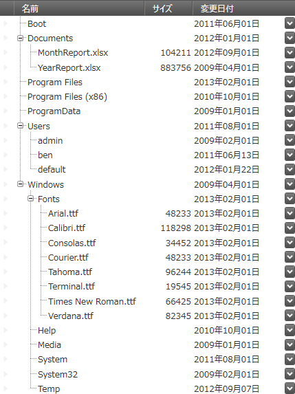

////
|metadata|
{
    "name": "whats-new-in-2015-volume-1",
    "controlName": [],
    "tags": ["Getting Started"],
    "guid": "bb18c4aa-2a00-42ea-bd8e-10e2873ff849",
    "buildFlags": [],
    "createdOn": "2015-02-19T14:32:38.2767368Z"
}
|metadata|
////

= 2015 Volume 1 の新機能

== トピックの概要

=== 目的

このトピックでは、{ProductName} 2015 Volume 1 リリースで導入された新しいコントロールと機能の概要について説明します。

== _Infragistics Excel ライブラリ_

[[_Ref398192011]]

=== ハイパーリンクのサポート

ライブラリのデータ モデルは、ハイパーリンクの作成と操作をサポートするようになりました。

==== 関連トピック:

link:excelengine-addinghyperlinktoworksheet.html[ハイパーリンクをワークシートに追加 (Infragistics Excel Engine)]

=== ワークブックの保護

ライブラリのデータ モデルは、ワークブックを保護できるようになりました。ワークブックの保護は、ワークシートの追加、名前変更、順序変更、削除を禁止します。

==== 関連トピック:

link:excelengine-workbook-protection.html[ワークブックの保護 (Infragistics Excel Engine)]

[[_Ref398192028]]

=== ワークシートの保護

ライブラリのデータ モデルは、ワークシートを保護できるようになりました。

==== 関連トピック:

link:excelengine-worksheet-protection.html[ワークシートの保護 (Infragistics Excel Engine)]

== _xamComboEditor_

=== プリミティブ型のコレクションへのバインド

_xamComboEditor_   コントロールは、`bool` 型、`char` 型、`double` 型などのプリミティブ型のコレクションへのバインドをサポートします。また、`enum`、`string` のコレクション、`DateTime` データへのバインドもサポートします。

==== 関連トピック:

link:xamcomboeditor-support-for-primitives.html[プリミティブ型のコレクションへのバインド (xamComboEditor)]

=== ドロップダウンの最小の高さの構成

新しいプロパティ `MinDropDownHeight` が追加され、 _xamComboEditor_   コントロールのドロップダウンの最小の高さを構成する機能が提供されています。

==== 関連トピック:

link:xamcomboeditor-dropdown-resizing.html[ドロップダウンの構成 (xamComboEditor)]

== _xamMultiColumnComboEditor_

新しいプロパティ `MinDropDownHeight` が追加され、 _xamMultiColumnComboEditor_   コントロールのドロップダウンの最小の高さを構成する機能が提供されています。

==== 関連トピック:

link:xammulticee-configuring-the-drop-down.html[ドロップダウンの構成 (xamMultiColumnComboEditor)]

== _xamDataGrid_

=== フィールドとレコードのサイズ変更の構成

フィールドやレコードのサイズを変更できる領域の構成をサポートするようになりました。

==== 関連するトピック:

link:{ApiPlatform}datapresenter{ApiVersion}~infragistics.windows.datapresenter.fieldlayoutsettings~fieldresizingarea.html[FieldResizingArea]

link:{ApiPlatform}datapresenter{ApiVersion}~infragistics.windows.datapresenter.fieldlayoutsettings~recordresizingarea.html[RecordResizingArea]

== _xamDataPresenter_

=== 選択したデータ項目へのバインド

プロパティを使用して、最後に選択された項目に MVVM に対応するバインドができるようになりました。

==== 関連トピック:

link:xamdatagrid-selected-data-items.html[選択されたデータ項目での作業 (xamDataGrid)]

== _xamGantt_

=== セクションのサイズ変更

グリッドとチャートのセクションのサイズ変更をサポートするようになりました。

==== 関連トピック:

link:xamgantt-configuring-sections.html[セクションの構成 (xamGantt)]

== _xamSpreadSheet_

=== ハイパーリンクのサポート

ハイパーリンクを表示し、ユーザーがそれらとインタラクションできるようになりました。

==== 関連するトピック:

link:spreadsheet-uiu-hyperlinks.html[ハイパーリンクのインタラクション (xamSpreadsheet)]

link:spreadsheet-work-hyperlinks.html[ハイパーリンクでの作業 (xamSpreadsheet)]

link:spreadsheet-uiu-context-menu.html[コンテキスト メニューのインタラクション (xamSpreadsheet)]

=== ホバーされたセルの取得

ポイントを提供することによりワークシートのセルを取得できるようになりました。

=== 複数のワークシートの選択

複数のワークシートを選択し、それらに対してグループ操作を実行できるようになりました。

==== 関連するトピック:

link:spreadsheet-conf-worksheets.html[ワークシートの構成 (xamSpreadsheet)]

link:spreadsheet-work-selection-formatting.html[アクティブな選択の書式の設定または取得 (xamSpreadsheet)]

=== ワークブックとワークシートの保護

ワークブックやワークシートの保護を行う場合に、特定のユーザー機能の無効化をサポートするようになりました。

==== 関連するトピック:

link:spreadsheet-uiu-tab-bar-area.html[タブ バー領域のインタラクション (xamSpreadsheet)]

link:spreadsheet-conf-tab-bar-area.html[タブ バー領域の構成 (xamSpreadsheet)]

=== 下線のサポート

テキストに下線と二重下線を描画できるようになりました。

==== 関連トピック:

link:spreadsheet-features.html[機能の概要 (xamSpreadsheet)]

== _xamTreeGrid_

=== 新しいコントロール

_xamTreeGrid_   コントロールは、コントロールの Data Presenter Family への最新の追加です。データをツリー グリッド レイアウトに配置します。このコントロールは基本的に、動的な切り替えができない単一のビュー (TreeView) を実装する  _xamDataPresenter_   です。

==== 関連トピック:

link:xamtreegrid.html[xamTreeGrid]