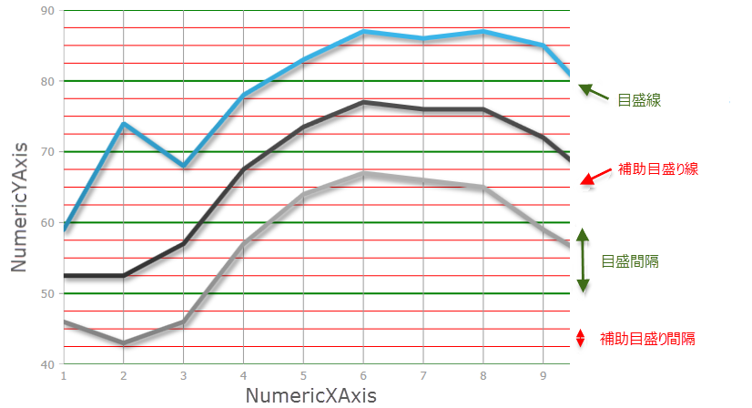
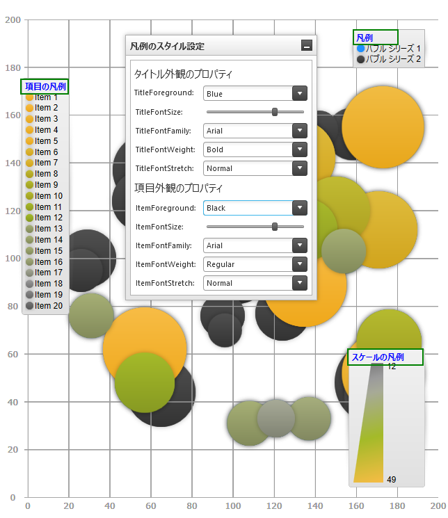
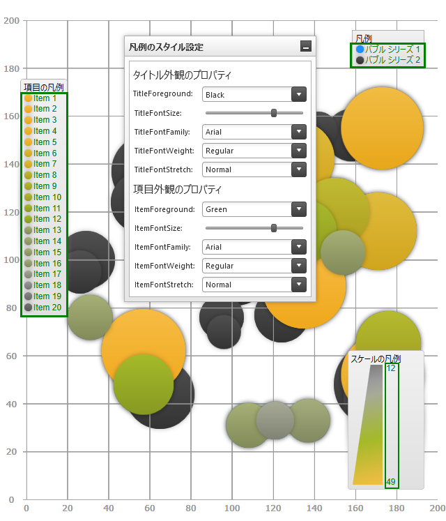
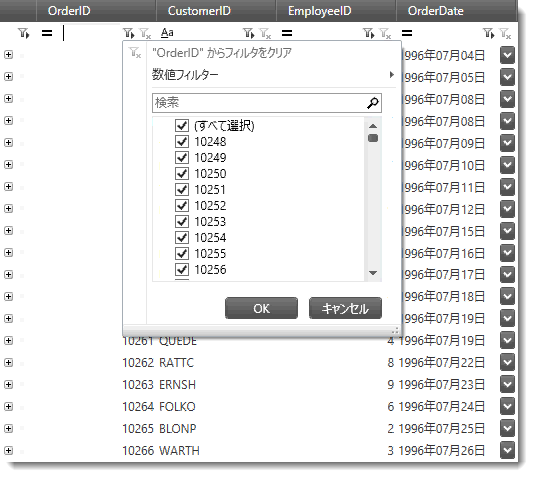

////
|metadata|
{
    "name": "whats-new-in-2015-volume-2",
    "controlName": [],
    "tags": ["Getting Started"],
    "guid": "fa57d2d5-32d9-40ef-9453-57883b983747",
    "buildFlags": [],
    "createdOn": "2015-05-18T12:48:29.4239636Z"
}
|metadata|
////

= 2015 Volume 2 の新機能

== トピックの概要

=== 目的

このトピックでは、{ProductName} 2015 Volume 2 リリースで導入された新しいコントロールと機能の概要について説明します。

== _Infragistics Excel ライブラリ_

[[_Ref398192011]]

=== ワークシート テーブルの列および行の操作

ライブラリのデータ モデルに、ワークシート テーブルの列と行の挿入および削除のサポートが追加されました。

==== 関連トピック:

link:excelengine-addingtabletoworksheet.html[テーブルをワークシートに追加 (Infragistics Excel Engine)]

== _Infragistics Syntax Parsing Engine_

[[_Ref398192011]]

=== 構文ツリー作成イベント

解析エンジンでは、構文ツリーの作成後に発生するイベントおよび構文ツリーがテキスト ドキュメントに返される前に発生するイベントをサポートするようになりました。

==== 関連トピック:

link:ig-spe-custom-diagnostics-and-annotations.html[カスタム診断および注釈 (Syntax Parsing Engine)]

== _xamBusyIndicator_

=== 新しいコントロール

_xamBusyIndicator_   は、長期的に実行されるプロセスが開始されたことを視覚的に通知し、そのプロセスの進行状況を表示する ContentControl です。

image::images/xamBusyIndicator_1.png[]

==== 関連トピック:

link:xambusyindicator.html[xamBusyIndicator]

== _xamComboEditor_

=== 列挙型のデータの処理

_xamComboEditor_   に列挙型データにバインドされるドロップダウンの生成処理をカスタマイズするサポートを追加しました。

==== 関連トピック:

link:xamcomboeditor-handling-enums.html[列挙型データの処理 (xamComboEditor)]

== _xamDataChart_

=== 主軸および副軸の間隔

_xamDataChart は、軸に対して垂直に表示される主軸および副軸の両方の間隔をサポートするようになりました。_

以下のスクリーンショットでは、NumericYAxis の主軸が間隔値 10 の緑色の線、NumericYAxis の副軸が間隔値 2.5 の赤色の線で示されています。

==== 関連トピック:

link:datachart-configuring-major-and-minor-intervals.html[主軸および副軸の間隔の構成]

=== 凡例のタイトルと項目のフォント

_xamDataChart の凡例 ItemsLegend および ScaleLegend は、フォントの外観を構成できるようになりました。_

以下のスクリーンショットは、カスタム凡例タイトルを示します。このタイトルには、サイズ 14 のボールドの Arial フォント、サポートされている 3 つの凡例タイプにすべて青色の前景色が使用されています (上から下に、Legend、ItemLegend、および ScaleLegend)。

以下のスクリーンショットは、カスタム凡例項目を示します。この項目には、サイズ 12 のボールドの Tahoma フォント、サポートされている 3 つの凡例タイプにすべて緑色の前景色が使用されています (上から下に、Legend、ItemLegend、および ScaleLegend)。

==== 関連トピック:

link:datachart-legends.html#Properties[チャート凡例]

== _xamDataGrid_

=== フィルターのクリア ボタン

_xamDataGrid_   のクリア フィルター ボタンは、アクティブなフィルター セットがない場合に無効 (半透明) でレンダリングするようになりました。

==== 関連トピック:

link:xamdatapresenter-about-record-filtering.html[レコード フィルタリングについて]

=== Excel スタイルのフィルタリング ダイアログ

_xamDataGrid_   コントロールは、`FilterRecord` で Excel スタイルのフィルタリング UI を使用できるようになりました。これを実行するには、`FilterOperandUIType` プロパティを `FilterOperandUIType.ExcelStyle` に設定します。

==== 関連トピック:

link:{ApiPlatform}datapresenter{ApiVersion}~infragistics.windows.datapresenter.fieldsettings~filteroperanduitype.html[FilterOperandUIType]

== _xamDataPresenter_

=== 条件に基づきテンプレートを適用

Data Presenter コントロールには、条件に基づきセルのテンプレートを表示および編集する機能が追加されました。

==== 関連トピック:

link:xamdatapresenter-apply-cell-value-templates-conditionally.html[条件に基づきセルの値テンプレートを適用 (xamDataPresenter)]

[[_Ref398192011]]

=== データ検証のサポートの強化

Data Presenter コントロールは、`INotifyDataErrorInfo` インターフェイスを実装するデータ項目をサポートするようになりました。

==== 関連トピック:

link:xamdatapresenter-validating-data.html[データ検証の概要]

[[_Ref398192028]]

=== データ ソース変更イベント

Data Presenter コントロールは、 link:{ApiPlatform}datapresenter{ApiVersion}~infragistics.windows.datapresenter.datapresenterbase~datasource.html[DataSource] プロパティを変更するとイベントを発生するようになりました。

==== 関連トピック:

link:{ApiPlatform}datapresenter{ApiVersion}~infragistics.windows.datapresenter.datapresenterbase~datasourcechanged_ev.html[DataSourceChanged イベント]

[[_Ref398192011]]

=== UI の手動更新

Data Presenter コントロールは、コントロールのユーザー インターフェイスの手動更新をサポートするようになりました。

==== 関連トピック:

link:xamdatapresenter-manual-refresh-controls-ui.html[コントロールの UI の手動更新 (xamDataPresenter)]

== _xamPropertyGrid_

=== 展開可能なタイプのカスタム エディター

_xamPropertyGrid_   コントロールは、展開可能なプロパティのカスタム エディターをサポートするようになりました。これにより、コレクションのネストされた要素リストを削除することもできます。

==== 関連トピック:

link:xampropertygrid-conf-editors.html[エディター定義の構成 (xamPropertyGrid)]

link:xampropertygrid-work-expandable-properties.html[展開可能なプロパティのサポート (xamPropertyGrid)]

=== 展開可能なプロパティのカスタマイズ

_xamPropertyGrid_   コントロールに、展開可能なプロパティのレンダリングをカスタマイズする方法が追加されました。

==== 関連トピック:

link:xampropertygrid-work-expandable-properties.html[展開可能なプロパティのサポート (xamPropertyGrid)]

=== 結合可能なプロパティ属性のサポート

_xamPropertyGrid_   コントロールは、複数のオブジェクトのバインドで、結合されたプロパティを除外する属性をサポートできるようになりました。

==== 関連トピック:

link:xampropertygrid-list-of-attributes.html[サポートされる属性のリスト (xamPropertyGrid)]

=== プロパティ リストの並べ替え

_xamPropertyGrid_   コントロールは、宣言的なプログラムによる方法で、プロパティ リストとそのカテゴリの並べ替え (順序変更) をサポートするようになりました。

==== 関連トピック:

link:xampropertygrid-conf-properties-sorting.html[プロパティ リストの並べ替え (xamPropertyGrid)]

== _xamRichTextEditor_

=== ポイントからのテキスト挿入位置の取得

_xamRichTextEditor_   コントロールは、指定されたポイントから最も近い有効なテキスト挿入位置を取得するメソッドをサポートするようになりました。このポイントは、 _xamRichTextEditor_   コントロールに関連付けられている必要があります。

==== 関連トピック:

link:{ApiPlatform}controls.editors.xamrichtexteditor{ApiVersion}~infragistics.controls.editors.xamrichtexteditor~getpositionfrompoint.html[GetPositionFromPoint]

== _xamSpreadSheet_

=== データ検証

_xamSpreadsheet_   コントロールは、ワークシートのセルに設定されたルールに基づいたデータ検証をサポートするようになりました。

==== 関連トピック:

link:spreadsheet-uiu-data-validation.html[データ検証のインタラクション (xamSpreadsheet)]