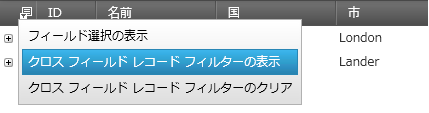
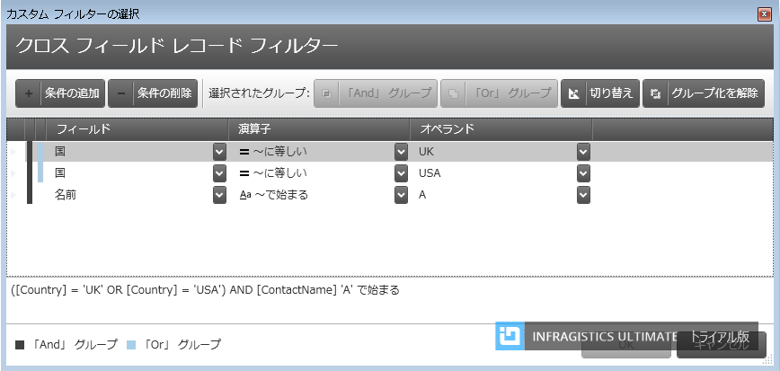
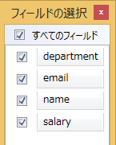

////
|metadata|
{
    "name": "whats-new-in-2016-volume-2",
    "controlName": [""],
    "tags": [],
    "guid": "c8fc4210-e08d-4f52-a9bd-ef7e8eb4b1d8","buildFlags": [],
    "createdOn": "2016-06-02T11:34:48.574014Z"
}
|metadata|
////

= 2016 Volume 2 の新機能

== 目的

このトピックでは、{ProductName} 2016 Volume 2 リリースで導入された新しいコントロールと機能の概要について説明します。

== xamCategoryChart

{ProductName} 2016 Volume 2 リリースでは、カテゴリ チャートという新しいコントロールを提供します。簡易な API を使用して、チャートにカテゴリ データの表示を簡単に構成できます。データ (コレクションまたはコレクションのコレクション) をバインドするのみで作業を開始します。

*XAML の場合:*
[source,xaml]
----
<ig:XamCategoryChart ItemsSource="{Binding DataCollection}" />
----

スマート データ アダプターを使用して、データは分析されて適切なビジュアライゼーションが描画されます。たとえば ChartType を Auto に設定した場合、大きなデータセットで折れ線チャートを描画する間、コントロールは小さなデータセットを提供して列チャートがプロットされるかどうかを決定します。

*XAML の場合:*
[source,xaml]
----
<ig:XamCategoryChart ItemsSource="{Binding DataCollection}" ChartType="Auto" />
----

一方、 ChartType を Line、Area、Column、Point、Spline、SplineArea、StepArea、StepLine または Waterfall に設定して、チャート タイプを明示的に指定することも可能です。

その他のカテゴリチャート コントロールの直感的な動作の例は、明示的にラベルを設定する必要がないことです。カテゴリ チャートは、最初の適切な文字列プロパティを使用し、ラベルに使用します。

コントロールは簡単に構成できるよう構築されており、エンジンとしてデータチャート コントロールを使用しています。つまり、高パフォーマンスでパワフルなデータ チャートの利点を備えています。

*関連トピック:* +
link:categorychart-overview.html[xamCategoryChart について]

link:categorychart-walkthrough.html[xamCategoryChart を使用した作業の開始]

== xamDataChart

=== *機能向上* 

{ProductName} 2016 Volume 2 リリースでは、データ チャート コントロールの性能を改善しました。

*_ConsolidatedColumnVerticalPosition というプロパティを新規追加しました_* 

本リリースでは、単一視覚要素に統合ざれた列の配置ロジックを決定するための、新しい link:{ApiPlatform}controls.charts.xamdatachart{ApiVersion}~infragistics.controls.charts.columnseries~consolidatedcolumnverticalposition.html[ConsolidatedColumnVerticalPosition] プロパティを提供しています。

プロパティは以下の値を含みます:

*Minimum* - 統合された項目は最小値を使用して配置されます。 

*Maximum* - 統合された項目は最大値を使用して配置されます。

*Median* - 統合された項目は中央値を使用して配置します。

*RelativeMinimum* - 統合された項目が相対する軸の参照値に一番近い値を使用して配置します。

*RelativeMaximum* - 連結された項目が相対する軸の参照値に一番遠い値を使用して配置します。

*関連トピック:* +
link:datachart-category-column-series.html[柱状リーズ]

=== *デザインの更新* 

{ProductName} 2016 Volume 2 リリースでは、xamDataChart、xamPieChart、xamDoughnutChart、xamFunnelChart、xamRadialGauge、xamLinearGauge、xamBulletGraph および xamSparkline コントロールのデフォルト デザインを更新しました。

以下のスクリーンショットは変更を示します。

==== *柱状チャート*

*新規* 

image:images/chart_design_column_new.png[columnchartnew]

*以前*

image:images/chart_design_column_previous.png[columnchartprevious]

==== *凡例*

*新規*

image:images/chart_design_legend_new.png[legendnew]

*以前*

image:images/chart_design_legend_previous.png[legendprevious]

==== *積層型エリア*

*新規*

image:images/chart_design_gallery_new.png[gallerynew]

*以前*

image:images/chart_design_gallery_previous.png[galleryprevious]

==== *財務チャート*

*新規*

image:images/chart_design_financial_new.png[financialnew]

*以前*

image:images/chart_design_financial_previous.png[financialprevious]

==== *円チャート*

*新規*

image:images/chart_design_pie_new.png[pienew]

*以前*

image:images/chart_design_pie_previous.png[pieprevious]

==== *ファンネル チャート*

*新規*

image:images/chart_design_funnel_new.png[funnelnew]

*以前*

image:images/chart_design_funnel_previous.png[funnelprevious]

==== *ドーナツ型チャート*

*新規*

image:images/chart_design_doughnut_new.png[doughnutnew]

*以前*

image:images/chart_design_doughnut_previous.png[doughnutprevious]

==== *ラジアル ゲージ*

*新規*

image:images/chart_design_radial_gauge_new.png[radialnew]

*以前*

image:images/chart_design_radial_gauge_previous.png[radialprevious]

==== *リニア ゲージ*

*新規*

image:images/chart_design_linear_gauge_new.png[linearnew]

*以前*

image:images/chart_design_linear_gauge_previous.png[linearprevious]

==== *ブレット グラフ*

*新規*

image:images/chart_design_bullet_graph_new.png[bulletnew]

*以前*

image:images/chart_design_bullet_graph_previous.png[bulletprevious]

==== *スパークライン*

*新規*

image:images/chart_design_sparkline_new.png[sparklinenew]

*以前*

image:images/chart_design_sparkline_previous.png[sparklineprevious]

==== *新しいチャート シリーズ (CTP)*
本リリーズでは、チャートに散布エリア シリーズおよび散布等高線シリーズをチャート シリーズに新規追加しました。このシリーズは、三次元の等高線グラフ コントロールの二次元バージョンです。

*散布エリア シリーズ*

散布エリア シリーズは、デカルト コンテキストにおいて、X と Y 座標の三角測量に基づき、等高線の各ピクセルに数値が割り当てられた、カラー等高線を描画する視覚チャート要素です。このシリーズは、磁場の強さ、二次元に投影/フラット化された三次元のシェイプ、データでの 3 つの数値列間の相関など、科学データをプロットするときに使用します。

image:images/scatter_area_series.png[sparklineprevious]

*散布等高線シリーズ*

散布等高線シリーズは散布エリア シリーズと同様のデータをプロットするときに使用しますが、データは補間サーフェス エリアの代わりに等高線で表示されます。

image:images/scatter_contour_series.png[sparklineprevious]

== xamGeographicMap 

==== *地理マップの凡例の表示* 

この CTP 機能では地理マップの凡例の表示が可能になります。

image:images/geographicmap_legend.png[geographicmaplegend]

== xamShapeChart (CTP)

Infragistics 2016 Volume 2 リリースでは、シェイプ チャートといコントロールを CTP コントロールとして追加しました。このコントロールは、チャート サーフェイスにデカルトおよび地理シェイプを表示します。間取り図、ダイアグラムや地図などの表示に使用されます。

image:images/shapechart.png[shapechart]

== xamPieChart

==== *スライスの選択* 

xamPieChart コントロールでスライスの選択が可能になりました。この機能はデフォルトで有効かされています。link:{PieChartLink}.{PieChartBase}{ApiProp}SelectionMode.html[SelectionMode] プロパティを設定して単一および複数選択をサポートします。また、link:{PieChartLink}.{PieChartBase}{ApiProp}SelectedItem.html[SelectedItem] や link:{PieChartLink}.{PieChartBase}{ApiProp}SelectedItems.html[SelectedItems] プロパティを使用して選択されたスライスに関連付けられたデータ項目を取得します。

選択イベントも追加しました。一部はキャンセル可能なもので、特定のスライス選択の無効化が可能です。イベントは以下の通りです。

* link:{PieChartLink}.{PieChartBase}{ApiProp}SelectedItemChanging_ev.html[SelectedItemChanging]
* link:{PieChartLink}.{PieChartBase}{ApiProp}SelectedItemChanged_ev.html[SelectedItemChanged]
* link:{PieChartLink}.{PieChartBase}{ApiProp}SelectedItemsChanging_ev.html[SelectedItemsChanging]
* link:{PieChartLink}.{PieChartBase}{ApiProp}SelectedItemsChanged_ev.html[SelectedItemsChanged]

選択されたスライスは異なるスタイルで表示されるため特定しやすくなっています。以下のスクリーンショットでは、Marketing スライスが選択されています。

image:images/piechart_slice_selection.png[piechartselection]

*関連トピック:* +
link:piechart.html[xamPieChart]

link:piechart-selection-and-explosion.html[選択および展開]

==== *円チャートの新しいイベント*

xamPieChart コントロールには、スライスをクリックすると発生する link:{ApiPlatform}controls.charts.xamdatachart{ApiVersion}~infragistics.controls.charts.piechartbase~labelclick_ev.html[LabelClick イベント]があります。

*関連トピック:*

link:piechart-using-piechart.html[xamPieChart の構成]

==== *ラベルの色付け*

ラベルがスライスの内、または外に表示されることにとって、異なる色を設定できます。設定は、link:{ApiPlatform}controls.charts.xamdatachart{ApiVersion}~infragistics.controls.charts.piechartbase~labelinnercolor.html[LabelInnerColor] プロパティおよび link:{ApiPlatform}controls.charts.xamdatachart{ApiVersion}~infragistics.controls.charts.piechartbase~labeloutercolor.html[LabelOuterColor] プロパティで構成します。

image:images/piechart_inner_outer_label_color.png[piechartlabelcolor]

*関連トピック:*

link:{ApiPlatform}controls.charts.xamdatachart{ApiVersion}~infragistics.controls.charts.piechartbase~labelinnercolor.html[LabelInnerColor] プロパティ

link:{ApiPlatform}controls.charts.xamdatachart{ApiVersion}~infragistics.controls.charts.piechartbase~labeloutercolor.html[LabelOuterColor] プロパティ

== Infragistics Excel Engine

*特定のルールのすべての参照を取得* 

link:{ApiPlatform}documents.excel{ApiVersion}~infragistics.documents.excel.datavalidationrulecollection.html[DataValidationRuleCollection] は、指定したルールと等しいデータ検証ルールを持つ参照のコレクションを返す link:{ApiPlatform}documents.excel{ApiVersion}~infragistics.documents.excel.datavalidationrulecollection~getallreferences.html[GetAllReferences] メソッドを公開します。

*データ検証ルールを比較する新しいメソッド*

link:{ApiPlatform}documents.excel{ApiVersion}~infragistics.documents.excel.datavalidationrule.html[DataValidationRule] には、このルールを指定したルールと比較し、ルールが構造的に等しい場合に true を返す link:{ApiPlatform}documents.excel{ApiVersion}~infragistics.documents.excel.datavalidationrule~isequivalentto.html[IsEquivalentTo] メソッドが追加されました。

== Royal Dark テーマ

*新しいテーマ* 

Royal Dark テーマは、UX を向上する一貫性のあるシンプルなテーマです。新しい視覚状態を追加しました。

{nbsp} +
*含まれる色:* +
image:images/WhatsNew_16.2_WPF_1.png[含まれる色]

{nbsp} +
*xamDataGrid* +
image:images/WhatsNew_16.2_WPF_2.png[xamDataGrid]

{nbsp} +
*xamSpreadsheet* +
image:images/WhatsNew_16.2_WPF_3.png[xamSpreadsheet]

{nbsp} +
*xamRibbon* +
image:images/WhatsNew_16.2_WPF_4.png[xamRibon]

{nbsp} +
*関連トピック:* +
link:designers-guide-using-themes.html[テーマ] +
link:ms-controls-implicit-themes.html[MS コントロールの暗黙のテーマ]

== xamCalendar, xamMonthCalendar, xamDateTimeEditor, xamDateTimeInput

*スクロール方向の構成*

xamCalendar、xamMonthCalendar、xamDateTimeEditor および xamDateTimeInput コントロールは、ナビゲーション矢印を押下して予定表アイテム グループのスクロール方向を構成するための、ScrollDirection という新しいプロパティを公開します。以前のバージョンでは、水平方向のスクロールのみをサポートしました。 +
水平方向のスクロール: +
image:images/xamCalendar_ScrollDirection1.png[] +
垂直方向のスクロール: +
image:images/xamCalendar_ScrollDirection2.png[] +
*関連トピック:* +
link:xamcalendar-using.html[xamCalendar の使用] +
link:xammonthcalendar-switch-to-a-different-calendar-view.html[異なるカレンダー ビューへの切り替え (xamMonthCalendar)]

== xamDataPresenter

*クロス フィールド レコード フィルタリング* 

データ プレゼンター コントロールは、論理接続を持つフィルター ルールの定義をサポートします。 +
 +
 +
*関連トピック:* +
link:xamdatagrid-crossfieldrecordfiltering.html[クロス フィールド レコード フィルタリング (xamDataGrid)] +
link:xamdatapresenter-crossfieldrecordfiltering.html[クロス フィールド レコード フィルタリング (xamDataPresenter)]

*フィールド選択の外観* 

単一のフィールド レイアウトを持つデータ プレゼンター コントロールのフィールド選択のデフォルト外観は、すべてのフィールドを選択するチェック ボックスが上部に追加されました。 +
 +
*関連トピック:* +
link:xamdatapresenter-about-the-field-chooser.html[フィールドの選択] 

== xamPropertyGrid

*エディター定義のデータ テンプレート セレクター サポート* 

xamPropertyGrid コントロールは、エディター定義でデータ テンプレート セレクターの割当をサポートします。 +
*関連トピック:* +
link:xampropertygrid-conf-templateselector.html[エディター定義のデータ テンプレート セレクターの構成 (xamPropertyGrid)]

== _xamRichTextEditor_

*ドキュメント アダプターの新しいイベント* 

link:{ApiPlatform}documents.richtextdocument{ApiVersion}~infragistics.documents.richtext.serialization.richtextdocumentadapterbase.html[RichTextDocumentAdapterBase] から拡張するすべてのドキュメント アダプターは、ドキュメント読み込もうとする際に例外がスローされた場合に発生する新しい link:{ApiPlatform}documents.richtextdocument{ApiVersion}~infragistics.documents.richtext.serialization.richtextdocumentadapterbase~documentloaderror_ev.html[DocumentLoadError] イベントが追加されます。 +
*関連トピック:* +
link:xamrichtexteditor-binding-to-data.html[xamRichTextEditor とデータのバインド]