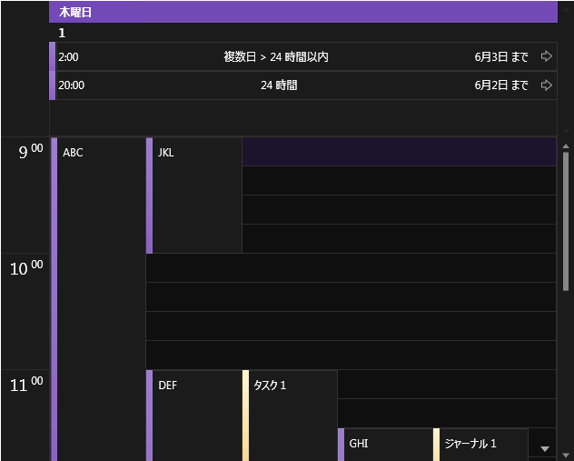
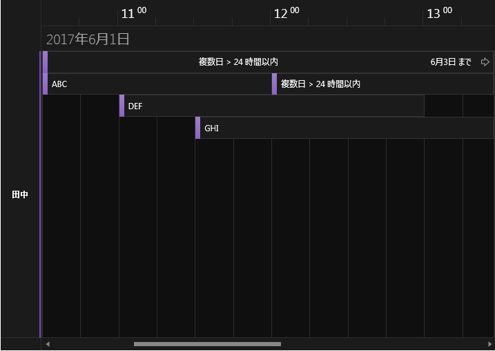
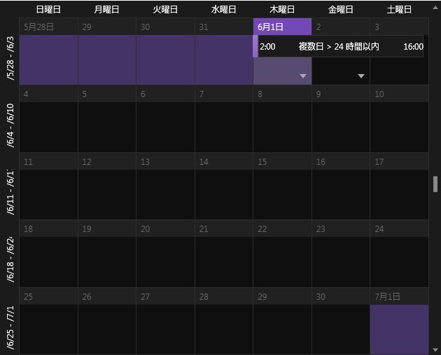
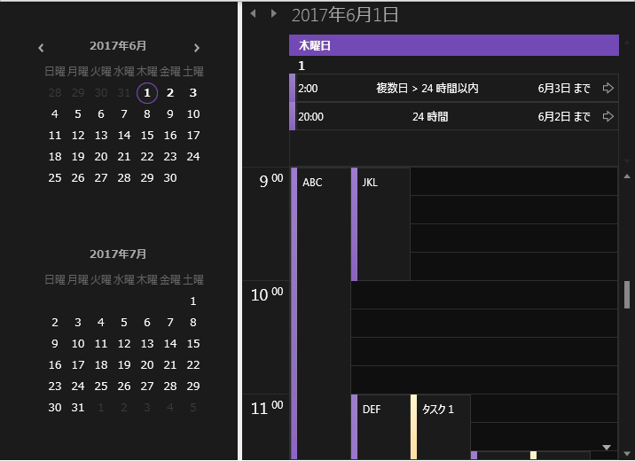
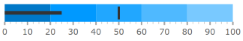

////
|metadata|
{
    "name": "whats-new-in-2017-volume-1",
    "controlName": [""],
    "tags": [],
    "guid": "",
	"buildFlags": [],
    "createdOn": "2016-11-23T11:34:48.574014Z"
}
|metadata|
////

= 2017 Volume 1 の新機能

== 目的

このトピックでは、{ProductName} 2017 Volume 1 リリースで導入された新しいコントロールと機能の概要について説明します。

== xamSchedule の Royal Dark テーマ

_xamSchedule_ コントロールのすべてのビューで Royal Dark テーマを追加しました。

*xamDayView:* +
 +
*xamScheduleView:* +
 +
*xamMonthView:* +
 +
*xamOutlookCalendarView および xamDateNavigator:* +
 +

== xamDiagram

==== ユーザー インタラクションの制限

xamDiagram コントロールは、編集モードの開始、サイズ変更、削除など、ユーザー インタラクションを制限するプロパティをサポートします。

*関連トピック:* +
link:xamdiagram-configuring-restricting-user-interactions.html[ユーザー インタラクションの制限の構成 (xamDiagram)]

==== Enter キーの動作

xamDiagram コントロールは、編集モードで *Enter* キーを押したときの動作の構成をサポートします。

*関連トピック:* +
link:xamdiagram-general-overview.html[概要 (xamDiagram)]

==== ツールボックス ヘッダーの非表示

コントロールでは、link:{ApiPlatform}controls.charts.xamdiagram{ApiVersion}~infragistics.controls.charts.xamdiagramtoolbox~headervisibility.html[HeaderVisibility] プロパティを使用してツールボックス ヘッダーを非表示にできます。

*関連トピック:* +
link:xamdiagram-configuring-the-toolbox.html[ツールボックスの構成 (xamDiagram)]

==== 飛び越し線

コントロールは、接続が交差する場合に「飛び越し線」の描画をサポートします。

image:images/xamDiagram_LineJumps_Arc.png[]

*関連トピック:* +
link:xamdiagram-configuring-connections-line-jumps.html[ダイアグラム接続の飛び越し線の構成 (xamDiagram)]

{empty} +

==== xamDiagram の項目のドロップ時またはコピー/貼り付け時の新しい動作

項目がツールボックスからドロップまたはコピー/貼り付けされた場合に動作が変わるプロパティがあります。

* `DragDropData` - この新しいプロパティはシャローコピーを使用してコピーされます。
* `Content` - このプロパティはディープコピーを使用してコピーされます。

*関連トピック:* +
link:xamdiagram-copy-when-drop-from-toolbox.html[ツールボックスから項目をドロップ (xamDiagram)]

{empty} +

==== IDataErrorInfo のサポート

コントロールは、データ項目が `IDataErrorInfo` インターフェイスを実装する場合にエラー インジケーターの視覚化をサポートします。

image::images/xamDiagram_Validation01.png[]

*関連トピック:* +
link:xamdiagram-idataerrorinfo-support.html[IDataErrorInfo サポート (xamDiagram)]

== xamEditors

==== スピン折り返しの動作

link:{ApiPlatform}editors{ApiVersion}~infragistics.windows.editors.xammaskededitor.html[xamMaskedEditor] およびすべての拡張されたエディター (link:{ApiPlatform}editors{ApiVersion}~infragistics.windows.editors.xamcurrencyeditor.html[xamCurrencyEditor]、link:{ApiPlatform}editors{ApiVersion}~infragistics.windows.editors.xamnumericeditor.html[xamNumericEditor]、および link:{ApiPlatform}editors{ApiVersion}~infragistics.windows.editors.xamdatetimeeditor.html[xamDateTimeEditor]) は新しいプロパティを公開します。link:{ApiPlatform}editors{ApiVersion}~infragistics.windows.editors.xammaskededitor~spinwrapbehavior.html[SpinWrapBehavior] は link:{ApiPlatform}editors{ApiVersion}~infragistics.windows.editors.spinwrapbehavior.html[SpinWrapBehavior] 型で、エディターの値スピン動作を決定します。
デフォルト値は `WrapAcrossSections` で、エディターの以前のバージョンのデフォルト スピン折り返し動作と異なります。この新しいプロパティは link:{ApiPlatform}editors{ApiVersion}~infragistics.windows.editors.xammaskededitor.html[xamMaskedEditor] の廃止された `SpinWrap` プロパティを置き換えます。

==== 和暦サポート

_xamDateTimeEditor_ コントロールは和暦をサポートします。

image:images/xamEditors_JIDS_03.png[]

*関連トピック:*

link:xameditors-japanese-imperial-date-support.html[和暦サポート]

== xamNumericSlider および xamNumericRangeSlider

`bool` 型の新しいプロパティ `IsNaNValueSupported` が link:{ApiPlatform}controls.editors.xamslider{ApiVersion}~infragistics.controls.editors.xamnumericslider.html[xamNumericSlider] および link:{ApiPlatform}controls.editors.xamslider{ApiVersion}~infragistics.controls.editors.xamnumericrangeslider.html[xamNumericRangeSlider] コントロールに追加されました。

このプロパティの目的は、`NaN` のサポートを追加し、スライダー操作を有効にします。以前は `NaN` 値がスライダー値に設定された場合、マウス (つまみのドラッグ、[+]/[-] ボタンのクリックなど) およびキーボード操作が無効になりました。

.注
[NOTE]
====
このプロパティは指定したスライダー値 (NaN 値) を変更しません。スライダーとのキーボードおよびマウス操作のみが有効になります。
====

*関連トピック:*

link:{ApiPlatform}controls.editors.xamslider{ApiVersion}~infragistics.controls.editors.xamnumericslider~isnanvaluesupported.html[xamNumericSlider.IsNaNValueSupported]

link:{ApiPlatform}controls.editors.xamslider{ApiVersion}~infragistics.controls.editors.xamnumericrangeslider~isnanvaluesupported.html[xamNumericRangeSlider.IsNaNValueSupported]

== xamPropertyGrid

==== ブラシ リソース パネル

_xamPropertyGrid_ コントロールは、ブラシ エディターで新しい構成可能なブラシ リソース パネルをサポートします。 +
image:images/xamPropertyGrid_Brush_Resources.png[] +
*関連トピック:* +
link:xampropertygrid-conf-brush-resources.html[ブラシ リソースの構成 (xamPropertyGrid)] +

{empty} +

==== バインドされた依存プロパティの編集の防止

_xamPropertyGrid_ コントロールは、バインドされた依存プロパティの値を非表示にする構成オプションをサポートします。

*関連トピック:* +
link:xampropertygrid-features-overview.html[機能の概要 (xamPropertyGrid)]

{empty} +

==== カスタム エディターの展開
xamPropertyGrid コントロールは、link:{ApiPlatform}controls.editors.xampropertygrid{ApiVersion}~infragistics.controls.editors.propertygridpropertyitem.html[PropertyGridPropertyItem] クラスで新しい link:{ApiPlatform}controls.editors.xampropertygrid{ApiVersion}~infragistics.controls.editors.propertygridpropertyitem~allowexpansionwhenusingcustomeditor.html[AllowExpansionWhenUsingCustomEditor] プロパティを公開します。このプロパティは、link:{ApiPlatform}controls.editors.xampropertygrid{ApiVersion}~infragistics.controls.editors.propertygrideditordefinition.html[PropertyGridEditorDefinition] で定義されるカスタム エディターを持つプロパティを展開できるようコントロールを構成することを許可します。

== xamDataChart

==== プロパティ変更
既存のチャート ズーム プロパティを非推奨するために新しいプロパティがチャートに追加しました。非推奨されたプロパティは後方互換性をサポートするために利用可能です。

* {DataChartName}.HorizontalZoomable -> link:{DataChartLink}.{DataChartName}{ApiProp}IsHorizontalZoomEnabled.html[{DataChartName}.IsHorizontalZoomEnabled]

* {DataChartName}.VerticalZoomable -> link:{DataChartLink}.{DataChartName}{ApiProp}IsVerticalZoomEnabled.html[{DataChartName}.IsVerticalZoomEnabled]

*関連トピック:* +
link:datachart-chart-navigation.html[チャート ナビゲーション]

== xamPieChart

==== プロパティ変更
円チャートのスタイル設定を簡単になるために新しいプロパティを追加しました。これらのプロパティは、以下のとおりです。

* 引き出し線
** link:{PieChartLink}.{PieChartBase}{ApiProp}LeaderLineOpacity.html[LeaderLineOpacity]
** link:{PieChartLink}.{PieChartBase}{ApiProp}LeaderLineStroke.html[LeaderLineStroke]
** link:{PieChartLink}.{PieChartBase}{ApiProp}LeaderLineStrokeThickness.html[LeaderLineStrokeThickness]
* 「その他」カテゴリ
** link:{PieChartLink}.{PieChartBase}{ApiProp}OthersCategoryFill.html[OthersCategoryFill]
** link:{PieChartLink}.{PieChartBase}{ApiProp}OthersCategoryOpacity.html[OthersCategoryOpacity]
** link:{PieChartLink}.{PieChartBase}{ApiProp}OthersCategoryStroke.html[OthersCategoryStroke]
** link:{PieChartLink}.{PieChartBase}{ApiProp}OthersCategoryStrokeThickness.html[OthersCategoryStrokeThickness]
* 選択スライス
** link:{PieChartLink}.{PieChartBase}{ApiProp}SelectedSliceFill.html[SelectedSliceFill]
** link:{PieChartLink}.{PieChartBase}{ApiProp}SelectedSliceOpacity.html[SelectedSliceOpacity]
** link:{PieChartLink}.{PieChartBase}{ApiProp}SelectedSliceStroke.html[SelectedSliceStroke]
** link:{PieChartLink}.{PieChartBase}{ApiProp}SelectedSliceStrokeThickness.html[SelectedSliceStrokeThickness]

== xamGeographicMap

==== プロパティ変更
地理的なマップ画像に link:{GeoMapLink}.GeographicMapImagery{ApiProp}CacheSize.html[CacheSize] の新しいプロパティを追加しました。このプロパティは、マップでキャッシュされるタイルの最大数を制御します。

link:{GeoMapLink}.OpenStreetMapImagery{ApiProp}TilePath.html[TilePath] プロパティが OpenStreetMap 画像に追加しました。このプロパティは、OpenStreetMap タイル画像のソース位置を示す URL を指定します。

== xamRadialGauge、xamLinearGauge および xamBulletGraph
==== ビジュアル デフォルトへの変更
ゲージのデフォルト ビジュアルが更新されました。

*xamRadialGauge:*

image:images/whats_new_2017_1_radialgaugetheme.png[]

*xamLinearGauge:*

image:images/whats_new_2017_1_lineargaugetheme.png[]

*xamBulletGraph:*

