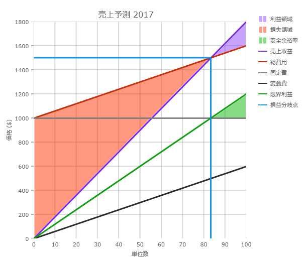
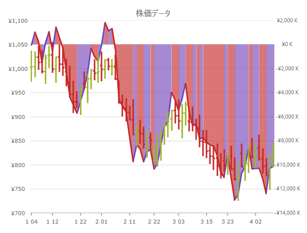
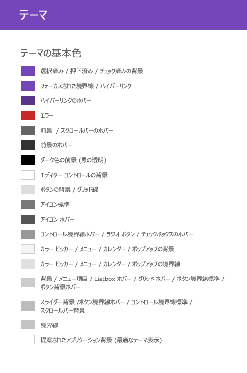
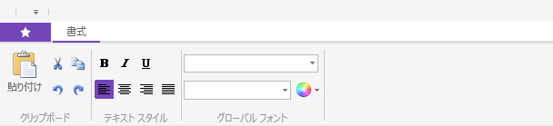

////
|metadata|
{
    "name": "whats-new-in-2017-volume-1",
    "controlName": [""],
    "tags": [],
    "guid": "c8fc4210-e08d-4f52-a9bd-ef7e8eb4b1d8","buildFlags": [],
    "createdOn": "2016-11-23T11:34:48.574014Z"
}
|metadata|
////

= 2017 Volume 2 の新機能

== 概要

このトピックでは、{ProductName} 2017 Volume 2 リリースで導入された新しいコントロールと機能の概要について説明します。主な機能は以下にリストされ、次のセクションは詳細を説明します。

* 新しいコントロール - xamShapeChart (RTM)
* 新しいコントロール - xamScatterChart (CTP)
* 新しい散布シリーズ - xamDataChart
* 新しい TimeXAxis - xamDataChart
* 新しいテーマ - Royal Light テーマ

== コントロールのデータ プレゼンター ファミリ

セル テンプレートのエディター テンプレートで使用される `SimpleTextBlock` は `FormattedText` の代わりに `GlyphRun` を使用します。セルのテキスト描画でパフォーマンスを向上します。詳細については、link:xamdata-performance-optimizations-overview.html[パフォーマンスの最適化の概要 (xamDataPresenter)] トピックを参照してください。

{empty} +

== xamShapeChart (RTM)

link:shapechart-overview.html[XamShapeChart] は軽量で高パフォーマンスなチャートです。このチャートは、散布 X/Y ポイントまたは 2 つ以上の数値データ列を持つデータ項目を表示するように構成できます。チャートも `Polygon` または `Polyline` 可視化としてシェープファイルのデータをプロットできます。X/Y プロパティを持つ `Point` オブジェクトのリストのリストを使用すると、任意のカスタム図形をプロットできます。

`XamShapeChart` コントロールはスマートなデータ アダプターを使用してバインドされるデータを解析して描画する適切なビジュアライゼーションを選択します。たとえば、link:{DataChartLink}.XamShapeChart{ApiProp}ChartType.html[ChartType] プロパティが `Auto` に設定され、データ セットに `X`、`Y`、および `Radius` と呼ばれる 3 つの数値データ列を含む場合にバブル チャートがプロットされます。3D 数値列が `Radius` の代わりに `Value` の場合、サーフェイスの各ピクセルに割り当てられた数値を持つ X および Y 座標の三角測量を使用して色付きのサーフェイスを描画します。ただし、以下の値に link:{DataChartLink}.XamScatterChart{ApiProp}ChartType.html[ChartType] プロパティを設定すると、`XamShapeChart` が使用するチャート タイプを指定できます: `Area`、`Bubble`、`Contour`、`HighDensity`、`Point`、`Line`、`Spline`、`Polygon`、または `Polyline`。詳細については、link:shapechart-getting-started-with-shapechart.html[{ShapeChartName} を使用した作業の開始]トピックを参照してください。

image:images/shapechart_overview_whats_new.png[シェープ チャートの可視化]

また、図形チャートは、`FixedCost`、`VariableCost`、`SalesRevenue`、および `SalesUnits` データ列を持つデータ項目が 1 つあれば損益分岐点データを描画できます。以下の画面は、損益分岐点データにバインドされる図形チャート コントロールを表示します。詳細については、link:shapechart-binding-to-break-even-data.html[{ShapeChartName} で損益分岐点データのバインド] トピックを参照してください。

== xamScatterChart (CTP)

link:{DataChartLink}.XamScatterChart.html[xamScatterChart] も軽量で高パフォーマンスなチャートで、簡易な API があります。`XamShapeChart` コントロールは `Polygon` または `Polyline` などの複雑な可視化をサポートしません。X/Y データをコレクションまたはコレクションのコレクションとして表示するための簡易な可視機能 (`Area`、`Bubble`、`Contour`、`HighDensity`、`Point`、`Line`、および `Spline`) がサポートされます。
 
image:images/scatterchart_overview_whats_new.png[]

== xamDataChart 機能

==== 新しい散布シリーズ

{DataChartName} コントロールに 4 つの新しい散布シリーズ型を追加しました。以下の画像はこのシリーズのプレビューを表示します。以下の表はシリーズの説明および詳細なトピックへのリンクを提供します。
 
image:images/datachart-new-scatter-series.png[Scatter Series]

[options="header", cols="30a,70a"]
|====
|シリーズ タイプ |説明

|`ScatterAreaSeries` 
|link:datachart-scatter-area-series.html[散布エリア シリーズ]は各ポイントに割り当てられた数値を使って、X および Y データの三角形分割に基づいて、色付きのサーフェスを描画します。このシリーズはヒート マップ、磁場の強さ、またはオフィスの Wi-Fi の強さを描画する場合などに便利です。

|`ScatterContourSeries` 
|link:datachart-scatter-contour-series.html[散布等高線シリーズ]は各ポイントに割り当てられた数値を使って、X および Y データの三角形分割に基づいて、色付きの等高線を描画します。
このシリーズは、等高線マップ、磁場の強さの変更、または `ScatterAreaSeries` の上にオーバーレイを描画するために便利です。

|`ScatterPolygonSeries` 
|link:datachart-scatter-polygon-series.html[散布多角形シリーズ]は多角形を使用してデータを表示するビジュアル要素です。このシリーズのタイプは任意の図形を描画できます。`Point` オブジェクトの `List` の `List` にバインドするか、`ShapefileConverter` を使用してポリゴンを持つシェープ ファイルを読み込みます。

|`ScatterPolylineSeries` 
|link:datachart-scatter-polyline-series.html[散布ポリライン シリーズ]はポリラインを使用してデータを表示するシリーズです。この散布シリーズのタイプは、ネットワーク グラフまたは散布データ ポイントの間に複数の接続などの切断された折れ線の描画が必要な場合に使用されます。このシリーズは `ScatterPolygonSeries` と同じデータ要件があり、シェープ ファイルからデータを描画できます。

|====

==== 新しい TimeXAxis

このリリースでは、link:{DataChartLink}.TimeXAxis.html[TimeXAxis] を {DataChartName} に追加しました。この軸はデフォルトで、ユーザーのズームによって動的に変更されるラベル書式設定を自動的にデータに適用します。また、軸ブレークを構成すると、範囲内の日付を除外できます。たとえば、週末、またはその他の必須ではない日付の範囲を非表示できます。軸は、デフォルトのラベル書式設定スキーマをオーバーライドして表示される日付範囲でラベルの構成をカスタマイズできます。詳細については、link:datachart-using-time-x-axis.html[時間 X 軸の使用]トピックを参照してください。

== Royal Light テーマ

Royal Light テーマは、UX を向上する統一性のあるシンプルな暗い色のテーマです。新しい視覚状態を追加しました。

{nbsp} +
*含まれる色:* +

{nbsp} +
*xamDataGrid* +
image:images/WhatsNew_17.2_WPF_01.png[xamDataGrid]

{nbsp} +
*xamSpreadsheet* +
image:images/WhatsNew_17.2_WPF_02.png[xamSpreadsheet]

{nbsp} +
*xamRibbon* +

{nbsp} +
*関連トピック:* +
link:designers-guide-using-themes.html[テーマ] +
link:ms-controls-implicit-themes.html[MS コントロールの暗黙のテーマ]
