////
|metadata|
{
    "tags": [],
    "controlName": [""]
}
|metadata|
////

= 2018 Volume 1 の新機能

このトピックでは、{ProductName} 2018 Volume 1 リリースで導入された新しいコントロールと機能の概要について説明します。以下は主な機能、次のセクションではその詳細について説明します。

toc::[]

== 新しいコントロール  - {FinancialChartName}

link:{FinancialChartLink}.{FinancialChartName}.html[{FinancialChartName}] は軽量で高パフォーマンスなチャートです。このチャートは、シンプルで直感的な API を使用した財務データの表示を簡単に構成できます。データ (コレクションまたはコレクションのコレクション) をバインドするだけで後の作業はチャートがすべて行います。

チャートを使用してデータを可視化する方法を複数提供します。価格およびボリュームに複数の表示モードおよび多数の財務指標を提供します。チャートにデータ コンテキストを表示するためにラベルの書式設定を使用します。

{FinancialChartName} の詳細は、「link:financial-chart-gettingstarted.html[{FinancialChartName} を使用した作業の開始]」トピックを参照してください。

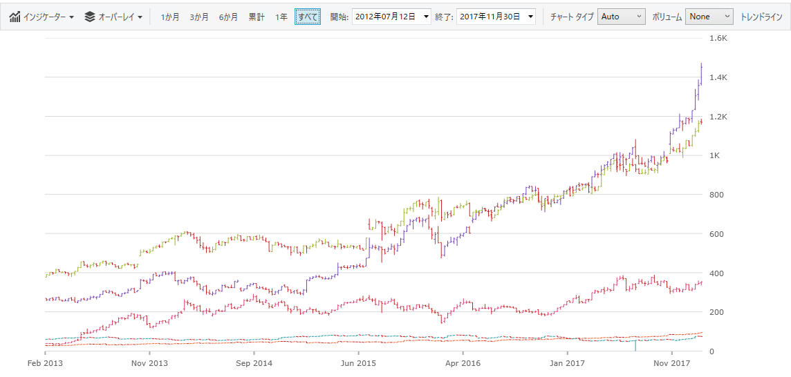

== Excel Engine の機能

=== 幅の自動調整サポート

WorksheetColumn に追加された 2 つの新しいメソッドは幅の自動調整をサポートします。

CalculateAutoFitWidth メソッドは、すべての要素に合わせるために必要な特定の WorksheetColumn の幅を返します。

AutoFitWidth メソッドは、CalculateAutoFitWidth メソッドから返された幅に WorksheetColumn をサイズ設定します。

=== 条件付き書式

条件付き書式は、セル値に基づいてセルに色、アイコン、またはデータ バーなどの書式設定を適用します。条件付き書式ルールを作成する必要があります。たとえば、条件付き書式ルールは、値が $2000 より小さい場合、セルの色を赤に設定します。このルールを適用する場合、$2000 より小さい値を持つセルを簡単に表示できます。

Excel Engine で条件付き書式の詳細については、「link:excelengine-conditional-formatting.html[Excel Engine の条件付き書式設定]」を参照してください。

=== ワークシートの並べ替えとフィルタリング

WorksheetTable のエンジンに並べ替えおよびフィルタリングのサポートがあります。Excel では、ワークシートでテーブル以外に並べ替えおよびフィルタリングが可能な単一の領域を定義できます。また、ワークシートで並べ替えたその他の領域を定義できます。これにより、ワークシート レベル並べ替えおよびフィルタリング操作のサポートを Excel Engine に追加し、アイコン並べ替え/フィルタリング クラスを公開しました。以前アイコンはアイコン セットの条件付き書式で指定していましたが、条件付き書式はサポートされていなかったために内部仕様でした。

{ExcelEngineName} で Worksheet フィルタリングの詳細については、「link:excelengine-filtering-worksheet-regions.html[Excel Engine のワークシート フィルタリング]」を参照してください。

{ExcelEngineName} のワークシート並べ替えの詳細については、「link:excelengine-worksheet-level-sorting.html[{ExcelEngineName} 並べ替え]」トピックを参照してください。

=== 追加された Excel 関数のサポート

Excel Engine は現時点で 100 種上の関数をサポートします。link:excelengine-list-of-supported-built-in-functions.html[サポートされる Excel 関数のリスト]を参照してください。

== {DataGridName} 機能

=== セルの結合

{DataGridName} コントロールはオプションに特定の Field の隣の兄弟データ レコードが同じ値を含むことを検出できます。セルが編集モードにない場合、値がデータ レコードの間に表示されます。

{DataGridName} コントロールの結合されたセルの詳細については、「link:xamdatagrid-cell-merging.html[{DataGridName} でセルの結合]」トピックを参照してください。

image::images/xamdatagrid_merged_cells_whats_new.png[]

=== 画像フィールド

{DataGridName} は画像固有の Field 要素があります。ImageField は、値が ImageSource を表す基本データ項目のプロパティ、画像の場所を表す Uri インスタンスまたは文字列、またはバイト配列と関連付けることができます。

{DataGridName} コントロールの新しい ImageField の詳細については、「link:xamdatagrid-configuring-image-field.html[画像フィールドの構成]」トピックを参照してください。

image::images/xamdatagrid_image_field_whats_new.png[]

== {SpreadsheetName} 機能

=== 条件付き書式

Excel Engine で条件付き書式機能の追加で、スプレッドシートにもこの機能を使用できます。スプレッドシートは Microsoft Excel に利用可能なすべての条件付き書式機能の描画をサポートします。Microsoft Excel に複数の定義済みスタイル (プリセット) があります。これを使用すると、条件付き書式をデータにすばやく適用できます。3 つのカテゴリにグループ化されます。

* データ バーは、各セルに追加された棒グラフのようなデータ バー水平バーです。

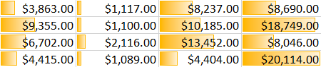

* カラー スケールは、各セルの色をその値に基づいて変更します。各色スケールは、2 色または 3 色のカラー グラデーションを使用します。たとえば、緑黄赤 (GYR) 色スケールで最大値の色は緑、平均値は黄色、最小値は赤になります。

image::images/ConditionalFormattingColorScales.png[]

* アイコン セットは特定のアイコンをその値に基づいて各セルに追加します。

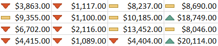

注: 条件書式設定はスプレッドシート内でコピー/貼り付けする際にコピーされます。

=== セル書式設定ダイアログ

{SpreadsheetName} を使用してセル データの表示方法を変更できます。たとえば、小数点の右にある桁数を指定、あるいはセルにパターンおよび境界線を追加できます。この設定を「セルの書式設定」ダイアログ ボックスでアクセスして変更できます。

==== 数値タブ

デフォルトですべてのワークシート セルが一般的な数値形式で書式設定されます。一般的な形式では、セルに入力された値はそのまま使用されます。たとえば、セルに 36526 と入力して Enter を押した場合、セル コンテンツは 36526 と表示されます。セルで一般的な数値形式が使用されるためです。ただし、最初にセルを通貨として書式設定した場合、数字 36526 は $36,526.00 として表示されます。

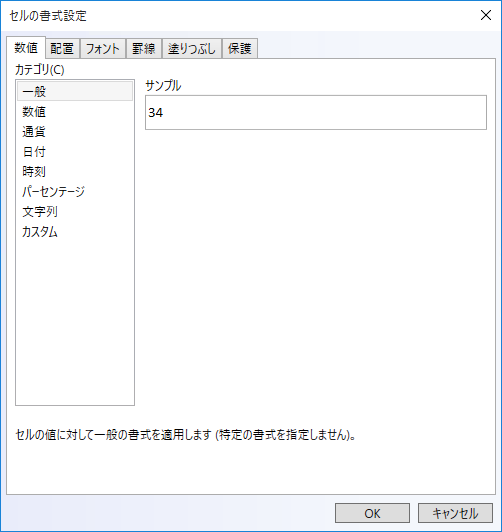

==== 配置タブ

テキストと数値を配置し、配置タブを使用してセルの方向を変更してテキスト コントロールを指定できます。

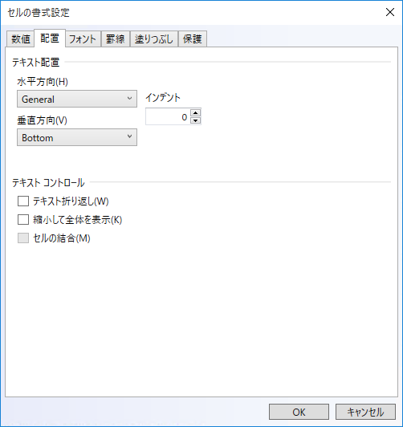

==== フォント タブ

用語「フォント」は、書体 (Arial など) とその属性 (ポイント サイズ、フォント スタイル、下線、色、エフェクト) を指します。セル書式設定ダイアログ ボックスのフォント タブを使用してこれらの設定を制御します。ダイアログ ボックスのプレビュー セクションのレビューで設定のプレビューを表示できます。

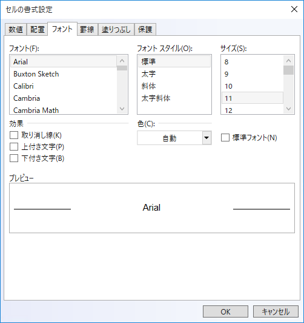

==== 境界線タブ

Excel で単一セルまたはセルの範囲の周りに境界線を配置できます。セルの左上角から右下角、またはセルの左下角から右上角へ線を描画できます。線のスタイル、線の太さ、または線の色を変更してデフォルト設定のセルの境界線をカスタマイズできます。

image::images/Format_Cells_Dialog_Border.png[]

==== 塗りつぶしタブ

セル書式設定ダイアログ ボックスの塗りつぶしタブを使用して選択セルの背景色を設定します。[パターン リスト] を使用して 2 色パターンまたはセル背景にシェードを適用できます。

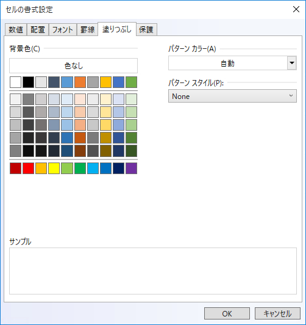

==== 保護タブ

[保護] タブでワークシートをロックしてデータや数式を保護できます。このオプションは、ワークシートも保護しない限り、効果はありません。

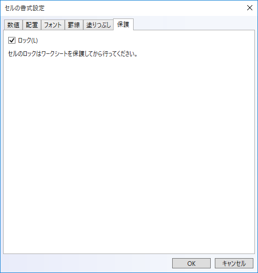

セル書式設定ダイアログの詳細については、「link:spreadsheet-format-cells-dialog.html[セル書式設定ダイアログ]」をご覧ください。

=== ワークシート フィルタリング

ワークシートの情報をフィルタリングして値をすばやく見つけることができます。1 列以上のデータをフィルターでき、表示する項目だけでなく除外する項目もフィルター設定できます。リストの選択に基づいてフィルタリング、または特定のフィルターを作成して必要なデータのみ表示できます。

データのフィルター時、1 列以上の値がフィルター条件に合わない場合、すべての行が非表示になります。数値またはテキスト値をフィルター、あるいは背景やテキストに色書式を適用したセルの色でフィルターできます。

{SpreadsheetName} のセルのコンキスト メニューでフィルター オプションを使用できます。フィルター適用後、ユーザーはフィルター ドロップダウンで**カスタム フィルター** オプションを選択し、その他のフィルタリング オプションのあるフィルタードロップダウンを開くことができます。

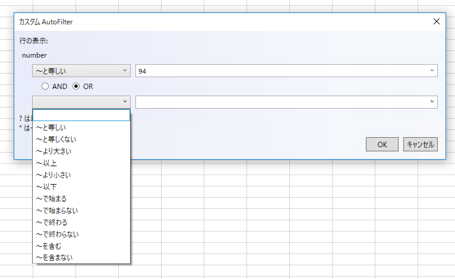

=== AutoFilter サポート

WorksheetTable のヘッダーとワークシート レベルのフィルタリング領域のヘッダー セルにフィルター関連メニューを表示するドロップダウン ボタンを表示します。ボタンは並べ替えとフィルター、ツールチップは列のフィルターを表示します。メニューは並べ替えとフィルタリングのオプションを表示します。フィルター オプションは、Excel と同様に列のデータ タイプに依存しません。以下のいずれかが表示されます。

* テキスト フィルター
* 数値フィルター
* 日付フィルター

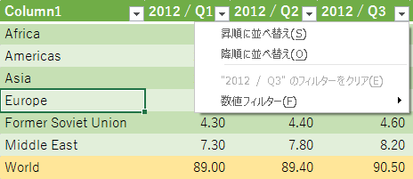

{SpreadsheetName} のフィルタリングについては、link:spreadsheet-uiu-custom-filter-dialog.html[フィルター ダイアログ インタラクション (XamSpreadsheet)] をご覧ください。

=== 表の機能拡張

==== コピー/貼り付け

表は、ソース選択がテーブル全体を含む場合にコピーされます。テーブル全体 (セルでクリック、ctrl+a を数回押下) を選択、クリップボードにコピー、貼り付けます。これで表のコピーが作成されました。WorksheetTable 内で貼り付けした場合、自動的に表を展開して貼り付け領域を含みます。

==== 編集

WorksheetTable の右端/下端に直ちに合わせるために入力または編集した場合、表を展開 (Excel と同様の個別の処理の取り消し不可) します。 

==== タブ ナビゲーション

表内のタブ ナビゲーションは、次行または前行にラップするテーブル内をナビゲーションします。Excel 同様、表の最後の表示セルからタブしたときに表が自動的に展開されます。

==== 集計行の数式

Excel で表の集計行がアクティブな場合、ドロップダウン ボタンが表示されて表に共通の数式を選択できます。Excel ではその他の数式を選択するためのダイアログを表示するオプションがあります。ドロップダウン ボタンをクリックまたはセルがアクティブなときに Alt+Down を押して表示できます。

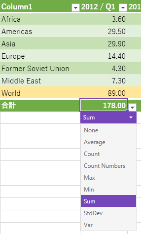

==== コンテキスト メニュー機能拡張

コンテキスト メニューが追加されました。行列を表に挿入や追加、表の行列の選択、集計行の切り替え、表を範囲に変換を追加がメニュー項目に含まれます。

表のセル コンテキストは、アクティブ セルが WorksheetTable の一部である場合に表示される以外はセル コンテキスト メニューと同様です。新しいメニューには、表に影響する新しいコマンドがあります。ActiveTable および ActiveCell が表の一部として公開されました。

==== リスト検証

Excel では、値を明示的なリスト、または値を含むセルの範囲にポイントを含むセルのリスト データ入力規則と呼ばれる特別なデータ入力規則タイプを定義できます。セル ドロップダウンを示すかどうかを検証するオプションがあります。Excel エンジンではデータ入力規則クラスをサポートし、スプレッドシートでも編集時に入力規則を使用していますが、有効な値一覧は公開していませんでした。本リリースではエンドユーザーに一覧を公開します。ドロップダウン ボタンの表示をサポート (ShowDropdown が true の場合) し、値のドロップダウン リストを表示します。ドロップダウン ボタンをクリックまたはセルがアクティブなときに Alt+Down を押して表示できます。

==== セル ドロップダウン

セル ドロップダウンを表示する方法が 2 つあります。セルのコンテキスト メニューから「**ドロップダウン リストから選択**」を使用するか、もう 1 つは Alt+Down で表示します。アクティブ セルの真上または真下にテキスト/文字列の値のドロップダウンを表示します。そのため、リスト データの検証のようにはリストのコンテンツを明示的に定義しません。注: {SpreadsheetName} は Excel とは異なり、このドロップダウンは編集時には表示されません。Excel 同様、数値を無視して空白や境界などで停止します。

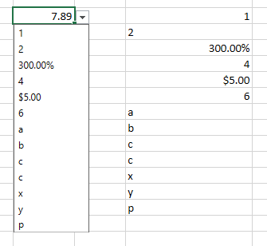

== xamRichTextEditor の新しいプロパティ

XamRichTextEditor コントロールに 2 つの新しいプロパティを追加しました。

* link:{ApiPlatform}controls.editors.xamrichtexteditor~infragistics.controls.editors.xamrichtexteditor~acceptsreturn.html[AcceptsReturn] プロパティは、ユーザーが ENTER キーを押したときにテキスト編集コントロールで応答する方法を示します。
* link:{ApiPlatform}controls.editors.xamrichtexteditor~infragistics.controls.editors.xamrichtexteditor~acceptstab.html[AcceptsTab] プロパティは、ユーザーが TAB キーを押したときにテキスト編集コントロールで応答する方法を示します。

== 和暦の日付書式設定のサポート

このリリースでは、link:xamdatetimeeditor.html[XamDateTimeEditor]、link:xammonthcalendar.html[XamMonthCalendar]、および link:xamdatagrid.html[XamDataGrid] の `DateTimeField` に `EraDisplayMode` プロパティを追加しました。

このプロパティは、和暦の日付を使用して年号情報を表示する方法を決定します。たとえば、`EraDisplayMode` プロパティが `FirstDayOfMonth` に設定された場合、月の最初の日の年号が表示されます。