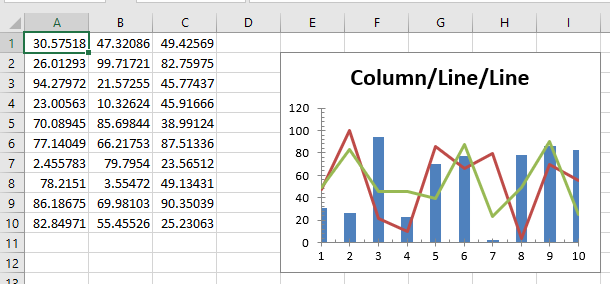

= 2019 Volume 1 の新機能

このトピックでは、{ProductName} 2019 Volume 1 リリースで導入された新しいコントロールと機能の概要について説明します。以下は主な機能について、次のセクションではその詳細について説明します。

toc::[]

=== .NET Core 3 サポート

Infragistics コントロールの使用に際して新しい環境が利用可能になりました。バージョン 2019.1 以降、アセンブリで NuGet を介した .NET Core 3.0 環境がサポートされます。

リリース時には、.NET Core 3.0 のリリース候補バージョンをサポートする予定ですが、環境と Microsoft のリリース スケジュールを同期させることにより、リリース時に .NET Core 3.0 のフルリリースをサポートする予定です。.NET Core 3.0 については、link:https://msdn.microsoft.com/ja-jp/magazine/mt848631.aspx[Microsoft サイト] をご確認ください。

Infragistics NuGet パッケージを使用するための環境設定については、link:nuget-feeds.html[NuGet フィード] および link:nuget-packages.html[NuGet パッケージ]のトピックを参照してください。

== {SpreadsheetName} 機能
=== チャート サポート

image:images/charts.png[]

Excel の人気機能が追加され、高パフォーマンスなデータ可視化を実現できるようになりました。新しく追加された SpreadsheetChartAdapter クラスが {SpreadsheetName} に統合されたことにより、設定がより簡単にできるようになりました。さらに、チャート アダプタは Excel エンジンによって補完されています。link:excelengine-workingwithcharts.html[18.2 で追加されたチャート サポート] をご覧ください。 

Spreadsheet ChartAdapter は、折れ線、エリア、柱状、ドーナツを含む 35 以上のチャート タイプがサポートされます。

{SpreadsheetName} の Excel チャートの詳細については、link:spreadsheet-adding-chart.html[{SpreadsheetName} コントロールのチャートの表示]トピックをご覧ください。

=== コンビネーション チャート
コンビネーション チャートは、1 つのチャートに複数の種類のチャートを組み合わせたチャートです。

