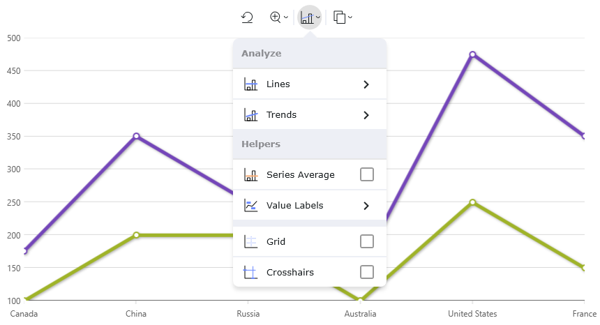

= 2023 Volume 1 の新機能

=== xamToolbar [ ベータ版 ]

link:xamtoolbar.html[xamToolbar] コンポーネントは、スタンドアロンまたは Data Chart および `CategoryChart` コンポーネントの両方と対話するための UI 操作のコンパニオン コンテナーです。これにより、事前定義された SVG アイコンを使用して `XamDataChart` など上のプロパティのプリセットから簡単に選択できるようになりますが、プロジェクト用のカスタム ツールを作成する機能も提供されます。多数の属性を利用して、使用中のアイコンを定義または変更したり、さまざまなスタイルをアイコンに適用したりできます。`Toolbar` には独自の SVG アイコンが表示されます。 

