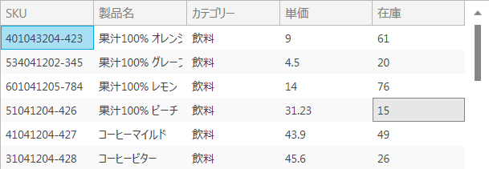
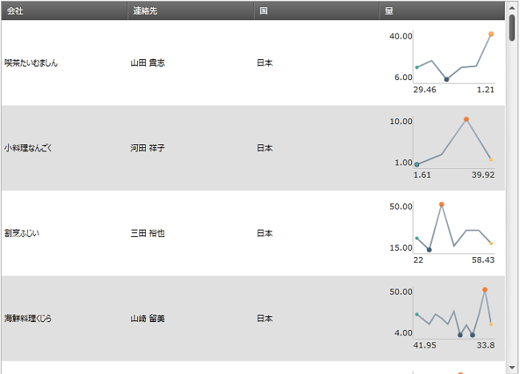
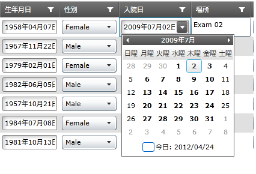
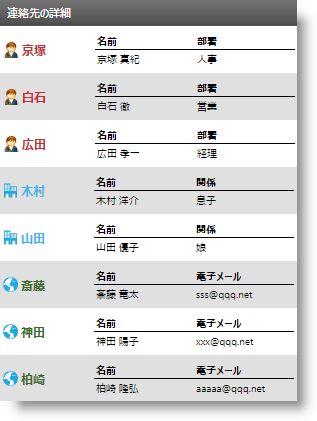
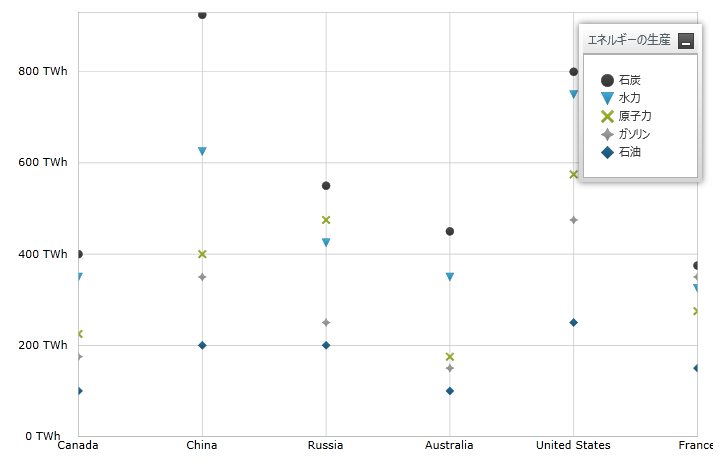
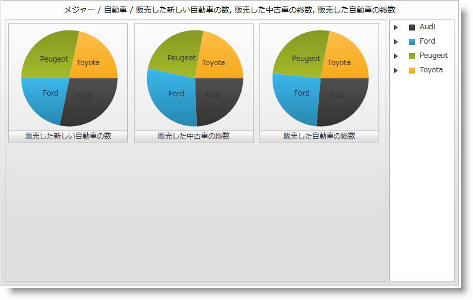
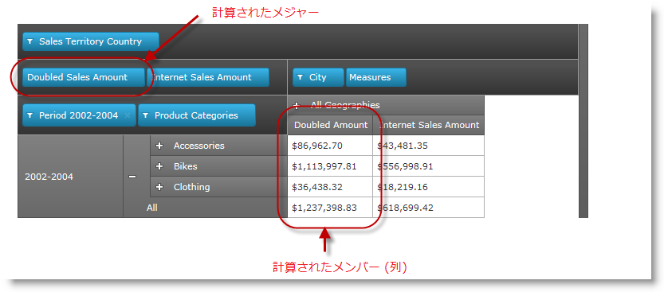
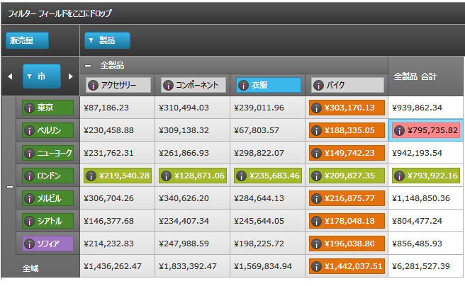
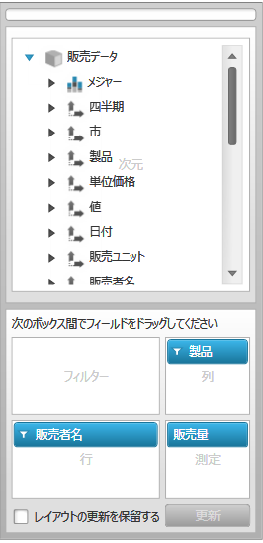

////
|metadata|
{
    "name": "whatsnew-whats-new-in-2012-volume-1",
    "controlName": [],
    "tags": [],
    "guid": "545d1012-e6ad-487a-9ca8-8b9fd0835d0c",
    "buildFlags": [],
    "createdOn": "2012-01-31T20:59:59.8014894Z"
}
|metadata|
////

= 2012 Volume 1 の新機能

== トピックの概要

=== 目的

{ProductName} 2012 Volume 1 リリースには、{PlatformName} コントロールをこれまで以上に活用することを可能にする多数の強力な新しい機能とコントロールを含んでいます。

== コントロールと機能

=== 機能の概要

以下の表に、{ProductName} 2012 Volume 1 の新機能の概要を示します。追加の詳細は、以下の概要表の後に提供します。

[options="header", cols="a,a,a"]
|====
|コントロール|機能|説明

|<<MetroTheme,Metro テーマ>>
|<<MetroTheme,Metro テーマ>>
|コントロールの新しいタッチフレンドリーなテーマ。

|<<TouchGesture,タッチ ジェスチャーのサポート>>
|<<TouchGesture,タッチ ジェスチャーのサポート>>
|コントロールのタッチフレンドリーなサポート。

|<<xamGeographicMap,xamGeographicMap>>
|<<_xamGeographicMap,xamGeographicMap>>
|地理的コンテキストでデータのプロットをサポートする新しいマップ コントロール。

|<<xamGrid,xamGrid>>
|<<xamSparklineColumn,xamSparkline 列>>
|スパークライン列タイプでは、xamSparkline™ コントロールを挿入することによって、グリッド セルにスパークライン チャートを表示できます。

|
|<<xamMultiColumnComboColumn,xamMultiColumnCombo 列>>
|MultiColumnCombo 列は、ドロップダウン リストで複数列を表示する列タイプです。

|
|<<_DateTimeColumn,DateTimeColumn 列>>
|DateTimeColumn は、xamDateTimeInput コントロールを使用して日付を表示します。

|
|<<_CopyPasteHelperMethods,コピー/貼り付けのヘルパー メソッド>>
|コピー/貼り付けのヘルパー メソッドは、xamGrid™ コントロールでのデータのコピー/貼り付けを容易にします。

|
|<<_ImplicitDataTemplates,暗黙的データ テンプレートのサポート>>
|xamGrid は暗黙的データ テンプレートおよび TemplateColumn 内の特定のデータ タイプの適用をサポートしています。

|
|<<_CustomFilterDialog,カスタム フィルター ダイアログ>>
|エンド ユーザーはダイアログ インターフェイスを使用して、列内のデータに複雑なフィルターを作成できます。

|<<xamDataChart,xamDataChart>>
|<<_DisplayingPointSeries,ポイント シリーズを表示>>
|小さいマーカーのように見えるデータ ポイントを表示するために、xamDataChart でタイプ PointSeries の 1 つまたは複数のシリーズ オブジェクトを描画するために設計されています。

|
|<<_OverviewPlusDetailPane,概要と詳細ペイン>>
|チャート コンテンツの概要を提供する新しい機能で、これによって _xam_ _DataChart_ コントロールのコンテンツのナビゲーションが可能となります。

|<<xamPieChart,xamPieChart>>
|<<_Visualizing_Olap_Data,OLAP データの視覚化>>
|PieChart を使用して OLAP データを描画できます。

|<<xamPivotGrid,xamPivotGrid>>

|<<AdvancedFiltering,高度なフィルタリング>>
|xamPivotGrid が上値と下値などのフィルターを使用して値をフィルター処理できるフィルタリング機能です。

|
|<<_Calculated_Measures,計算メジャー>>
|計算メジャーを定義し、個別の列に表示できます。

|
|<<_CustomCellTemplates,セル テンプレートおよびヘッダー テンプレートのカスタマイズ>>
|事前に定義された基準にしたがって選択的に適用されているピボット グリッドのヘッダー セルおよびデータ セルのユーザー設定のデータ テンプレートを定義できます。

|
|<<_DynamicMetaDataTree,動的なメタデータ ツリー>>
|データ選択ウィザードのメタ データ ツリーに含まれている項目を指定できます。

|
|<<_EnhancedPerformancePivotGrid,xamPivodGrid のパフォーマンス向上>>
|本リリースから、xamTree™ コントロールは xamPivotGrid で内部的に使用されなくなり、xamDataTree™ で置き換えられました。

|
|<<_FieldChooser,フィールドの選択>>
|ユーザーは、列、行、フィルター、およびメジャーを素早く選択できます。

|
|<<_LockingComponents,コンポーネントのロック>>
|xamPivotGrid では、xamPivotGrid または xamPivotDataSelector の行、列、フィルター、または測定エリアの編集をロックしたり、ロック解除したりできます。

|
|<<_Row_Header_Highlighting,行ヘッダーの強調表示>>
|行のヘッダー セルを選択することで、行の状態を強調表示できます。

|<<xamSparkline,xamSparkline>>
|<<_Sparkline_Visual_Elements,スパークライン ビジュアル要素>>
|xamSparkline コントロールには複数の視覚要素と、これらの要素を構成およびカスタマイズするために使用可能な対応する機能があります。

|<<colorTuner,XAML Color Tuner>>
|<<_Create_your_own_theme,固有のテーマを作成>>
|Color Tuner を使用すると、コントロール テーマの色を調整できます。

|
|<<_Sharing_color_tuning_configurations,カラー調整の構成を共有>>
|カスタム カラー調整の構成を共有できます。

|<<excel,Excel Engine>>
|<<_Excel_format_support,Excel 書式設定のサポート>>
|Excel ライブラリは今回、組み込みのスタイル、親スタイル、書式オプション、スタイルに関係する多数の Microsoft Excel ビヘイビアーおよび解決済みのセル書式の決定機能へのアクセスをサポートしています。

|
|<<_Excel_2007_Color_Model,Excel 2007 カラー モデル>>
|このリリースは更新されたカラー オブジェクト モデルを採用しています。Excel 2007 カラー モデルを使用すると、カラーを指定し、Workbook パレットで作業して、セルを塗りつぶすために新しい Fill プロパティを使用できます。

|
|<<_Suport_Named_Tables_in_an_Excel_Spreadsheet,Excel 表計算で名前付きテーブルをサポート>>
|Excel Engine ライブラリは今回、ワークシートからのデータで名前付きテーブルにアクセスおよび作成する機能をサポートします。このテーブルを並べ替えて、フィルターし集計できます。

|
|<<_Filtering_Tables,テーブルをフィルター>>
|Excel Engine はテーブルのフィルターをサポートします。

|
|<<_Sorting_Tables,テーブルを並べ替え>>
|Excel Engine はテーブルの並べ替えをサポートします。

|
|<<_Get_Cell_Text,セル テキストの取得>>
|ここでは、Microsoft Excel セルに表示されるテキストの提供の仕方を決定する方法を説明します。

|<<_undoredo,Infragistics Undo/Redo Framework™>>
|<<_undoredo1,Infragistics Undo/Redo Framework™>>
|元に戻す/やり直し機能のサポートが提供されます。このフレームワークはクロスプラットフォームで、WPF または Silverlight アプリケーションのいずれかで使用できます。

|<<_xamBarcode,xamBarcode>>
|<<_Hiding_Barcode_Text,人間が認識できるバーコード テキストを非表示にする>>
|xamBarcode コントロールでは、人間が認識できるバーコード テキストを非表示および表示できます。

|====

== Metro テーマ

[[MetroTheme]]

=== Metro テーマ

今回のリリースでは、すべてのコントロールに適用可能な新しいテーマ、Metro を導入します。このテーマは、白、グレー、黒を使用し、強調表示/アクセント カラーとしてシアンを使用します。これはタッチ環境のために特に作成されたテーマであるため、コントロールにより大きなタッチ領域ができて使いやすくなります。

[options="header", cols="a"]
|====
|IG テーマと Metro テーマを使用するコントロール

|image::images/Metro_Theme_1.png[] 

図 1: IG テーマを使用した xamGrid 

 

図 2: Metro テーマを使用した xamGrid

|image::images/Metro_Theme_3.png[] 

図 3: IG テーマを使用した xamDialogWindow
|image::images/Metro_Theme_4.png[] 

図 4: Metro テーマを使用した xamDialogWindow

|image::images/Metro_Theme_5.png[] 

図 5: IG テーマを使用した xamTileManager
|image::images/Metro_Theme_6.png[] 

図 6: Metro テーマを使用した xamTileManager

|image::images/Metro_Theme_7.png[] 

図 7: IG テーマを使用した xamInputs
|image::images/Metro_Theme_8.png[] 

図 8: Metro テーマを使用した xamInputs

|image::images/Metro_Theme_9.png[] 

図 9: IG テーマを使用した xamOrgChart
|image::images/Metro_Theme_10.png[] 

図 10: Metro テーマを使用した xamOrgChart

|image::images/Metro_Theme_11.png[] 

図 11: IG テーマを使用した xamMap
|image::images/Metro_Theme_12.png[] 

図 12: Metro テーマを使用した xamMap

|====

==== 関連トピック:

* link:designers-guide-using-themes.html[テーマの使用]

== タッチ ジェスチャーのサポート

[[TouchGesture]]

=== タッチ ジェスチャーのサポート

12.1 リリースより、{ProductName} コントロールはタッチ ジェスチャをサポートしています。次のトピックでは、タッチ ジェスチャーのサポート、タッチ環境でのコントロールの使用およびコントロールを使用する間に受ける制限を説明します。

==== 関連トピック:

* link:developers-guide-touch-support.html[タッチ ジェスチャーのサポート]

[[xamGeographicMap]]
== xamGeographicMap

[[_xamGeographicMap]]

=== xamGeographicMap

_xamGeographicMap_   コントロールによって、ビュー モデルからの地理的位置を含むデータを表示したり、地理的画像地図でシェイプ ファイルから読み込まれた地理的データを表示できます。

[cols="a,a"]
|====

|image:images/Whats_New_xamGeographicMap_1.png[] 

図 1: Open Street Maps からの地理的画像がある xamGeographicMap
|image:images/Whats_New_xamGeographicMap_2.png[] 

図 2: Map Quest© からの地理的画像がある xamGeographicMap

|image::images/Whats_New_xamGeographicMap_3.png[] 

図 3: Bing™ Maps からの地理的画像がある xamGeographicMap
|image::images/Whats_New_xamGeographicMap_4.png[] 

図 4: CloudMade© Maps からの地理的画像がある xamGeographicMap

|====

image::images/Whats_New_xamGeographicMap_5.png[]

図 5: 複数の地理的シリーズがある xamGeographicMap

*関連トピック:*

* link:geographicmap.html[xamGeographicMap]

[[xamGrid]]
== xamGrid

[[xamSparklineColumn]]

=== xamSparkline 列

スパークライン列タイプでは、xamSparkline™ コントロールを挿入することによって、グリッド セルにスパークライン チャートを表示できます。

==== 関連トピック:

* link:xamgrid-sparkline-column.html[xamSparkline 列]

[[xamMultiColumnComboColumn]]

=== xamMultiColumnCombo 列

MultiColumnCombo 列は、ドロップダウン リストで複数列を表示する列タイプです。これによってユーザーは、事前設定された項目のドロップダウン リストから値を選択することによって、xamGrid コントロールのセル値を編集できます。

image::images/xamGrid_MultiColumnCombo_01.png[]

==== 関連トピック:

* link:xamgrid-multicolumncombo-column.html[xamMultiColumnCombo 列]

[[_DateTimeColumn]]

=== DateTimeColumn 列

DateTimeColumn は、 link:xamdatetimeinput.html[xamDateTimeInput]™ コントロールを使用して link:xamgrid.html[xamGrid] コントロールに日付を表示します。link:{ApiPlatform}controls.grids.datetimecolumn{ApiVersion}~infragistics.controls.grids.datetimecolumn~selecteddatemask.html[SelectedDateMask] プロパティを特定のマスクに設定することによって、日付の書式を決定できます。

==== 関連トピック:

* link:xamgrid-datetimecolumn.html[DateTimeColumn]

[[_CopyPasteHelperMethods]]

=== コピー/貼り付けのヘルパー メソッド

コピー/貼り付けのヘルパー メソッドは、以下のような機能を提供します。

* xamGrid コントロールでのデータの貼り付け
* Microsoft Office Excel 文書または xamGrid コントロールに貼り付けることができる、有効な長方形セルの選択を検証
* xamGrid コントロールでのデータの貼り付け中にエラーが発生した場合のエラー処理

==== 関連トピック:

* link:xamgrid-copypastehelpermethods.html[コピー/貼り付けのヘルパー メソッド]

[[_ImplicitDataTemplates]]

=== 暗黙的データ テンプレートのサポート

暗黙的データ テンプレートは、特定のデータ タイプに適用されます。x:Key プロパティの代わりに、DataType プロパティがデータ テンプレートに設定されます。この機能は Silverlight 5 で導入され、Windows Presentation Foundation でも利用可能です。

==== 関連トピック:

* link:xamgrid-implicitdatatemplates.html[セルのデータ タイプによって、異なるユーザー インターフェイスを適用する]

[[_CustomFilterDialog]]

=== カスタム フィルター ダイアログ

xamGrid カスタム フィルター ダイアログは、列のフィルタリング ロジックを作成して編集するエンド ユーザー インターフェイスを提供します。

image::images/WhatsNew_CustomFilterDialog.png[]

==== 関連トピック:

* link:xamgrid-using-the-custom-filter-dialog.html[カスタム フィルター ダイアログの使用]

[[xamDataChart]]
== xamDataChart

[[_DisplayingPointSeries]]

=== ポイント シリーズを表示

_xamDataChart_   は、 link:{ApiPlatform}controls.charts.xamdatachart{ApiVersion}~infragistics.controls.charts.pointseries_members.html[PointSeries] と呼ばれる他のタイプのシリーズを提供しています。これは、それらを識別する小さい形状のアイコンを使用して、マーカーまたはポイントとしてデータ ポイントを表示することを意図しています。

以下は、 _xamDataChart_   によるビューでの複数の PointSeries のプレビューです。

==== 関連トピック:

* link:datachart-category-point-series.html[ポイント シリーズを表示]

[[_OverviewPlusDetailPane]]

=== 概要と詳細ペイン

_xamDataChart_   では、チャート コンテンツの概要は xamOverviewPlusDetailPane コントロールによって表されます。このコントロールは、サポートされるシリーズのすべてのタイプおよびナビゲーション機能のプレビューを提供します。

以下に示すのは、 _xamDataChart_   の概要ペインの PointSeries の FinancialPriceSeries のプレビューです。

image::images/Whats_New_xamDataChart_OPD.png[]

==== 関連トピック:

* link:datachart-navigating-chart-using-overview-plus-detail-pane.html[Overview Plus Detail Pane を使用してチャートをナビゲート]

[[xamPieChart]]
== xamPieChart

[[_Visualizing_Olap_Data]]

=== OLAP データの視覚化

_xamPieChart_   に追加された最近の機能拡張は、OlapAxis と呼ばれる新しい軸タイプです。これは、PieChart を使用した OLAP データの視覚化に役立ちます。

==== 関連トピック:

* link:piechart-visualizing-olap-data-piechart.html[OLAP データの視覚化]

[[xamPivotGrid]]
== xamPivotGrid

=== 高度なフィルタリング

高度なフィルタリング機能により、xamPivotGrid の値のフィルタリングが可能になり、合計、カウント、またはパーセントによる上値と下値のフィルターが可能です。

image::images/xamPivotGrid_Advanced_Filtering.png[]

==== 関連トピック:

* link:xampivotgrid-understanding-xampivotgrid.html[xamPivotGrid の概要]
* link:xampivotgrid-getting-started-with-xampivotgrid.html[xamPivotGrid を使用した作業の開始]

[[_Calculated_Measures]]

=== 計算メジャー

この機能は、何らかの計算式でメジャーを作成し、計算メジャーとしてそれを別の列で表す方法を提供します。計算メジャーは、計算における定義されたメジャーの結果を表します。

==== 関連トピック:

* link:xampivotgrid-calculated-measures.html[計算メジャー]

[[_CustomCellTemplates]]

=== セル テンプレートおよびヘッダー テンプレートのカスタマイズ

xamPivotGrid™ コントロールでは、データ セルとヘッダー セルにカスタム DataTemplates を指定できます。セルの階層やレベルなどに基づいて、さまざまなセルにさまざまなテンプレートを指定できます。

==== 関連トピック:

* link:xampivotgrid-customizing-cells-with-templates.html[テンプレートを使用したセルのカスタマイズ]

[[_DynamicMetaDataTree]]

=== 動的なメタデータ ツリー

データ ソースを xamPivotDataSelector™ に割り当てる場合、データ ソースのすべての項目 (Measures、Dimensions、Hierarchies など) が自動的にメタデータ ツリーに追加されます。動的なメタデータ ツリー機能を使用すると、既定で組み込む項目を正確に指定し、それらの項目を展開するかどうか指定できます。

==== 関連トピック:

* link:xampivotgrid-dataselector-including-excluding-items-from-the-metadatatree.html[xamPivotDataSelector のメタデータ ツリーへの項目の包含/除外]

[[_EnhancedPerformancePivotGrid]]

=== xamPivotGrid のパフォーマンス強化

このリリース時点で、フィルター ドロップダウンおよびデータ選択ウィザードのメタデータ ツリーで xamTree ではなく xamDataTree コントロールを使用します。xamDataTree は仮想化を使用してその項目を表示するため、xamPivotGrid のパフォーマンスとユーザー エクスペリエンスが著しく強化されています。その他のメリットとして、より簡単にデータ選択ウィザードのスタイルを変更できるようになりました。

.注:
[NOTE]
====
ご使用のプロジェクトの xamTree アセンブリへの参照を xamDataTree への参照と置き換える必要があります。
====