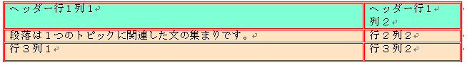
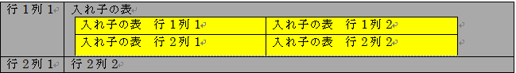

////

|metadata|
{
    "name": "word-add-table-to-word-document",
    "controlName": ["IG Word Library"],
    "tags": ["Getting Started"],
    "guid": "e7850c5a-776e-4026-83fc-5b6824db3348",  
    "buildFlags": [],
    "createdOn": "2016-05-25T18:21:54.3620728Z"
}
|metadata|
////

= テーブルを Word 文書に追加

このドキュメントは、Word 文書に見出し行とネストされたテーブルがあるテーブルを追加する方法を示します。

トピックは以下のとおりです。

* <<Intro,はじめに>>
* <<Req,要件>>
* <<FormatTable,書式設定されたテーブル - 概要>>
* <<Ex,実例>>

** <<ExTableWithHeader,実例 : ヘッダー行のあるテーブルを作成>>

*** <<PrevTableWithHeader,プレビュー>>
*** <<CodeTableWithHeader,コード サンプル>>

** <<ExNestedTable,実例 : ネストされたテーブルを作成>>

*** <<PrevNestedTable,プレビュー>>
*** <<CodeNestedTable,コード サンプル>>

* <<relatedTopics,関連トピック>>

[[Intro]]
== はじめに

Infragistics® Word ライブラリによって、Word 文書にテーブルを挿入することができます。テーブルによって簡単にテキストの列や行を配置できます。

[[Req]]
== 要件

link:{ApiPlatform}documents.io{ApiVersion}.html[{VersionedApiPlatform}.Documents.IO.v{ProductVersion}.dll] アセンブリへの参照が必要とされます。

[[FormatTable]]
== 書式設定されたテーブル - 概要

書式設定されたテーブル、テーブルの行、テーブルのセルは、以下のようなさまざまなクラスで処理されます。

* link:{ApiPlatform}documents.io{ApiVersion}~infragistics.documents.word.tableproperties.html[TableProperties]
* link:{ApiPlatform}documents.io{ApiVersion}~infragistics.documents.word.tablerowproperties.html[TableRowProperties]
* link:{ApiPlatform}documents.io{ApiVersion}~infragistics.documents.word.tablecellproperties.html[TableCellProperties]
* link:{ApiPlatform}documents.io{ApiVersion}~infragistics.documents.word.tableborderproperties.html[TableBorderProperties]

[[Ex]]
== 実例

[[ExTableWithHeader]]
== 実例 : ヘッダー行のあるテーブルを作成

以下のコードは、 link:{ApiPlatform}documents.io{ApiVersion}~infragistics.documents.word.worddocumentwriter.html[WordDocumentWriter] ストリーマー オブジェクトを使用して 2 列と 3 行のテーブルを作成します。最初の行は、TableRowProperties オブジェクトの link:{ApiPlatform}documents.io{ApiVersion}~infragistics.documents.word.tablerowproperties~isheaderrow.html[IsHeaderRow] プロパティを使用してヘッダー行として設定されます。

[[PrevTableWithHeader]]
== プレビュー

以下は最終結果のプレビューです。

====== 図 1: サンプル コードによって作成された Word 文書のヘッダーが付いたテーブル

[[CodeTableWithHeader]]
== コード サンプル

*C# の場合:*

----
using Infragistics.Documents.Word;
// Create a new instance of the WordDocumentWriter class using the
// static 'Create' method.
// This instance must be closed once content is written into Word.
WordDocumentWriter docWriter = WordDocumentWriter.Create(@"C:\TestWordDoc.docx");
docWriter.StartDocument();
// Create border properties for Table
TableBorderProperties borderProps = docWriter.CreateTableBorderProperties();
borderProps.Color = Color.Red;
borderProps.Style = TableBorderStyle.Double;
// Create table properties
TableProperties tableProps = docWriter.CreateTableProperties();
tableProps.Alignment = ParagraphAlignment.Center;
tableProps.BorderProperties.Color = borderProps.Color;
tableProps.BorderProperties.Style = borderProps.Style;
// Create table row properties
TableRowProperties rowProps = docWriter.CreateTableRowProperties();
//Make the row a Header
rowProps.IsHeaderRow = true;
// Create table cell properties
TableCellProperties cellProps = docWriter.CreateTableCellProperties();
cellProps.BackColor = Color.DarkGray;
cellProps.TextDirection = TableCellTextDirection.LeftToRightTopToBottom;
// Begin a table with 2 columns, and apply the table properties
docWriter.StartTable(2, tableProps);
// Begin a Row and apply table row properties
// This row will be set as the Header row by the row properties
// HEADER ROW
docWriter.StartTableRow(rowProps);
// Cell Value for 1st row 1st column
// Start a Paragraph and add a text run to the cell
docWriter.StartTableCell(cellProps);
docWriter.StartParagraph();
docWriter.AddTextRun("Header Row1 Col1");
docWriter.EndParagraph();
docWriter.EndTableCell();
// Cell value for 1st row 2nd column
docWriter.StartTableCell(cellProps);
docWriter.StartParagraph();
docWriter.AddTextRun("Header Row1 Col2");
docWriter.EndParagraph();
docWriter.EndTableCell();
// End the Table Row
docWriter.EndTableRow();
// Reset the cell properties, so that the
// cell properties are different from the header cells.
cellProps.Reset();
cellProps.BackColor = Color.AliceBlue;
// DATA ROW
docWriter.StartTableRow();
// Cell Value for 2nd row 1st column
docWriter.StartTableCell(cellProps);
docWriter.StartParagraph();
docWriter.AddTextRun("A paragraph is a series of sentences that are organized and coherent, and are all related to a single topic. ");
docWriter.EndParagraph();
docWriter.EndTableCell();
// Cell Value for 2nd row 2nd column
docWriter.StartTableCell(cellProps);
docWriter.StartParagraph();
docWriter.AddTextRun("Row2 Col2");
docWriter.EndParagraph();
docWriter.EndTableCell();
docWriter.EndTableRow();
// DATA ROW
docWriter.StartTableRow();
// Cell Value for 3rd row 1st column
docWriter.StartTableCell(cellProps);
docWriter.StartParagraph();
docWriter.AddTextRun("Row3 Col1");
docWriter.EndParagraph();
docWriter.EndTableCell();
// Cell Value for 3rd row 2nd column
docWriter.StartTableCell(cellProps);
docWriter.StartParagraph();
docWriter.AddTextRun("Row3 Col2");
docWriter.EndParagraph();
docWriter.EndTableCell();
docWriter.EndTableRow();
docWriter.EndTable();
docWriter.EndDocument();
// Close the WordDocumentWriter instance.
docWriter.Close();
----

*Visual Basic の場合:*

----
'  Create a new instance of the WordDocumentWriter class using the
'  static 'Create' method.
Dim docWriter As WordDocumentWriter = WordDocumentWriter.Create("C:\TestWordDoc.docx")
docWriter.StartDocument()
' Create border properties for Table
Dim borderProps As TableBorderProperties = docWriter.CreateTableBorderProperties()
borderProps.Color = Color.Red
borderProps.Style = TableBorderStyle.[Double]
' Create table properties
Dim tableProps As TableProperties = docWriter.CreateTableProperties()
tableProps.Alignment = ParagraphAlignment.Center
tableProps.BorderProperties.Color = borderProps.Color
tableProps.BorderProperties.Style = borderProps.Style
' Create table row properties
Dim rowProps As TableRowProperties = docWriter.CreateTableRowProperties()
'Make the row a Header
rowProps.IsHeaderRow = True
' Create table cell properties
Dim cellProps As TableCellProperties = docWriter.CreateTableCellProperties()
cellProps.BackColor = Color.DarkGray
cellProps.TextDirection = TableCellTextDirection.LeftToRightTopToBottom
' Begin a table with 2 columns, and apply the table properties
docWriter.StartTable(2, tableProps)
' Begin a Row and apply table row properties
' This row will be set as the Header row by the row properties
' HEADER ROW
docWriter.StartTableRow(rowProps)
' Cell Value for 1st row 1st column
' Start a Paragraph and add a text run to the cell
docWriter.StartTableCell(cellProps)
docWriter.StartParagraph()
docWriter.AddTextRun("Header Row1 Col1")
docWriter.EndParagraph()
docWriter.EndTableCell()
' Cell value for 1st row 2nd column
docWriter.StartTableCell(cellProps)
docWriter.StartParagraph()
docWriter.AddTextRun("Header Row1 Col2")
docWriter.EndParagraph()
docWriter.EndTableCell()
' End the Table Row
docWriter.EndTableRow()
' Reset the cell properties, so that the
' cell properties are different from the header cells.
cellProps.Reset()
cellProps.BackColor = Color.AliceBlue
' DATA ROW
docWriter.StartTableRow()
' Cell Value for 2nd row 1st column
docWriter.StartTableCell(cellProps)
docWriter.StartParagraph()
docWriter.AddTextRun("A paragraph is a series of sentences that are organized and coherent, and are all related to a single topic. ")
docWriter.EndParagraph()
docWriter.EndTableCell()
' Cell Value for 2nd row 2nd column
docWriter.StartTableCell(cellProps)
docWriter.StartParagraph()
docWriter.AddTextRun("Row2 Col2")
docWriter.EndParagraph()
docWriter.EndTableCell()
docWriter.EndTableRow()
' DATA ROW
docWriter.StartTableRow()
' Cell Value for 3rd row 1st column
docWriter.StartTableCell(cellProps)
docWriter.StartParagraph()
docWriter.AddTextRun("Row3 Col1")
docWriter.EndParagraph()
docWriter.EndTableCell()
' Cell Value for 3rd row 2nd column
docWriter.StartTableCell(cellProps)
docWriter.StartParagraph()
docWriter.AddTextRun("Row3 Col2")
docWriter.EndParagraph()
docWriter.EndTableCell()
docWriter.EndTableRow()
docWriter.EndTable()
docWriter.EndDocument()
docWriter.Close()
----

[[ExNestedTable]]
== 実例 : ネストされたテーブルを作成

ネストされたテーブルは、別のテーブル内に表示されるテーブルです。以下のコードは、2 つの列、2 つの行、および 2 つの列と行があるネストされたテーブルのある主テーブルを作成します。主テーブルの最初の行の第 2 列にネストされたテーブルが格納されます。

[[PrevNestedTable]]
== プレビュー

以下は最終結果のプレビューです。

====== 図 2: サンプル コードによって作成された Word 文書のネストされたテーブル

[[CodeNestedTable]]
== コード サンプル

*C# の場合:*

----
// Create a new instance of the WordDocumentWriter
// class using the static 'Create' method.
// This instance must be closed once content is written into Word.
WordDocumentWriter docWriter = WordDocumentWriter.Create(@"C:\TestWordDoc.docx");
TableCellProperties cellProps = docWriter.CreateTableCellProperties();
cellProps.BackColor = Color.LightGray;
docWriter.StartDocument();
// Begin a Table with 2 columns
docWriter.StartTable(2);
// Begin a table row
docWriter.StartTableRow();
// Begin Table cell for first row first column
docWriter.StartTableCell(cellProps);
docWriter.StartParagraph();
docWriter.AddTextRun("Row1 Col1");
docWriter.EndParagraph();
docWriter.EndTableCell();
// Begin Table cell for first row second column
docWriter.StartTableCell(cellProps);
#region // Nested Table
docWriter.StartParagraph();
docWriter.AddTextRun("Nested Table");
docWriter.AddNewLine();
docWriter.EndParagraph();
docWriter.StartTable(2);
docWriter.StartTableRow();
cellProps.Reset();
cellProps.BackColor = Color.Yellow;
docWriter.StartTableCell(cellProps);
docWriter.StartParagraph();
docWriter.AddTextRun("Nested Table Row1 Col1");
docWriter.EndParagraph();
docWriter.EndTableCell();
docWriter.StartTableCell(cellProps);
docWriter.StartParagraph();
docWriter.AddTextRun("Nested Table Row1 Col2");
docWriter.EndParagraph();
docWriter.EndTableCell();
docWriter.EndTableRow();
docWriter.StartTableRow();
docWriter.StartTableCell(cellProps);
docWriter.StartParagraph();
docWriter.AddTextRun("Nested Table Row2 Col1");
docWriter.EndParagraph();
docWriter.EndTableCell();
docWriter.StartTableCell(cellProps);
docWriter.StartParagraph();
docWriter.AddTextRun("Nested Table Row2 Col2");
docWriter.EndParagraph();
docWriter.EndTableCell();
docWriter.EndTableRow();
// For nested tables at least one paragraph must be added after adding the table within the cell.
// The EndTable method exposes an overload that adds an empty paragraph. 
docWriter.EndTable(true);
#endregion // Nested Table
docWriter.EndTableCell();
docWriter.EndTableRow();
docWriter.StartTableRow();
cellProps.Reset();
cellProps.BackColor = Color.LightGray;
docWriter.StartTableCell(cellProps);
docWriter.StartParagraph();
docWriter.AddTextRun("Row2 Col1");
docWriter.EndParagraph();
docWriter.EndTableCell();
docWriter.StartTableCell(cellProps);
docWriter.StartParagraph();
docWriter.AddTextRun("Row2 Col2");
docWriter.EndParagraph();
docWriter.EndTableCell();
docWriter.EndTableRow();
docWriter.EndTable();
docWriter.EndDocument();
// Close the WordDocumentWriter instance.
docWriter.Close();
----

*Visual Basic の場合:*

----
'  Create a new instance of the WordDocumentWriter
'  class using the static 'Create' method.
'  This instance must be closed once content is written into Word.
Dim docWriter As WordDocumentWriter = WordDocumentWriter.Create("C:\TestWordDoc.docx")
'string WordDocname = Application.StartupPath + "\\TestWordDoc.docx";
'WordDocumentWriter docWriter = WordDocumentWriter.Create(WordDocname);
Dim cellProps As TableCellProperties = docWriter.CreateTableCellProperties()
cellProps.BackColor = Color.LightGray
docWriter.StartDocument()
' Begin a Table with 2 columns
docWriter.StartTable(2)
' Begin a table row
docWriter.StartTableRow()
' Begin Table cell for first row first column
docWriter.StartTableCell(cellProps)
docWriter.StartParagraph()
docWriter.AddTextRun("Row1 Col1")
docWriter.EndParagraph()
docWriter.EndTableCell()
' Begin Table cell for first row second column
docWriter.StartTableCell(cellProps)
'#Region ""
docWriter.StartParagraph()
docWriter.AddTextRun("Nested Table")
docWriter.AddNewLine()
docWriter.EndParagraph()
docWriter.StartTable(2)
docWriter.StartTableRow()
cellProps.Reset()
cellProps.BackColor = Color.Yellow
docWriter.StartTableCell(cellProps)
docWriter.StartParagraph()
docWriter.AddTextRun("Nested Table Row1 Col1")
docWriter.EndParagraph()
docWriter.EndTableCell()
docWriter.StartTableCell(cellProps)
docWriter.StartParagraph()
docWriter.AddTextRun("Nested Table Row1 Col2")
docWriter.EndParagraph()
docWriter.EndTableCell()
docWriter.EndTableRow()
docWriter.StartTableRow()
docWriter.StartTableCell(cellProps)
docWriter.StartParagraph()
docWriter.AddTextRun("Nested Table Row2 Col1")
docWriter.EndParagraph()
docWriter.EndTableCell()
docWriter.StartTableCell(cellProps)
docWriter.StartParagraph()
docWriter.AddTextRun("Nested Table Row2 Col2")
docWriter.EndParagraph()
docWriter.EndTableCell()
docWriter.EndTableRow()
' For nested tables atleast one paragraph must be added
' after adding the table within the cell.
' The EndTable method exposes an overload that adds an empty paragraph.
docWriter.EndTable(True)
'#End Region
docWriter.EndTableCell()
docWriter.EndTableRow()
docWriter.StartTableRow()
cellProps.Reset()
cellProps.BackColor = Color.LightGray
docWriter.StartTableCell(cellProps)
docWriter.StartParagraph()
docWriter.AddTextRun("Row2 Col1")
docWriter.EndParagraph()
docWriter.EndTableCell()
docWriter.StartTableCell(cellProps)
docWriter.StartParagraph()
docWriter.AddTextRun("Row2 Col2")
docWriter.EndParagraph()
docWriter.EndTableCell()
docWriter.EndTableRow()
docWriter.EndTable()
docWriter.EndDocument()
' Close the WordDocumentWriter instance.
docWriter.Close()
----

[[relatedTopics]]
== 関連トピック

* link:word-create-a-word-document.html[Word 文書の作成]
* link:word-apply-formatting-to-word-document.html[書式設定を Word 文書に適用]
* link:word-add-images-to-word-document.html[画像を Word 文書に追加]
* link:word-headers-footers-and-page-numbers.html[ヘッダー、フッター、ページ番号]
* link:word-about-ig-word-library.html[Infragistics Word ライブラリについて]