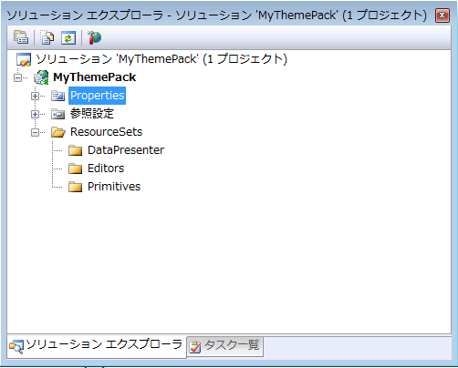

////
|metadata|
{
    "name": "wpf-creating-and-setting-up-a-themepack-project",
    "controlName": [],
    "tags": ["Styling","Theming"],
    "guid": "{3552235F-7845-4580-92EB-CD9E7ED9AF5A}",
    "buildFlags": ["wpf"],
    "createdOn": "2012-01-30T20:33:32.0560395Z"
}
|metadata|
////

= テーマパック プロジェクトの作成と設定

テーマパックはコンパイルされたアセンブリであるため、テーマパックをビルドするためには Visual Studio® プロジェクトを作成する必要があります。必要なファイルを構成する支援をするためにいくつかのフォルダーを追加することも必要です。

[start=1]
. Microsoft® Visual Studio 2008 以後で、メイン メニューで [ファイル] をクリックし、次に [新規] そして [プロジェクト...] をクリックします。[新しいプロジェクト] ダイアログ ボックスが表示します。

[start=2]
. [新しいプロジェクト] ダイアログ ボックスで、プロジェクト タイプ ツリーで Visual C# または Visual Basic を展開し、NET Framework 3.0 以後を選択します。

[start=3]
. 使用可能なテンプレートから Custom Control Library (WPF) を選択します。

[start=4]
. テンプレート名を "MyThemePack" に指定して、[OK] をクリックします。Visual Studio でプロジェクトが生成されます。

[start=5]
. ソリューション エクスプローラーで、UserControl1.xaml を右クリックして、ポップアップ メニューから [プロジェクトから削除] を選択します。

[start=6]
. 以下の NuGet パッケージ参照をプロジェクトに追加します。

** Infragistics.WPF.DataGrids

+
NuGet フィードのセットアップと NuGet パッケージの追加の詳細については、link:nuget-feeds.html[NuGet フィード] ドキュメントを参照してください。

[start=7]
. ソリューション エクスプローラーで、プロジェクトを右クリックして、ポップアップ メニューから [追加] をクリックし、次に [新しいフォルダー] をクリックします。フォルダー名を "ResourceSets" に指定します。

[start=8]
. ResourceSets フォルダーを右クリックし、ポップアップ メニューから [追加] をクリックし、次に [新しいフォルダー] をクリックします。フォルダー名を "DataPresenter" に指定します。

[start=9]
. 前述の手順を 2 度繰り返して、さらに 2 つのフォルダーを ResourceSets フォルダーに追加します。これらの 2 フォルダー名を "Editors" と "Primitives" に指定します。

[start=10]
. ソリューションは以下の画像のようになります。

次の手順はスタイル グループごとにクラスを追加して構成することです。link:wpf-creating-a-style-groups-class.html[スタイル グループのクラスの作成]では、この手順を紹介します。