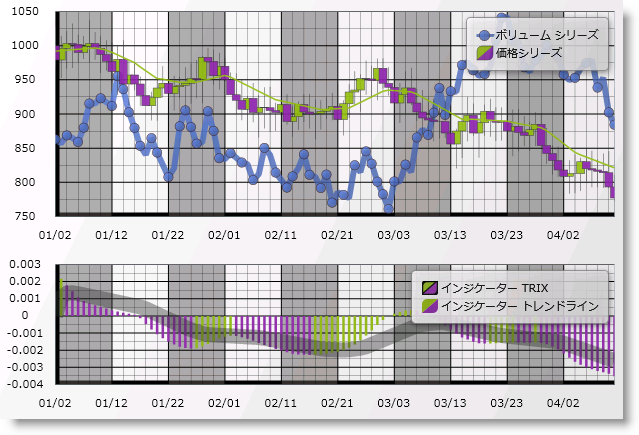

////

|metadata|
{
    "name": "wpf-dv-whats-new-in-2010-volume-2",
    "controlName": [],
    "tags": [],
    "guid": "f5ff0176-fd9a-45e0-a33c-85eec2455f60",  
    "buildFlags": [],
    "createdOn": "2012-01-31T20:23:42.5544945Z"
}
|metadata|
////

= 2010 Volume 2 の新機能

{ProductName} 2010 Volume 2 リリースには、{PlatformName} コントロールをこれまで以上に活用することを可能にする多数の強力な新しい機能とコントロールを含んでいます。

以下は 2010 Volume 2 リリースに追加した機能およびコントロールのリストです。リンクをクリックして提供されている機能のリストを確認してください。

* <<StartupSolution,スタートアップ ソリューション>>
* <<xamBarcodeControl,xamBarcode コントロール>>
* <<xamBulletGraph,xamBulletGraph コントロール>>
* <<xamDataChart,xamDataChart コントロール>>
* <<xamGauge,xamGauge コントロール>>
* <<xamMap,xamMap コントロール>>
* <<xamPivotGrid,xamPivotGrid コントロール>>
* <<xamTimeline,xamTimeline コントロール>>
* <<xamTreemap,xamTreemap コントロール>>

[[StartupSolution]]

== *スタートアップ ソリューション*

2010 volume 2 リリースから開始しましたが、{ProductName} には Visual Studio 2010 用のスタートアップ ソリューションが含まれます。このソリューションにはいくつかの未完成の例が含まれており、インフラジスティックスの主要なコントロールの基本と最も一般的な操作方法に関する実践的な学習体験を素早く提供します。

Visual Studio の「タスク リスト」ウィンドウを参照することを推奨します。コード コメントに提供されているガイダンスを読みながら、コメントが付けられたコードの一部のコメントを解除してみましょう。これによって、さまざまな側面のコントロールの機能と動作を確認して試すことができます。

例はコントロールの基本的な機能を示しており、高度な状況は対象外です。多くの完成したサンプルは、 link:http://samples.jp.infragistics.com[http://samples.jp.infragistics.com] でご覧いただけます。より詳細かつ高度なガイダンスとコード例はオンライン マニュアルからも入手できます。

[[xamBarcodeControl]]

== *xamBarcode コントロール*

配送コンテナから医療記録、食料品店の豆缶まで、バーコードは物理的な資産に識別データを添付するための国際的な仕組みとなりました。業界にとって独特な機能を提供するバーコードの作成などのバーコード技術に関して業界は標準を作成しています。バーコード コントロールのビジョンは、さまざまな幅広く採用されたバーコード標準に一致するスクリーン バーコード画像の描画ができるコントロールのセットをユーザーに提供することで、これらのコントロールは開発者からバーコード作成のプロセスと詳細の多くを取り出し、これによってバーコード書式でデータをアプリケーションに簡単に組み込むことができます。

image::images/xamBarcode_XamEanUpcBarcode_04.png[]

image::images/xamBarcode_XamPdf417Barcode_05.png[]

コントロールの xamBarcode™ シリーズは、以下のバーコード記号のサポートを提供します (各バーコードは個別のコントロールであることに注意)。

* link:xambarcode-xamcode39barcode.html[Code 39]
* link:xambarcode-configuring-code128.html[Code 128]
* link:xambarcode-xameanupcbarcode.html[Ean/Upc]

** Ean 13
** Ean 8
** Upc A
** Upc E

* link:xambarcode-xaminterleaved2of5barcode.html[Interleaved 2 Of 5]
* link:xambarcode-xamgs1databarbarcode.html[GS1 DataBar]

** Omnidirectional
** Truncated
** Stacked
** Stacked Omnidirectional
** Limited
** Expanded

* link:xambarcode-xamintelligentmailbarcode.html[Intelligent Mail Barcode]
* link:xambarcode-xamroyalmailbarcode.html[Royal Mail Barcode]
* link:xambarcode-xampdf417barcode.html[Pdf 417]
* link:xambarcode-xammaxicodebarcode.html[Maxi Code]

[[xamBulletGraph]]

ifdef::wpf[]

== *xamBulletGraph コントロール*

新しく魅力あるコントロールである xamBulletGraph™ は標準の棒チャートのバリエーションで、ダッシュボードで使用されるメーターおよびゲージを置き換えるために設計されています。このコントロールはデザインではリニアで、ひとつ以上の他の計測と比較して主な計測をシンプルかつ簡潔に表示します。

xamBulletGraph コントロールは 5 つの主要コンポーネントで構成されます。

* テキスト ラベル
* 量的スケール
* 主要目盛
* 比較目盛
* 定性的な範囲

image::images/XamBulletGraph_About_XamBulletGraph_01.png[新機能 - xamBulletGraph]

== 関連トピック

link:bulletgraph-adding.html[xamBulletGraph の追加]
endif::wpf[]

[[xamDataChart]]

== *xamDataChart コントロール*

xamDataChart™ コントロールは、ミリ秒で数多くのデータ ポイントのライブ フィードを処理できる次世代の高性能コンポーネントです。これは単一のチャート プロット領域で複数のシリーズのオーバーレイを簡単に実行するためにも設計されているので、ユーザーは統計的および技術的なインジケーターを追加して簡単に解析することができます。link:{ApiPlatform}controls.charts.xamdatachart{ApiVersion}~infragistics.controls.charts.xamdatachart.html[xamDataChart] コントロールは、Google® および Yahoo!® のファイナンス Web サイトと同様の財務的な機能を提供します。これは、各種のチャート、およびチャート アプリケーションの作成や既存データまたは情報化アプリケーションにチャート機能の追加を行うためのフレームワークを提供します。xamDataChart コントロールで提供される機能の詳細については、 link:datachart-using-datachart.html[「機能の概要」]セクションを参照してください。

== 関連トピック

* link:datachart-series-types.html[シリーズ タイプ]
* link:datachart-financial-indicators-overview.html[財務指標]
* link:datachart-multiple-axes.html[複数軸]
* link:datachart-multiple-legends.html[複数凡例]
* link:datachart-multiple-series.html[複数シリーズ]
* link:datachart-chart-navigation.html[チャート ナビゲーション]
* link:datachart-chart-synchronization.html[チャートの同期]

[[xamGauge]]

ifdef::wpf[]

== *xamGauge コントロール*

コントロールの xamGauge™ ファミリーは、データを表示するために使用できる 3 タイプのゲージで構成されます。

== xamLinearGauge™

以下は xamLinearGauge の主要な機能のリストです:

* *複数のゲージ要素* - スケールや針などの複数のゲージ要素をゲージに追加できます。
* *水平または垂直のスケール方向* - 単一のプロパティを設定することによってスケール内のすべての要素とともにスケールの方向を変更できます。
* *2 つの異なるタイプのマーカー* - 値を示すために針とバー マーカーの両方またはいずれか一方を使用できます。
* *針のドラッグ* - 針の値を設定するためにランタイムに針をドラッグできます。

image::images/SL_DV_Whats_New_xamGauge_Control_01.png[]

== xamRadialGauge™

以下は xamRadialGauge の主要な機能のリストです:

* *複数のゲージ要素* - スケールや針などの複数のゲージ要素をゲージに追加できます。
* *針のダンペングの抑制* - 針を移動することに加えて、ラジアル ゲージは針の移動を抑制することも可能です。

image::images/SL_DV_Whats_New_xamGauge_Control_02.png[]

== xamSegmentedDisplay™

以下は xamSegmentedDisplay の主要な機能のリストです:

* *数字と文字の表示* - 14 のセグメント化された数字を使用して数字と文字を表示できます。

image::images/SL_DV_Whats_New_xamGauge_Control_03.png[]

endif::wpf[]

[[xamMap]]

ifdef::wpf[]

== *xamMap コントロール*

xamMap™ コントロールはシンプルかつ洗練された方法で地理データを表示できます。これでリッチでインタラクティブなマップを使用してエンドユーザーにビジネス データを提示することができます。

人気のある ESRI Shapefile フォーマットからマップを表示できます。これは多角形ベースの Shapefile (区画、州、国)、線分群ベースの Shapefile (道路、河川、伝送回線)、そして点ベースの Shapefile (都市、対象の地点) を含みます。

スタイルとテンプレートによって、xamMap のカスタマイズの可能性は無限になります。

以下は xamMap の主要な機能のリストです:

* *マップ レイヤー* - 複数のマップを使用して、州、都市、道路などのマップ 要素の複雑なレイヤー化を可能にすることができます。
* *インタラクティブなマップ 要素* - マップの図形の表現はユーザーのアクションに対応することができ、ユーザー エクスペリエンスを高めます。
* *包括的なカラー モデル* - マップ 要素に色を付けるためにマップの表現はリッチでありながらシンプルな方法で拡張されます。
* *データ バインディング* - シェープファイルからのデータに加えて、xamMap はデータ バインディングやデータ マッピング機能を使用してその他のデータ ソースをマップ要素に関連付けることができます。
* *ヘルパー ペインと子コントロール* - ナビゲーション、色見本、サムネイル、スケール ペインのような xamMap 内の追加コントロールのコレクションはユーザー エクスペリエンスをさらに高めます。

== 関連トピック

link:xamwebmap-understanding-xamwebmap.html[xamMap の理解]

link:xamwebmap-getting-started-with-xamwebmap.html[xamTree を使用した作業の開始]

link:xamwebmap-map-elements-color-map-elements.html[マップ要素に色を付ける]

link:xamwebmap-using-multiple-layers.html[複数のレイヤー]

link:xamwebmap-map-panes.html[ペイン]
endif::wpf[]

[[xamPivotGrid]]

== *xamPivotGrid コントロール*

xamPivotGrid™ コントロールは、複雑なビジネス解析アプリケーションのためのデータ ビジュアライゼーション ツールです。OLAP (オンライン分析処理) を使用すれば、xamPivotGrid コントロールは、多次元クエリの結果を効率的に表示するために異なる多くのデータ ソースで作業することができます。

image::images/xamPG_6-7-2010_6-05-37_PM.png[]

* link:xampivotgrid-understanding-xampivotgrid.html[xamPivotGrid の理解]
* link:xampivotgrid-getting-started-with-xampivotgrid.html[xamPivotGrid を使用した作業の開始]
* link:xampivotgrid-using-xampivotgrid.html[xamPivotGrid の使用]

[[xamTimeline]]

ifdef::wpf[]

== *xamTimeline コントロール*

xamTimeline™ コントロールは、イベントの連続するシリーズを表示することを目的としています。コントロールによって、エンド ユーザーが簡単に視覚化および理解できる情報を素早く表示できるように、データ バインディングだけでなく手動でのデータ操作が可能となります。

使用できるタイムラインには以下の 2 つの異なるタイプがあります:

* *Numeric* - Double タイプの時刻値を表示します。
* *DateTime* - DateTime タイプの時刻値を表示します。

これによってユーザーは以下のような情報を表示することが可能となります: 歴史的な出来事、業務プロセスの説明の手順、プロジェクト マイルストーン、ビデオのキーフレーム、または任意の種類の時刻シリーズ データの表現。スタイルおよびテンプレートに加えて、ユーザーが作成する各タイムラインに人を引きつけるユニークな外観を付けることができます。

以下は xamTimeline で使用できる機能の一部です。

*データの表示* - エンド ユーザーがタイムラインを動的に選択して比較することを可能にする方法で、時系列および順次データを表示します。

*インタラクティブ* - 各タイムラインはインタラクティブであるため、エンド ユーザーは必要な情報を選択および検索することができます。

*タイムラインの比較* - ひとつのコントロールに複数のイベント シーケンスがある場合があり、ユーザーは複数のタイムライン内のイベントを比較できます。

*カスタマイズ* - xamTimeline のあらゆる要素をスタイルすることができ、ユーザーはユニークなルック アンド フィールであらゆるタイムラインを作成できます。

image::images/SL_DV_XamTimeline_About_XamTimeline_01.png[]

== 関連トピック

link:xamtimeline-understanding-xamwebtimeline.html[xamTimeline について]

link:xamtimeline-display-date-time-series.html[日時シリーズを表示]

link:xamtimeline-display-numeric-time-series.html[数値時刻シリーズを表示]
endif::wpf[]

[[xamTreemap]]

== *xamTreemap コントロール*

ツリーマップは階層データをネストされるノードのセットとして表示します。ツリーの各ブランチにツリーマップ ノードを割り当てし、そのノードにサブブランチを表す小さいノードでタイルします。各ノードの矩形の領域のサイズはデータを指定した要素に相対します。データの別の要素を表すためにノードに色を設定することがあります。

色とサイズがツリー構造で対応している場合、他の手段でスポットするのが難しいパターンを容易に確認することができます。ツリーマップのもうひとつの利点は、スペースを効率的に使用できることです。結果として、画面で多くの項目を同時に読みやすく表示できます。

ツリーマップは、数量を示すように設計されていません。目的は相対的なランキングを示すことです。ツリーマップは、データ ポイントを分類したり、値の相対的な違いを伝達することが不得意である円チャートやエリア チャートの他のフォームよりも効果的です。

xamTreemap™ は、データの相対的な重みを表示するデータ バウンド コントロールです。さまざまなアルゴリズムを使用して、データ項目のレイアウトがどのように行われるかを決定する手助けをします。

* スライス ＆ ダイス (ディメンションの切り替え)
* 矩形
* ストリップ

xamTreemap コントロールによって、要件に最適なアルゴリズムを顧客は選択できます。Squarified メソッドを使用するようにデフォルト設定されています。このコントロールには、2 つのメカニズムを使用して顧客がノードに色付けすることができる機能が含まれています。最初のグループ ベースのメカニズムは、値で項目を色付けするもので、2 つ目はマップ choropleth に似ているもので、値に基づきノードの色にグラデーションを付けます。

このコントロールは、数多くのデータ ポイント ノードをバインドおよび描画することができます。

image::images/xamTreemap_About_xamTreemap_01.png[]