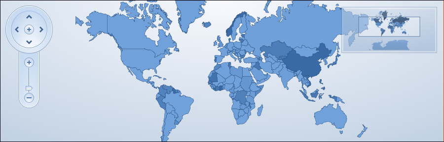
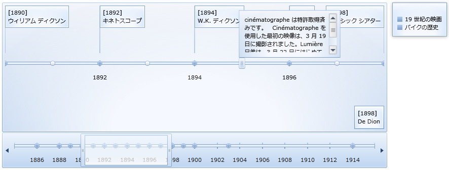
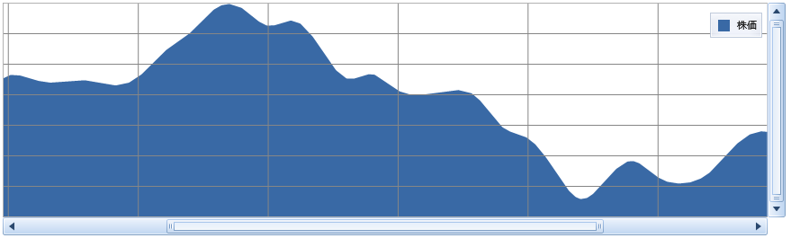
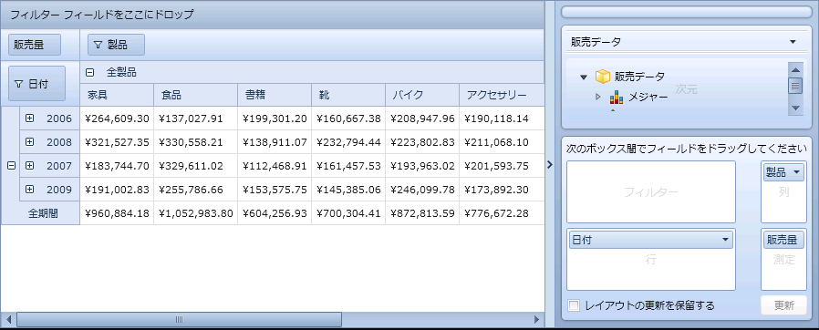
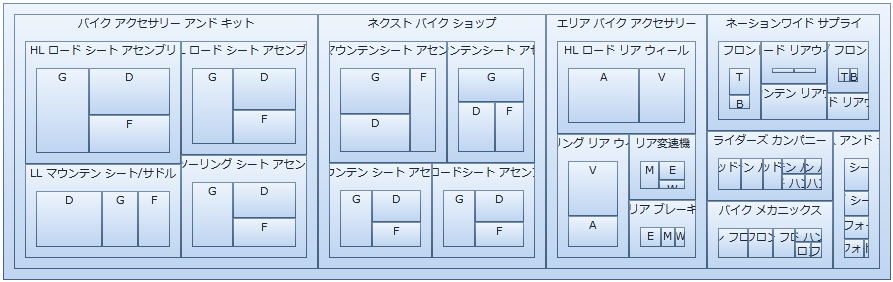

////
|metadata|
{
    "name": "wpf-dv-whats-new-in-2010-volume-3",
    "controlName": [],
    "tags": [],
    "guid": "f237ed2f-c569-4c91-8a8a-94be08ea3340",
    "buildFlags": [],
    "createdOn": "2012-01-31T20:23:42.5574945Z"
}
|metadata|
////

= 2010 Volume 3 の新機能

{ProductName} 2010 Volume 3 リリースには、{PlatformName} コントロールをこれまで以上に活用することを可能にする多数の強力な新しい機能とコントロールを含んでいます。

以下は 2010 Volume 3 リリースで追加または更新した機能およびコントロールのリストです。リンクをクリックして新機能を体験してください。

* <<DragDrop,Infragistics Drag and Drop Framework>>
* <<ExcelEngineSL,Infragistics Excel Engine>>
* <<Office2010,xamMap - パフォーマンスおよびマップ ウインドウ アニメーション>>
* <<MapGeoImage,xamMap - 地図画像および空間データ統合>>  
* <<PivotGridXMLA,xamPivotGrid - XMLA 認証と XMLA for SAP>>
* <<ValueMappers,xamTreeMap - カスタム値マッパーおよび新しいプロパティ>>

[[DragDrop]]
== *Infragistics Drag and Drop Framework*

{ProductName} Data Visualization 2010 Volume 3 リリースには新しい Drag and Drop Framework が含まれています。このフレームワークはドラッグ アンド ドロップ機能のアプリケーションへの追加を可能な限り簡単にするために必要なピースを提供します。これによって要素のリアルタイムの移動とよりユーザー フレンドリーな操作が可能になります。

Drag and Drop Framework を利用するにはソース要素とターゲット要素を設定することが必要となります。ソース要素をターゲット要素にドラッグ アンド ドロップできます。場合によっては、これはアプリケーションにドラッグ アンド ドロップを実装するのと同じくらいシンプルです。

=== 関連トピック

link:drag-and-drop-framework-about-ig-drag-and-drop-framework.html[Infragistics Drag and Drop Framework について]

link:drag-and-drop-framework-getting-started-with-ig-drag-and-drop-framework.html[Infragistics Drag and Drop Framework を使用した作業の開始]

link:drag-and-drop-framework-using-ig-drag-and-drop-framework.html[Infragistics Drag and Drop Framework の使用]

[[ExcelEngineSL]]

== *Infragistics Excel Engine*

Infragistics Excel Engine によって、 link:{ApiPlatform}documents.excel{ApiVersion}~infragistics.documents.excel.workbook.html[Workbook]、 link:{ApiPlatform}documents.excel{ApiVersion}~infragistics.documents.excel.worksheet.html[Worksheet]、 link:{ApiPlatform}documents.excel{ApiVersion}~infragistics.documents.excel.worksheetcell.html[Cell]、 link:{ApiPlatform}documents.excel{ApiVersion}~infragistics.documents.excel.formula.html[Formula] などの人気の Microsoft® Excel® スプレッドシート オブジェクトを使用してスプレッドシート データで作業をすることができます。Infragistics Excel Library によって Excel スプレッドシートでアプリケーションのデータを表すことだけでなく、Excel からアプリケーションにデータを転送することも簡単になります。

=== サポートされるバージョンの Microsoft Excel

以下は Excel のサポートされるバージョンのリストです。

* Microsoft Excel 97
* Microsoft Excel 2000
* Microsoft Excel 2002
* Microsoft Excel 2003
* Microsoft Excel 2007

=== 機能

以下は Infragistics Excel Engine の主要な機能のリストです:

* *Excel に依存しない* - Infragistics Excel Engine は Microsoft Excel に依存せずに完全に実行するクラス ライブラリであるため、インストールする必要はありません。
* *Workbook オブジェクト モデル* - これは Workbook、Worksheet、Cell、Formula など、ユーザーが使用可能なすべての Excel オブジェクトを表します。

=== 関連トピック

link:excelengine-about-infragistics-excel-engine.html[Infragistics Excel Engine について]

link:excelengine-creating-a-workbook.html[ワークブックを作成]

link:excelengine-using-the-infragistics-excel-engine.html[Infragistics Excel Engine の使用]

[[Office2010]]

== *Office 2010 Blue テーマ*

2010 Volume 3 リリースから開始しましたが、Infragistics はすべての {ProductName} コントロールのためにカスタム テーマを提供します。最初に紹介されるテーマは Office 2010 Blue テーマで、Microsoft Office® 2010 のルック アンド フィールに基づいています。たとえば、xamDataChart コントロールの Office 2010 Blue スタイルは、Microsoft Excel® 2010 のチャート スタイルに基づいています。

Office 2010 Blue テーマから開始するには、 link:themes.html[テーマの使用]トピックを参照してください。

=== xamMap

=== xamTimeline

=== xamDataChart

=== xamPivotGrid

=== xamTreemap

=== xamGauge

image::images/xamControls_Office_2010_Blue_06.png[]

=== 関連トピック

link:designersguide-styling-ig-controls.html[Infragistics コントロールのスタイル]
link:designers-guide-what-is-a-theme.html[テーマとは?]
link:designers-guide-working-with-themes.html[テーマでの作業]

[[QRCode]]

== *xamBarcode - QR Code のサポート*

xamBarcode コントロールには新しいバーコード タイプ xamQRCodeBarcode があります。

QR (Quick Response) バーコードは、QR スキャナー、携帯電話およびスマートフォンで素早く読み取ることができる、最も人気の高い平面記号のひとつです。

たとえば、カメラ付き携帯電話でこの QR をスキャンして xamBarcode コントロール シリーズのために Web サイトにアクセスすることができます。

image::images/Whats_New_XamQRCodeBarcode_WPF_01.png[]

link:http://jp.infragistics.com/dotnet/netadvantage/wpf/data-visualization/xam-barcode.aspx#Overview[Web サイトへのリンク]

=== 関連トピック

link:xambarcode-configuring-qr-code.html[QR Code]

link:xambarcode-barcode-symbologies.html[バーコードの記号]

[[PolarSeries]]

== *xamDataChart - 極座標シリーズ*

xamDataChart コントロールは、 link:datachart-polar-line-series.html[極座標直線シリーズ]と link:datachart-polar-spline-series.html[極座標スプライン シリーズ]のサポートを提供するためにアップグレードされました。これらのシリーズは link:datachart-scatter-series-overview.html[散布図シリーズ]に似ていますが、デカルト (xy-) 座標ではなく極座標 (rθ-) を採用します。

image::images/xamDataChart_Polar_Spline_Series_01.png[]

=== 関連トピック

* link:datachart-polar-line-series.html[極座標直線シリーズ]
* link:datachart-polar-spline-series.html[極座標スプライン シリーズ]

[[MapPerformance]]

== *xamMap - パフォーマンスおよびマップ ウインドウ アニメーション*

xamMap コントロールのパン/ズームのパフォーマンスは、複数のレイヤーで構成されるマップで特に改善されました。これはパン/ズーム中に発生するウィンドウ アニメーションのカスタマイズもサポートします。

詳細については、 link:xammap-map-window-animation.html[マップ ウィンドウ アニメーションの使用]を参照してください。

[[MapGeoImage]]

== *xamMap - 地図画像および空間データ統合*

XamMap コントロールは、以下の機能をサポートするために変更されました。

== 地理画像の統合

xamMap は外部ソースから地図に地図画像を表示する機能を提供します。さらに、xamMap コントロールを使用して、地図画像をシェープファイルに保存されたデータと合成することができます。詳細は、 link:xamwebmap-geo-imagery-integration.html[「地図画像の統合」]セクションを参照してください。

image::images/XamMap_Display_Geo_Imagery_Map_01.png[]

== 地理的な空間データベースの統合

XamMap は、シェープファイルから変換され SQL データベースに保存された地理的な空間データをロードする機能も提供します。

image::images/XamMap_Display_Geospatial_Data_from_SQL_Database_Server_01.png[]

[[PivotGridXMLA]]

== *xamPivotGrid - XMLA 認証と XMLA for SAP*

2010 Volume 3 リリースのために xamPivotGrid コントロールに追加された新しいサポート機能を説明します。

* *XMLA 認証* - xamPivotGrid は、XMLA 認証のサポートを提供するために修正されました。ユーザー名とパスワードを必要とするサーバーに接続するために XmlaDataSource.Credentials プロパティを使用できるようになりました。
* *XMLA for SAP* - xamPivotGrid コントロールは XMLA によって SAP サーバーに接続できるようになりました。XmlaDataSource を使用するのと同じ方法で XmlaSapDataSource を使用するだけです。

これらの機能の詳細は、xamPivotGrid コントロールの link:xampivotgrid-getting-started-with-xampivotgrid.html[xamPivotGrid について]トピックを参照してください。

[[ValueMappers]]

== *xamTreeMap - カスタム値マッパーおよび新しいプロパティ*

== カスタム値マッパー

xamTreemap コントロールは、カスタム link:xamtreemap-value-mappers.html[値マッパー]の作成を可能にするように修正されました。2 つの基本的なマッパー クラスから派生するように選択できます。これによりノードのランク付けのためにカスタム ロジックを使用できます。

== RootNode プロパティ

link:{ApiPlatform}controls.charts.xamtreemap{ApiVersion}~infragistics.controls.charts.xamtreemap~rootnode.html[RootNode] プロパティは、xamTreemap コントロールの視覚化されたノードのルート ノードを返します。これによって、配置されたノードをトラバースすることができます。

== 新しいイベント

xamTreemap は今回以下の追加イベントをサポートします。

* link:{ApiPlatform}controls.charts.xamtreemap{ApiVersion}~infragistics.controls.charts.xamtreemap_events.html[MouseMove]
* link:{ApiPlatform}controls.charts.xamtreemap{ApiVersion}~infragistics.controls.charts.xamtreemap_events.html[MouseWheel]
* link:{ApiPlatform}controls.charts.xamtreemap{ApiVersion}~infragistics.controls.charts.xamtreemap_events.html[MouseDoubleClick]

== 関連トピック

link:xamtreemap-about-value-mapping.html[xamTreemap 値マッピングについて]

link:xamtreemap-value-mappers.html[値のマッパー]

link:xamtreemap-custom-value-mappers.html[xamTreemap カスタム値マッパー]