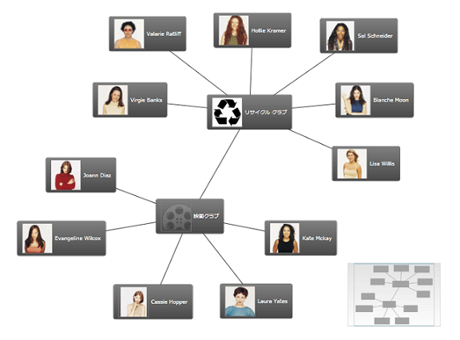
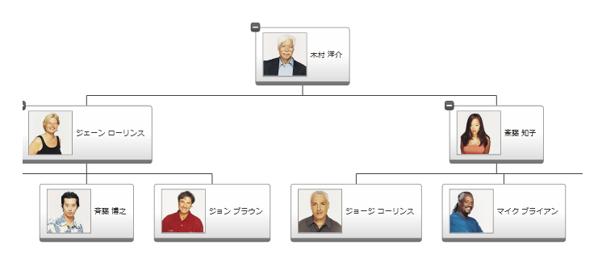
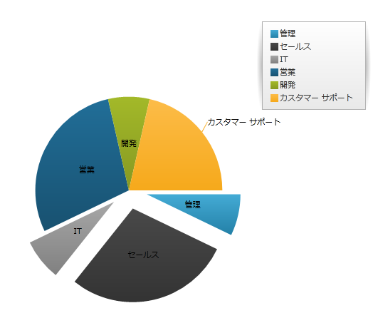
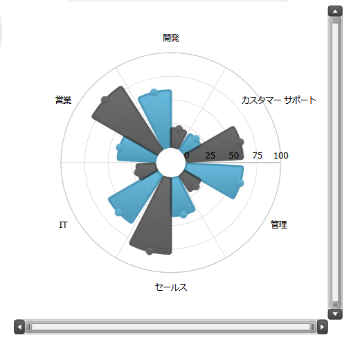
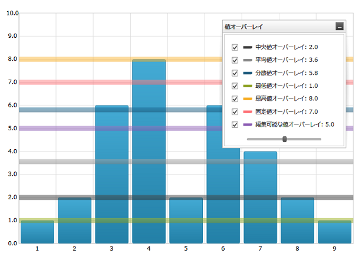
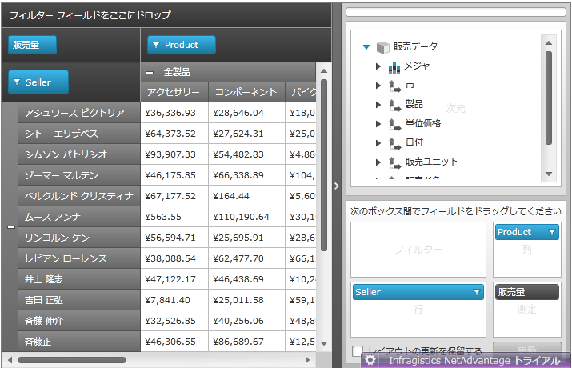
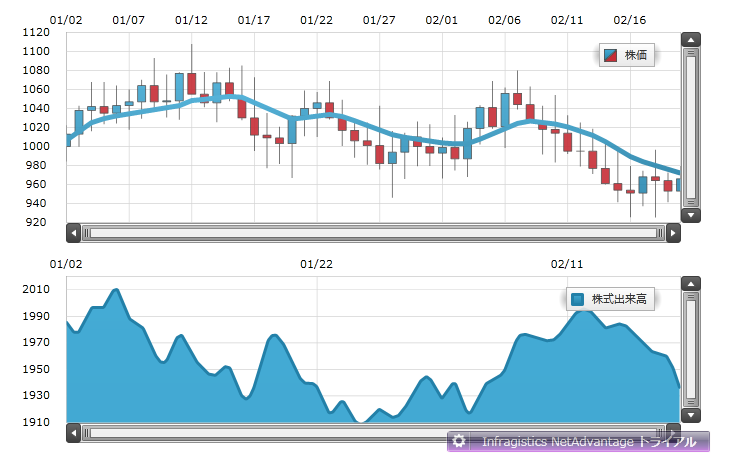
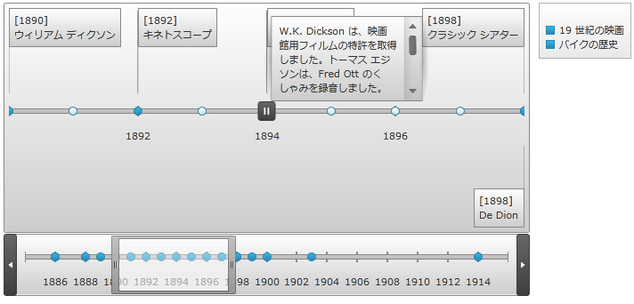
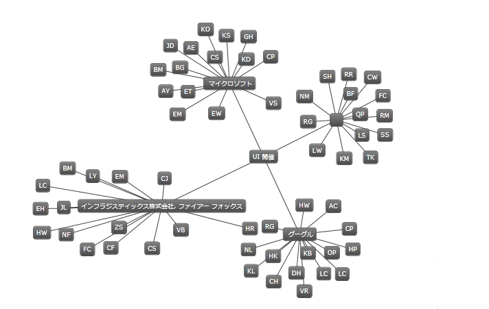

////

|metadata|
{
    "name": "wpf-dv-whats-new-in-2011-volume-1",
    "controlName": [],
    "tags": [],
    "guid": "ac7e978e-3670-4238-b173-464f470cd17a",  
    "buildFlags": [],
    "createdOn": "2012-01-31T20:23:42.5594945Z"
}
|metadata|
////

= 2011 Volume 1 の新機能

{ProductName} 2011 Volume 1 リリースには、{PlatformName} コントロールをこれまで以上に活用することを可能にする多数の強力な新しい機能とコントロールを含んでいます。

以下は 2011 Volume 1 リリースで追加または更新した機能およびコントロールのリストです。リンクをクリックして新機能を体験してください。

* <<barcode_reader,Infragistics Barcode Reader>>
* <<networknode,xamNetworkNode>>™
* <<org_chart,xamOrgChart>>™
* <<piechart,xamPieChart>>™
* <<custom_resource_strings,カスタム リソース文字列>>
* <<ui_automation_support,UI Automation のサポート>>
* <<xamMapPerformance,xamMap™ - パフォーマンスの改善>>
* <<xamDataChartPerformance,xamDataChart™ - パフォーマンスの改善>>
* <<xamDataChartNewSeries,xamDataChart™ - 新しいシリーズ タイプ>>
* <<xamDataChartValueOverlay,xamDataChart™ - 値オーバーレイ>>
* <<igtheme,新しい IG テーマ>>

[[barcode_reader]]
== link:xambarcode-about-xambarcode.html[Infragistics Barcode Reader]

Infragistics Barcode Reader は画像からバーコードをデコードするためのライブラリです。

[[supported_symbologies]]
== サポートされる記号

Infragistics Barcode Reader は以下のバーコード記号をサポートします。

* link:http://ja.wikipedia.org/wiki/CODE39[Code 39]
* link:http://ja.wikipedia.org/wiki/CODE128[Code 128]
* link:http://ja.wikipedia.org/wiki/EAN%E3%82%B3%E3%83%BC%E3%83%89[EAN]/ link:http://ja.wikipedia.org/wiki/%E3%83%90%E3%83%BC%E3%82%B3%E3%83%BC%E3%83%89[UPC]:

** EAN-13
** EAN-8
** UPC-A
** UPC-E

* link:http://ja.wikipedia.org/wiki/ITF%E3%82%B3%E3%83%BC%E3%83%89[Interleaved 2 of 5]
* link:http://ja.wikipedia.org/wiki/QR%E3%82%B3%E3%83%BC%E3%83%89[QR Code]

[[networknode]]

== link:xamnetworknode.html[xamNetworkNode]

今回のリリースには、Network Node コントロールが採用されており、ノードと接続を使用してグラフを視覚化することができます。このコントロールはデータ バインド、選択、テンプレート化、スタイル、カスタム配置などの機能をサポートしています。詳細は、 link:xamnetworknode.html[「xamNetworkNode」]を参照してください。

[[org_chart]]
== link:xamorgchart.html[xamOrgChart]

xamOrgChart は組織図を描画するためのデータ バインドされたコントロールです(図 1)

図 1: xamOrgChart コントロールで作成されたサンプルの組織図

このコントロールは、ノードの展開と縮小、パンとズーム、キーボード ナビゲーション、カスタム スタイルおよびテンプレート、複数ノードの選択をはじめとするさまざまな選択タイプをサポートします。

[[piechart]]
== link:piechart.html[xamPieChart]™

今回のリリースには、xamPieChart™ と呼ばれるデータ チャート アセンブリの新しい特殊なコントロールが採用されています。このコントロールによって、他とはっきりと区別できるデータ カテゴリを表すスライスに円チャートを分割することができます(下の図 1 を参照)。円チャート コントロールは、スライス選択および展開、また値しきい値より下のカテゴリのための「その他」のスライスをサポートしています。詳細は、 link:piechart-getting-started-with-piechart.html[「xamPieChart を使用した作業の開始」]

[[custom_resource_strings]]
== link:developers-guide-customizing-resource-strings.html[カスタム リソース文字列]

このリリースから、{ProductName} Data Visualization のすべてのコントロールの文字列値をカスタマイズする機能が提供されました。この機能によって、特定のカルチャ、ロケールまたは言語のためにアプリケーションを簡単のローカライズできるようになりました。

以下の画像では、xamPivotGrid コントロールのリソース文字列はカスタマイズされています。

image::images/Customize_Resource_Strings_01.png[]

図 2: カスタマイズされた Filter、Data、Row、Column および XamPivotDataSelector ヘッダーのある xamPivotGrid コントロール

[[ui_automation_support]]
== link:developers-guide-ui-automation-support.html[UI Automation のサポート]

{ProductName} コントロール スイートは Microsoft® UI Automation を完全にサポートします。UI Automation フレームワークによって、アプリケーションの UI 要素にアクセスしたり障害を持つエンドユーザーにこの情報を提供するためのスクリーン リーダーなどの支援技術が可能となります。

UI Automation のもうひとつの主な用途は自動化テストです。フレームワークによってテスト スクリプトは UI 要素にアクセスして操作することができます。

[[xamMapPerformance]]
== xamMap - パフォーマンスの改善

2011 Volume 1 リリースでは、 link:{ApiPlatform}controls.maps.xammap{ApiVersion}~infragistics.controls.maps.xammap.html[xamMap]™ コントロールのパンニングおよびズーミング機能が拡張され、より速い応答を提供します。キャプションをマップで使用しない場合にパフォーマンスが向上します。詳細については、 link:xammap-map-window-animation.html[マップ ウィンドウ アニメーションの使用]を参照してください。

数千の link:{ApiPlatform}controls.maps.xammap{ApiVersion}~infragistics.controls.maps.symbolelement.html[SymbolElement] を使用した場合のマップの応答も更に速くなりました。マップ要素を使用する方法の詳細については、 link:xamwebmap-map-elements.html[マップ要素の表示] トピックを参照してください。

image::images/Whats_New_2011_1_xamMap_01.png[]

[[xamDataChartPerformance]]
== xamDataChart™ - パフォーマンスの改善

2011 Volume 1 リリースでは、 link:{ApiPlatform}controls.charts.xamdatachart{ApiVersion}~infragistics.controls.charts.xamdatachart.html[xamDataChart]™ コントロールは、ユーザーが操作を完了するまで作業を延期します。データ バインドされたコレクションで個別に多数の項目を更新する場合、以前の xamDataChart では、ユーザーが更新を完了するまで待機せずに、無関係な作業を実行します。今後は作業が完了するまで待機します。また、xamDataChart または軸で複数の外観プロパティを更新する場合、新しいバージョンのチャートは、視覚の違いを調整する前に、すべてのプロパティの更新が完了するまで待機します。

さらに、散布図と極座標チャートを更新する作業は、パフォーマンスを改善するためにより効率的に処理されています。前回の最新情報の更新と同じマーカーを画面に保持するためにこれまで以上の試みが行われており、視覚的なノイズを減らし、描画速度を向上しています。詳細は、 link:datachart-chart-performance.html[「チャートのパフォーマンス」]のトピックを参照してください。

[[xamDataChartNewSeries]]
== xamDataChart - 新しいシリーズ タイプ

以下の新しいシリーズ タイプをサポートするために xamDataChart コントロールが更新されました。

* link:datachart-bubble-series.html[バブル シリーズ]
* link:datachart-polar-area-series.html[極座標エリア シリーズ]
* link:datachart-polar-scatter-series.html[極座標散布図シリーズ]
* link:datachart-polar-spline-area-series.html[極座標スプライン エリア シリーズ]
* link:datachart-radial-area-series.html[ラジアル エリア シリーズ]
* link:datachart-radial-line-series.html[ラジアル線シリーズ]
* link:datachart-radial-column-series.html[ラジアル柱状シリーズ]
* link:datachart-radial-pie-series.html[ラジアル円シリーズ]

image::images/Whats_New_2011_1_xamDataChart_01.png[]

image::images/Whats_New_2011_1_xamDataChart_02.png[]

[[xamDataChartValueOverlay]]
== xamDataChart™ - 値オーバーレイ

xamDataChart コントロールは、Infragistics Math Calculators を使用して、複数の Value Overlay の表示と数学値の計算のサポートを提供します。詳細は、 link:datachart-series-value-overlay.html[「値オーバーレイ」]トピックを参照してください。

[[igtheme]]
== 新しい IG テーマ

今回のリリースでは、IG テーマという新しいテーマが採用されました。このテーマはすべての {ProductName} コントロールに適用できます。このテーマは、黒、白、いくつかのグレーと強調表示とアクセントカラーとして青を使用するモノクロです。すべてのコントロールには外部ファイルとして出荷される対応するテーマのリソース ファイルがあり、XAML およびコード ビハインドからそれにアクセスできます。IG テーマを使用する方法の詳細は、 link:designers-guide-using-themes.html[「テーマの使用」]トピックを参照してください。

以下の図は、IG テーマが適用された {ProductName} コントロールをいくつか示しています。

image::images/Whats_New_2011_1_IG_Theme_01.png[]

図 1: IG テーマが適用された xamMap コントロール

image::images/Whats_New_2011_1_IG_Theme_02.png[]

図 2: IG テーマが適用された xamBulletGraph コントロール

image::images/Whats_New_2011_1_IG_Theme_03.png[]

図 3: IG テーマが適用された xamGauge コントロール

図 4: IG テーマが適用された xamPivotGrid コントロール

図 5: IG テーマが適用された xamDataChart コントロール

図 6: IG テーマが適用された xamTimeline コントロール

図 7: IG テーマが適用された xamNetworkNode コントロール

image::images/Whats_New_2011_1_IG_Theme_08.png[]

図 8: IG テーマが適用された xamOrgChart コントロール