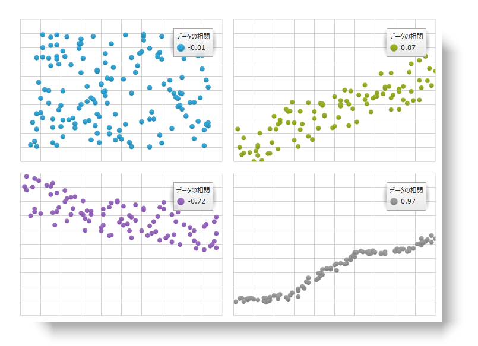
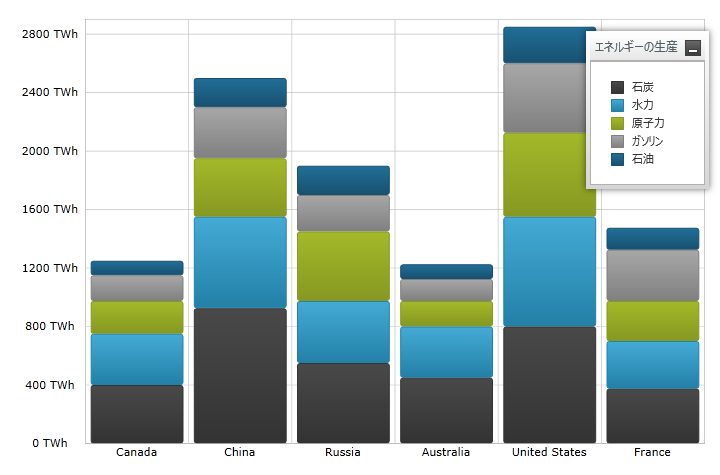
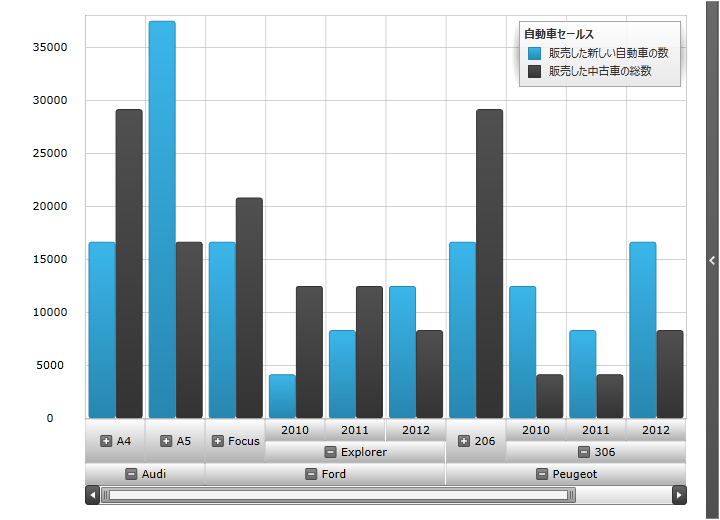
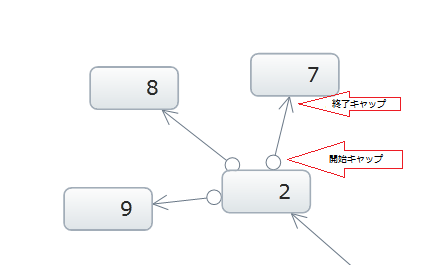
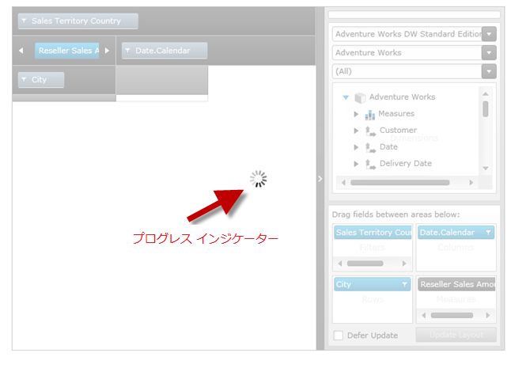
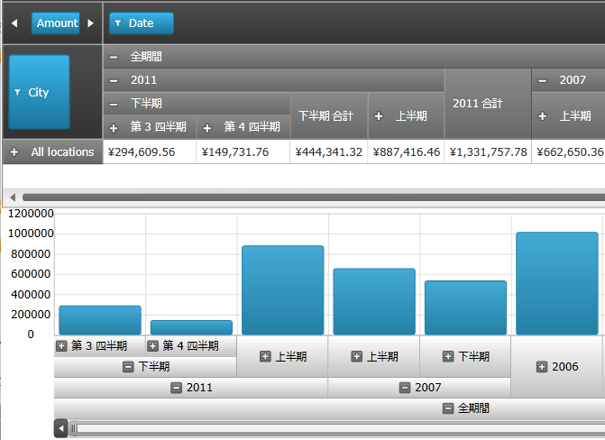
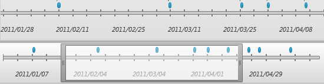

////

|metadata|
{
    "name": "wpf-dv-whats-new-in-2011-volume-2",
    "controlName": [],
    "tags": ["Getting Started"],
    "guid": "4a41fb0f-3d8f-4689-be54-937e8089a457",  
    "buildFlags": [],
    "createdOn": "2012-01-31T20:23:42.5614945Z"
}
|metadata|
////

= 2011 Volume 2 の新機能

{ProductName} 2011 Volume 2 リリースには、{PlatformName} コントロールをこれまで以上に活用することを可能にする多数の強力な新しい機能とコントロールを含んでいます。

以下は 2011 Volume 2 リリースで追加または更新した機能およびコントロールのリストです。リンクをクリックして新機能を体験してください。

このドキュメントには次のセクションが含まれています:

* <<InfragisticsMathLibrary,Infragistics Math Library™>>
* <<InfragisticsMathCalculators,Infragistics 数学計算式™>>
* <<xamFunnelChart,xamFunnelChart™ - 新しいコントロール>>
* <<xamDataChart,xamDataChart™ - 新機能>>

** <<xamDataChartNewSeries,xamDataChart - 新しいシリーズ タイプ>>
** <<xamDataChartAxisScalers,xamDataChart - 軸スケーラー>>
** <<xamDataChartAxisTickmarkValues,xamDataChart - 軸目盛値>>
** <<xamDataChartSeriesInheritance,xamDataChart - シリーズ継承>>
** <<xamDataChartSeriesErrorBars,xamDataChart - シリーズ誤差範囲>>
** <<xamDataChartCorrelationFormula,xamDataChart - 相関式>>
** <<xamDataChartWeightedMovingAverageTrendLine,xamDataChart - 重み付けされた移動平均トレンドライン>>
** <<xamDataChartLegendItemDisplayOrder,xamDataChart - 凡例項目の表示順序>>
** <<xamDataChartOverviewPane,xamDataChart - チャートの概要ペイン (CTP)>>
** <<xamDataChartOLAPAxis,xamDataChart - OLAP 軸(CTP)>>

* <<xamGeographicMap,xamGeographicMap™ - 新しいコントロール (CTP)>>
* <<xamNetworkNode,xamNetworkNode™ - 新機能>>

** <<xamNetworkNodeNavigationFeatures,xamNetworkNode™ - ナビゲーション機能>>
** <<xamNetworkNodeRelationshipBetweenNodes,xamNetworkNode - ノード間の関係>>
** <<xamNetworkNodeRemovingNodes,xamNetworkNode - ネットワークからノードを削除>>
** <<xamNetworkNodeRemovingNodes,xamNetworkNode - ネットワーク ノードに視覚的な状態を表示>>

* <<xamPivotGrid,xamPivotGrid™ - 新機能>>

** <<xamPivotGridPerformanceImprovement,xamPivotGrid - パフォーマンスの改善>>
** <<xamPivotGridProgressIndicator,xamPivotGrid - 進捗インジケーター>>
** <<xamPivotGridDataSlicer,xamPivotGrid - データ スライサー>>
** <<xamPivotGridIntegration,xamPivotGrid - xamDataChart との統合 (CTP)>>

* <<xamSparkline,xamSparkline™ - 新しいコントロール (CTP)>>
* <<xamTimeline,xamTimeline™ - ズーミングに基づく自動調整ラベル>>
* <<ResWash,リソース ウォッシャー>>

== Infragistics Math Library™

link:{ApiPlatform}math{ApiVersion}~infragistics.math_namespace.html[Infragistics Math Library]™ は、すべての Infragistics 製品と使用できる数学および統計的な構造と関数のライブラリです。このライブラリについての詳細は link:ig-math-infragistics.html[Infragistics Math Library] トピックを参照してください。

Infragistics Math ライブラリは link:http://msdn.microsoft.com/ja-jp/library/system.math.aspx[System.Math] クラスの演算をいくつかの新しい数学オブジェクトに拡張します。

* link:{ApiPlatform}math{ApiVersion}~infragistics.math.complex.html[複素数]
* link:{ApiPlatform}math{ApiVersion}~infragistics.math.constant.html[数学定数]
* link:{ApiPlatform}math{ApiVersion}~infragistics.math.vector.html[ベクトル]

** link:{ApiPlatform}math{ApiVersion}~infragistics.math.complexvector.html[複素ベクトル]
** link:{ApiPlatform}math{ApiVersion}~infragistics.math.booleanvector.html[ブール ベクトル]

* link:{ApiPlatform}math{ApiVersion}~infragistics.math.matrix.html[行列]

** link:{ApiPlatform}math{ApiVersion}~infragistics.math.complexmatrix.html[複素行列]
** link:{ApiPlatform}math{ApiVersion}~infragistics.math.booleanmatrix.html[ブール行列]

== Infragistics 数学計算式™

link:{ApiPlatform}math.calculators{ApiVersion}~infragistics.math.calculators_namespace.html[Infragistics 数学計算式] は、さまざまな計算のためにすべての Infragistics 製品と使用できる数学および統計的な計算用のライブラリです。

image::images/Whats_New_In_2011_Volume_2_IG_Math_Calculators_01.png[]

図 1 - バリアンスと平均を計算する式

Infragistics 数学計算式は xamDataChart コントロールの値オーバーレイと誤差範囲を計算するために必要です。このライブラリについての詳細は link:ig-math-calculators.html[Infragistics 数学計算式] トピックを参照してください。それらは次のタイプの計算にカテゴリ分けされます。

[options="header", cols="a,a"]
|====
|計算式タイプ|説明

|値計算式
|単一の値を計算する Infragistics 数学計算式グループを表します。値計算式を xamDataChart コントロールと統合する方法の例については、 link:datachart-series-value-overlay.html[値オーバーレイ]および link:datachart-series-data-correlation.html[シリーズ データの相関]のトピックを参照してください。 

* link:ig-calculators-correlation-calculator.html[Infragistics 相関計算式] 

* link:ig-calculators-mean-calculator.html[Infragistics 平均計算式] 

* link:ig-calculators-median-calculator.html[Infragistics 中央値計算式] 

* link:ig-calculators-standard-deviation-calculator.html[Infragistics 標準偏差計算式] 

* link:ig-calculators-standard-error-calculator.html[Infragistics 標準誤差計算式] 

* link:ig-calculators-variance-calculator.html[Infragistics バリアンス計算式] 

|誤差範囲の計算式
|xamDataChart コントロールにおけるシリーズ オブジェクトの誤差範囲の長さを計算する Infragistics 数学計算式のグループを表します。誤差範囲計算式を xamDataChart コントロールと統合する方法の例については、「 link:datachart-series-error-bars.html[シリーズ誤差範囲]」トピックを参照してください。 

* link:ig-calculators-data-calculator.html[Infragistics データ計算式] 

* link:ig-calculators-fixed-value-calculator.html[Infragistics 固定値計算式] 

* link:ig-calculators-percentage-calculator.html[Infragistics パーセンテージ計算式] 

* link:ig-calculators-standard-deviation-calculator.html[Infragistics 標準偏差計算式] 

* link:ig-calculators-standard-error-calculator.html[Infragistics 標準誤差計算式] 

|====

== xamFunnelChart™ - 新しいコントロール

ファンネル チャートによりファンネル図形が表示されます。上限値と下限値によるスライスでデータを表現するトップダウン構成の複数セクションを表示します。このコントロールについての詳細は link:funnelchart.html[xamFunnelChart] トピックを参照してください。

xamFunnelChart のプレビュー

image::images/Whats_New_In_2011_Volume_2_xamFunnelChart_01.png[]

== xamDataChart™ - 新機能

このセクションでは link:datachart-datachart.html[xamDataChart] コントロールの新機能についての情報を提供します。

== xamDataChart - 新しいシリーズ タイプ

xamDataChart コントロールはいくつもの新しいシリーズ タイプをサポートするよう更新されています。これらのシリーズについての詳細は link:datachart-category-series-overview.html[カテゴリシリーズ] トピックを参照してください。

* 棒シリーズ
* 積層型 100 エリア シリーズ
* 積層型 100 棒シリーズ
* 積層型 100 柱状シリーズ
* 積層型 100 折れ線シリーズ
* 積層型 100 スプライン シリーズ
* 積層型 100 スプライン エリア シリーズ
* 積層型棒シリーズ
* 積層型エリア シリーズ
* 積層型柱状シリーズ
* 積層型折れ線シリーズ
* 積層型スプライン シリーズ
* 積層型スプライン エリア シリーズ
* ポイント シリーズ (CTP)

xamDataChart コントロールの新しいシリーズ タイプをいくつかプレビューします。

image::images/Whats_New_In_2011_Volume_2_xamDataChart_01.png[]

== xamDataChart - 軸スケーラー

xamDataChart コントロールの軸スケーラー機能は、数値軸に沿ってプロットされるスケーリング値のためのカスタム軸スケーラーを実装するためのものです。このチャート機能についての詳細は link:datachart-using-axis-scales.html[軸目盛の使用] と link:datachart-creating-custom-axis-scalers.html[カスタム軸スケーラーの作成] トピックスを参照してください。

y 軸をカスタム軸スケーラーを用いてスケールして xamDataChart をプレビューします。

image::images/Whats_New_In_2011_Volume_2_xamDataChart_02.png[]

== xamDataChart - 軸目盛値

xamDataChart コントロールの軸目盛値機能は、数値軸上でカスタム軸目盛値を実装するためのものです。このチャート機能についての詳細は link:datachart-creating-custom-axis-tickmark-values.html[カスタム軸目盛値の作成] トピックを参照してください。

y 軸でカスタム軸目盛値をもつ xamDataChart をプレビューします。

image::images/Whats_New_In_2011_Volume_2_xamDataChart_03.png[]

== xamDataChart - シリーズ継承

xamDataChart コントロールのシリーズ継承機能はベースの link:{ApiPlatform}controls.charts.xamdatachart{ApiVersion}~infragistics.controls.charts.series.html[Series] オブジェクトからシリーズのカスタムタイプを実装するかまたはシリーズの既存タイプを拡張することができます。このチャート機能についての詳細は link:datachart-creating-custom-series.html[カスタムシリーズの作成] トピックを参照してください。

同じ値のデータ ポイントを結び塗りつぶした等高線を表示するカスタム シリーズをもつ xamDataChart のプレビュー。

image::images/Whats_New_In_2011_Volume_2_xamDataChart_04.png[]

== xamDataChart - シリーズ誤差範囲

xamDataChart コントロールの誤差範囲機能はプロットされるデータ ポイントにさまざまな誤差範囲をプロットすることができます。すべての誤差範囲は link:ig-math-calculators.html[Infragistics Math Calculators] アセンブリで計算されます。すべての link:datachart-scatter-series-overview.html[散布シリーズ]および複数の link:datachart-category-series-overview.html[カテゴリシリーズ]で使用することが可能です。このチャート機能についての詳細は link:datachart-series-error-bars.html[シリーズ誤差範囲] トピックを参照してください。

散布シリーズのデータ ポイントに設定された誤差範囲をもつ xamDataChart のプレビュー。

image::images/Whats_New_In_2011_Volume_2_xamDataChart_05.png[]

== xamDataChart - 相関式

データ相関式により、 link:ig-math-calculators.html[Infragistics Math Calculators] アセンブリの一部である link:ig-calculators-correlation-calculator.html[Infragistics 相関計算] を使用することによって、xamDataChart に表示されるデータ セットの 2 つの変数の相関が計算できます。このチャート機能についての詳細は link:datachart-series-data-correlation.html[シリーズ データ相関] トピックを参照してください。

凡例項目として表示されるデータ相関をもつ xamDataChart のプレビュー。

== xamDataChart - 重み付けされた移動平均トレンドライン

xamDataChart コントロールは重み付けされた移動平均を新しいタイプのトレンドラインとしてプロットできます。このチャート機能についての詳細は link:datachart-trend-lines.html[トレンドライン] トピックを参照してください。

財務物価シリーズの重み付けされた移動平均を表示するトレンドラインをもつ xamDataChart のプレビュー。

image::images/Whats_New_In_2011_Volume_2_xamDataChart_07.png[]

== xamDataChart - 凡例項目の表示順序

xamDataChart コントロールは積層シリーズの ReverseLegendOrder プロパティを使用して凡例項目の表示順序を逆にできます。

チャート凡例の凡例項目の表示順序を逆にした xamDataChart のプレビュー。

== xamDataChart - チャートの概要ペイン (CTP)

xamDataChart コントロールはデータが link:{ApiPlatform}controls.charts.xamdatachart{ApiVersion}~infragistics.controls.charts.areaseries.html[AreaSeries] または link:{ApiPlatform}controls.charts.xamdatachart{ApiVersion}~infragistics.controls.charts.lineseries.html[LineSeries] でプロットされた時にパンとズーム機能およびチャート内容の概要を提供する xamOverviewPlusDetailPane コントロールによる統合をサポートします。このナビゲーション コントロールについての詳細は link:xamoverviewplusdetailpane.html[xamOverviewPlusDetailPane] トピックを参照してください。

xamOverviewPlusDetailPane コントロールをもつ xamDataChart のプレビュー

image::images/Whats_New_In_2011_Volume_2_xamDataChart_09.png[]

== xamDataChart - OLAP 軸(CTP)

xamDataChart コントロールは link:{ApiPlatform}controls.charts.olap{ApiVersion}~infragistics.controls.charts.olapxaxis.html[OlapXAxis] と OlapColumnSeries オブジェクトを使用した OLAP (Online Analytical Processing) フラットデータ ソースからのデータ プロットをサポートします。

OlapXAxis を使用してプロットする OLAP データをもつ xamDataChart のプレビュー。

== xamGeographicMap - 新しいコントロール (CTP)

xamGeographicMap はコミュニティ テクノロジー プレビューとして新しくリリースされたコントロールです。地理マップは、異なる地図画像ソース、シェイプファイル、地理的位置のプロットを含む link:xammap.html[xamMap] コントロールの機能と link:datachart-datachart.html[xamDataChart] コントロールのナビゲーション機能とデータプロットのパフォーマンスを組み合わせます。

異なるデータ ソースをもつ xamGeographicMap コントロールのプレビュー。

image::images/Whats_New_In_2011_Volume_2_xamGeographicMap_01.png[]

== xamNetworkNode™ - 新機能

このセクションでは xamNetworkNode コントロールの新機能についての情報を提供します。

== xamNetworkNode™ - ナビゲーション機能

xamNetworkNode はビュー ポータル内で xamNetworkNode を移動させる、マウスとキーボードを使用してのナビゲーションができるようになりました。

表 1 - 新しいナビゲーション機能

[options="header", cols="a,a"]
|====
|機能|説明

|キーボードの Ctrl キーとプラス (+) キーを押します。
|ビューポートは xamNetworkNode 上でズームインします。

|キーボードの Ctrl キーとマイナス (-) キーを押します。
|ビューポートは xamNetworkNode 上でズームアウトします。

|マウス ホイールでスクロールする
|ビューポートは xamNetworkNode 上でズームインおよびズームアウトします。

|キーボードの矢印キーを使用する
|ビューポートは xamNetworkNode をビューの中で対応する方向に動かします。

|マウスで xamNetworkNode の背景 (ノード上以外) をポイントし次にマウスの左ボタンを押してマウスを移動
|ビューポートは xamNetworkNode をビューの中でパンします。

|====

== xamNetworkNode - ノード間の関係

xamNetworkNode コントロールは、コントロール内で接続されたソースノードとターゲットノードを示すアイコンで接続されたノードに対するさまざまな関係タイプを設定できるようになりました。

以下の画像は LineStartCap/LineEndCap の設定を説明します。LineStartCap をもつソースノードが LineEndCap をもつターゲットノードに結び付けられる

== xamNetworkNode - ネットワークからノードを削除

ネットワーク レイアウトまたはデータ ソースでネットワークからノードを削除します。

[options="header", cols="a,a"]
|====
|機能|説明

|NetworkNodeLayoutからノードを削除する
|ネットワーク レイアウトからのノードの削除は NetworkNodeNode の表示/非表示プロパティを折り畳みに設定することで行われます。

|データ ソースからノードを削除する
|データ ソースからのノードの削除にはそれを基本のコレクションから削除する必要があります。コントロールにはノードのコレクションに行われた変更が通知され、データモデルの変更を反映するよう更新されます。変更通知のためにはデータに <a href="">INotifyPropertyChanged</a> インターフェイスが実装されていなければなりません。

|====

ノード「4」をビューから削除する

image::images/Whats_New_In_2011_Volume_2_xamNetworkNode_02.png[]

図: ノードの削除 - 前 (左) と後 (右)

削除されようとするノードが別のノードと接続されている場合、その接続ノードは接続線なしに表示されます。

image::images/Whats_New_In_2011_Volume_2_xamNetworkNode_03.png[]

図: 接続されたノードの削除 - 前 (左) と後 (右)

== xamNetworkNode - ノードの表示/非表示

xamNetworkNode コントロールはノードの表示/非表示を複数の方法で行えるようになりました。

展開インジケーターを使用した表示/非表示

コード ビ ハインドを使用した (展開インジケーターを使用しない) 表示/非表示

キーボード上の Enter キー (展開インジケーターが可視の場合)

デフォルトのモードに加え、ノードの Visibility プロパティを「Collapsed」に設定することで、任意のノードを非表示にすることができます。

次の図は、親ノードで展開インジケーターが有効になっている xamNetworkNode を表示しています。親ノードは、表示/非表示にすることができる子ノードを結合しています。プラス記号は、子ノードが非表示であることを示します。

image::images/Whats_New_In_2011_Volume_2_xamNetworkNode_04.png[]

図: 拡張 インジケーターの表示

== xamNetworkNode - ネットワーク ノードに表示状態を表示

xamNetworkNode コントロールの表示状態はグループで構成され、それぞれはコントロールが選択されたグループの状態のひとつに設定される複数の表示状態プロパティからなります。

次の画像は xamNetworkNode コントロールが現在サポートする種々の表示状態を示します。

[options="header", cols="a,a"]
|====
|表示状態|プレビュー

|Normal
|image::images/Whats_New_In_2011_Volume_2_xamNetworkNode_05.png[] 

|Disabled
|image::images/Whats_New_In_2011_Volume_2_xamNetworkNode_06.png[] 

|Focused
|image::images/Whats_New_In_2011_Volume_2_xamNetworkNode_07.png[] 

|Selected
|image::images/Whats_New_In_2011_Volume_2_xamNetworkNode_08.png[] 

|IsEditing 

[NOTE] 

==== 

*注:* IsEditing 状態は表示状態なだけで、ノードは編集できません。 

====
|image::images/Whats_New_In_2011_Volume_2_xamNetworkNode_09.png[] 

|====

== xamNetworkNode - 選択されたノードにズームイン

ズーム機能を経験する。xamNetworkNode コントロールには、1 つ以上の選択されたノード上でズームインできる強化機能が含まれます。このコントロールはユーザーが検索したノードにズームインする機能もサポートします。

この画像はひとつのノードにズームインしています。

image::images/Whats_New_In_2011_Volume_2_xamNetworkNode_10.png[]

図: ひとつのノードにズームインして表示

== xamPivotGrid™ - 新機能

このセクションでは xamPivotGrid コントロールの新機能についての情報を提供します。

== xamPivotGrid - パフォーマンスの改善

xamPivotGrid™ コントロールは数多くの大幅な性能向上を果たしました。2011 Volume 1 (以前の) リリースにおいて、このコントロールは 50,000 レコードで応答が長くかかりました。現在のリリースでは、1,500,000 レコードを約 2 秒で描画できます。

XMLA データ ソースで、データはキューブで構成され、各ディメンションは定義された階層を含みます。今回の強化にはフラット データ ソースの性能を向上する階層的レンダリングの改良が含まれます。

サンプル ブラウザの性能セクションにある「大量データの取り扱い」サンプルを参照してください。向上した性能を確認していただけます。

== xamPivotGrid - 進捗インジケーター

xamPivotGrid コントロールの DataSource はデータ処理がまだ進行中 (ビジー) か完了したかを判定するのに使用できる IsBusy プロパティをサポートするようになりました。これは xamPivotGrid コントロールの DataSource オブジェクトの「Processing」と呼ばれる既存のプロパティと同一です。データ処理が進行中の場合、この値は true になります。これによりユーザーは必要に応じて処理中またはデータのロード風にページに表示する進捗インジケーターを実装できます。

xamPivotGrid がデータのロードでビジーな間の進捗インジケーターのプレビュー。

== xamPivotGrid - データ スライサー

xamPivotDataSlicer™ コントロールは既存のピボット グリッド フィルタリングに加えてデータをフィルタリングする容易な方法を提供するようになりました。このフィルタリング機能の強化により、データ スライサーでリストされた項目を使うだけでピボット グリッドの測定と合わせて階層的に選択した列、行、フィルター エリアをフィルターできます。キーボードの Ctrl キーを押しながらマウスの左ボタンをクリックすることで複数の項目が選択できます。

次の画像に、データ階層に表示された情報をフィルターするデータ スライサー上で選択された項目が示されています。

image::images/Whats_New_In_2011_Volume_2_xamPivotGrid_02.png[]

== xamPivotGrid - xamDataChart との統合 (CTP)

データをプロットする xamDataChart コントロールで使用される OlapAxis と呼ばれる新しい軸タイプを公開します。OlapAxis は DataSource プロパティを用いてピボット グリッドとして同じデータ ソースにバインドされるという意味で統合プロセスの主要要素です。サポートされるデータ ソース タイプはピボット グリッドの XMLADataSource と FlatDataSource です。より詳細およびコードの例については link:xampivotgrid-integration-with-chart.html[データ チャートの統合]トピックを参照してください。

xamDataChart をもつ xamPivotGrid 統合のプレビュー。

== xamSparkline™ - 新しいコントロール (CTP)

xamSparkline はひとつのグリッド セルにフィットするフル機能のチャートです。現在これはコミュニティ テクノロジー プレビュー コントロールで、折れ線、エリア、柱状、WinLoss の 4 つのチャート タイプをサポートします。チャートは数値または DateTime タイプの 1 次元データを描画します。高/低、最初/最後、マイナス、すべてのデータ ポイントのマーカーなどのマーカーを表示する機能をもっています。

ここでは高低のマーカーを示す異なるチャート タイプが示されています。

[options="header", cols="a,a"]
|====
|チャート タイプ|プレビュー

|折れ線チャート
|image::images/Whats_New_In_2011_Volume_2_xamSparkline_01.png[] 

|エリア チャート
|image::images/Whats_New_In_2011_Volume_2_xamSparkline_02.png[] 

|柱状チャート
|image::images/Whats_New_In_2011_Volume_2_xamSparkline_03.png[] 

|範囲領域を持つ柱状チャート
|image::images/Whats_New_In_2011_Volume_2_xamSparkline_04.png[] 

この画像は最小と最大の間のユーザ定義値に基づいて調整された一般の範囲領域 (水平に強調表示) を示します。

|WinLoss 

マーカー (高低) と同様に正負の値を表示します。
|image::images/Whats_New_In_2011_Volume_2_xamSparkline_05.png[] 

|====

== xamTimeline™ - ズーミングに基づく自動調整ラベル

タイムライン ラベルは、データの選択した時間セグメント上のズームに基づいて目盛を自動的に調整する機能を備えます。例：

* タイムライン表示が年のユニット タイプを表示する時、目盛はズームイン後の月を表示します。
* タイムライン表示が月のユニット タイプを表示する時、目盛はズームイン後の日を表示します。
* タイムライン表示が日のユニット タイプを表示する時、目盛はズームイン後の時間を表示します。

ズーム前に、コントロールは月の中の日を示します。

ズーム後に、コントロールはラベルを自動調節し時間を表示します。

image::images/Whats_New_In_2011_Volume_2_xamTimeline_02.png[]

この機能についての詳細は link:xamtimeline-auto-adjust-labels.html[ラベルの自動調節]トピックを参照してください。

== リソース ウォッシャー

リソース ウォッシングを使用して、既存の ResourceDictionary 内のリソースのグループ (WashGroups) に色 (WashColor) を設定し、アプリケーションのコントロールの色を更新できます。

*関連するトピック:*

* link:reswash-about.html[リソース ウォッシャーについて]