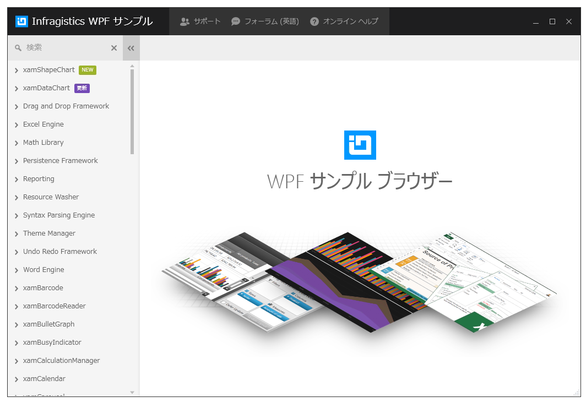

////

|metadata|
{
    "name": "wpf-netadvantage-for-wpf-samples",
    "controlName": [],
    "tags": ["Getting Started"],
    "guid": "{50FD2B15-9778-4E57-90D4-875FE345494F}",  
    "buildFlags": [],
    "createdOn": "2012-01-30T19:39:51.5806693Z"
}
|metadata|
////

= {ProductName} のサンプル

== サンプル ブラウザー

サンプル ブラウザーは、{ProductName} コントロールの広範な機能セットの使用を例示することによって、事例によって学習する考え方に沿っています。ブラウザー内に対応するソース コードを直接提供することによって、機能を動かすためには何が関与しているかを理解することができます。

link:https://github.com/Infragistics/wpf-samples/tree/master[サンプル ブラウザーのダウンロード]

Infragistics for WPF サンプル ブラウザーは、Infragistics WPF 製品で提供されるすべてのコントロールのサンプルを含むスタンドアロン アプリケーションです。それは、このリポジトリの Examples フォルダーに存在します。それを実行するには、以下の手順を実行します。

* Visual Studioで .\Examples\Infragistics.Samples.WPF.sln を開きます。
* 各プロジェクトで参照されている NuGet パッケージを復元します。Infragistics for WPF 製品のトライアル版 NuGet パッケージは、現在ブラウザー内の各プロジェクトで使用されています。Visual Studio はビルド時にパッケージを復元しようとします。トライアル版パッケージは公開 NuGet フィードに存在するため、それをターゲットにして復元する必要があります。
* ビルドが完了したら、Visual Studio 内からソリューションを開始するだけでブラウザーを起動できます。ブラウザー アプリの実行ファイルは、将来のブラウザー実行のために自動生成された .\Examples\Output フォルダーに配置されます。

サンプルはデフォルトで、link:https://nuget.org[Nuget.org] にあるトライアル NuGet パッケージを使用しています。

