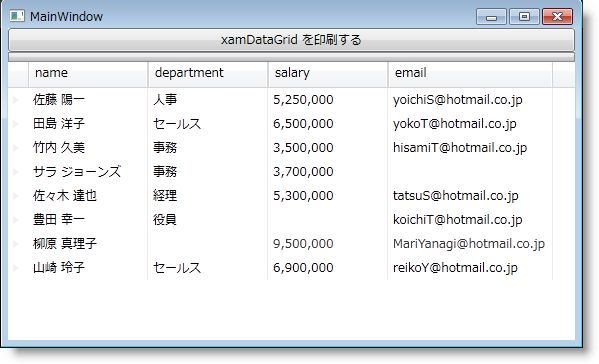

////
|metadata|
{
    "name": "wpf-reporting-getting-started-with-wpf-reporting",
    "controlName": ["IG WPF Reporting"],
    "tags": ["Reporting"],
    "guid": "{B77C11F4-8B34-4BC2-9E1A-AB46F31C40DE}",
    "buildFlags": [],
    "createdOn": "2012-01-30T19:39:51.9047341Z"
}
|metadata|
////

= WPF レポートをページに追加

== 始める前に

link:{ApiPlatform}reporting{ApiVersion}~infragistics.windows.reporting.report.html[Report] オブジェクトをインスタンス化して link:{ApiPlatform}reporting{ApiVersion}~infragistics.windows.reporting.embeddedvisualreportsection.html[EmbeddedVisualReportSection] オブジェクトをその link:{ApiPlatform}reporting{ApiVersion}~infragistics.windows.reporting.report~sections.html[Sections コレクション]に追加してからでなければ、レポートをプレビュー、印刷、またはエクスポートすることはできません。セクションを Report オブジェクトに追加した後で、xamReportPreview™ コントロールを使用してレポートの link:wpf-reporting-show-a-print-preview.html[印刷プレビューを表示]したり、XML Paper Specification (XPS) 形式でレポートをエクスポートしたり、レポートをプリンタに出力することができます。

== 達成すること

主要コンテンツとして xamDataGrid™ を使用してレポートを作成します。

xamReportPreview をウィンドウに追加します。

== 以下の手順に従って、レポートを作成します

[start=1]
. Microsoft® Windows® Presentation Foundation Window プロジェクトを作成します。
[start=2]
. ソリューション エクスプローラーで以下の NuGet パッケージ参照をプロジェクトに追加します。NuGet フィードのセットアップと NuGet パッケージの追加の詳細については、link:nuget-feeds.html[NuGet フィード] ドキュメントを参照してください。

* Infragistics.WPF.Reporting
* Infragistics.WPF.DataGrids

アプリケーションにレポート機能を実装するには、上記のリストのうち、最初のパッケージへの参照のみが必要です。XamDataGrid コントロールは、このトピックの残りの部分でレポート機能を紹介するために使用されます。

[start=3]
. 開いている Window タグ内で XamDataGrid の名前空間宣言を追加します。

*XAML の場合:*

----
xmlns:igDP="http://infragistics.com/DataPresenter"
----

[start=4]
. DockPanel コンテナーを Window に追加します。

*XAML の場合:*

----
<DockPanel>
    <!--TODO: ここに Button を追加します。-->
    <!--TODO: ここに xamDataGrid を追加します。-->
</DockPanel>
----

[start=5]
. Button コントロールを DockPanel コンテナーに追加します。

.. 添付の DockPanel.Dock プロパティを Top に設定します。
.. Content プロパティを "Print xamDataGrid" に設定します。
.. Button コントロールの Click イベントにイベント ハンドラーを接続します。

*XAML の場合:*

----
<Button 
    DockPanel.Dock="Top" 
    Content="Print xamDataGrid" 
    Click="Button_Click" />
----

[start=6]
. xamDataGrid を DockPanel コンテナーに追加します。

.. Name プロパティを設定すると、コード ビハインドで参照できます。
.. BindToSampleData プロパティを True に設定します。

*XAML の場合:*

----
<igDP:XamDataGrid Name="xamDataGrid1" BindToSampleData="True" />
----

[start=7]
. コード ビハインドを開き、コード ビハインド内に using/Imports のディレクティブを配置すれば、メンバーの完全に記述された名前を常にタイプする必要がなくなります。

*Visual Basic の場合:*

----
Imports Infragistics.Windows.Reporting
----

*C# の場合:*

----
using Infragistics.Windows.Reporting;
----

[start=8]
. メソッドのスタブが作成されている場合は、Button コントロールの Click イベントのイベント ハンドラーを追加し、Report および EmbeddedVisualReportSection オブジェクトをインスタンス化し、xamDataGrid コントロールへの参照をそのコンストラクターに渡します。最後に、EmbeddedVisualReportSection オブジェクトを Report オブジェクトの Sections コレクションに追加し、Report オブジェクトの link:{ApiPlatform}reporting{ApiVersion}~infragistics.windows.reporting.report~print.html[Print] メソッドまたは link:{ApiPlatform}reporting{ApiVersion}~infragistics.windows.reporting.report~export.html[Export] メソッドを呼び出します。

*Visual Basic の場合:*

----
Private Sub Button_Click(sender As Object, e As RoutedEventArgs) 
    Dim report1 As New Report()
    Dim section1 As New EmbeddedVisualReportSection(Me.xamDataGrid1)
    report1.Sections.Add(section1)
    report1.Print()
    ' 以下のコード行は、xamDataGrid のコンテンツを
    ' XPS ドキュメントにエクスポートします。
    'report1.Export(OutputFormat.XPS, "c:\\xamDataGrid1.xps")
End Sub
----

*C# の場合:*

----
private void Button_Click(object sender, RoutedEventArgs e)
{
    Report report1 = new Report();
    EmbeddedVisualReportSection section1 = new EmbeddedVisualReportSection(this.xamDataGrid1);
    report1.Sections.Add(section1);
    report1.Print();
    // 以下のコード行は、xamDataGrid のコンテンツを
    // XPS ドキュメントにエクスポートします。
    //report1.Export(OutputFormat.XPS, "c:\\xamDataGrid1.xps");
}
----

[start=9]
. プロジェクトを実行します。

以下のスクリーンショットのような Window が表示されます。"Print xamDataGrid" とラベルが付けられたボタンをクリックして、xamDataGrid コントロールのコンテンツを印刷できます。

== 以下の手順に従って、xamReportPreview をウィンドウに追加します

[start=1]
. Microsoft® Windows® Presentation Foundation Window プロジェクトを作成します。
[start=2]
. 以下の NuGet パッケージ参照をプロジェクトに追加します。

** Infragistics.WPF.Reporting

+
NuGet フィードのセットアップと NuGet パッケージの追加の詳細については、link:nuget-feeds.html[NuGet フィード] ドキュメントを参照してください。

[start=3]
. Infragistics 名前空間宣言を追加します。

*XAML の場合:*

----
xmlns:igReporting="http://infragistics.com/Reporting"
----

*Visual Basic の場合:*

----
Imports Infragistics.Windows.Reporting
----

*C# の場合:*

----
using Infragistics.Windows.Reporting;
----

[start=4]
. デフォルトの Grid レイアウト コンテナーに名前を付けると、コード ビハインドで参照できます。

*XAML の場合:*

----
<Grid Name="layoutRoot">
</Grid>
----

[start=5]
. コード ビハインドを使用する場合、Window の Loaded イベントにイベント ハンドラーを接続します。

*XAML の場合:*

----
<Window ... Loaded="Window_Loaded">
----

[start=6]
. xamReportPreview コントロールのインスタンスを作成して、これをメイン Grid に追加します。

*XAML の場合:*

----
<igReporting:XamReportPreview Name="xamReportPreview1" />
----

*Visual Basic の場合:*

----
Private Sub Window_Loaded(ByVal sender As Object, ByVal e As RoutedEventArgs) 
    Dim xamReportPreview1 = New XamReportPreview()
    Me.layoutRoot.Children.Add(xamReportPreview1)
End Sub
----

*C# の場合:*

----
private void Window_Loaded(object sender, RoutedEventArgs e)
{
    XamReportPreview xamReportPreview1 = new XamReportPreview();
    this.layoutRoot.Children.Add(xamReportPreview1);
}
----

[start=7]
. プロジェクトを実行します。

プロジェクトを実行すると、以下のスクリーンショットに似た Window が表示されます。xamReportPreview コントロールは、レポートのプレビューを生成していないために、コンテンツを表示しません。xamReportPreview の link:{ApiPlatform}reporting{ApiVersion}~infragistics.windows.reporting.xamreportpreview~generatepreview.html[GeneratePreview] メソッドを呼び出し、 link:{ApiPlatform}reporting{ApiVersion}~infragistics.windows.reporting.report.html[Report] オブジェクトに参照を渡す必要があります。

image::images/WPF_Reporting_Adding_xamReportPreview_to_a_Window_Using_Procedural_Code_01.png[]

== 関連トピック

link:wpf-reporting-understanding-wpf-reporting.html[WPF レポーティング について]

link:wpf-reporting-using-wpf-reporting.html[WPF レポーティング の使用]