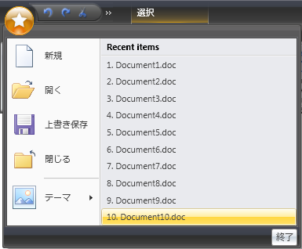
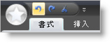
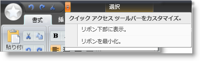
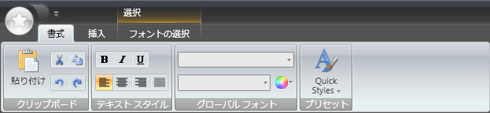

////

|metadata|
{
    "name": "wpf-whats-new-in-2007-volume-2",
    "controlName": [],
    "tags": ["Getting Started","How Do I"],
    "guid": "{58FD7798-F02A-4E81-AE22-080D3C65F145}",  
    "buildFlags": [],
    "createdOn": "2012-01-30T19:39:51.6886909Z"
}
|metadata|
////

= 2007 Volume 2 の新機能

{ProductName} 2007 Volume 2 リリースには、WPF コントロールをこれまで以上に活用することを可能にする多数の強力な新しいコントロールと機能を含んでいます。

以下は 2007 Volume 2 リリースに追加したコントロールのリストです。リンクをクリックして提供されている機能のリストを確認してください。

* <<xamChart,xamChart>>
* <<xamComboEditor,xamComboEditor>>
* <<xamRibbon,xamRibbon>>

[[xamChart]]

== xamChart

xamChart™ コントロールは、グラフを使用してデータを提示する新しい視覚的コントロールです。xamChart コントロールは、柱状、円のウェッジ、円柱などを使用して値を表示します。

== チャート タイプ

xamChart コントロールは、25 の異なるチャート タイプをサポートしており、これによってアプリケーションでデータを強調するために完全な外観を選択することができます。

[cols="a,a"]
|====

|image::images/Whats_New_xamChart_01.png[] 

|image::images/Whats_New_xamChart_02.png[] 

|image::images/Whats_New_xamChart_03.png[] 

|image::images/Whats_New_xamChart_04.png[] 

|====

== 立体描画

データの優れた視覚化を表示するために立体描画をオンにできます。

[cols="a,a"]
|====

|image::images/Whats_New_xamChart_05.png[] 

|image::images/Whats_New_xamChart_06.png[] 

|image::images/Whats_New_xamChart_07.png[] 

|image::images/Whats_New_xamChart_08.png[] 

|====

== 合成チャート

xamChart コントロールは合成チャートの作成に留意して構築されました。合成チャートの作成がこれほど簡単にできるようになったのは初めてです。一組の Series を xamChart に追加してデータにバインドするだけです。各 Series に異なるチャートタイプを描画させて、複雑な構成チャートを作成します。

image::images/Whats_New_xamChart_09.png[]

[[xamComboEditor]]

== xamComboEditor

xamComboEditor™ コントロールは、エンド ユーザーが単一の項目を選択できるドロップダウン リストを提供するエディタ コントロールです。

以前のリリースで、xamDataGrid™ はデータを編集するために使用できるドロップダウン エディタを含んでいませんでした。xamComboEditor のリリースで、項目が移植されたドロップダウンを使用して、 link:{ApiPlatform}datapresenter{ApiVersion}~infragistics.windows.datapresenter.cell.html[Cell] の値を編集できます。xamDataGrid 内のドロップダウンリストを使用すると、データエントリの間誤字の量を減らすことに役立ちます。

image::images/xamComboEditor_Whats_New_20072.png[]

[[xamRibbon]]

== xamRibbon

xamRibbon™ コントロールは、Microsoft® Windows® Presentation Foundation アプリケーションの Microsoft® Office® 2007 リボン機能を複製するメニュー コントロールです。10 年前のプレーン、デフォルト、ドロップダウンメニューを使用する代わりに、xamRibbon を使用してアプリケーションにスタイリッシュなルック アンド フィールを与えることができます。xamRibbon の多くの機能を使用して、アプリケーションのルックアンドフィールを改善するだけでなく、使いやすさも改善することができます。

== アプリケーション メニュー

アプリケーション メニューはアプリケーションのメイン メニューです。アプリケーション メニューは 3 つの領域に分割されます。

* 左の領域は、ファイル操作を目的としたボタンを表示します。
* 右の領域は、左の領域と似たボタンを表示します。右の領域のもうひとつの用途は、最近使用されたリストです。
* 下側の領域は、アプリケーション オプションまたは終了ボタンなどのボタンを表示します。

== クイック アクセス ツールバー

Quick Access Toolbar (QAT) はユーザーが構成できる小さいツールバーで、リボンの上 (デフォルト) または下に常に表示されます。それに Ribbon ツールを追加すると、QAT の多様性が示されます。事実、RibbonGroup 全体を QAT に簡単に追加できます。

== タブおよびタブ グループ

アプリケーションでタブを使用したことがあれば、xamRibbon のオブジェクト モデルに直ぐに慣れます。xamRibbon コントロールには、タブのコレクションが含まれており、その各コレクションはグループのコレクションを持ち、その各グループはツールのコレクションを持つという構造になっています。この構造によって、エンド ユーザーが簡単に見つけることができる機能に関連したアプリケーション タスクにツールを整理することができます。

