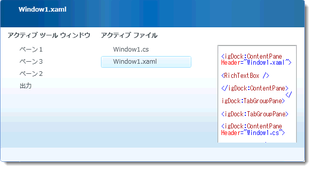
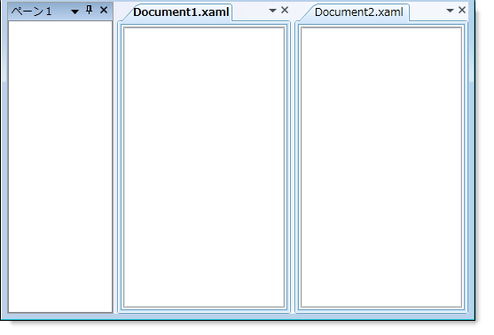
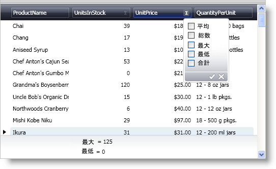

////

|metadata|
{
    "name": "wpf-whats-new-in-2008-volume-1",
    "controlName": [],
    "tags": ["Getting Started","How Do I"],
    "guid": "{CD006A1B-5DD0-407A-8616-B6D3B95387BC}",  
    "buildFlags": [],
    "createdOn": "2012-01-30T19:39:51.6906913Z"
}
|metadata|
////

= 2008 Volume 1 の新機能

{ProductName} 2008 Volume 1 リリースには、WPF コントロールをこれまで以上に活用することを可能にする xamDataGrid の行集計と新しいレイアウト コントロールが含まれています。

以下は 2008 Volume 1 リリースに追加した機能のリストです。提供される機能の詳細は、以下のリンクをクリックしてください。

* <<xamDockManager,xamDockManager コントロール>>
* Data Presenter Family 2008.1

** <<xamDataRow,行の集計機能>>
** <<xamDataNewProperties,新しいプロパティ>>

[[xamDockManager]]

== xamDockManager コントロール

xamDockManager™ コントロールは、Microsoft® Visual Studio® と同じようにランタイムにエンドユーザーが修正可能なアプリケーション レイアウトを作成することができるレイアウト コントロールです。

xamDockManager の機能には以下が含まれます。

* *ドッキング インジケータ* - ドッキング インジケータによって、ランタイムに視覚的なインジケータを使用してエンドユーザーは簡単にペインをドックできます。

image::images/xamDockManager_New_xamDockManager_Control_01.png[XamDockManager のドッキング インジケーターの実例]

* *ペイン ナビゲータ* - ペイン ナビゲータはエンドユーザーに開いているペイン間を切り替える便利な方法を提供します。これは新しいペインのプレビューを表示することでペイン間を切り替える推測にもなります。

* *タブ付けされた文書* - ドッキング機能に加えて、Visual Studio のコード ビューまたはデザイン ビューとまったく同じように xamDockManager のメイン クライアント領域にタブを表示できます。タブ付けされた MDI アプリケーションを作成するためにこの機能を活用することもできます。

[[xamDataRow]]

== 行の集計機能

2008 Volume 1 リリースから開始しましたが、行集計機能は xamDataGrid™ と xamDataPresenter™ の link:{ApiPlatform}datapresenter{ApiVersion}~infragistics.windows.datapresenter.gridview.html[GridView] で使用できます。

行集計機能が有効な時には、フィールド ヘッダにシグマ アイコンが表示されます。このアイコンをクリックして集計選択ダイアログ ボックスを開くことができます。集計選択ダイアログ ボックスには経験豊かなエンド ユーザーも初心者のエンド ユーザーも簡単に使用できる直感的で使いやすいインタフェースがあります。

[[xamDataNewProperties]]

== 新しいプロパティ

== ラベルのパフォーマンスの最適化

link:{ApiPlatform}datapresenter{ApiVersion}~infragistics.windows.datapresenter.fieldsettings.html[FieldSettings] オブジェクトは、xamDataGrid™、xamDataCarousel™ および xamDataPresenter™ のパフォーマンスを最適化する支援をするために新しい link:{ApiPlatform}datapresenter{ApiVersion}~infragistics.windows.datapresenter.fieldsettings~allowlabelvirtualization.html[AllowLabelVirtualization] プロパティを公開しています。

== ラベル テキストの動作

FieldSettings オブジェクトは、 link:{ApiPlatform}datapresenter{ApiVersion}~infragistics.windows.datapresenter.field.html[Field] オブジェクトのラベルでテキストの動作を修正するのに役に立つ新しいプロパティを公開します。link:{ApiPlatform}datapresenter{ApiVersion}~infragistics.windows.datapresenter.labelpresenter.html[LabelPresenter] オブジェクトでテキストを揃える、切り落とす、折り返すためにスタイルまたはテンプレートを作成する必要はもうありません。

* link:{ApiPlatform}datapresenter{ApiVersion}~infragistics.windows.datapresenter.fieldsettings~labeltextalignment.html[LabelTextAlignment]
* link:{ApiPlatform}datapresenter{ApiVersion}~infragistics.windows.datapresenter.fieldsettings~labeltexttrimming.html[LabelTextTrimming]
* link:{ApiPlatform}datapresenter{ApiVersion}~infragistics.windows.datapresenter.fieldsettings~labeltextwrapping.html[LabelTextWrapping]

== 拡張インディケータ

link:{ApiPlatform}datapresenter{ApiVersion}~infragistics.windows.datapresenter.fieldlayoutsettings.html[FieldLayoutSettings] オブジェクトは新しい link:{ApiPlatform}datapresenter{ApiVersion}~infragistics.windows.datapresenter.fieldlayoutsettings~expansionindicatordisplaymode.html[ExpansionIndicatorDisplayMode] プロパティを公開します。このプロパティを設定して、子レコードを持たないレコードの展開インジケータを非表示にすることができます。

== コンバータとフィールド

Field オブジェクトはデータ バインディングのシナリオで支援となる link:{ApiPlatform}datapresenter{ApiVersion}~infragistics.windows.datapresenter.field~converter.html[Converter]、 link:{ApiPlatform}datapresenter{ApiVersion}~infragistics.windows.datapresenter.field~converterculture.html[ConverterCulture] および link:{ApiPlatform}datapresenter{ApiVersion}~infragistics.windows.datapresenter.field~converterparameter.html[ConverterParameter] プロパティを公開します。