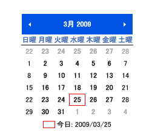
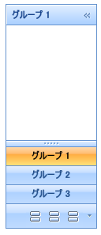
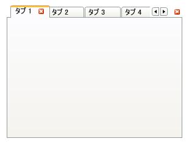

////

|metadata|
{
    "name": "wpf-whats-new-in-2008-volume-2",
    "controlName": [],
    "tags": ["Getting Started","How Do I"],
    "guid": "{7411F468-4B5E-4671-9BE7-37082022635C}",  
    "buildFlags": [],
    "createdOn": "2012-01-30T19:39:51.6936919Z"
}
|metadata|
////

= 2008 Volume 2 の新機能

{ProductName} 2008 Volume 2 リリースには、WPF コントロールをこれまで以上に活用することを可能にする多数の強力な新しいコントロールと機能を含んでいます。

以下は 2008 Volume 2 リリースに追加したコントロールのリストです。リンクをクリックして提供されている機能のリストを確認してください。

* <<xamDateTimeEditor,xamDateTimeEditor のドロップダウン カレンダー>>
* <<xamDataPresenter,xamDataPresenter の移動可能なフィールド>>
* <<WPFReporting,WPF レポーティング エンジン>>
* <<xamMonthCalendar,xamMonthCalendar コントロール>>
* <<xamOutlookBar,xamOutlookBar コントロール>>
* <<xamTabControl,xamTabControl>>

[[xamDateTimeEditor]]

== xamDateTimeEditor のドロップダウン カレンダー

xamDateTimeEditor™ コントロールは、xamMonthCalendar™ コントロールを、エンドユーザーが xamDateTimeEditor に入力する代わりにドロップダウンカレンダーから日付を選択することができるドロップダウンカレンダーとして使用します。この機能はコードを記述しなくても自動的に有効になります。

image::images/xamDateTimeEditor_Drop_Down_Calendar_for_xamDateTimeEditor_01.png[]

[[xamDataPresenter]]

== xamDataPresenter の移動可能なフィールド

xamDataPresenter™ コントロール (グリッド ビューを使用) および xamDataGrid™ コントロールによってエンドユーザーはランタイムにフィールドを移動することが可能となります。これによって読みやすさを向上するためにカスタマイズできます。さらに、カスタマイズの内容を保存およびロードできるので、エンドユーザーはアプリケーションを再起動する時にデータを再構成する必要がありません。

image::images/xamDataPresenter_Movable_Fields_for_xamDataPresenter_01.png[]

[[WPFReporting]]

== WPF レポーティング エンジン

WPF レポーティング エンジンは数行のコードとともに xamDataGrid™ コントロールを印刷する機能を提供します。xamReportPreview™ コントロールを使用してエンドユーザーに印刷プレビューを表示することさえできます。使用しやすいオブジェクト モデルとともに、xamReporting エンジンはスタイルおよびテンプレートを使用して固有の要素をページに追加する柔軟性を提供します。

image::images/WPF_Reporting_Engine_01.png[]

[[xamMonthCalendar]]

== xamMonthCalendar コントロール

xamMonthCalendar™ コントロールは Microsoft® Windows® Vista™ にあるカレンダー機能を複製します。西暦ビューへとズームアウトしてから特定の月に達するまで異なるビューでズームインすることによって、エンドユーザーは異なる日付にナビゲートできます。

[[xamOutlookBar]]

== xamOutlookBar コントロール

xamOutlookBar™ コントロールは、Microsoft® Outlook のエンドユーザーが新しいナビゲーション インタフェースを学習しなくても使用できる簡単にナビゲートできるアプリケーションを作成する機能を提供します。Outlook に詳しくないエンドユーザーでもアプリケーションをナビゲートできる簡単さを理解できます。エンドユーザーが画面の領域を最大限に利用しなければならない時には、再度必要になるまで xamOutlookBar コントロールを縮小できます。

[[xamTabControl]]

== xamTabControl

多くのアプリケーションはタブを使用してエンドユーザーが複数の作業を同時に開くことや、作業の論理的なユニットに作業を分割することを可能にします。多くのエンドユーザーは Web ブラウザーを日常的に使用しているので、タブ付きのインタフェースに馴染みがあります。xamTabControl™ をアプリケーションで使用することによって、同様の機能を実装できます。

Microsoft® Windows® Presentation Foundation TabControl の機能に加えて、タブを閉じるための機能、タブ ヘッダーをスクロールする機能、そしてタブを閉じるボタンを表示する機能など、すべてがひとつのプロパティ設定の手の届く範囲で入手できます。

