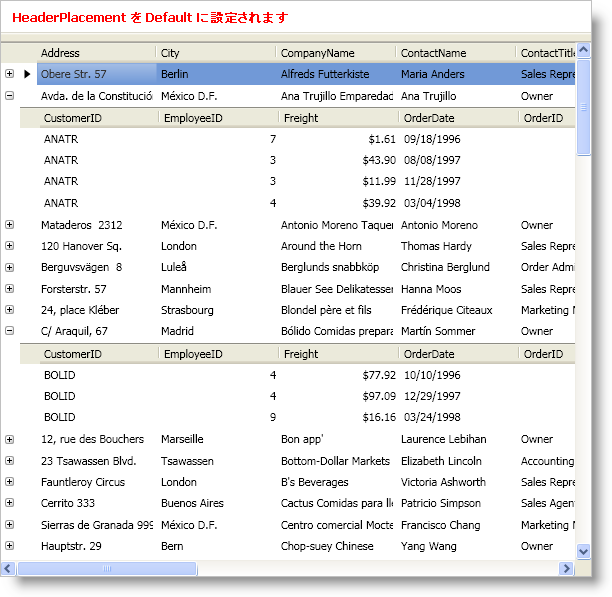
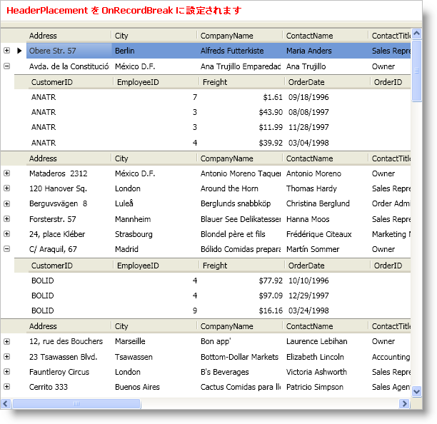
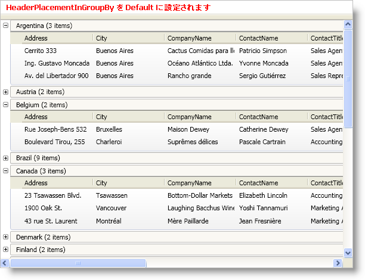
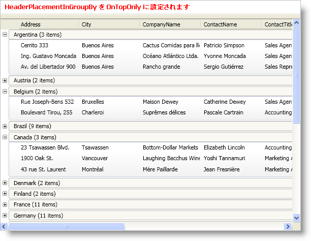

////

|metadata|
{
    "name": "wpf-whats-new-in-2009-volume-1",
    "controlName": [],
    "tags": ["Getting Started","How Do I"],
    "guid": "{285F0A73-BED7-454C-BCB7-916A80DE5D41}",  
    "buildFlags": [],
    "createdOn": "2012-01-30T19:39:51.6956923Z"
}
|metadata|
////

= 2009 Volume 1 の新機能

{ProductName} 2009 Vol. 1 リリースには、WPF コントロールをこれまで以上に活用することを可能にする多数の強力な新しい機能を含んでいます。

以下は 2009 Volume 1 リリースに追加した機能のリストです。リンクをクリックして提供されている機能のリストを確認してください。

* <<FixedFields,固定フィールド>>
* <<HeaderPlacement,ヘッダー配置>>
* <<RecordFiltering,レコード フィルタリング>>
* <<DataPresenter,データ プレゼンターの強化>>

[[FixedFields]]

== 固定フィールド

xamDataPresenter™ および xamDataGrid™ コントロールによって、エンドユーザーはレコードの方向とコントロールのフロー方向に基づいてコントロールのエッジにフィールドを固定できます。この機能を有効にすると、エンドユーザーはフィールドヘッダーに表示されるピンアイコンをクリックするか、固定したいフィールドに分割バーをドラッグできます。

image::images/xamDataPresenter_Fixed_Fields.png[]

== 関連トピック

link:xamdatagrid-about-fixed-non-scrolling-fields.html[固定 (非スクロール) フィールドについて]

link:xamdatagrid-enable-fixed-fields.html[固定フィールドを有効にする]

link:xamdatagrid-fix-fields.html[フィールドの固定]

[[HeaderPlacement]]

== ヘッダー配置

link:{ApiPlatform}datapresenter{ApiVersion}~infragistics.windows.datapresenter.fieldlayoutsettings.html[FieldLayoutSettings] オブジェクトで公開された新しい link:{ApiPlatform}datapresenter{ApiVersion}~infragistics.windows.datapresenter.fieldlayoutsettings~headerplacement.html[HeaderPlacement] プロパティと link:{ApiPlatform}datapresenter{ApiVersion}~infragistics.windows.datapresenter.fieldlayoutsettings~headerplacementingroupby.html[HeaderPlacementInGroupBy] プロパティの両方またはどちらか一方を設定して、xamDataPresenter™ および xamDataGrid™ でフィールド ヘッダーを繰り返すことができます。

[NOTE]
====
*注:* ビューは個別のヘッダー (つまり、グリッド ビュー) をサポートする必要があり、ヘッダー配置プロパティがデータ プレゼンターに影響を及ぼすためには LabelLocation プロパティが SeparateHeader に設定される必要があります。
====

[[RecordFiltering]]

== レコード フィルタリング

xamDataPresenter™ および xamDataGrid™ コントロールによって、エンド ユーザーはオリジナルのデータをより小さいサブセットで表示するためにレコードをフィルターして除外することができます。フィルター レコードまたはフィールド ヘッダーのフィルター アイコンの 2 つの異なる方法でエンドユーザーにレコード フィルタリング機能を公開できます。フィルター レコードを使用する場合、エンド ユーザーはドロップダウン リストからオペランドおよび演算子を選択できます。

[NOTE]
====
*注:* フィルター レコードおよびフィルター アイコンは、グリッド ビュー (つまり、xamDataGrid または xamDataPresenter) を使用する場合に限って使用できます。ただし、XAML またはプロシージャ コードの xamDataCarousel™ にフィルター条件を追加できます。
====

image::images/xamDataPresenter_Record_Filtering.png[]

== 関連トピック

link:xamdatapresenter-about-record-filtering.html[レコード フィルタリングについて]

link:xamdatapresenter-enable-record-filtering.html[レコード フィルタリングを有効にする]

link:xamdatapresenter-add-filter-conditions.html[フィルター条件の追加]

link:xamdatapresenter-modify-the-list-of-operators.html[演算子のリストの修正]

link:xamdatapresenter-modify-the-look-of-filtered-records.html[フィルターされたレコードの外観を修正]

[[DataPresenter]]

== データ プレゼンターの強化

== フィルターおよびソートされたコレクション ビューでリスト修正をフル サポート (つまりレコードの追加/削除) 

[NOTE]
====
*注:* CollectionView 基本グラフ、ListCollectionView クラス(pre-3.5 SP1)、または BindingListCollectionView クラス (pre-3.5 SP1) をデータ ソースとして使用する場合、リスト修正 (つまり追加と削除) はリセット通知として扱われます。これらのクラスは .NET Framework 3.5 SP1 更新によって導入された新しい IEditableCollectionView インタフェースを実装しないからです。これはパフォーマンス ヒットを発生させる場合があります。パフォーマンスを最大限にするために ListCollectionView クラスまたは BindingListCollectionView クラスの .NET Framework 3.5 SP1 バージョンを使用することを推奨します。
====

== グループ化されたレコードの状態はリセット後に保持される

CollectionView オブジェクトをフィルターまたはソートする時に、 link:{ApiPlatform}datapresenter{ApiVersion}~infragistics.windows.datapresenter.groupbyrecord.html[GroupByRecord] オブジェクトの展開された状態が保持されるようになりました。さらに、リセット通知を CollectionView オブジェクトから受け取る場合、既存のレコードと展開された状態を保持します。

[NOTE]
====
*注:* レコードの展開された状態を保持するには、DataSource プロパティを null に設定する回避策を削除してからリセットする必要があります。
====

== InitializeRecordEventArgs オブジェクトは IsPreparingForSort プロパティを公開

link:{ApiPlatform}datapresenter{ApiVersion}~infragistics.windows.datapresenter.events.initializerecordeventargs~ispreparingforsort.html[IsPrepartingForSort] プロパティが link:{ApiPlatform}datapresenter{ApiVersion}~infragistics.windows.datapresenter.events.initializerecordeventargs.html[InitializeRecordEventArgs] オブジェクトに追加されました。InitializeRecord イベントを処理する場合、ソートのためにイベントが発生したかどうかを判断できます。

== 2 つの値を LabelClickAction 列挙体に追加

3 ステートのソート (つまり、Ascending、Descending、NoSort) を可能にするために、以下の 2 つの値が link:{ApiPlatform}datapresenter{ApiVersion}~infragistics.windows.datapresenter.labelclickaction.html[LabelClickAction] 列挙体に追加されました:

* SortByOneFieldOnlyTriState
* SortByMultipleFieldsTriState

[NOTE]
====
*注:* FieldSettings オブジェクトの LabelClickAction プロパティを新しい 3 ステートの列挙体値のいずれかに設定する場合、エンド ユーザーが CTRL キーを押すまたはフィールドがグループ化フィールドの場合には 'NoSort' 状態が省略されます。
====

== IsSynchronizedWithCurrentItem プロパティが DataPresenterBase に追加

link:{ApiPlatform}datapresenter{ApiVersion}~infragistics.windows.datapresenter.datapresenterbase~issynchronizedwithcurrentitem.html[IsSynchonizedWithCurrentItem] プロパティを True に設定するとルートレベルのデータ レコードを同期します。

== ActualPosition プロパティを Field オブジェクトに追加

link:{ApiPlatform}datapresenter{ApiVersion}~infragistics.windows.datapresenter.fielditem~actualposition.html[ActualPosition] プロパティは link:{ApiPlatform}datapresenter{ApiVersion}~infragistics.windows.datapresenter.fieldposition.html[FieldPosition] 構造を返す読み取り専用プロパティで、フィールド レイアウトでフィールドの実際の Row、RowSpan、Column および ColumnSpan を返します。エンド ユーザーがフィールドを再配列するまたはデータ プレゼンターが自動的にフィールドを配列する時には、この値が link:{ApiPlatform}datapresenter{ApiVersion}~infragistics.windows.datapresenter.field.html[Field] オブジェクトの Row、RowSpan、Column および ColumnSpan プロパティ値と異なる可能性があります。

[NOTE]
====
*注:* データ プレゼンターがフィールドをまだ自動的に配列していない場合、このプロパティは Field オブジェクトの Column、Row、ColumnSpan および RowSpan プロパティに基づいてデフォルト値を返します。
====