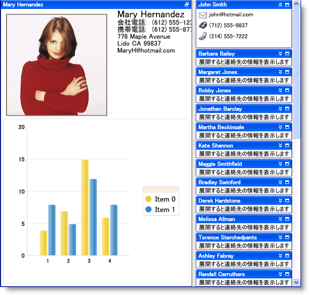

////

|metadata|
{
    "name": "wpf-whats-new-in-2010-volume-1",
    "controlName": [],
    "tags": ["Getting Started","How Do I"],
    "guid": "{F6858E6F-F48C-4274-B009-1DEE65B6D427}",  
    "buildFlags": [],
    "createdOn": "2012-01-30T19:39:51.6996931Z"
}
|metadata|
////

= 2010 Volume 1 の新機能

{ProductName} 2010 Vol. 1 リリースには、WPF コントロールをこれまで以上に活用することを可能にする多数の強力な新しい機能を含んでいます。

以下は 2010 Volume 1 リリースに追加した機能のリストです。リンクをクリックして提供されている機能のリストを確認してください。

* <<xamDataCards,xamDataCards コントロール>>
* <<xamDockManager,xamDockManager の拡張>>
* <<xamEditor,xamEditor のスピン ボタン>>
* <<xamTilesControl,xamTilesControl>>

[[xamDataCards]]

== xamDataCards コントロール

xamDataCards™ コントロールでは、Microsoft® Outlook 2007 の連絡先のようなカードを使用してフラット データを表示できます。xamDataCards コントロールが link:{ApiPlatform}datapresenter{ApiVersion}~infragistics.windows.datapresenter.datapresenterbase.html[DataPresenterBase] クラスから派生するため、DataPresenter コントロールのコアな機能を継承します。ただし、xamDataCards コントロールは以下の機能をサポートしません:

* 階層データ
* 固定レコード
* グループ化
* 集計

image::images/xamDataCards_About_xamDataCards_01.png[]

[[xamDockManager]]

== xamDockManager の拡張

== ドラッグ動作

タブ グループ (挿入バーまたはプレビュー) 内のペインのドラッグ動作およびフローティング ペインのドラッグ動作 (即時、遅延、またはシステム設定) を変更できます。

== FileMenuOpening イベント

xamDockManager コントロールの FileMenuOpening イベントを処理して、カスタム メニュー項目をタブ グループのファイル メニューに追加できます。

== コンテンツ ペイン ボタンを非表示にする

ヘッダーを再テンプレートする代わりにコンテンツ ペインによって公開される表示プロパティを設定することによって、コンテンツ ペインのヘッダーのボタンを非表示にできます。

== ピン固定されていないペインのフライアウト動作

エンドユーザーがヘッダー上にホーバーする時にピン固定されていないペインが自動的にフライアウトすることを禁止できます。

== ペインにすべての使用可能なスペースを使用

xamDockManager コントロールは、文書のためにスペースを確保する代わりに、すべての使用できるスペースをペインに配分できます (DocumentContentHost)。

[[xamEditor]]

== xamEditor のスピン ボタン

xamMaskedEditor™ コントロールおよび xamMaskedEditor から派生しているコントロールは、エンドユーザーがエディターの値を増やすまたは減らすことができるスピン ボタンを表示できます。

[[xamTilesControl]]

== xamTilesControl

xamTilesControl™ は矩形のタイルを使用してコンテンツを表示します。これらは連続して配列されて複数行のタイルとなります。エンド ユーザーは 1 つ以上のタイルを最大化できます。これによって残りのタイルは自動的に最小化されます。ただし、最小化されたタイルはコントロールの端に沿って今まで通りに表示されるので、エンドユーザーは素早く最大化して、ユーザーの注意を新しいコンテンツに移すことができます。

xamTilesControl には以下の機能が含まれます:

* *アニメーション* - xamTilesControl には状態のトランジション中に再生されるアニメーションが組み込まれています。固有のアニメーションを追加して、このエクスペリエンスをカスタマイズできます。
* *データ バインディング* - xamTilesControl は ItemsControl クラスから派生しているので、データ項目の Tile オブジェクトを自動的に作成するために link:http://msdn.microsoft.com/ja-jp/library/system.windows.controls.itemscontrol.itemssource.aspx[ItemsSource] プロパティを設定できます。
* *ドラッグ アンド ドロップ* - エンドユーザーはランタイムにタイルをドラッグして再配置できます。
* *明示的なタイル レイアウト* - グリッド パネルの概念を使用して明示的な列および行にタイルを配列できます (Column、Row、ColumnSpan および RowSpan)。
* *レイアウトの保存およびロード* - エンドユーザーがランタイムにレイアウトを変更した後で、変更を保存してアプリケーションのセッション間に復元できます。
* *状態に基づく項目のテンプレート* - タイルの状態に基づいて項目テンプレートを定義できます。xamTilesControl は、エンドユーザーがタイルの状態を変更すると、正しい項目テンプレートを自動的に適用します。
* *状態に基づいたサイズ制限* - 状態に基づいてタイルのサイズを制限できます。
* *タイルのリサイズ* - エンドユーザーはリサイズ インジケーターを使用してタイルをリサイズできます。