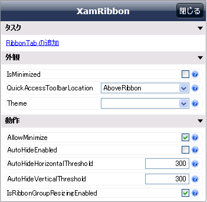
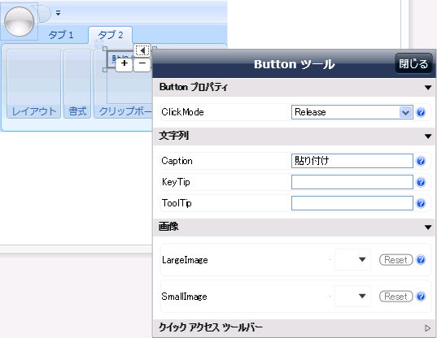
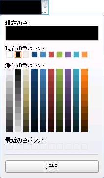
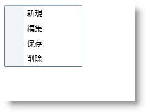
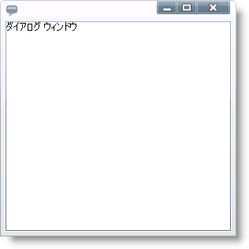
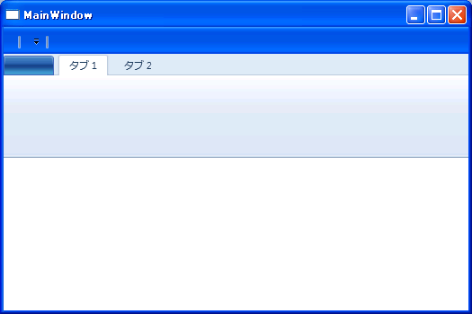

////

|metadata|
{
    "name": "wpf-whats-new-in-2010-volume-2",
    "controlName": [],
    "tags": ["Getting Started","How Do I"],
    "guid": "fe5be400-2111-4191-a16a-37923a13e613",  
    "buildFlags": [],
    "createdOn": "2012-01-30T19:39:51.7016935Z"
}
|metadata|
////

= 2010 Volume 2 の新機能

{ProductName} 2010 Volume 2 リリースには、強力な line of business コントロール群が含まれています。

以下のリンクをクリックしてこのリリースで提供されているコントロールおよび機能のリストを確認してください。

* <<NET4Builds,.NET 4.0 ビルド>>
* <<VSMSupport,VisualStateManager のサポート>>
* <<SSolution,スタートアップ ソリューション>>
* <<SmartTags,デザイン タイム スマートタグ>>
* <<ColorPicker,xamColorPicker コントロール>>
* <<ContextMenu,xamContextMenu コントロール>>
* <<DialogWindow,xamDialogWindow コントロール>>
* <<Menu,xamMenu コントロール>>
* <<Slider,xamSlider コントロール>>
* <<SpellChecker,xamSpellChecker コントロール>>
* <<TagCloud,xamTagCloud コントロール>>
* <<XamRibbon,xamRibbon の Scenic リボン テーマ>>

[[NET4Builds]]

== .NET 4.0 ビルド

10.2 リリースから、{ProductName} には、以前に含まれていた .NET 3.0 ビルドに加えてすべての WPF コントロール アセンブリの .NET 4.0 ビルドが含まれます。

10.2 製品インストーラーは .NET 3.0 ビルドをインストールして、ターゲット システムに VS2010 があるかどうかを検索します。VS2010 がシステムにインストールされている場合に、インストーラーはコントロール アセンブリの .NET 4.0 ビルドもインストールします。

以下は、コントロール アセンブリの 2 つのバージョンのフォルダーの場所です。

[cols="a"]
|====
|C:\Program Files\Infragistics\NetAdvantage 2010.2\WPF\CLR3.0

|$$.NET$$ 3.0 アセンブリが含まれます。

|====

[cols="a"]
|====
|C:\Program Files\Infragistics\NetAdvantage 2010.2\WPF\CLR4.0

|$$.NET$$ 4.0 アセンブリが含まれます。

|====

[cols="a"]
|====
|C:\Program Files\Infragistics\NetAdvantage 2010.2\WPF\DefaultStyles

|コントロールの 2 つのバージョン間で共有するデフォルトのスタイルが含まれます。

|====

[cols="a"]
|====
|C:\Program Files\Infragistics\NetAdvantage 2010.2\WPFCommon

|WPF LoB (Line of Business) と WPF DV (Data Visualization) 製品間で共有する .NET 4.0 アセンブリが含まれます。これには以下が含まれます。 

* {ProductName} 共通コントロール アセンブリ 

* {ProductName} XamChart コントロール 

* {ProductName} Excel Engine 

|====

アセンブリ名が変更されました。プレフィックス *Infragistics3.Wpf* が *InfragisticsWPF3* に変更されました。また .NET 4.0 アセンブリは *{ApiPlatform}* プレフィックスを使用しています。詳細は link:developers-guide-upgrading-your-project.html[「アップグレード」]セクションを参照してください。

[[VSMSupport]]

== VisualStateManager のサポート

$$.NET$$ 4.0 の発表に伴い、Microsoft は link:http://msdn.microsoft.com/ja-jp/library/system.windows.visualstatemanager(VS.95).aspx[VisualStateManager] のサポートを WPF に追加しました (.NET 4.0 以前は、VisualStateManager は Silverlight でしかサポートされませんでした)。この新機能を活用するために、VisualStateManager のサポートをすべての WPF コントロール 10.2 に追加しました。VisualStateManager は視覚的な状態をコントロールに適用するためにこれまでよりもさらにシンプルなモデルを提供します。

VSM サポートの一環として、すべての WPF コントロールは (「重要な」子要素も) 一連の link:http://msdn.microsoft.com/ja-jp/library/system.windows.visualstate(VS.95).aspx[VisualStates] を公開するようになりました。これはエンドユーザーの操作に基づいてランタイムでコントロールによって「現在の状態」として動的かつ自動的に選択されます。要素がある状態から別の状態に移行する時、または特定の状態がアクティブになる時には必ず、コントロール要素のためのカスタムテンプレートを開始ストーリーボードに修正することにで状態の変更に「反応」できます。

既存の WPF コントロールのデフォルトのテンプレートが継続して link:http://msdn.microsoft.com/ja-jp/library/system.windows.trigger.aspx[Triggers] を使用する一方で、任意のコントロールで任意の要素のカスタムテンプレートを作成する時に開発者は Triggers と VisualStateManager を自由に選択できます。実際的には、必要な場合には、同じテンプレートで Triggers と VisualStates/VisualTransitions の両方を使用できます。

VisualStateManager は視覚的な状態を NA/WPF コントロールに適用するためにシンプルでありながら柔軟な方法です。コントロールの状態が変わると必ず、プロパティ値を移行するための方法を公開することによって、コントロールのルックとフィールの両方を簡単にカスタマイズする方法を提供します。視覚的な状態の移行を自動的に生成するため、コードを記述するために要する時間を減らし、テンプレートで定義される視覚的な状態により多くの時間を割くことができます。Expression Blend を使用すると、特定の要素に対してサポートされる状態がどのようにであるかを簡単に知ることができるだけでなく、要素の状態が変わった時に希望の効果を生成する link:http://msdn.microsoft.com/ja-jp/library/ms742868(VS.85).aspx[Storyboards] を簡単に記述して添付できます。VisualStateManager の詳細は、 link:http://msdn.microsoft.com/ja-jp/library/system.windows.visualstatemanager(VS.95).aspx[MSDN Web サイト]で参照してください。

[[SSolution]]

== スタートアップ ソリューション

2010 volume 2 リリースから開始しましたが、{ProductName} には Visual Studio 2010 ようのスタートアップソリューションが含まれます。このソリューションにはいくつかの未完成の例が含まれており、インフラジスティックスの主要なコントロールの基本と最も一般的な操作方法に関する実践的な学習体験を素早く提供します。

Visual Studio の「タスク リスト」ウィンドウを参照することを推奨します。コード コメントに提供されているガイダンスを読みながら、コメントが付けられたコードの一部のコメントを解除してみましょう。これによって、さまざまな側面のコントロールの機能と動作を確認して試すことができます。

例はコントロールの基本的な機能を示しており、高度な状況は対象外です。多くの完成したサンプルは、 link:http://samples.jp.infragistics.com[http://samples.jp.infragistics.com] でご覧いただけます。より詳細かつ高度なガイダンスとコード例はオンライン マニュアルからも入手できます。

スタートアップ ソリューションは、{ProductName} 製品をインストール直後に使用できます。

[[SmartTags]]

== デザイン タイム スマートタグ

{ProductName} 10.2 の場合は、SmartTag のようなサポートをコントロールに追加してデザイン タイム エクスペリエンスを改善し、デベロッパーがコントロールの重要なプロパティを素早く構成できるようにします。このサポートは当社の VS2010/Blend3/Blend4 と互換性があるデザイナー アセンブリで公開されるため、アプリケーションとともに出荷するコントロール アセンブリのサイズは増えません。

SmartTag は WindowsForms Designer により VS2008 以前はサポートされていましたが、WPF デザイナーにはサポートされていません。当社は、この人気がある Windows Forms デザイナー機能を当社の WPF コントロールに拡張するために、独自の SmartTag フレームワークをビルドいたしました。

これらの SmartTag の使用法は簡単です。SmartTag が有効な {ProductName} コントロールのいずれかを選択すれば、コントロールの右上端にハンドル (三角形が右を向いた小さな四角形のボタン) が現れます。

image::images/WPF_SmartTags_01.png[]

このボタンを押して SmartTag パネルを開きます。選択された要素またはコントロールに適用する一連のプロパティまたはタスクが表示されます。ハイパーリンクをクリックするだけで VS Property Window とほとんど同じ方法でタスクを実行したり、その値を編集できます。すべてのプロパティの右端には小さな青色の疑問符 (?) アイコンが表示され、マウスのカーソルをそのアイコンの上に置くと、ツールチップにプロパティの詳細情報が表示されます。

ハンドルと SmartTag は、以下の画像の ButtonTool で示すように、VS デザイン面上で選択された場合に、コントロールの他の「重要な」子要素の上に表示されます。SmartTag は 10.2 の初期リリースでは、より大型で複雑なコントロールにのみ使用できます。引き続きサービスリリースでは残りのコントロールの SmartTag サポートを発表し、すべてのコントロールが次回フルバージョン 10.3 などでサポートされる予定です。VS2010 Microsoft 版は Visual Studio および Blend のデザイナー フレームワークを一体化した点にも注意してください。当社の SmartTag フレームワークはこの一体化されたデザイナー サポートの上にビルドされているため、VS2010、Blend3、および Blend 4 で {ProductName} コントロールを使用する場合のみ Smart Tag を使用できます。

次に XamRibbon コントロールのボタンの上にある Infragistics SmartTag の例を示します。

[[ColorPicker]]

== xamColorPicker コントロール

{ProductName} 2010 volume 2 リリースでは、新しいエキサイティングなコントロールをインフラジスティックスの既に広範なコントロールのコレクションに追加しました。新しい xamColorPicker コントロールは Editors コントロールのひとつで、プロがデザインしたパレットまたは固有のカスタム パレットから色を選択することを可能にするインタラクティブなインターフェイスを提供します。

== 関連トピック

link:xamcolorpicker-about-xamcolorpicker.html[xamColorPicker について]

link:xamcolorpicker-adding-xamcolorpicker-to-your-page.html[xamColorPicker をページに追加]

link:xamcolorpicker-using-xamcolorpicker.html[xamColorPicker の使用]

[[ContextMenu]]

== xamContextMenu コントロール

xamContextMenu コントロールによって、Microsoft® WPF™ アプリケーションのためのコンテキスト メニューを作成することができます。xamContextMenu コントロールと xamMenu コントロールは両方とも共通の基本クラス (xamMenuBase) を共有するので、両方のコントロールで多くの同じプラクティスを活用できます。

xamMenu コントロールと全く同じように、xamContextMenu コントロールはアプリケーション固有のコマンドまたはタスクを表す項目のリストを表示します。一般的にメニュー項目をクリックするとサブメニューが開くか、アプリケーション ロジックが実行されます。

このコントロールの重要な機能の一部を以下にリストします。

* *チェックボックス* - エンドユーザーが複数の項目を選択できるようにチェックボックスを追加します。
* *構成可能* - エンドユーザーが右クリックまたは左クリックした時に開くように xamContextMenu を構成できます。Infragistics コマンディング フレームワークを使用して xamContextMenu を開くことさえできます。
* *階層メニュー項目* - 階層データをバインドする、またはメニュー項目を追加して階層メニュー項目を表示します。
* *アイコン* - 各メニュー項目の目的を示す支援をするためにアイコンを追加します。
* *配置* - エンドユーザーがコンテキスト メニューを開いたときに指定した位置に表示するようにコンテキスト メニューの配置を設定できます。

== 関連トピック

link:xamcontextmenu-getting-started-with-xamcontextmenu.html[xamContextMenu をアプリケーションに追加]

link:xamcontextmenu-using-xamcontextmenu.html[xamContextMenu の使用]

[[DialogWindow]]

== xamDialogWindow コントロール

{ProductName} の xamDialogWindow は新しく、エキサイティングなコントロールで、従来の標準的な Windows Forms ダイアログ ウィンドウの機能を再現し、WPF ベースのアプリケーション内でモーダル ダイアログと非モーダルダイアログの両方を簡単にポップアップすることができます。

以下は xamDialogWindow コントロールの主要な機能のリストです:

* モーダルまたはモーダレス - xamDialogWindow コントロールによってアプリケーションのフローを制御するためにモーダルまたはモーダレスでダイアログを開くことができます。
* カスタマイズ可能なヘッダーおよびコンテンツ - xamDialogWindow コントロールのヘッダーおよびコンテンツは 100% テンプレート可能で、Web アプリケーションの残りの部分との整合性を保持するようにダイアログ ウィンドウをスタイルできます。
* サイズ変更機能 - エンドユーザーは xamDialogWindow コントロールの境界線をドラッグしてサイズを変更できます。
* 場所 - アプリケーション内で任意の場所で開くように xamDialogWindow コントロールを設定できますが、任意の場所へ最小化するように設定することも可能です。

== 関連トピック

link:xamdialogwindow-about-xamdialogwindow.html[xamDialogWindow について]

link:xamdialogwindow-using-xamdialogwindow.html[xamDialogWindow の使用]

[[Menu]]

== xamMenu コントロール

xamMenu コントロールは、アプリケーション固有のコマンドまたはタスクを表す項目のリストを表示します。一般的にメニューで項目をクリックするとサブメニューが開くか、アプリケーション ロジックが実行されます。

このコントロールの重要な機能の一部を以下にリストします。

* *アイコン* - 各メニュー項目の目的を示す支援をするためにアイコンを追加します。
* *テンプレート* - 広範なテンプレート機能は詳細なカスタマイズ オプションおよび楽しいユーザー エクスペリエンスへと導きます。
* *チェックボックス* - エンドユーザーが複数の項目を選択できるようにチェックボックスを追加します。
* *メニューの方向* - 方向と位置だけでなく、メニュー項目自体をどのように表示するかをカスタマイズします。
* *階層データ* - 任意の階層の深さでメニュー項目をすばやく表示するためにデータを追加またはバインドします。
* *スムーズなスライディング* - スムーズなアニメーションにより優れたルック アンド フィールが可能となります。

image::images/WPF_xamMenu_Getting_Started_with_xamMenu_01.png[]

== 関連トピック

link:xammenu-getting-started-with-xammenu.html[xamMenu をアプリケーションに追加]

link:xammenu-using-xammenu.html[xamMenu の使用]

[[Slider]]

== xamSlider コントロール

xamSlider コントロール ファミリによって、エンドユーザーは xamSlider コントロールでつまみをスライドすることによって値または値の範囲を指定することができます。xamSlider コントロール ファミリーは、データ型や機能に基づいて分類できる 4 種類のスライダーで構成されます。アプリケーションで使用するスライダーは、実装したい機能によって異なります。

* xamNumericSlider - double 値を選択するためにひとつのつまみを表示できるスライダー。
* xamDateTimeSlider - DateTime 値を選択するためにひとつのつまみを表示できるスライダー。
* xamNumericRangeSlider - 複数の double 値または double 値の範囲を選択するために複数のつまみを表示できるスライダー。
* xamDateTimeRangeSlider - 複数の DateTime 値または DateTime 値の範囲を選択するために複数のつまみを表示できるスライダー。

image::images/xamSlider_About_xamSlider_01.png[]

== 関連トピック

link:xamslider-getting-started-with-xamslider.html[xamSlider を使用した作業の開始]

link:xamslider-using-xamslider.html[xamSlider の使用]

[[SpellChecker]]

== xamSpellChecker コントロール

今回の {ProductName} リリースには xamSpellChecker コントロールが含まれています。この優れた新しいコントロールによって、エンドユーザーは搭載されている 9 つの辞書のいずれを使用してもアプリケーション内でスペルチェック操作を簡単に実行できます。以下は xamSpellChecker コントロールの主要な機能の一部です:

* 辞書のサポート - xamSpellChecker コントロールには、オランダ、英語 (アメリカ、オーストラリア、イギリス、カナダ)、フランス、ドイツ、スペイン、ポルトガルの 9 ヶ国語の辞書が標準で付属します。
* SpellChecker ダイアログ -- xamSpellChecker コントロールのスペルチェック ダイアログは、検証またはボタン クリックで起動できます。このダイアログはエンドユーザーのスペルミスを見つけ出して、語を無視する、修正候補の語に変更する、または語をカスタムのユーザー辞書に追加することができます。

image::images/WPF_xamSpellChecker_About_xamSpellChecker.png[新機能]

== 関連トピック

link:xamspellchecker-about-xamspellchecker.html[xamSpellChecker について]

link:xamspellchecker-adding-xamspellchecker-to-your-page.html[xamSpellChecker をページに追加]

link:xamspellchecker-using-xamspellchecker.html[xamSpellChecker の使用]

[[TagCloud]]

== xamTagCloud コントロール

xamTagCloud コントロールは {ProductName} の今回のリリースに含まれている新しいエキサイティングなコントロールです。この新しいコントロールによってキーワードや語句を選択して発生の頻度、重要性、希望するその他のアルゴリズムに基づいて重みを付けることができ、xamTagCloud コントロールがそれらを表示します。

ウェイトが重いタグはその他のタグよりも太字のフォント サイズで目立ちます。ウェイトが軽いタグはフォント サイズが小さくなります。xamTagCloud コントロールを一瞥しただけでエンドユーザーは最も一般的なタグを識別します。

以下は xamTagCloud コントロールの主要な機能のリストです:

* *データ バインディング* - Content プロパティと Weight プロパティを持つ項目の列挙可能なソースにタグ クラウドの ItemsSource プロパティを設定します。
* *リンク可能なタグ* - クラウドに現れる項目をハイパーリンクできます。これによりエンドユーザーはこれらをクリックして定義する URI に移動できます。
* *ウェイトとサイズ* - タグ クラウドのウェイトの範囲をカスタマイズでき、これらは対応するフォント サイズにマップされます。

image::images/WPF_xamTagCloud_About_xamTagCloud_01.png[新機能 - xamTagCloud]

== 関連トピック

link:xamtagcloud-about-xamtagcloud.html[xamTagCloud について]

link:xamtagcloud-using-xamtagcloud.html[xamTagCloud の使用]

[[XamRibbon]]

== xamRibbon の Scenic リボン テーマ

{ProductName} 10.2 には、「Scenic」と呼ばれる XamRibbon コントロールの新しいテーマが含まれています。この新しいテーマが選択されると、XamRibbon の UI が MS のペイントと MS のメモ帳によって使用される「Scenic Ribbon」スタイルに変わります。

以下はテーマの例です。

xamRibbon でテーマを設定する方法:

*XAML の場合:*

----
<Window
        ...
        xmlns:igRibbon="http://infragistics.com/Ribbon"
        ...
>
...
<Grid>
        <igRibbon:XamRibbon x:Name="XamRibbon1" Theme="Scenic">
        <!--TODO: ここでタブを追加します-->
        </igRibbon:XamRibbon>
</Grid>
...
----