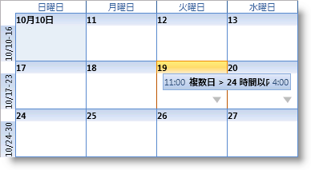

////

|metadata|
{
    "name": "wpf-whats-new-in-2010-volume-3",
    "controlName": [],
    "tags": ["Getting Started","How Do I"],
    "guid": "98707124-2d31-4a5a-a70b-5987aec6f712",  
    "buildFlags": [],
    "createdOn": "2012-01-30T19:39:51.7086949Z"
}
|metadata|
////

= 2010 Volume 3 の新機能

{ProductName} 2010 Volume 3 リリースには、強力な line of business コントロール群が含まれています。

以下のリンクをクリックしてこのリリースで提供されているコントロールおよび機能のリストを確認してください。

* <<dataTree,xamDataTree コントロール>>
* <<schedule,xamSchedule コントロール>>
* <<office2010,Office 2010 Blue テーマ>>

[[dataTree]]

== xamDataTree コントロール

{ProductName} 2010 Volume 3 リリースでは、xamDataTree コントロールが弊社の広範なコントロールのスイートに追加されました。この新しく魅力あるコントロールによって、xamDataTree コントロールを使用して階層的なデータをスムースかつ効率的に表示およびナビゲートできます。xamDataTree コントロールは、ノード テンプレート、ノード ドラッグ アンド ドロップ、bi-state および tri-state のチェックボックスを含む豊かな機能が含まれています。

*関連トピック*

link:xamdatatree-about-xamdatatree.html[xamDataTree について]

link:xamdatatree-adding-xamdatatree-to-your-page.html[xamDataTree をページに追加]

link:xamdatatree-using-xamdatatree.html[xamDataTree の使用]

[[schedule]]

== xamSchedule コントロール

{ProductName} 2010 volume 3 には、新しいスケジューリング コンポーネント スイートを含んでいます。このコンポーネント スイートは、アプリケーションが持つであろうスケジューリング要件に対応するように設計された 3 つの新しいコントロールで構成されています。これらの新しいコントロール、xamDayView、xamScheduleView および xamMonthView は、リソース、カレンダー、アクティビティおよびその他の構成設定を提供する簡単に使用できる xamScheduleDataManager と組み合わせられます。

インフラジスティックスの統合された XAML 戦略の一環として、これらのコントロールは同じ API とオブジェクト モデルを持つ Silverlight および WPF の両コントロールとして提供されます。これにより、いずれかのプラットフォームをターゲットとして構築できる単一のコードセットでスケジューリングアプリケーションを作成することが可能となります。

さらに、xamSchedule スイートには、スケジューリング情報を含む任意のタイプのバックエンド データ ソースにアクセスするための堅牢なデータ コネクターアーキテクチャが含まれています。10.3 では 2 つのコネクターを提供します: スケジューリング データのローカル リストに接続するための ListScheduleDataConnector、およびサーバーのデータにアクセスする必要があるアプリケーションが使用する WcfListScheduleDataConnector です。WcfListScheduleDataConnector は、クライアント側のコネクターとサーバー側のサービスで構成されており、xamSchedule コントロールにデータを提供するために Windows Communication Foundation (WCF) を介して通信します。

*関連トピック*

link:xamschedule-understanding.html[xamSchedule の理解]

link:xamschedule-getting-started.html[xamSchedule を使用した作業の開始]

link:xamschedule-using.html[xamSchedule の使用]

[[office2010]]

== Office 2010 Blue テーマ

{ProductName} 2010 volume 3 リリースでは、Office 2010 テーマでアプリケーションを明るくする機会をご提供します。これで、アプリケーション インターフェイスの Microsoft Office 2010 スイートによって始まった Office 2010 Blue スタイルでコントロールのデフォルトのルック アンド フィールを素早く変更できます。

*関連トピック*

link:themes.html[テーマ]