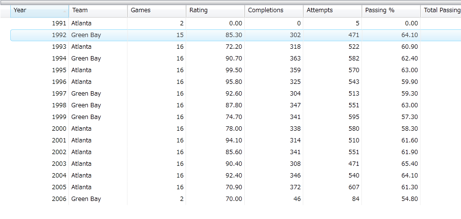
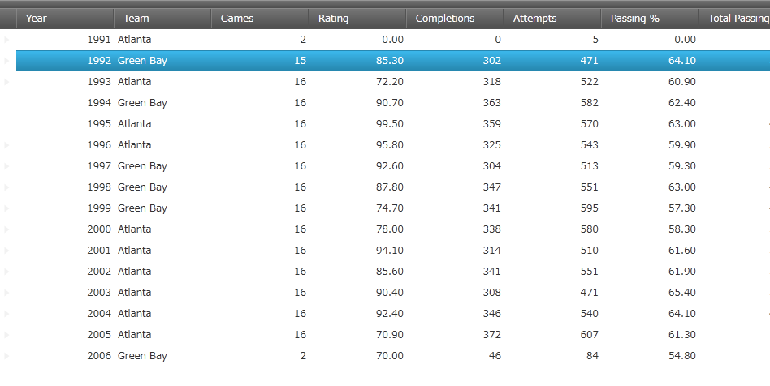
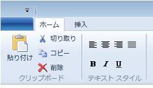
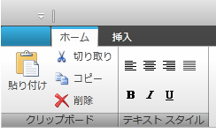
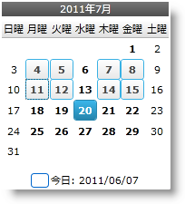
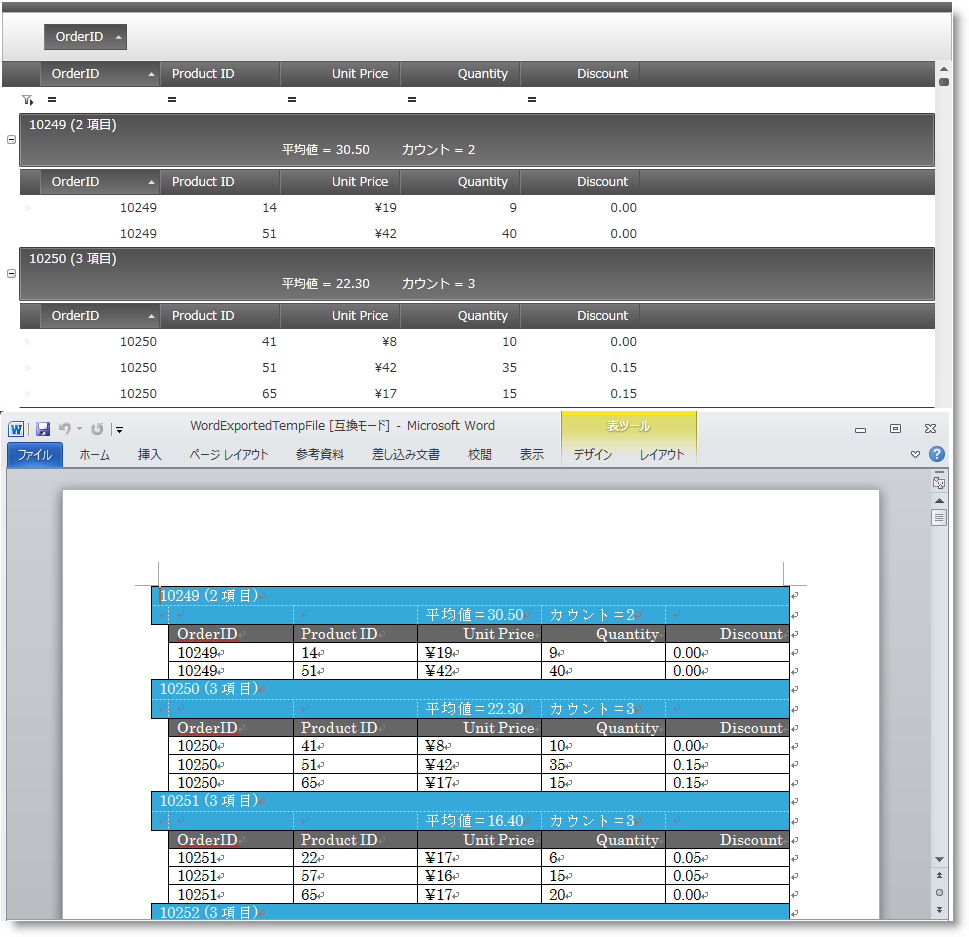
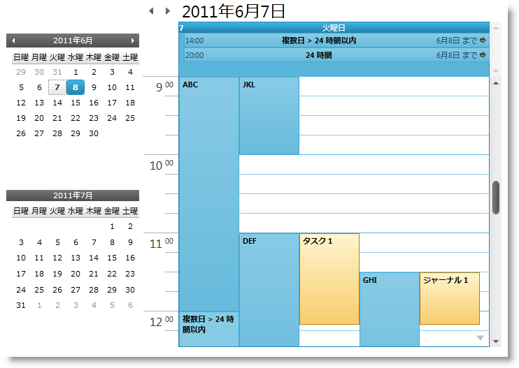
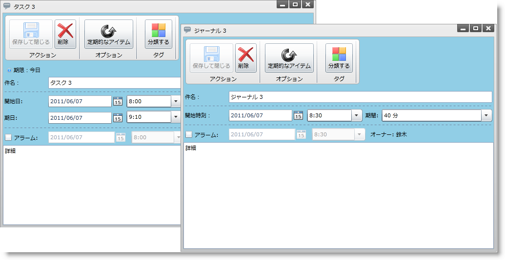

////

|metadata|
{
    "name": "wpf-whats-new-in-2011-volume-1",
    "controlName": [],
    "tags": ["Getting Started","Grids","How Do I","Scheduling","Theming"],
    "guid": "8cb217e5-a316-4fbf-be88-3e51f3e478b7",  
    "buildFlags": [],
    "createdOn": "2012-01-30T19:39:51.7126957Z"
}
|metadata|
////

= 2011 Volume 1 の新機能

{ProductName} 2011 Volume 1 リリースには、強力な line of business コントロール群が含まれています。

以下のリンクをクリックしてこのリリースで提供されている新しいコントロールおよび機能のリストを確認してください。

* <<DragDropFramework,Infragistics Drag And Drop Framework>>
* <<IGTheme,新しい IG テーマ>>
* <<xamCalendar,xamCalendar コントロール>>
* <<xamDataGrid,xamDataGrid の改善>>

** <<xamDataGrid_EE,xamDataGrid 非同期 Excel エクスポート>>
** <<xamDataGrid_WW,xamDataGrid Word ライター>>

* <<xamDockManager,xamDockManager の改善>>

** <<xamDockManager,フローティング ペインの最大化/最小化>>
** <<xamDockManager,所有されるペイン>>

* <<xamSchedule,xamSchedule の改善>>

** <<xamSchedule_Views,xamDateNavigator および xamOutlookCalendarView>>
** <<xamSchedule_AC,アクティビティ カテゴリ>>
** <<xamSchedule_EDC,ExchangeScheduleDataConnector>>
** <<xamSchedule_DLG,タスクおよび履歴を編集するためのダイアログ>>
** <<xamSchedule_RS,カレンダー グループ領域のサイズ変更とスクロール>>

[[DragDropFramework]]

== Infragistics Drag And Drop Framework

{ProductName} 2011 Volume 1 リリースには新しい Drag and Drop Framework が含まれています。このフレームワークはドラッグアンドドロップ機能のアプリケーションへの追加を可能な限り簡単にするために必要なピースを提供します。これによって要素のリアルタイムの移動とよりユーザー フレンドリーな操作が可能になります。

Drag and Drop Framework を利用するにはソース要素とターゲット要素を設定することが必要となります。ソース要素をターゲット要素にドラッグ アンド ドロップできます。場合によっては、これはアプリケーションにドラッグ アンド ドロップを実装するのと同じくらいシンプルです。

image::images/DragDropChart.png[DragDrop]

== *関連トピック*

link:drag-and-drop-framework-about-ig-drag-and-drop-framework.html[Infragistics Drag and Drop Framework について]

link:drag-and-drop-framework-getting-started-with-ig-drag-and-drop-framework.html[Infragistics Drag and Drop Framework を使用した作業の開始]

link:drag-and-drop-framework-using-ig-drag-and-drop-framework.html[Infragistics Drag and Drop Framework の使用]

== IG テーマ

[[IGTheme]]
*新しい IG テーマ*

今回のリリースでは、IG テーマという新しいテーマが採用されました。このテーマは {ProductName} Line of Business のすべてのコントロールに適用できます。このテーマは、黒、白、いくつかのグレーと強調表示とアクセント カラーとして青を使用するモノクロです。

テーマをコントロールに適用する方法については、 link:themes.html[「テーマ」]のトピックを参照してください。

以下の図 は、IG テーマが適用された xamDataGrid コントロールと適用されていない xamDataGrid コントロールを示します。

以下の図 は、IG テーマが適用された xamRibbon コントロールと適用されていない xamRibbon コントロールを示します。

関連トピック

link:themes.html[テーマ]

[[xamCalendar]]

== xamCalendar コントロール

{ProductName} 2011 Volume 1 リリースには新しいクロス プラットフォーム カレンダー コントロールが含まれています。xamCalendar コントロールはさまざまなビュー (Day、Month、Year、Decade および Century)、複数のカレンダー、さらに単一および複数日選択をサポートします。

== *関連トピック*

link:xamcalendar-about.html[xamCalendar について]

link:xamcalendar-restricting-date-selection.html[日付選択制限の実装]

link:xamcalendar-using.html[xamCalendar の使用]

[[xamDataGrid]]

== xamDataGrid の改善

{ProductName} 2011 Volume 1 では、xamDataGrid コントロールにいくつかの改善点がみられます。

[[xamDataGrid_EE]]

== xamDataGrid 非同期 Excel エクスポート

Excel Exporter で、非同期データ エクスポートを使用できるようになりました。

== *関連トピック*
link:xamdatapresenter-export-a-datapresenter-control-to-excel.html[DataPresenter コントロールを Excel にエクスポート]

[[xamDataGrid_WW]]

== xamDataGrid Word ライター

{ProductName} 2011 Volume 1 リリースには、Microsoft® Word フォーマットへの xamDataGrid コンテンツのエクスポートのサポートが追加されました。レコード、列、またはグリッドのその他のビジュアルパーツを除外することでエクスポートされたデータをカスタマイズできます。また、さまざまなスタイル オプションをエクスポートされたデータに使用できます。

== *関連トピック*

link:xamdatapresenter-exporting-data-to-word.html[xamDataPresenter を使用してデータを Word にエクスポート]

link:xamdatapresenter-applying-formats-when-exporting-data.html[データをエクスポートする時にフォーマットを適用]

link:xamdatapresenter-exclude-settings.html[エクスポート時の DataPresenter の Exclude 設定]

link:xamdatapresenter-exporting-to-word-events.html[エクスポート イベントを処理することでエクスポートを管理]

[[xamDockManager]]

== xamDockManager の改善

{ProductName} 2011 Volume 1 では、xamDockManager コントロールに多数の改善が採用されています。フローティング ペインを最小化/最大化できるようになりました。また OS のタスク バーに所有されるペインを表示するかどうかを選択できます。

image::images/xamDockManager_min_max_1.png[]

== *関連トピック*

link:xamdockmanager-min-max.html[フローティング ペインの最大化/最小化]

link:xamdockmanager-owned-panes.html[所有されるペインと所有されないペイン]

link:xamdockmanger-dragging-panes.html[ペイン ドラッグのモード]

[[xamSchedule]]

== xamSchedule の改善

{ProductName} 2011 Volume 1 では、xamSchedule コントロールで使用可能なビューに多数の改善が採用されています。

[[xamSchedule_Views]]

== xamDateNavigator および xamOutlookCalendarView

2 つの新しいビューが使用可能になりました。

xamDateNavigator は xamOutlookCalendarView コントロールと組み合わせてよく使用されますが、DataManager と自動的に連携して、ユーザーが日時を選択できるようになりました。また、スタンドアロンビューとしても使用でき、ツールチップのアクティビティに関する情報を表示するよう構成できます。

xamOutlookCalendarView は、xamDayView、xamScheduleView および xamMonthView を結合したビューで、選択した日の量に基づいて手動または自動で各ビューを切り替えることを可能にします。

== *関連トピック*

link:xamschedule-using-control-confdatenavigator.html[xamDateNavigator の構成]

link:xamschedule-using-control-confoutlookcalendar.html[xamOutlookCalendarView の構成]

[[xamSchedule_AC]]

== アクティビティ カテゴリ

カレンダーに表示されるさまざまなアクティビティのタイプの優れたスタイルを可能にするために (さまざまな色で)、アクティビティ カテゴリが使用可能になりました。

image::images/xamSchedule_Activity_Cat1.png[]

== *関連トピック*

link:xamschedule-using-activities-categories.html[アクティビティ カテゴリ]

[[xamSchedule_EDC]]

== ExchangeScheduleDataConnector

ExchangeScheduleDataConnector は xamSchedule を Exchange Server に接続し、サーバーに格納されたスケジュール データを表示および編集することを可能にします。

== *関連トピック*

link:xamschedule-using-connector-exchange.html[Exchange Data Connector を使用して xamSchedule を Exchange Server に接続]

[[xamSchedule_DLG]]

== タスクおよび履歴を編集するためのダイアログ

xamSchedule は、専用のタスク ダイアログと履歴ダイアログを使用したタスクと履歴の編集をサポートします。

== *関連トピック*

link:xamschedule-using-activitydialogs.html[アクティビティ ダイアログ]

[[xamSchedule_RS]]

== カレンダー グループ領域のサイズ変更とスクロール

xamSchedule ビューはカレンダー グループ領域のサイズ変更とスクロールをサポートするようになりました。また複数日アクティビティ領域のサイズ変更をサポートする xamDayView が追加されました。

image::images/xamSchedule_dayView-resizing-groups-1.png[]

image::images/xamSchedule_dayView-resizing-area-1.png[]

== *関連トピック*

link:xamschedule-using-control-confday.html[xamDayView の構成]

link:xamschedule-using-control-confschedule.html[xamScheduleView の構成]

link:xamschedule-using-control-confmonth.html[xamMonthView の構成]