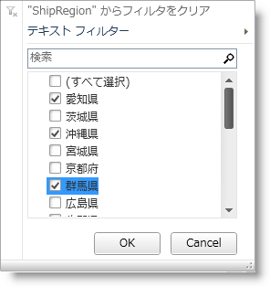
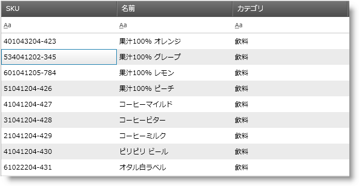
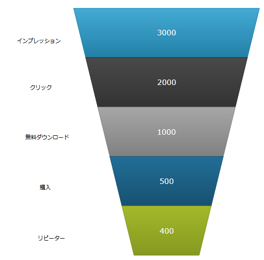
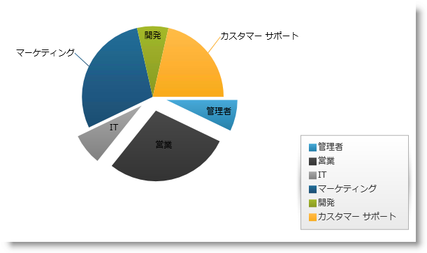
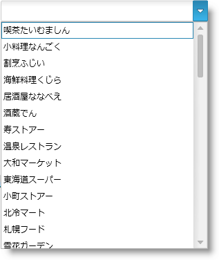
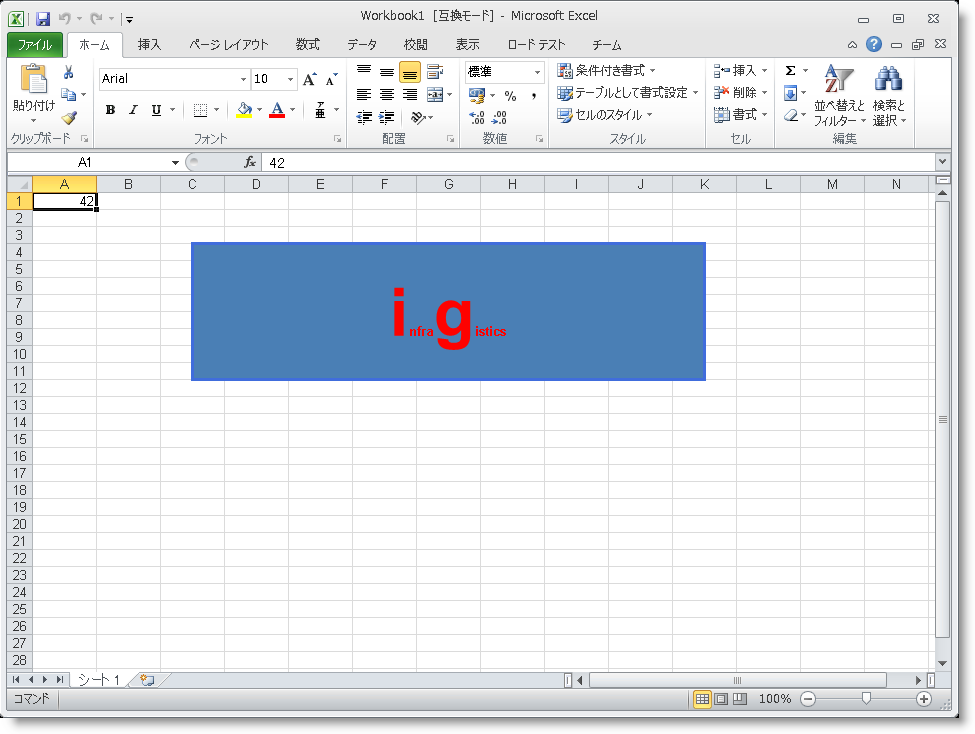

////
|metadata|
{
    "name": "wpf-whats-new-in-2011-volume-2",
    "controlName": [],
    "tags": [],
    "guid": "c33ad9d2-a279-4e80-8afc-ccc25955a670",
    "buildFlags": [],
    "createdOn": "2012-01-30T19:39:51.7176967Z"
}
|metadata|
////

= 2011 Volume 2 の新機能

== トピックの概要

== 目的

このトピックでは、{ProductName} 2011 Volume 2 リリースで導入された新しい機能とコンポーネントの概要について説明します。

== 本トピックの内容

このドキュメントには次のセクションが含まれています:

*新機能とコンポーネント*

** <<ExcelStyleFiltering,DataPresenter ExcelStyle フィルタリング>>
** <<xamCalculationManagerxamDataGrid,xamCalculationManager の xamDataGrid との使用>>
** <<xamGrid,xamGrid>>
** <<xamInputs,xamInputs™>>

*** <<xamMaskedInput,xamMaskedInput>>
*** <<xamCurrencyInput,xamCurrencyInput>>
*** <<xamNumericInput,xamNumericInput>>
*** <<xamDateTimeInput,xamDateTimeInput>>

** <<xamCalculationManager,xamCalculationManager>>
** <<xamFormulaEditor,xamFormulaEditor>>
** <<xamDataChart,xamDataChart>>
** <<xamFunnelChart,xamFunnelChart>>
** <<xamPieChart,xamPieChart>>
** <<xamTileManager,xamTileManager>>
** <<xamComboEditor,xamComboEditor>>
** <<xamMultiCCE,xamMultiColumnComboEditor>>
** <<ResourceWasher,リソース ウォッシャー>>
** <<PersistenceFW,Infragistics Persistence Framework™>>
** <<IGMath,Infragistics Math Library™>>
** <<InfragisticsMathCalculators,Infragistics 数学計算式™>>
** <<IGWord,Infragistics Word ライブラリ>>
** <<dataGrid,xamDataGrid™ で条件付きの書式設定>>
** <<ValueEditors,xamNumericEditor™ および xamCurrencyEditor™ - TrimFractionalZeros サポート>>
** <<excelShapes,Infragistics Excel Engine でサポートされる図形>>

== 関連トピック
=== 新機能とコンポーネント

以下の表では、新機能とコンポーネントを簡単に説明されています。

[options="header", cols="a,a"]
|====
|機能/ コンポーネント|説明

|DataPresenter ExcelStyle フィルタリング
|XamDataGrid コントロールの使いやすいフィルタリング。

|xamCalculationManager の xamDataGrid (CTP) との使用
|xamCalculationManager コントロールを xamDataGrid コントロールと統合します。

|xamGrid
|xamGrid は、ページング、フィルタリング、編集、階層データなどをサポートする何千ものレコードを視覚化するための、高性能なクロスプラットフォームのコントロールです。

|xamInputs™
|マスクされたデータ編集のためのクロス プラットフォーム コントロール。 

* xamMaskedInput 

* xamCurrencyInput 

* xamNumericInput 

* xamDateTimeInput 

|xamCalculationManager
|xamCalculationManager コントロールは、計算を動的に実行できる高度な式数を作成することが可能なクロス プラットフォーム コントロールです。

|xamFormulaEditor
|オートコンプリートおよびコンテキスト ヘルプを伴う数式表現を編集するためのクロス プラットフォーム コントロールです。

|xamDataChart
|xamDataChart は次世代の、高性能なクロスプラットフォームのチャート コントロールです。

|xamFunnelChart
|ファンネルチャートは、セクション単位で上から下へデータを表示します。各セクションは、大きな値から小さな値へスライスとしてデータを表します。

|xamPieChart
|このコントロールによって、他とはっきりと区別できるデータ カテゴリを表すスライスに円チャートを分割することができます

|xamTileManager
|xamTileManager はクロスプラットフォームのコントロールで、矩形のタイルを複数行に配置して中身を表示します。

|xamComboEditor
|xamComboEditor はクロス プラットフォーム コントロールで、項目のためのドロップダウン コンテナーとユーザー入力のための値表示という 2 つのメイン エントリを含みます。

|xamMultiColumnComboEditor
|xamMultiColumnComboEditor はクロスプラットフォームのグリッド状コントロールであり、コントロールの ItemsSource プロパティ上のエンティティ オブジェクト コレクション セット上の各プロパティについて列を自動生成します。

|Resource Washer
|リソース ウォッシャーを使用して、アプリケーション内のコントロールの色を変更 (ウォッシュ) できます。

|Persistence Framework™
|Persistence Framework を使用すると、エンドユーザー セッション全体でコントロールのプロパティ値を簡単に保持およびロードできます。

|Infragistics Math Library™
|Infragistics Math ライブラリを使用して、広範囲にわたり正確で目盛効率良く算術演算を実行できます。

|Infragistics Word ライブラリ
|Infragistics Word ライブラリを使用して、Microsoft® Word 文書を作成できます。

|xamDataGrid™ のセル値の変更に関して再評価された CellValuePesenterStyleSelector
|xamDataGrid コントロールでセルの値を変更する際、様々なスタイルを適用することができます。

|xamNumericEditor™ および xamCurrencyEditor™ - TrimFractionalZeros サポート
|xamNumericEditor™ および xamCurrencyEditor™ コントロールの両方で、自動的に追加される分数のゼロを抑制できます。

|Infragistics Excel Engine でサポートされる形状
|Infragistics Excel Engine を使用して、異なるタイプの形状 (四角形、線形、など) を操作できます。

|====

[[ExcelStyleFiltering]]
==== DataPresenter ExcelStyle フィルタリング

{ProductName} 2011 Volume 2 リリースには、新しい ExcelStyle フィルタリングが含まれています。このフィルターによって、XamDataGrid コントロールでのフィルタリングがより簡単になります。

*関連するトピック:*

* link:xamdatapresenter-enable-record-filtering.html[レコード フィルタリングを有効にする]
* link:xamdatagrid-record-filtering.html[ExcelStyle レコード フィルタリングを有効にする]

[[xamCalculationManagerxamDataGrid]]
==== xamCalculationManager の xamDataGrid との使用

xamCalculationManager コントロールを xamDataGrid コントロールと組み合わせて使用して、フィールドの値をソースおよびターゲットとして使用して計算を実行できます。

image::images/xamCalculationManager_Using_with_xamDataGrid.png[]

*関連するトピック:*

* link:xamcalculationmanager-using-xamcalculationmanager-with-xamdatagrid.html[xamCalculationManager の xamDataGrid との使用] 

[[xamGrid]]
==== xamGrid

xamGrid はクロスプラットフォームのコントロールで、データおよび UI の視覚化のパフォーマンスが向上します。グリッドは何千ものレコードを含むことができ、エンド ユーザーは性能面での問題に直面することはありません。

以下のリストには、xamGrid コントロールの機能の一部が挙げられています。

*高パフォーマンス* - データおよび UI の仮想化によって xamGrid は非常に軽量かつ高速で、大量のデータを処理することができます。

*階層データ* - マスター/詳細データの関係、および各レベルの様々な列レイアウトを使用して、複雑な階層データを表示することができます。

*編集可能 -* xamGrid コントロールによって、インライン編集、新しい行の追加、イベントの作成、読み取り、更新および削除操作が可能になります。

*柔軟な列* - エンドユーザーは列の固定、移動、サイズ変更、ソートができます。

*ページング* - この機能はデータをベージに分割するため、ロード時間を短縮してパフォーマンスを向上します。

*フィルタリング* - この機能によって、エンドユーザーはより管理しやすい方法でデータのサブセットを表示できます。

*テンプレート* - アプリケーション全体で整合性の取れたルック アンド フィールを保持できるように xamGrid のスタイルを設定できます。

*関連するトピック:*

* link:xamgrid-about-xamgrid.html[xamGrid について]
* link:xamgrid-adding-xamgrid-to-your-page.html[xamGrid をページに追加]
* link:xamgrid-using-xamgrid.html[xamGrid の使用]

[[xamInputs]]
==== xamInputs

xamInputs グループのコントロールは、データ入力中にユーザーに指示を与えるために使用され、また入力されたデータがあらかじめ定義された基準のいくつかを満たすかどうかを確認する機会を提供します。このコントロールは意図的にプラットフォーム間で共通にしているため、これらのコントロールを Silverlight または WPF で置き替えることができるように使用できます。入力コントロールは、スタンドアロンのテキスト ボックスとして使用したり、他のコントロールと組み合わせて使用することができます (たとえば、xamGrid コントロールのセルとして)。*関連するトピック:*

* link:xaminputs-about.html[xamInputs について]
* link:xaminputs-masks.html[マスク]

[[xamMaskedInput]]
==== xamMaskedInput

{ProductName} 2011 Volume 2 で開始すると、新しい xamMaskedInput コントロールが手に入ります。xamMaskedInput コントロールによって、ユーザーの入力を制限したり、導く支援をするように入力マスクを指定することができます。入力マスクにリテラル文字、入力フラグまたはプロンプト文字を定義できます。リテラル文字は入力の部分を分離または区別し (日付フィールドのスラッシュなど)、入力フラグはエンドユーザーが入力できる文字タイプを制限します。そしてプロンプト文字はデータを入力できるプレースホルダーを示します。

入力フラグを使用して必須またはオプションの文字を指定し、すべての必要となるデータが入力されたかどうかを確認するためにチェックできます。さらに、xamMaskedInput によって、エンドユーザーによって入力された raw 入力やリテラル文字やプロンプト文字を含む入力を取得できます。

また、xamMaskedInput コントロールは、無効な値が入力された時にエラー メッセージを表示したり元の値に戻すなどのコントロールの動作を指定することができます。

image::images/xamInputs_xamMaskedInput_About.png[]

*関連するトピック:*

* link:xammaskedinput-about.html[xamMaskedInput について]
* link:xammaskedinput-using.html[xamMaskedInput の使用]

[[xamCurrencyInput]]
==== xamCurrencyInput

{ProductName} 2011 Volume 2 で開始すると、新しい xamCurrencyInput コントロールが手に入ります。xamCurrencyInput コントロールは、数値を通貨タイプとして表示するためにマスクを使用するシンプルなテキストボックスコントロールです。このマスクを使用して、所定のカルチャの通貨記号を値の前に追加することができます。余りがなくても、小数点第 2 位まで値の小数部分がそのまま残ることを保証することも可能です。

image::images/xamInputs_xamCurrencyInput_About.png[]

*関連するトピック:*

* link:xamcurrencyinput-about.html[xamCurrencyInput について]
* link:xamcurrencyinput-using.html[xamCurrencyInput の使用]

[[xamNumericInput]]
==== xamNumericInput

xamNumericInput™ コントロールは、ユーザーの数値入力を支援するためにマスクを使用する、シンプルなテキスト ボックス コントロールです。マスクを使って、事前定義された有効な数値形式に対するユーザー入力を制限することができます。

image::images/xamInputs_xamNumericInput_About.png[]

*関連するトピック:*

* link:xamnumericinput-about.html[xamNumericInput について]
* link:xamnumericinput-using.html[xamNumericInput の使用]

[[xamDateTimeInput]]
==== xamDateTimeInput

{ProductName} 2011 Volume 2 が新たにリリースされると、xamDateTimeInput コントロールが手に入ります。xamDateTimeInput コントロールはシンプルなテキストボックスコントロールで、マスクを使用して、エンドユーザーが正しいフォーマットで日付/時刻の値を入力する支援します。このマスクを使用して、ユーザーの入力を、事前に決定した有効な日付と時刻の形式に制限することができます。このコントロールはカレンダードロップダウンも提供し、そこから日付を選択することができます。

image::images/xamInputs_xamDateTimeInput_About.png[]

*関連するトピック:*

* link:xamdatetimeinput-about.html[xamDateTimeInput について]
* link:xamdatetimeinput-using.html[xamDateTimeInput の使用]

[[xamCalculationManager]]
==== xamCalculationManager

xamCalculationManager コントロールでは、計算を動的に実行できる高度な式数を作成することが可能です。これらの数式のソースおよびターゲットは、項目計算の任意のオブジェクトの任意のパブリック プロパティになることができます。項目リストを使用する数式は、Sum と Average の例における集計関数を実行するために作成することもできます。

image::images/xamCalculationManager_About_01.png[]

*関連するトピック:*

* link:xamcalculationmanager.html[xamCalculationManager]
* link:xamcalculationmanager-getting-started-with-xamcalculationmanager.html[xamCalculationManager を使用した作業の開始]
* link:xamcalculationmanager-overview-of-named-references.html[名前付き参照の概要]

[[xamFormulaEditor]]
==== xamFormulaEditor

xamFormulaEditor コントロールは、xamCalculationManager で管理される数式のエディターとして機能します。ユーザーの数式編集を支援するオートコンプリートおよびコンテキスト ヘルプを提供します。また、ユーザーがオペランドおよび数式を検索できる FormulaEditorDialog も提供します。

image::images/xamFormulaEditor_About_1.png[]

*関連するトピック:*

* link:xamformulaeditor-about.html[xamFormulaEditor について]
* link:xamformulaeditor-contextualhelp.html[コンテクストのヘルプ]
* link:xamformulaeditor-using.html[xamCalculationManager での xamFormulaEditor および FormulaEditorDialog の使用]

[[xamDataChart]]
==== xamDataChart

xamDataChart™ コントロールは、ミリ秒で数多くのデータポイントのライブフィードを処理できる次世代の高性能コンポーネントです。これは単一のチャートプロット領域で複数のシリーズのオーバーレイを簡単に実行するためにも設計されているので、ユーザーは統計的および技術的なインジケーターを追加して簡単に解析することができます。xamDataChart コントロールは、Google® および Yahoo!® のファイナンス Web サイトと同様の財務的な機能を提供します。これは、各種のチャート、およびチャート アプリケーションの作成や既存データまたは情報化アプリケーションにチャート機能の追加を行うためのフレームワークを提供します。

image::images/xamDataChart_Whats_New_xamDataChart_01.png[]

*関連するトピック:*

* link:datachart-series-types.html[シリーズ タイプ]
* link:datachart-financial-indicators-overview.html[財務指標]
* link:datachart-multiple-axes.html[複数軸]
* link:datachart-multiple-legends.html[複数凡例]
* link:datachart-multiple-series.html[複数シリーズ]
* link:datachart-chart-navigation.html[チャート ナビゲーション]
* link:datachart-chart-synchronization.html[チャートの同期]

[[xamFunnelChart]]
==== xamFunnelChart

ファンネル チャートによりファンネル図形が表示されます。上限値と下限値によるスライスでデータを表現するトップダウン構成の複数セクションを表示します。

*関連するトピック:*

* link:funnelchart.html[xamFunnelChart]
* link:funnelchart-getting-started-with-funnelchart.html[xamFunnelChart を使用した作業の開始]
* link:funnelchart-data-binding.html[データ バインディング]

[[xamPieChart]]
==== xamPieChart

今回のリリースには、xamPieChart™ と呼ばれるデータ チャート アセンブリの新しい特殊なコントロールが採用されています。このコントロールによって、他とはっきりと区別できるデータ カテゴリを表すスライスに円チャートを分割することができます(下の図 1 を参照)。円チャートコントロールは、スライス選択および展開、また値しきい値より下のカテゴリのための「その他」のスライスをサポートしています。

*関連するトピック:*

* link:piechart.html[xamPieChart]
* link:piechart-getting-started-with-piechart.html[xamPieChart を使用した作業の開始]
* link:piechart-data-binding.html[データ バインディング]

[[xamTileManager]]
==== xamTileManager

xamTileManager は新しいクロスプラットフォームのコントロールで、矩形のタイルを使用してコンテンツを表示します。これらは複数行のタイルとなって連続して配列されます。エンド ユーザーは 1 つ以上のタイルを最大化できます。これによって残りのタイルは自動的に最小化されます。ただし、最小化されたタイルはコントロールの端に沿って今まで通りに表示されるので、エンドユーザーは素早く最大化して、ユーザーの注意を新しいコンテンツに移すことができます。

image::images/xamTileManager_About_01.png[]

*関連するトピック:*

* link:xamtilemanager-about-xamtilemanager.html[xamTileManager について]
* link:xamtilemanager-adding-xamtilemanager-to-your-application.html[xamTileManager をアプリケーションに追加]
* link:xamtilemanager-using-xamtilemanager.html[xamTileManager の使用]

[[xamComboEditor]]
==== xamComboEditor

xamComboEditor™ は新しいクロス プラットフォーム コントロールで、項目のリストをコントロールにバインドできます。これはフラットなデータ バインドされたコントロールで、項目のためのドロップダウン コンテナーとユーザー入力のための値表示という 2 つのメイン エントリを含みます。

xamComboEditor の主な機能は以下の通りです。

* 仮想化: xamComboEditor は非常に素早く多数の項目を表示できます。
* 値入力フィールドに直接書き込んで、xamComboEditor コントロール項目として入力を追加できます。
* ご使用のアプリケーション ロジックに従って、xamComboEditor の動作をカスタマイズできます。これは読み取り専用のコンボ ボックスとして、または Google スタイルの Type Ahead コントロールとして使用できます。
* Selectable モードと Editable モードの 2 つのプライマリ モードがあります。
* xamComboEditor の視覚的な Style 項目だけでなくその項目も簡単にカスタマイズできます。

*関連するトピック:*

* link:wpf-xamcomboeditor-about-xamcomboeditor.html[xamComboEditor について]
* link:xamcomboeditor-adding-xamcomboeditor-to-your-page.html[xamComboEditor をアプリケーションに追加]
* link:wpf-xamcomboeditor-using-xamcomboeditor.html[xamComboEditor の使用]

[[xamMultiCCE]]
==== xamMultiColumnComboEditor

xamMultiColumnComboEditor コントロールはグリッドのように機能します。コントロールの ItemsSource プロパティに設定された IEnumerable に含まれるデータ オブジェクトのすべてのプロパティの列を自動的に生成することができます。コントロールの AutoGenerateColumns プロパティ (デフォルトは true) は、この動作を制御します。

image::images/xamMultiCCE_About_1.png[]

*関連するトピック:*

* link:xammulticce-about.html[xamMultiColumnComboEditor について]

[[ResourceWasher]]
==== リソース ウォッシャー

リソース ウォッシングを使用して、既存の ResourceDictionary 内のリソースのグループ (WashGroups) に色 (WashColor) を設定し、アプリケーションのコントロールの色を更新できます。

*関連するトピック:*

* link:reswash-about.html[リソース ウォッシャーについて]

[[PersistenceFW]]
==== Infragistics Control Persistence Framework

{ProductName} 2011 volume 2 では、新しい Infragistics Control Persistence Framework を導入しました。Control Persistence Framework を使用すると、エンドユーザーセッション全体でコントロールのプロパティ値を簡単に保持およびロードできます。フレームワークは任意のコントロールの状態の保持およびロードをサポートします。

設定を保持およびロードするために使用できるストレージ メディアがいくつかあります。

* 独立したストレージ
* データベース

Control Persistence Framework によって、コントロールのプロパティ設定をすべて保存できます。または保持されるプロパティのサブセットを選択することができます。またさらなる制御とカスタマイズを処理できるいくつかのイベントとともに保存およびロードプロセスの調整を制御することもできます。

*関連するトピック:*

* link:persistence-about-ig-control-persistence-framework.html[Infragistics Control Persistence Framework について]
* link:persistenceframework-getting-started-with-infragistics-control-persistence-framework.html[Infragistics Control Persistence Framework を使用した作業の開始]
* link:persistence-using-ig-control-persistence-framework.html[Infragistics Control Persistence Framework の使用]

[[IGMath]]
==== Infragistics Math Library™

Math ライブラリは、広範囲におよぶ数学演算を簡単に実行できる一連のコア関数を提供します。数学演算は高速かつ正確で、効率的にメモリを使用します。データ構造を複数の形式に変換することなく、数学演算を実行するアプリケーションを作成できます。数値法の採用、コンパートメントモデルの構築、モンテカルロシミュレーションの実行、回帰問題の解決を行います。

*関連するトピック:*

* link:ig-math-infragistics.html[Infragistics Math Library]
* link:ig-math-mathematical-functions.html[数学関数]
* link:ig-math-matrices.html[行列]
* link:ig-math-vectors.html[ベクトル]

==== Infragistics 数学計算式™

link:{ApiPlatform}math.calculators{ApiVersion}~infragistics.math.calculators_namespace.html[Infragistics 数学計算式] は、さまざまな計算のためにすべての Infragistics 製品と使用できる数学および統計的な計算用のライブラリです。

image::images/Whats_New_In_2011_Volume_2_IG_Math_Calculators_01.png[]

図 1 - バリアンスと平均を計算する式

Infragistics 数学計算式は xamDataChart コントロールの値オーバーレイと誤差範囲を計算するために必要です。このライブラリについての詳細は link:ig-math-calculators.html[Infragistics 数学計算式] トピックを参照してください。それらは次のタイプの計算にカテゴリ分けされます。

[options="header", cols="a,a"]
|====
|計算式タイプ|説明

|値計算式
|単一の値を計算する Infragistics 数学計算式グループを表します。値計算式を xamDataChart コントロールと統合する方法の例については、 link:datachart-series-value-overlay.html[値オーバーレイ]および link:datachart-series-data-correlation.html[シリーズ データの相関]のトピックを参照してください。 

* link:ig-calculators-correlation-calculator.html[Infragistics 相関計算式] 

* link:ig-calculators-mean-calculator.html[Infragistics 平均計算式] 

* link:ig-calculators-median-calculator.html[Infragistics 中央値計算式] 

* link:ig-calculators-standard-deviation-calculator.html[Infragistics 標準偏差計算式] 

* link:ig-calculators-standard-error-calculator.html[Infragistics 標準誤差計算式] 

* link:ig-calculators-variance-calculator.html[Infragistics バリアンス計算式] 

|誤差範囲の計算式
|xamDataChart コントロールにおけるシリーズ オブジェクトの誤差範囲の長さを計算する Infragistics 数学計算式のグループを表します。誤差範囲計算式を xamDataChart コントロールと統合する方法の例については、「 link:datachart-series-error-bars.html[シリーズ誤差範囲]」トピックを参照してください。 

* link:ig-calculators-data-calculator.html[Infragistics データ計算式] 

* link:ig-calculators-fixed-value-calculator.html[Infragistics 固定値計算式] 

* link:ig-calculators-percentage-calculator.html[Infragistics パーセンテージ計算式] 

* link:ig-calculators-standard-deviation-calculator.html[Infragistics 標準偏差計算式] 

* link:ig-calculators-standard-error-calculator.html[Infragistics 標準誤差計算式] 

|====

==== Infragistics Word ライブラリ

今回の {ProductName} 2011 Volume 2 のリリースでは、新しい Infragistics® Word® ライブラリが採用されました。Word ライブラリによって、フォワードのみのストリーマー を使用して Microsoft® Word 文書を作成できます。

*関連するトピック:*

* link:word-about-ig-word-library.html[Infragistics Word ライブラリについて]

[[dataGrid]]
==== xamDataGrid で条件付きの書式設定

xamDataGrid コントロールでセルの値を変更する際、様々なスタイルを適用することができます。CellValuePesenterStyleSelector は FieldSettings で任意のレベルを指定することができます。

*関連するトピック:*

* link:xamdatagrid-cellvaluepesenterstyleselector-reevaluated.html[条件付きの書式設定]

[[ValueEditors]]
==== xamNumericEditor および xamCurrencyEditor - TrimFractionalZeros サポート

新しい TrimFractionalZeros プロパティを使用して、ValueEditor コントロールの視覚的表現に対してこれまで以上に制御できます。これを true に設定することで、自動的に追加される分数のゼロを抑制できます。

* xamNumericEditor および xamCurrencyEditor - TrimFractionalZeros サポート

[[excelShapes]]
==== Infragistics Excel Engineでサポートされる形状

link:excelengine-about-infragistics-excel-engine.html[Infragistics Excel Engine] を使用して、異なるタイプの形状 (四角形、線形、など) を操作できます。

図 1 - Infragistics Excel Engine を使用して作成される四角形

以下は、Excel シートで追加または変更できる可能性のあるすべての形状です。」

[options="header", cols="a,a"]
|====
|形式|外観

|線
|image::images/ExcelShaped_Line.png[]

|直線コネクタ
|image::images/ExcelShaped_StraightConnector.png[]

|ひし形
|image::images/ExcelShaped_Diamod.png[]

|楕円 (長円形)
|image::images/ExcelShaped_Ellipse.png[]

|ハート
|image::images/ExcelShaped_Hearth.png[]

|爆発 1
|image::images/ExcelShaped_IrregularStar1.png[]

|爆発 2
|image::images/ExcelShaped_IrregularStar2.png[]

|稲妻
|image::images/ExcelShaped_LightningBolt.png[]

|五角形
|image::images/ExcelShaped_Pentagon.png[]

|矩形
|image::images/ExcelShaped_Rectangle.png[]

|直角三角形
|image::images/ExcelShaped_RightTriangle.png[]

|====

*関連するトピック:*

* link:excelengine-adding-a-shape-to-an-excel-worksheet.html[形状を Excel ワークシートに追加]
* link:excelengine-customizing-excel-shapes.html[Excel の形状のカスタマイズ]
* link:excelengine-grouping-excel-shapes.html[Excel の形状のグループ化]
* link:excelengine-importing-shapes-from-excel.html[Excel から形状をインポート]

== 関連トピック

以下は、その他の役立つトピックです。

* link:wpf-revision-history.html[改訂履歴]