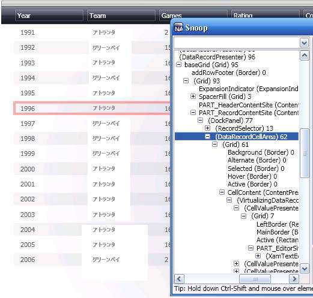
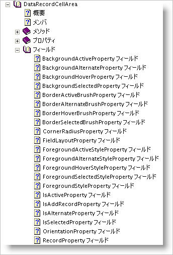

////

|metadata|
{
    "name": "wpf-working-with-xamdatagrid-xamdatacarousel-and-xamdatapresenter-styling-points",
    "controlName": [],
    "tags": ["Styling","Templating"],
    "guid": "177b5997-747c-41f5-9b33-ddc50c271f3b",  
    "buildFlags": ["wpf"],
    "createdOn": "2012-01-30T20:19:02.5380964Z"
}
|metadata|
////

= xamDataGrid、xamDataCarousel および xamDataPresenter のスタイリング ポイント

xamDataGrid、xamDataCarousel、xamDataCards および xamDataPresenter は、ルック アンド フィールを十分にカスタマイズすることを可能にする多数のスタイリング ポイントを公開します。これらのスタイリング ポイントは、より大きいコントロールを形成するために一緒に使用される唯の小さいコントロールです。これらは実際的なコントロールであるため、{ProductName} コントロールと同じようにターゲットおよびスタイルすることができます。要求の少ないスタイリングのシナリオでは、シンプルなブラシまたはフォントの設定で希望の外観を達成できます。高度なシナリオでは、これらのコントロールの ControlTemplate 全体を置き換えたりカスタマイズすることができます。

スタイリング作業を開始する前に、スタイルでターゲットとするコントロールを認識する必要があります。ランタイムに大きいコントロールによって小さいコントロールがどのように使用されるのかを理解することが重要です。構成図 (このトピックの最後にある)

== 関連トピック
関連トピック セクションのリンクは、個々のコントロールがどのようにネストされ連携するのかを示します。

無料で使用可能な SourceForge® Snoop (link:http://blois.us/Snoop[http://blois.us/Snoop]) を使用することによって、コントロールがどのように連携するのかをより適切に理解することができます。このツールによって、実行中の Windows® Presentation Foundation アプリケーションに関連付けてアプリケーションの VisualTree を表示できます。Snoop を使用すると、希望する外観を達成するためにターゲットとする必要があるコントロールを素早く学習できます。手始めに単一のコントロール (つまり link:{ApiPlatform}datapresenter{ApiVersion}~infragistics.windows.datapresenter.datarecordcellarea.html[DataRecordCellArea]) のスタイリングを見てみましょう。プロセスをいったん理解したら、その他のコントロールを識別してスタイルする準備は完了です。スタイリング ポイントの完全なリストについては、 link:{ApiPlatform}datapresenter{ApiVersion}~infragistics.windows.datapresenter.datapresenterbase.html[「DataPresenterBase」]を参照してください。

== ネストされたコントロールのスタイリング

この詳細なガイドでは、グリッドで隔行の背景色を変更します。この詳細なガイドは、隔行の背景色の描画を実行するコントロールを識別する方法を示します。どのプロパティをコントロールで設定する必要があるのかを識別する方法を次に学習します。

[start=1]
. *ターゲット コントロールを識別します。*

構成図と Snoop の両方を使用すると、DataRecordCellArea としてスタイルする必要があるコントロールを識別できます。

[start=2]
. *スタイリング プロパティを識別します。*

どのコントロールをスタイルするかが分かったら、その外観に影響を与えるために設定可能なプロパティを決定する必要があります。link:api-reference-guide.html[API 参照ガイド]を使用して、DataRecordCellArea を指定して Properties セクションを展開します。

"Background" という名前で始まるプロパティは 4 つあります。BackgroundActive、BackgroundAlternate、BackgroundHover、および BackgroundSelected です。同様に、同じ状態に対して定義されている BorderBrush プロパティがあります。BorderActiveBrush、BorderAlternateBrush、BorderHoverBrush、および BorderSelectedBrush です。

[NOTE]
====
*注:* ここに表示されるプロパティは、このコントロールに追加されたカスタム プロパティのみです。Background や BorderBrush などの継承プロパティはこのリストには表示されません。
====

[start=3]
. *デフォルトのスタイルを作成します。*

設定可能なブラシ プロパティを識別したら、DataRecordCellArea をターゲットとするスタイルを作成する番です。このスタイルは、ターゲットとするコントロールの範囲内にある任意の ResourceDictionary に追加できます。このスタイルにキーが指定されていないため、その範囲内のすべての DataRecordCellArea コントロールは、隔行の背景色に Red (#FF0000) を使用します。

*XAML の場合:*

----

----

[start=4]
. *キーを指定したスタイルを作成します。*

デフォルトですべての DataRecordCellAreas に使用されないキーを指定したスタイルも作成できます。

*XAML の場合:*

----

----

このスタイルを適用するには、 link:{ApiPlatform}datapresenter{ApiVersion}~infragistics.windows.datapresenter.fieldlayoutsettings.html[FieldLayoutSettings] の DataRecordCellAreaStyle プロパティに割り当てる必要があります。

*XAML の場合:*

----
<igDP:XamDataGrid x:Key="myGrid">
        <igDP:XamDataGrid.FieldLayoutSettings>
                <igDP:FieldLayoutSettings DataRecordCellAreaStyle="{StaticResource customCellArea}" />
        </igDP:XamDataGrid.FieldLayoutSettings>
</igDP:XamDataGrid>
----

== 掘り下げて見る:カスタムの ControlTemplates

多くの場合、カスタムのブラシまたはその他のプロパティ値 (BorderThickness や FontFamily など) を指定することで、スタイリングのニーズに対応します。追加のアートワークを追加したい、またはコントロールの基本的なレイアウトを変更したい場合には、コントロールのテンプレートをカスタマイズする必要があります。

[NOTE]
====
*注:* ControlTemplates の説明と Windows® Presentation Foundation の機能および役割は、このトピックの範囲に含まれません。
====

テンプレートの編集を実行するには、Microsoft® Expression® Blend などのツールを使用するのが最善です。Expression Blend で {ProductName} のテンプレートを編集する時には、{InstallPath}\DefaultStyles というフォルダーに配置されているデフォルトのコントロール テンプレートのコピーから常に開始することを推奨します。Expression Blend は、コントロールからデフォルトのテンプレートを生成できますが、100% の精度でテンプレートを取得するためにこのツールに依存できません。Expression Blend は、まさにこの理由でシステム コントロール用のデフォルトの XAML のコピーを出荷します。TemplateBinding、Triggers、および ContentPresenters すべてが正しく動作することを保証するために作業中のテンプレートから開始することが重要です。

== 推奨する手順

オリジナルのコピーから常に開始できるようにアプリケーションで使用するためにデフォルトのスタイル ({InstallPath}\DefaultStyles) のコピーを作成する必要があります。

*デフォルトのスタイルのコピーを作成するには、次の手順に従ってください。*

[start=1]
. プロジェクト ディレクトリで「resources」フォルダーを作成し、デフォルトの XAML ファイルをそのフォルダーにコピーします。
[start=2]
. Microsoft Visual Studio® または Expression Blend のいずれかでプロジェクトにファイルを追加します。
[start=3]
. ドキュメントの希望の範囲で MergedDictionary 参照を新しい ResourceDictionaries に追加します。

*XAML の場合:*

----
<Window.Resources>
        <ResourceDictionary>
                <ResourceDictionary.MergedDictionaries>
                        <ResourceDictionary Source="resources/DataPresenterGeneric.xaml"/>              
                </ResourceDictionary.MergedDictionaries>
        </ResourceDictionary>
</Window.Resources>
----

[start=4]
. 選択のエディターを使用してテンプレートをカスタマイズします。

== さらに詳しく:デフォルトの ResourceDictionary の作業

デフォルトの ResourceDictionaries は、Brush リソース、Express エディション リソース、Full バージョン リソースの 3 つの主要なグループに分割することができます。3 つのグループ セット(InfragisticsWPF4、InfragisticsWPF4.Controls.Editors および InfragisticsWPF4.DataPresenter)は、それぞれ以下の特定のアセンブリをターゲットとします。

* DataPresenterGeneric_Brushes.xaml
* DataPresenterGeneric_Express.xaml
* DataPresenterGeneric.xaml

スタイルの各セットによって使用される主要なブラシは、`_Brushes.xaml` ファイルで定義されます。これらのファイルに存在するリソースを編集することによって、コントロールのルック アンド フィールを素早く変えることができます。

[NOTE]
====
*注:* `_Brushes` ファイルを含めるだけでは視覚的な変更を行うことはできません。スタイル ファイルはブラシ ファイルを参照して StaticResources として適用します。`_Express` ファイルには Express アセンブリと Full アセンブリ両方に存在するコントロールのためのスタイルが含まれています。Express 以外のファイルには、Express バージョンに含まれないコントロールのためのスタイルが含まれています。
====

== 概要

この詳細なガイドは、大きいコントロール内に存在するサブコントロールを識別する、そのコントロールに使用可能なスタイリング プロパティを見つける、デフォルトのスタイルとそのコントロールをターゲットとするキーが指定されたスタイルの両方を作成する方法を示しました。これは、{ProductName} に含まれているコントロールの任意の範囲をターゲットとする時に使用するプロセスです。大きいコントロールでサブコントロールがどのように構成されるのか、またカスタムのスタイリングを順調に行うための方法を学習するために時間を割いてください。

== 関連トピック

link:xamdatapresenter-xamdatapresenters-carousel-view-composition-diagram.html[xamDataPresenter のカルーセル ビューの構成図]

link:xamdatapresenter-xamdatapresenters-grid-view-composition-diagram.html[xamDataPresenter のグリッド ビューの構成図]