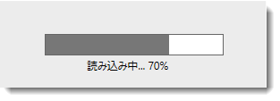

////
|metadata|
{
    "name": "xambusyindicator-adding-to-your-page",
    "tags": ["Getting Started","How Do I"],
    "controlName": ["xamBusyIndicator"],
    "guid": "4739e83e-bbf5-40c4-b164-8b5859b9def4",
    "buildFlags": [],
    "createdOn": "2015-07-30T16:03:47.5735268Z"
}
|metadata|
////

= xamBusyIndicator をページに追加

== トピックの概要

=== 目的

このトピックでは、 _xamBusyIndicator_   コントロールを短時間で起動、実行するために役立つ詳細な操作方法を紹介します。

=== 前提条件

このトピックを理解するために、以下のトピックを参照することをお勧めします。

[options="header", cols="a,a"]
|====
|トピック|目的

| link:xambusyindicator-features-overview.html[機能の概要]
|このトピックでは、このコントロールでサポートする機能を開発者の観点から説明します。

| link:xambusyindicator-visual-elements.html[視覚要素概要]
|このトピックでは、コントロールの視覚要素についての概要を紹介します。

| link:xamgrid-adding-xamgrid-to-your-page.html[xamGrid をページに追加]
|このトピックでは、ユーザーができるだけ早く操作に慣れるように、プロシージャー コードおよび XAML を使用して _xamGrid_ コントロールをページに追加するために必要な基本手順について説明します。

|====

=== 外部リソース
[options="header", cols="a,a"]
|====
|記事|目的 

| link:https://msdn.microsoft.com/ja-jp/library/system.componentmodel.backgroundworker(v=vs.110).aspx[BackgroundWorker クラス] 

|この MSDN ページでは、BackgroundWorker クラスとその使用方法に関する情報を提供します。 

|====

=== このトピックの内容

このトピックは、以下のセクションで構成されます。

* <<_Ref426221454, 長時間に渡る演算の進行状況の表示に、BackgroundWorker と xamBusyIndicator の使用 - 例 >>

** <<_Ref426221467,概要>>
** <<_Preview,プレビュー>>
** <<_Prerequisites,前提条件>>

* <<_Ref426221529, コード例の概要 >>
* <<_Ref426221588, 関連トピック >>

[[_Ref426221454]]
=== 長時間に渡る演算の進行状況の表示に、BackgroundWorker と xamBusyIndicator の使用 - 例

[[_Ref426221467]]

=== 概要

この例は、長時間に渡る演算の実行を通知し、実際の進行状況を視覚的に表示するために  _xamBusyIndicator_   コントロールを使用する方法を説明します。

この例では、 _xamGrid_   コントロールはデータ コンテナーとして使用され、`BackgroundWorker` クラスはバックグラウンド スレッド上のデータの読み込み操作の実行に使用されます。

[[_Preview]]

=== プレビュー

以下のスクリーンショットは最終結果のプレビューです。

image::images/Adding_xamBusyIndicator_to_Your_Page_2.png[]

[[_Prerequisites]]

=== 前提条件

この手順を実行するには、以下が必要です。

* Microsoft® WPF™ プロジェクトを作成し、以下の NuGet パッケージ参照を追加します。

** Infragistics.WPF (`XamBusyIndicator` はこのパッケージに存在します)
** Infragistics.WPF.Controls.Grids.XamGrid

NuGet フィードのセットアップと NuGet パッケージの追加の詳細については、link:nuget-feeds.html[NuGet フィード] ドキュメントを参照してください。

* 以下の名前空間宣言を追加します。

*XAML の場合:*

[source,xaml]
----
xmlns:ig="http://schemas.infragistics.com/xaml"
----

*C# の場合:*

[source,csharp]
----
using Infragistics.Controls.Interactions;
----

*Visual Basic の場合:*

[source,vb]
----
Imports Infragistics.Controls.Interactions
----

*  _xamBusyIndicator_   コントロールをページに追加します。

*XAML の場合:*

[source,xaml]
----
<ig:XamBusyIndicator IsBusy="True">
    <!-- xamBusyIndicator のコンテンツ -->
</ig:XamBusyIndicator>
----

[[_Ref426221529]]
== コード スニペットの概要

=== コード スニペットの概要表

以下の表は、このトピックで使用したコード スニペットを示しています。

[options="header", cols="a,a"]
|====
|例|説明

|<<_Ref426219199, データ モデルのクラス >>
|これは、例で使用されるデータ モデルのクラスです。

|<<_Ref426219966, ViewModel クラス >>
|この ViewModel クラスは、`BackgroundWorker` インスタンスを使用し、その主要なイベント `DoWork`、`ProgressChanged`、`RunWorkerCompleted` を処理して、データの読み込みの機能を実装します。

|<<_Ref426222137, 長時間に渡る演算の進行状況の表示に、XAML の xamBusyIndicator の使用 >>
|この XAML コードは _xamBusyIndicator_ コントロールを構成します。

|====

[[_Ref426219199]]
== データ モデルのクラス

=== 説明

これは、例で使用されるデータ モデルのクラスです。

=== コード

*C# の場合:*

[source,csharp]
----
public class DataModel : ObservableModel
{
    public string ID { get; set; }
    public string Name { get; set; }
}
public class ObservableModel : INotifyPropertyChanged
{
    #region INotifyPropertyChanged
    public event PropertyChangedEventHandler PropertyChanged;
    protected void OnPropertyChanged(string propertyName)
    {
        OnPropertyChanged(this, new PropertyChangedEventArgs(propertyName));
    }
    protected void OnPropertyChanged(object sender, PropertyChangedEventArgs e)
    {
        PropertyChangedEventHandler handler = this.PropertyChanged;
        if (handler != null)
            handler(sender, e);
    }
    #endregion
}
----

*Visual Basic の場合:*

[source,vb]
----
Public Class DataModel
    Inherits ObservableModel
    Public Property ID() As String
        Get
            Return m_ID
        End Get
        Set(value As String)
            m_ID = value
        End Set
    End Property
    Private m_ID As String
    Public Property Name() As String
        Get
            Return m_Name
        End Get
        Set(value As String)
            m_Name = value
        End Set
    End Property
    Private m_Name As String
End Class
Public Class ObservableModel
    Implements INotifyPropertyChanged
#Region "INotifyPropertyChanged Members"
    Public Event PropertyChanged(ByVal sender As Object, ByVal e As PropertyChangedEventArgs) Implements INotifyPropertyChanged.PropertyChanged
    Public Sub OnPropertyChanged(ByVal propertyName As String)
        RaiseEvent PropertyChanged(Me, New PropertyChangedEventArgs(propertyName))
    End Sub
#End Region
End Class
----

[[_Ref426219966]]
== ViewModel クラス

=== 説明

この ViewModel クラスは、`BackgroundWorker` インスタンスを使用し、その主要なイベント `DoWork`、`ProgressChanged`、`RunWorkerCompleted` を処理して、データの読み込みの機能を実装します。

以下のパブリック プロパティは、その他の用途で _xamBusyIndicator_ コントロールに実装されます。

* IsInProgress
* CurrentProgress
* CurrentProgressFormatted

=== コード

*C# の場合:*

[source,csharp]
----
public class DataProvider : ObservableModel
{
    private BackgroundWorker _worker;
    private bool _isInProgress;
    public bool IsInProgress
    {
        get
        {
            return this._isInProgress;
        }
        set
        {
            if (this._isInProgress != value)
            {
                this._isInProgress = value;
                this.OnPropertyChanged("IsInProgress");
            }
        }
    }
    private double _currentProgress;
    public double CurrentProgress
    {
        get
        {
            return this._currentProgress;
        }
        set
        {
            if (this._currentProgress != value)
            {
                this._currentProgress = value;
                this.OnPropertyChanged("CurrentProgress");
            }
        }
    }
    private object _currentProgressFormatted;
    public object CurrentProgressFormatted
    {
        get
        {
            return this._currentProgressFormatted;
        }
        set
        {
            if (this._currentProgressFormatted != value)
            {
                this._currentProgressFormatted = value;
                this.OnPropertyChanged("CurrentProgressFormatted");
            }
        }
    }
    private ObservableCollection<DataModel> _data;
    public ObservableCollection<DataModel> Data
    {
        get
        {
            return this._data;
        }
        set
        {
            if (this._data != value)
            {
                this._data = value;
                this.OnPropertyChanged("Data");
            }
        }
    }
    public DataProvider()
    {
        _worker = new BackgroundWorker() { WorkerReportsProgress = true };
        _worker.DoWork += new DoWorkEventHandler(WorkerDoWork);
        _worker.ProgressChanged += new ProgressChangedEventHandler(WorkerProgressChanged);
        _worker.RunWorkerCompleted += new RunWorkerCompletedEventHandler(WorkerCompleted);
        if (!_worker.IsBusy)
        {
            IsInProgress = true;
            _worker.RunWorkerAsync();
        }   
    }
    private void WorkerDoWork(object sender, DoWorkEventArgs e)
    {
        const int maxRecords = 1000;
        var orders = new List<DataModel>();
        for (int i = 1; i < maxRecords; i++)
        {
            System.Threading.Thread.Sleep(10);
            orders.Add(new DataModel(){ID = i.ToString(), Name = "Data record " + i});
            _worker.ReportProgress(Convert.ToInt32(((decimal)i / (decimal)maxRecords) * 100));
        }
        e.Result = orders;
    }
    private void WorkerProgressChanged(object sender, ProgressChangedEventArgs e)
    {
        CurrentProgress = (double)e.ProgressPercentage / 100;
        CurrentProgressFormatted = string.Format("Loading {0}%", e.ProgressPercentage);
    }
    private void WorkerCompleted(object sender, RunWorkerCompletedEventArgs e)
    {
        IsInProgress = false;
        this.Data = new ObservableCollection<DataModel>((List<DataModel>)e.Result);
    }
}
----

*Visual Basic の場合:*

[source,vb]
----
Public Class DataProvider
    Inherits ObservableModel
    Private _worker As BackgroundWorker
    Private _isInProgress As Boolean
    Public Property IsInProgress() As Boolean
        Get
            Return Me._isInProgress
        End Get
        Set(value As Boolean)
            If Me._isInProgress <> value Then
                Me._isInProgress = value
                Me.OnPropertyChanged("IsInProgress")
            End If
        End Set
    End Property
    Private _currentProgress As Double
    Public Property CurrentProgress() As Double
        Get
            Return Me._currentProgress
        End Get
        Set(value As Double)
            If Me._currentProgress <> value Then
                Me._currentProgress = value
                Me.OnPropertyChanged("CurrentProgress")
            End If
        End Set
    End Property
    Private _currentProgressFormatted As Object
    Public Property CurrentProgressFormatted() As Object
        Get
            Return Me._currentProgressFormatted
        End Get
        Set(value As Object)
            If Me._currentProgressFormatted IsNot value Then
                Me._currentProgressFormatted = value
                Me.OnPropertyChanged("CurrentProgressFormatted")
            End If
        End Set
    End Property
    Private _data As ObservableCollection(Of DataModel)
    Public Property Data() As ObservableCollection(Of DataModel)
        Get
            Return Me._data
        End Get
        Set(value As ObservableCollection(Of DataModel))
            If Me._data IsNot value Then
                Me._data = value
                Me.OnPropertyChanged("Data")
            End If
        End Set
    End Property
    Public Sub New()
        _worker = New BackgroundWorker() With {
            .WorkerReportsProgress = True
        }
        AddHandler _worker.DoWork, AddressOf WorkerDoWork
        AddHandler _worker.ProgressChanged, AddressOf WorkerProgressChanged
        AddHandler _worker.RunWorkerCompleted, AddressOf WorkerCompleted
        If Not _worker.IsBusy Then
            IsInProgress = True
            _worker.RunWorkerAsync()
        End If
    End Sub
    Private Sub WorkerDoWork(sender As Object, e As DoWorkEventArgs)
        Const maxRecords As Integer = 1000
        Dim orders = New List(Of DataModel)()
        For i As Integer = 1 To maxRecords - 1
            System.Threading.Thread.Sleep(10)
            orders.Add(New DataModel() With {
                .ID = i.ToString(),
                .Name = "Data record " & i
            })
            _worker.ReportProgress(Convert.ToInt32((CDec(i) / CDec(maxRecords)) * 100))
        Next
        e.Result = orders
    End Sub
    Private Sub WorkerProgressChanged(sender As Object, e As ProgressChangedEventArgs)
        CurrentProgress = CDbl(e.ProgressPercentage) / 100
        CurrentProgressFormatted = String.Format("Loading {0}%", e.ProgressPercentage)
    End Sub
    Private Sub WorkerCompleted(sender As Object, e As RunWorkerCompletedEventArgs)
        IsInProgress = False
        Me.Data = New ObservableCollection(Of DataModel)(DirectCast(e.Result, List(Of DataModel)))
    End Sub
End Class
----

[[_Ref426222137]]
== 長時間に渡る演算の進行状況の表示に、XAML のxamBusyIndicator の使用

=== 説明

この XAML コードは  _xamBusyIndicator_   コントロールを構成します。

以下の link:{RootAssembly}{ApiVersion}~infragistics.controls.interactions.xambusyindicator_members.html[XamBusyIndicator] のプロパティが設定されます。

[options="header", cols="a,a"]
|====
|プロパティ|説明

| link:{RootAssembly}{ApiVersion}~infragistics.controls.interactions.xambusyindicator~isbusy.html[IsBusy]
|コントロールを表示する場合に指定します。

| link:{RootAssembly}{ApiVersion}~infragistics.controls.interactions.xambusyindicator~animation.html[Animation]
|アニメーション タイプを指定します。この例では、`ProgressBar` に設定されます。

| link:{RootAssembly}{ApiVersion}~infragistics.controls.interactions.xambusyindicator~isindeterminate.html[IsIndeterminate]
|アニメーションの確定モードまたは非確定モードを指定します。この例では、 _xamBusyIndicator_ の`IsIndeterminate` プロパティが `True` に設定され、確定された進行状況を表示します。

| link:{RootAssembly}{ApiVersion}~infragistics.controls.interactions.xambusyindicator~progressvalue.html[ProgressValue]
|進行状況の値を 0～1 の範囲内に設定します。

| link:{RootAssembly}{ApiVersion}~infragistics.controls.interactions.xambusyindicator~busycontent.html[BusyContent]
|ビジー アニメーションの下に置かれたコンテンツを指定します。この例では、`BusyContent` プロパティは、進行状況のパーセントを示すテキストに設定されます。

|`Content`
|この例に示すこのプロパティは、 _xamGrid_ コントロールに設定されます。

|====

=== コード

*XAML の場合:*

[source,xaml]
----
<Window.DataContext>
    <data:DataProvider />
</Window.DataContext>
<ig:XamBusyIndicator IsBusy="{Binding Path=IsInProgress}" 
                     Animation="ProgressBar" IsIndeterminate="False"
                     ProgressValue="{Binding Path=CurrentProgress}"
                     BusyContent="{Binding Path=CurrentProgressFormatted}">              
    <ig:XamGrid x:Name="DataGrid" ItemsSource="{Binding Path=Data}" ColumnWidth="*" />
</ig:XamBusyIndicator>
----

[[_Ref426221588]]
== 関連トピック

このトピックの追加情報については、以下のトピックも合わせてご参照ください。

[options="header", cols="a,a"]
|====
|トピック|目的

| link:xambusyindicator-configuring.html[xamBusyIndicator の構成]
|このセクションのトピックでは、コントロールの構成についての情報を提供します。

| link:xambusyindicator-working.html[xamBusyIndicator の作業]
|このセクションのトピックでは、コントロールをプログラムによって管理する詳しい方法を説明します。

| link:xambusyindicator-api-reference.html[API リファレンス (xamBusyIndicator)]
|このトピックでは、コントロールに関連した名前空間およびクラスに関する参考情報を提供します。

|====