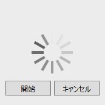

////

|metadata|
{
    "name": "xambusyindicator-configuring-busy-content",
    "tags": ["Getting Started","How Do I"],
    "controlName": ["xamBusyIndicator"],
    "guid": "a30b36d9-abd9-4113-b69f-a0cd00c222e0",  
    "buildFlags": [],
    "createdOn": "2015-08-04T11:24:13.7529187Z"
}
|metadata|
////

= ビジー コンテンツの構成 (xamBusyIndicator)

== トピックの概要

=== 目的

このトピックでは、 _xamBusyIndicator_   ビジー コンテンツを構成する方法を説明します。

=== 前提条件

このトピックを理解するために、以下のトピックを参照することをお勧めします。

[options="header", cols="a,a"]
|====
|トピック|目的

| link:xambusyindicator-features-overview.html[機能の概要]
|このトピックでは、このコントロールでサポートする機能を開発者の観点から説明します。

| link:xambusyindicator-visual-elements.html[視覚要素]
|このトピックでは、コントロールの視覚要素についての概要を紹介します。

|====

[[_Ref426237144]]

=== このトピックの内容

このトピックは、以下のセクションで構成されます。

* <<_Ref426381889, ビジー コンテンツの構成 >>
* <<_Ref427774342, ビジー コンテンツ テンプレートの適用 >>
* <<_Ref426366458, 関連コンテンツ >>

** <<_Ref426366463,トピック>>

[[_Ref426381889]]
== ビジー コンテンツの構成

[[_Ref426381902]]

=== 概要

_xamBusyIndicator_   ビジー コンテンツは、アニメーション領域の下に置かれるコンテンツです。

link:{RootAssembly}{ApiVersion}~infragistics.controls.interactions.xambusyindicator_members.html[XamBusyIndicator] の link:{RootAssembly}{ApiVersion}~infragistics.controls.interactions.xambusyindicator~busycontent.html[BusyContent] プロパティを使用して、テキストまたは `FrameworkElement` を配置します。

2 つの例では、テキストと `FrameworkElement` を  _xamBusyIndicator_   ビジー コンテンツに設定する方法を示しています。

デフォルトで、`BusyContent` プロパティの初期値は `null` です。

=== プロパティ設定

以下の表は、任意の構成とそれを管理するプロパティ設定のマッピングを示します。

[options="header", cols="a,a,a"]
|====
|目的:|使用するプロパティ:|設定の選択肢:

|表示されたビジー コンテンツの構成
| link:{RootAssembly}{ApiVersion}~infragistics.controls.interactions.xambusyindicator~busycontent.html[BusyContent]
|`object`

|====

[[_Ref426381917]]

=== テキストをビジー コンテンツとして設定する - 例

以下のスクリーンショットは、以下の設定の結果、 _xamBusyIndicator_   の外観がどのようになるかを示しています。

[options="header", cols="a,a"]
|====
|プロパティ|値

| link:{RootAssembly}{ApiVersion}~infragistics.controls.interactions.xambusyindicator~busycontent.html[BusyContent]
| _しばらくお待ちください。_ 

|====

image::images/Configuring_Busy_Content_1.png[]

以下のコードはこの例を実装します。

*XAML の場合:*

[source,xaml]
----
<ig:XamBusyIndicator IsBusy="True" BusyContent="Please, wait ..." />
----

[[_Ref426381921]]

=== FrameworkElement をビジー コンテンツとして設定する - 例

以下のスクリーンショットは、以下の設定の結果、 _xamBusyIndicator_   の外観がどのようになるかを示しています。

[options="header", cols="a,a"]
|====
|プロパティ|値

| link:{RootAssembly}{ApiVersion}~infragistics.controls.interactions.xambusyindicator~busycontent.html[BusyContent]
|_<StackPanel Orientation="水平" HorizontalAlignment="中央">_ 

_    <Button Content="開始" Width="50" Margin="5"/>_ 

_    <Button Content="キャンセル" Width="50" Margin="5" />_ 

_</StackPanel>_

|====

以下のコードはこの例を実装します。

*XAML の場合:*

[source,xaml]
----
<ig:XamBusyIndicator IsBusy="True">
    <ig:XamBusyIndicator.BusyContent>
        <StackPanel Orientation="Horizontal" HorizontalAlignment="Center">
            <Button Content="Start" Width="50" Margin="5"/>
            <Button Content="Cancel" Width="50" Margin="5" />
        </StackPanel>
    </ig:XamBusyIndicator.BusyContent>
</ig:XamBusyIndicator>
----

[[_Ref427774342]]
== ビジー コンテンツ テンプレートの適用

=== 概要

link:{RootAssembly}{ApiVersion}~infragistics.controls.interactions.xambusyindicator_members.html[XamBusyIndicator] の link:{RootAssembly}{ApiVersion}~infragistics.controls.interactions.xambusyindicator~busycontenttemplate.html[BusyContentTemplate] プロパティを使用して、 _xamBusyIndicator_   ビジー コンテンツにカスタム テンプレートを適用します。

=== プロパティ設定

以下の表は、任意の構成とそれを管理するプロパティ設定のマッピングを示します。

[options="header", cols="a,a,a"]
|====
|目的:|使用するプロパティ:|設定の選択肢:

|ビジー コンテンツにカスタム テンプレートを適用
| link:{RootAssembly}{ApiVersion}~infragistics.controls.interactions.xambusyindicator~busycontenttemplate.html[BusyContentTemplate]
|`DataTemplate`

|====

=== 例

以下のスクリーンショットは、以下の設定の結果、 _xamBusyIndicator_   の外観がどのようになるかを示しています。

[options="header", cols="a,a"]
|====
|プロパティ|値

| link:{RootAssembly}{ApiVersion}~infragistics.controls.interactions.xambusyindicator~busycontenttemplate.html[BusyContentTemplate]
|_<DataTemplate>_ 

_<StackPanel Orientation="垂直">_ 

_<TextBlock Text="{Binding ProgressValue, StringFormat={}{0:P0}}" />_ 

_<Slider Maximum="1" Minimum="0" Width="80" Value="{Binding ProgressValue}" />_ 

_</StackPanel>_ 

_</DataTemplate>_

|====

image::images/Configuring_Busy_Content_3.png[]

以下のコードはこの例を実装します。

*XAML の場合:*

[source,xaml]
----
<ig:XamBusyIndicator IsBusy="True" Animation="ProgressBar"
                     BusyContent="{Binding RelativeSource={RelativeSource Self}}"
                     ProgressValue=".5">
    <ig:XamBusyIndicator.BusyContentTemplate>
        <DataTemplate>
            <StackPanel Orientation="Vertical">
                <TextBlock Text="{Binding ProgressValue, StringFormat={}{0:P0}}" />
                <Slider Maximum="1" Minimum="0" Width="80" Value="{Binding ProgressValue}" />
            </StackPanel>
        </DataTemplate>
    </ig:XamBusyIndicator.BusyContentTemplate>
</ig:XamBusyIndicator>
----

[[_Ref426366458]]
== 関連コンテンツ

[[_Ref426366463]]

=== トピック

このトピックの追加情報については、以下のトピックも合わせてご参照ください。

[options="header", cols="a,a"]
|====
|トピック|目的

| link:xambusyindicator-configuring-busy-indicator-display.html[ビジー インジケータの表示の構成]
|このトピックでは、 _xamBusyIndicator_ コントロールを表示する方法を説明します。

| link:xambusyindicator-configuring-delayed-display.html[表示の遅延の構成]
|このトピックでは、 _xamBusyIndicator_ コントロールを表示する前の遅延時間を構成する方法を説明します。

| link:xambusyindicator-configuring-focus-target.html[フォーカス ターゲットの構成]
|このトピックでは、 _xamBusyIndicator_ が非アクティブな場合に、UIElement がフォーカスを受け取るように明示的に構成する方法を説明します。

| link:xambusyindicator-configuring-determinate-xambusyindicator.html[既定の xamBusyIndicator の構成]
|このトピックでは、 _xamBusyIndicator_ コントロールを構成して、既定の進行状況を表示する方法を説明します。

| link:xambusyindicator-configuring-overlay-style.html[オーバーレイ スタイルの構成]
|このトピックでは、 _xamBusyIndicator_ のオーバーレイ スタイルをカスタマイズする方法を説明します。

| link:xambusyindicator-configuring-animations-brushes.html[アニメーション ブラシの構成]
|このトピックでは、 _xamBusyIndicator_ コントロールのデフォルトのアニメーション ブラシをカスタマイズする方法を説明します。

|====