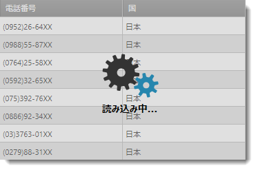
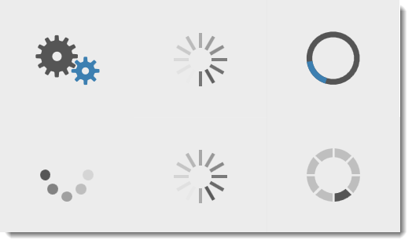

////
|metadata|
{
    "name": "xambusyindicator-features-overview",
    "tags": [],
    "controlName": ["xamBusyIndicator"],
    "guid": "ab5a6378-7230-477c-8924-0e9bfd1d9cf5",
    "buildFlags": [],
    "createdOn": "2015-07-30T15:58:43.8630753Z"
}
|metadata|
////

= 機能の概要 (xamBusyIndicator)

== トピックの概要

=== 目的

このトピックでは、このコントロールでサポートする機能を開発者の観点から説明します。

=== このトピックの内容

このトピックは、以下のセクションで構成されます。

* <<_Ref428373160, 概要 >>
* <<_Ref428373168, 主要機能 >>
* <<_Ref428373174, 関連コンテンツ >>

** <<_Ref428373179,トピック>>

[[_Ref428373160]]
== 概要

=== xamBusyIndicator の概要

_xamBusyIndicator_   は、コンテンツをオーバーレイし、基本のプロセスの長時間に渡り実行される状態をインジケーターで表示するコントロールです。

_xamBusyIndicator_   コントロールは、さまざまなアニメーションを提供します。一部のアニメーションには、確定および非確定モードがあります。

[[_Ref428373168]]
== 主要機能

=== 主要な機能の概要表

以下の表では、 _xamBusyIndicator_   コントロールの主要な機能を簡単に説明します。詳細は、概要表の後に記載されています。

[options="header", cols="a,a"]
|====
|機能|説明

|<<_Ref428376087,ビルド済みのアニメーション>>
|_xamBusyIndicator_ コントロールは、ビルド済みのアニメーションのセットを提供します。

|<<_Ref428378819,進行状況の表示>>
|_xamBusyIndicator_ には、確定と非確定の 2 つのモードがあります。コントロールが確定モードの場合は、基本アクティビティの進行状況が表示されます。

|<<_Ref428379228,開始の遅延>>
|_xamBusyIndicator_ コントロールを指定した遅延の後に表示することができます。

|<<_Ref428454948,構成可能なビジー コンテンツ>>
|_xamBusyIndicator_ アニメーションの下に置かれるコンテンツは、すべてカスタマイズできます。

|<<_Ref428379500,構成可能なフォーカス エレメント>>
|_xamBusyIndicator_ コントロールが非アクティブな場合にフォーカスを受け取るように、`UIElement` を指定できます。

|<<_Ref428453028,スタイル設定可能なオーバーレイ>>
|_xamBusyIndicator_ コントロールのオーバーレイ スタイルは、`OverlayStyle` プロパティを `Rectangle` エレメントに設定するだけで、簡単に変更できます。

|<<_Ref428448810,テーマ>>
|_xamBusyIndicator_ コントロールには、テーマが用意されています。

|====

[[_Ref428376087]]

=== ビルド済みのアニメーション

_xamBusyIndicator_   コントロールは、ビルド済みのアニメーションのセットを提供します。

アニメーションのデフォルト ブラシは、アニメーションの速度と同様に完全なカスタマイズが可能です。

また、独自に作成したアニメーションをデフォルトのコントロール アニメーションと置き換えることもできます。

*関連トピック:*

* link:xambusyindicator-animations.html[アニメーション]
* link:xambusyindicator-configuring-animations-brushes.html[アニメーション ブラシの構成]
* link:xambusyindicator-configuring-animation-duration.html[アニメーション時間の構成]
* link:xambusyindicator-applying-custom-animation.html[カスタム アニメーションの適用]

[[_Ref428378819]]

=== 進行状況の表示

_xamBusyIndicator_   コントロールには、非確定モードと確定モードの両方を提供する ProgressRing と ProgressBar という 2 つのアニメーションがあります。

確定モードでは、基本アクティビティの進行状況が表示されます。

image::images/xamBusyIndicator_Features_Overview_3.png[]

*関連トピック:*

* link:xambusyindicator-configuring-determinate-xambusyindicator.html[既定のプログレス バーの構成]

[[_Ref428379228]]

=== 開始の遅延

_xamBusyIndicator_   コントロールは、指定した間隔の後に表示することができます。

*関連トピック:*

* link:xambusyindicator-configuring-delayed-display.html[表示の遅延の構成]

[[_Ref428454948]]

=== 構成可能なビジー コンテンツ

_xamBusyIndicator_   コントロールのビジー コンテンツ領域は、すべてカスタマイズできます。

*関連トピック:*

* link:xambusyindicator-configuring-busy-content.html[ビジー コンテンツの構成]

[[_Ref428379500]]

=== 構成可能なフォーカス エレメント

_xamBusyIndicator_   コントロールが非アクティブな場合にフォーカスを受け取るように、`UIElement` を指定できます。

*関連トピック:*

* link:xambusyindicator-configuring-focus-target.html[フォーカス ターゲットの構成]

[[_Ref428453028]]

=== スタイル設定可能なオーバーレイ

_xamBusyIndicator_   コントロールのデフォルトのオーバーレイ スタイルは、`OverlayStyle` プロパティを `Rectangle` エレメントに設定するだけで、簡単に変更できます。

*関連トピック:*

* link:xambusyindicator-configuring-overlay-style.html[オーバーレイ スタイルの構成]

[[_Ref428448810]]

=== テーマ

xamBusyIndicator コントロールは、テーマをセットで提供します。テーマを含むディクショナリの名前は "[テーマ名].WPF.xaml" です。たとえば、Metro テーマのディクショナリの名前は "Metro.WPF.xaml" です。

*関連トピック:*

* link:designers-guide-using-themes.html[テーマの使用]

[[_Ref428373174]]
== 関連コンテンツ

[[_Ref428373179]]

=== トピック

このトピックの追加情報については、以下のトピックも合わせてご参照ください。

[options="header", cols="a,a"]
|====
|トピック|目的

| link:xambusyindicator-visual-elements.html[視覚要素]
|このトピックでは、コントロールの視覚要素についての概要を紹介します。

| link:xambusyindicator-adding-to-your-page.html[xamBusyIndicator をページに追加]
|このトピックでは、 _xamBusyIndicator_ コントロールを短時間で起動、実行するために役立つ詳細な操作方法を紹介します。

| link:xambusyindicator-configuring.html[xamBusyIndicator の構成]
|このセクションのトピックでは、 _xamBusyIndicator_ コントロールの構成についての情報を提供します。

|====