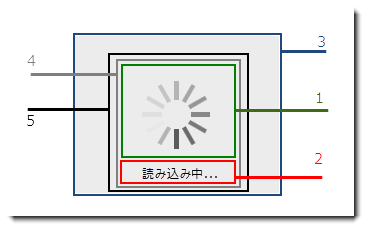

////
|metadata|
{
    "name": "xambusyindicator-visual-elements",
    "tags": [],
    "controlName": ["xamBusyIndicator"],
    "guid": "0d4ece43-37b7-4416-b245-330b981c3e19",
    "buildFlags": [],
    "createdOn": "2015-07-30T16:02:01.5453397Z"
}
|metadata|
////

= 視覚要素 (xamBusyIndicator)

== トピックの概要

=== 目的

このトピックでは、コントロールの視覚要素についての概要を紹介します。

=== このトピックの内容

このトピックは、以下のセクションで構成されます。

* <<_Ref428364135, xamBusyIndicator コントロールの視覚要素と関連プロパティ >>
* <<_Ref428364140, 関連コンテンツ >>

** <<_Ref428364144,トピック>>

[[_Ref428364135]]
== xamBusyIndicator コントロールの視覚要素と関連プロパティ

=== 視覚要素の概要

以下のスクリーンショットは、 _xamBusyIndicator_   コントロールの視覚要素を示します。設定可能な要素を図の後に示します。

[start=1]
. アニメーション
[start=2]
. ビジー コンテンツ
[start=3]
. オーバーレイ
[start=4]
. グリッド要素
[start=5]
. 境界線要素

=== 視覚要素と関連プロパティ

以下の表は、 _xamBusyIndicator_   コントロールの視覚要素とそれらを構成するプロパティをマップします。

[options="header", cols="a,a,a"]
|====
|視覚要素
|プロパティ
|トピック

|ビジー インジケータ
| link:{RootAssembly}{ApiVersion}~infragistics.controls.interactions.xambusyindicator~isbusy.html[IsBusy]
| link:xambusyindicator-configuring-busy-indicator-display.html[ビジー インジケータの表示の構成]

|
| link:{RootAssembly}{ApiVersion}~infragistics.controls.interactions.xambusyindicator~displayafter.html[DisplayAfter]
| link:xambusyindicator-configuring-delayed-display.html[表示の遅延の構成]

|アニメーション
| link:{RootAssembly}{ApiVersion}~infragistics.controls.interactions.xambusyindicator~animation.html[Animation]
| link:xambusyindicator-animations.html[アニメーション] 

link:xambusyindicator-applying-custom-animation.html[カスタム アニメーションの適用]

|
| link:{RootAssembly}{ApiVersion}~infragistics.controls.interactions.busyanimation~animationtotalduration.html[AnimationTotalDuration]

|link:xambusyindicator-configuring-animation-duration.html[アニメーション時間の構成]

|
|さまざまな構成が可能なアニメーション ブラシのプロパティ
| link:xambusyindicator-configuring-animations-brushes.html[アニメーション ブラシの構成]

|ビジー コンテンツ
| link:{RootAssembly}{ApiVersion}~infragistics.controls.interactions.xambusyindicator~busycontent.html[BusyContent] 

link:{RootAssembly}{ApiVersion}~infragistics.controls.interactions.xambusyindicator~busycontenttemplate.html[BusyContentTemplate] 

link:{RootAssembly}{ApiVersion}~infragistics.controls.interactions.xambusyindicator~busycontenttemplateselector.html[BusyContentTemplateSelector]
| link:xambusyindicator-configuring-busy-content.html[ビジー コンテンツの構成]

|オーバーレイ
| link:{RootAssembly}{ApiVersion}~infragistics.controls.interactions.xambusyindicator~overlaystyle.html[OverlayStyle]
| link:xambusyindicator-configuring-overlay-style.html[オーバーレイ スタイルの構成]

|====

[[_Ref428364140]]
== 関連コンテンツ

[[_Ref428364144]]

=== トピック

このトピックの追加情報については、以下のトピックも合わせてご参照ください。

[options="header", cols="a,a"]
|====
|トピック|目的

| link:xambusyindicator-features-overview.html[機能の概要]
|このトピックでは、このコントロールでサポートする機能を開発者の観点から説明します。

| link:xambusyindicator-adding-to-your-page.html[xamBusyIndicator をページに追加]
|このトピックでは、 _xamBusyIndicator_ コントロールを短時間で起動、実行するために役立つ詳細な操作方法を紹介します。

| link:xambusyindicator-configuring.html[xamBusyIndicator の構成]
|このセクションのトピックでは、 _xamBusyIndicator_ コントロールの構成についての情報を提供します。

|====