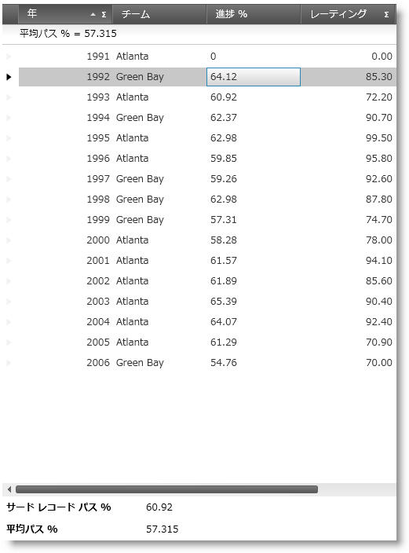

////
|metadata|
{
    "name": "xamcalculationmanager-using-xamcalculationmanager-with-xamdatagrid",
    "controlName": ["xamCalculationManager"],
    "tags": ["Calculations","Getting Started"],
    "guid": "e5e69ffc-6db9-47cc-82c1-795cb760baed",
    "buildFlags": [],
    "createdOn": "2016-05-25T18:21:54.5941242Z"
}
|metadata|
////

= xamCalculationManager の xamDataGrid との使用

== トピックの概要

== 目的

このトピックでは、xamCalculationManager コントロールを xamDataGrid コントロールと組み合わせて使用して、フィールドの値をソースおよびターゲットとして使用して計算を実行する方法を説明します。

== 本トピックの内容

このドキュメントには次のセクションが含まれています:

* 前提条件
* はじめに
* 概要
* 手順

== 前提条件

以下のトピックを理解することが必要です。

* link:xamdatagrid-understanding-xamdatagrid.html[xamDataGrid について]
* link:xamdatapresenter-bind-a-datapresenter-control-to-an-xmldataprovider.html[DataPresenter コントロールを XmlDataProvider にバインド]
* link:xamdatapresenter-manually-assigning-a-field-layout-to-xamdatapresenter.html[フィールド レイアウトを xamDataPresenter を手動で割り当て]
* link:xamdatapresenter-define-a-field-layout.html[フィールド レイアウトの定義]
* link:xamdatapresenter-add-unbound-fields-to-a-datapresenter-control.html[DataPresenter コントロールにバインドされていないフィールドを追加]
* link:xamcalculationmanager.html[xamCalculationManager]
* link:xamcalculationmanager-getting-started-with-xamcalculationmanager.html[xamCalculationManager を使用した作業の開始]
* link:xamformulaeditor-about.html[xamFormulaEditor について]
* link:xamformulaeditor-using.html[xamCalculationManager での xamFormulaEditor および FormulaEditorDialog の使用]

== はじめに

このトピックでは、xamCalculationManager と xamDataGrid コントロールの統合について扱いますが、同じ手順をその他の DataPresenter コントロールに適用することができます。xamCalculationManager コンポーネントによって実行される計算に関連するのに適した他のコントロールは、DataPresenterBase クラスから派生します。これらのコントロールは以下の通りです。

* xamDataPresenter™
* xamDataGrid
* xamDataCards™
* xamDataCarousel™

これらのコントロールの様々な部分は、セルや集計を含む、計算のソースおよびターゲットとして使用できます。

== プレビュー

以下のスクリーンショットは最終結果のプレビューです。Passing 列の値は、Completions および Attempts 列の値に基づいて計算されます。Passing 列の数式: Completion/Attempt$$*$$100、小数第二位まで四捨五入されます。上記では、グリッドは xamFormulaEditor コントロールであり、ユーザーはグリッドの Passing フィールドの数式を編集することができます。以下のグリッドは、xamCalculationManager コントロールによって計算される Average Passing 集計です。集計の下には 2 つのテキスト ブロックがあり、xamCalculationManger コントロールを使用して、コントロールに登録されたオブジェクトのプロパティの値にアクセスできることを示しています。この例では、3 番目のデータ レコードおよび平均通過スコア内の Passing フィールドが計算され、集計に表示されます。

== 概要

以下はプロセスの概念的概要です。

. 新規 WPF プロジェクトの作成および必要な参照の追加。
. 必要な XML 名前空間を追加します。
. xamCalculationManager を追加します。
. xamDataGrid の datasource を構成します。
. xamDataGrid を追加します。
. CalculationAdapter を構成します。
. xamDataGrid FieldLayout を構成します。
. 外部参照を計算された値に追加します。
. xamFormulaEditor を追加します。
. ソリューションを構築して実行します。

== 手順

. *新規 WPF プロジェクトを作成し、必要な参照を追加します。*
+
Microsoft Visual Studio を起動し、新しい Microsoft® Windows® Presentation Foundation プロジェクトを作成します。次に、以下の NuGet パッケージ参照をプロジェクトに追加します。

* Infragistics.WPF.CalculationManager
* Infragistics.WPF.DataGrids
* Infragistics.WPF.DataGrids.Calculation
* Infragistics.WPF.FormulaEditor

NuGet フィードのセットアップと NuGet パッケージの追加の詳細については、link:nuget-feeds.html[NuGet フィード] ドキュメントを参照してください。

. *必要な XML 名前空間を追加します。*
+
xamCalculationManger コンポーネントを xamDataGrid コントロールと共に使用するには、Infragistics XAML xml 名前空間および Infragistics DataPresenter xml 名前空間の宣言を、アプリケーションの MainWindow.xaml ファイルの開始 Window タグに追加する必要があります。
+
*XAML の場合:*
+
[source,xaml]
----
<Window …
    xmlns:ig="http://schemas.infragistics.com/xaml"
    xmlns:igDP="http://infragistics.com/DataPresenter">
----

. *xamCalculationManager を追加します。*
+
名前空間を追加した後、次の手順では xamCalculationManager コントロールをアプリケーションに追加します。その宣言を、ウィンドウのリソース セクションまたはメイン グリッドのコンテナーに配置します。これらの 2 つのアプリケーションの唯一の違いは、コードで計算マネージャーを参照する方法です。それをグリッド コンテナーに追加した場合、x:Name を経由して計算マネージャーにアクセスします。それを StaticResource として宣言した場合は、StaticResource マークアップ拡張を使用して、x:Key を経由してアクセスします。
+
それをメイン グリッドのコンテナーに配置することにした場合は、xamCalculationManager 宣言は次のようになります。
+
*XAML の場合:*
+
[source,xaml]
----
<ig:XamCalculationManager x:Name="CalculationManager" />
----

. *xamDataGrid の datasource を構成します*
+
xamDataGrid コントロールの datasource として、XmlDataProvider 経由で link:resources-quarterbacks.html[Quarterbacks.xml] ファイルを使用できます。
+
--
.. まず、Visual Studio のソリューション エクスプローラー内のプロジェクトのルートに xml ファイルを追加します。
.. 次に、Window.Resources セクションで XmlDataProvider を追加し、その Source プロパティを「Quarterbacks.xml」に設定します。
.. XPath プロパティを「/QuarterBack」に設定し、このリソースを後で参照するためのキーを指定します。
--
+
*XAML の場合:*
+
[source,xaml]
----
<XmlDataProvider Source="Quarterbacks.xml" 
    x:Key="QuarterbackData" XPath="/QuarterBack" />
----

. *xamDataGrid を追加します。*
+
XmlDataProvider を構成したらすぐに、xamDataGrid の構成に移ることができます。
+
--
.. XamDataGrid タグの追加から始めます。それから、コントロールの DataSource プロパティを XmlDataProvider インスタンスに設定します。
+
*XAML の場合:*
+
[source,xaml]
----
<igDP:XamDataGrid
    DataSource="{Binding Source={StaticResource QuarterbackData}, XPath=season}"      
…
----
.. 次に、CalculationManager に添付のプロパティを設定します。
+
*XAML の場合:*
+
[source,xaml]
----
ig:XamCalculationManager.CalculationManager=
    "{Binding ElementName=CalculationManager}"
----
--

. *CalculationAdapter を構成します*
+
次に、xamDataGrid の CalculationAdapter プロパティを、DataPresenterCalculationAdapter クラスのインスタンスに設定します。本手順と以前の手順の結果として、xamDataGrid は xamCalculationManager の計算に参加できるようになります。xamDataGrid フィールドの計算マネージャーの数式を参照するには、DataPresenterCalculationAdapter の ReferenceId プロパティを設定する必要があります。
+
*XAML の場合:*
+
[source,xaml]
----
<igDP:XamDataGrid … >
    <igDP:XamDataGrid.CalculationAdapter>
        <igDP:DataPresenterCalculationAdapter 
            ReferenceId="dataPresenterAdapter"/>
        </igDP:XamDataGrid.CalculationAdapter>
    …
</igDP:XamDataGrid>
----

. *xamDataGrid FieldLayout を構成します。*
.. 自動フィールド生成を無効にします。
+
.注:
[NOTE]
====
この手順は、xamCalculationManager が xamDataGrid と共に動作するためには必要ありません。ただし、これはフィールドの数を最小化し、それによってアプリケーションがよりシンプルになるため、ここで説明しています。
====
+
デフォルトで、xamDataGrid は、datasource オブジェクトのすべてのパブリック プロパティにフィールドを自動的に作成します。この動作を防ぐには、以下の手順を行う必要があります。
+
--
... xamDataGrid の FieldLayoutSettings プロパティのタグを宣言します。
... FieldLayoutSettings プロパティのタグ内の FieldLayoutSettings オブジェクトを追加します
... AutoGenerateFields プロパティを False に設定します
--
+
*XAML の場合:*
+
[source,xaml]
----
<igDP:XamDataGrid.FieldLayoutSettings>
    <igDP:FieldLayoutSettings 
        AutoGenerateFields="False" />
</igDP:XamDataGrid.FieldLayoutSettings>
----

.. FieldLayout の定義。
+
--
... xamDataGrid の FieldLayouts プロパティのタグを宣言します
... FieldLayout をグリッドの FieldLayoutCollection に追加し、その CalculationReferenceId プロパティを文字列に設定します。この文字列を使用して、xamCalculationManager の数式からのレイアウトのフィールドを後から参照することができます。
... FieldLayout の Fields コレクションのタグを宣言します
... SumamaryDefinitions のタグを宣言します
--
+
*XAML の場合:*
+
[source,xaml]
----
<igDP:XamDataGrid.FieldLayouts>
    <igDP:FieldLayout CalculationReferenceId="Quarterback">
        <igDP:FieldLayout.Fields>
        </igDP:FieldLayout.Fields>
        <igDP:FieldLayout.SummaryDefinitions>
        </igDP:FieldLayout.SummaryDefinitions>
    </igDP:FieldLayout>
</igDP:XamDataGrid.FieldLayouts>
----

.. フィールドを FieldLayout FieldCollection に追加。
+
FieldLayout の定義方法の詳細は、link:xamdatapresenter-define-a-field-layout.html[フィールド レイアウトの定義]トピックを参照してください。現在のサンプルでは、2～3 の数値フィールド (値がこのフィールドに基づく)、計算済みのフィールドの値、および様々なレコードを識別するための 2～3 のテキスト フィールドが必要です。
+
--
... datasource に一致するフィールドの追加
... Fields の Settings プロパティのタグを宣言し、タグ内の FieldSettings オブジェクトを追加します。
... 数値フィールド用の FieldSettings オブジェクトの プロパティを Int32 に設定します
... 数値フィールドの CalculationSettings のタグを宣言し、その中にある FieldCalculationSettings オブジェクトを追加します
... FieldCalculationSettings オブジェクトの ReferenceId プロパティを文字列に設定します。この文字列を後から使用して、xamCalculationManager 数式のフィールド値を参照できます。
--
+
.注:
[NOTE]
====
この手順はオプションで、ReferenceId を指定しない場合、Field の Name を代わりに使用できます。
====
+
*XAML の場合:*
+
[source,xaml]
----
<igDP:Field Name="year" Label="Year"/>
<igDP:Field Name="team" Label="Team"/>
<igDP:Field Name="comp" Label="Completions">
    <igDP:Field.Settings>
        <igDP:FieldSettings EditAsType="{x:Type sys:Int32}" />
    </igDP:Field.Settings>
    <igDP:Field.CalculationSettings>
        <igDP:FieldCalculationSettings ReferenceId="compref" />
    </igDP:Field.CalculationSettings>
</igDP:Field>
<igDP:Field Name="att" Label="Attempts">
    <igDP:Field.Settings>
        <igDP:FieldSettings EditAsType="{x:Type sys:Int32}" />
    </igDP:Field.Settings>
    <igDP:Field.CalculationSettings>
        <igDP:FieldCalculationSettings ReferenceId="attref" />
    </igDP:Field.CalculationSettings>
</igDP:Field>
----

.. その値が計算される非バインド フィールドを追加します。
+
xamCalculationManager コンポーネントを使用して、xamDataGrid の非バインド フィールドの値を計算できます。各値は事前定義された数式を使用して計算されます。これはランタイムにコードを変更したり、または xamFormulaEditor 経由で編集したりすることができます。数式が変更されると、その数式によって影響を受けるすべての値は再計算されます。計算済みの非バインド フィールドの追加処理は、以下の通りです。
+
--
... フィールド (NumericField) を追加し、その Name および Label (オプション) プロパティを設定します。
... その BindingType プロパティを Unbound に設定します。
... フィールドの CalculationSetting プロパティのタグを宣言します
... CalculationSettings タグ内の FieldCalculationSettings オブジェクトを追加します
... Formula および ReferenceId プロパティを FieldCalculationSettings オブジェクトに設定します。
--
+
*XAML の場合:*
+
[source,xaml]
----
<igDP:NumericField Name="pct" Label="Passing" BindingType="Unbound">
    <igDP:NumericField.CalculationSettings>
        <igDP:FieldCalculationSettings 
            Formula="round([comp]/[attref]*100,2)" 
            ReferenceId="pctref" />
    </igDP:NumericField.CalculationSettings>
</igDP:NumericField>
----
+
上記コードの最も重要な部分は、xamDataGrid コントロールの他のフィールドの値を、数式のソースとしてどのように使用するかです。フィールドを参照するためには、その Name プロパティ (上記の例における、「comp」) の値、またはその FieldCalculationSettings オブジェクト (「attref」) の ReferenceId の値を使用できます。
.. 計算された集計を FieldLayout SummaryDefinitionCollection に追加します。
+
xamCalculationManager と xamDataGrid の統合のもう 1 つの特長は、フィールドの値に基づいてカスタム集計を作成できることです。
+
--
... 集計の定義を追加し、その Key を設定します
... SummaryDefinition の CalculationSettings プロパティのタグを宣言します
... タグ内の SummaryCalculationSettings オブジェクトを追加します。その Formula および ReferenceId プロパティを設定します。
--
+
*XAML の場合:*
+
[source,xaml]
----
<igDP:SummaryDefinition Position="Left" Key="Average Passing">
    <igDP:SummaryDefinition.CalculationSettings>
        <igDP:SummaryCalculationSettings 
            Formula="average([pctref])" 
            ReferenceId="pctavgref" />
    </igDP:SummaryDefinition.CalculationSettings>
</igDP:SummaryDefinition>
----
+
この集計では、pct フィールドのすべての値の平均を計算します。同様に、xamCalculationManager コンポーネントの、組み込み関数および/またはユーザー定義の関数を使用する独自の集計を作成することができます。集計の計算のソースとして、xamDataGrid コントロールのすべてのレコードのフィールド値を使用できます。
. *外部参照を計算された値に追加します*
+
xamCalculationManager を通して、計算された値を参照することができます。
+
--
.. 2 つのテキスト ブロックを追加し、XamCalculationManager の CalculationManager 添付のプロパティを、前に宣言した計算マネージャーに設定します
.. XamCalculationManager 添付プロパティの ControlSettings 添付プロパティのタグを宣言します
.. ControlCalculationSettings オブジェクトを追加し、その Formula プロパティを設定します
--
+
*XAML の場合:*
+
[source,xaml]
----
<TextBlock
    ig:XamCalculationManager.CalculationManager=
        "{Binding ElementName=CalculationManager}">
    <ig:XamCalculationManager.ControlSettings> 
        <ig:ControlCalculationSettings 
            Formula="[//dataPresenterAdapter/Quarterback(2)/pctref]" /> 
    </ig:XamCalculationManager.ControlSettings> 
</TextBlock>
----
+
このコードは、datasource の 3 番目のレコードの pct フィールドの値を表示します。xamCalculationManager コンポーネントが計算した集計への参照を使用することもできます。以下に、計算された Average Passing 集計値が表示されています。
+
*XAML の場合:*
+
[source,xaml]
----
<TextBlock
    ig:XamCalculationManager.CalculationManager=
        "{Binding ElementName=CalculationManager}">
    <ig:XamCalculationManager.ControlSettings>
        <ig:ControlCalculationSettings 
            Formula="[//dataPresenterAdapter/Quarterback/pctavgref]" />
    </ig:XamCalculationManager.ControlSettings>
</TextBlock>
----
. *xamFormulaEditor を追加します。*
+
xamDataGrid および xamCalculationManager の組み合わせで使用できるもう 1 つの機能は、xamFormulaEditor コントローラーとの統合です。エディターの使用によって、ユーザーはフィールドと集計のカスタム数式を定義できます。この機能を活用するには、xamFormulaEditor をアプリケーションに追加し、その Target プロパティを xamDataGrid コントロールのField または Summary に設定します。
+
*XAML の場合:*
+
[source,xaml]
----
<ig:XamFormulaEditor 
    Target="{Binding ElementName=dataGrid, 
        Path=FieldLayouts[0].Fields[pct]}" Margin="5" />
----
+
このコードは、pct フィールドに適用される数式を編集できる、xamFormulaEditor コントロールを作成します。

. *ソリューションを構築して実行します*

== コード例: xamCalculationManager の xamDataGrid との使用

以下のコードは、上記手順の最終結果を示しています。

*XAML の場合:*
[source,xaml]
----
<Window …
    xmlns:ig="http://schemas.infragistics.com/xaml"
    xmlns:igDP="http://infragistics.com/DataPresenter"
    xmlns:sys="clr-namespace:System;assembly=mscorlib">
    
    <Window.Resources>
        <XmlDataProvider Source="Quarterbacks.xml"
            x:Key="QuarterbackData" XPath="/QuarterBack" />
    </Window.Resources>
    
    <Grid>
        <StackPanel>
            <ig:XamCalculationManager x:Name="CalculationManager" />
            <ig:XamFormulaEditor Margin="5"
                Target="{Binding ElementName=dataGrid, Path=FieldLayouts[0].Fields[pct]}" />
            <igDP:XamDataGrid x:Name="dataGrid"
                ig:XamCalculationManager.CalculationManager=
                    "{Binding ElementName=CalculationManager}"
                DataSource="{Binding Source={StaticResource QuarterbackData}, XPath=season}">
            
                <igDP:XamDataGrid.CalculationAdapter>
                    <igDP:DataPresenterCalculationAdapter 
                        ReferenceId="dataPresenterAdapter" />
                </igDP:XamDataGrid.CalculationAdapter>
 
                <igDP:XamDataGrid.FieldLayoutSettings>
                    <igDP:FieldLayoutSettings AutoGenerateFields="False" />
                </igDP:XamDataGrid.FieldLayoutSettings>
 
                <igDP:XamDataGrid.FieldLayouts>
                    <igDP:FieldLayout CalculationReferenceId="Quarterback">
                        <igDP:FieldLayout.Fields>
                            <igDP:Field Name="year" Label="Year"/>
                            <igDP:Field Name="team" Label="Team"/>
                            <igDP:Field Name="comp" Label="Completions">
                                <igDP:Field.Settings>
                                    <igDP:FieldSettings 
                                        EditAsType="{x:Type sys:Int32}" />
                                </igDP:Field.Settings>
                            </igDP:Field>
                            <igDP:Field Name="att" Label="Attempts">
                                <igDP:Field.CalculationSettings>
                                    <igDP:FieldCalculationSettings 
                                        ReferenceId="attref" />
                                </igDP:Field.CalculationSettings>
                                <igDP:Field.Settings>
                                    <igDP:FieldSettings 
                                        EditAsType="{x:Type sys:Int32}" />
                                </igDP:Field.Settings>
                            </igDP:Field>
 
                            <igDP:NumericField Name="pct" Label="Passing" BindingType="Unbound">
                                <igDP:NumericField.CalculationSettings>
                                    <igDP:FieldCalculationSettings 
                                        Formula="round([comp]/[attref]*100,2)" ReferenceId="pctref" />
                                </igDP:NumericField.CalculationSettings>
                            </igDP:NumericField>
                        </igDP:FieldLayout.Fields>
                    
                        <igDP:FieldLayout.SummaryDefinitions>
                            <igDP:SummaryDefinition 
                                Position="Left" Key="Average Passing">
                                <igDP:SummaryDefinition.CalculationSettings>
                                    <igDP:SummaryCalculationSettings 
                                        Formula="average([pctref])" ReferenceId="pctavgref" />
                                </igDP:SummaryDefinition.CalculationSettings>
                            </igDP:SummaryDefinition>
                        </igDP:FieldLayout.SummaryDefinitions>
                    
                    </igDP:FieldLayout>
                </igDP:XamDataGrid.FieldLayouts>
            </igDP:XamDataGrid>
        <TextBlock Text="Third record Passing:" />
        <TextBlock ig:XamCalculationManager.CalculationManager=
            "{Binding ElementName=CalculationManager}">
                <ig:XamCalculationManager.ControlSettings>
                    <ig:ControlCalculationSettings 
                        Formula="[//dataPresenterAdapter/Quarterback(2)/pctref]" />
                </ig:XamCalculationManager.ControlSettings>
            </TextBlock>
        <TextBlock Text="Average passing:"/>
            <TextBlock ig:XamCalculationManager.CalculationManager=
                "{Binding ElementName=CalculationManager}">
                <ig:XamCalculationManager.ControlSettings>
                    <ig:ControlCalculationSettings 
                        Formula="[//dataPresenterAdapter/Quarterback/pctavgref]" />
                </ig:XamCalculationManager.ControlSettings>
            </TextBlock>
        </StackPanel>        
    </Grid>
</Window>
----

== 関連トピック

以下は、その他の役立つトピックです。

* link:xamdatagrid-understanding-xamdatagrid.html[xamDataGrid について]
* link:xamdatagrid-using-xamdatagrid.html[xamDataGrid の使用]
* link:xamcalculationmanager.html[xamCalculationManager]
* link:xamcalculationmanager-getting-started-with-xamcalculationmanager.html[xamCalculationManager を使用した作業の開始]
* link:xamformulaeditor-about.html[xamFormulaEditor について]
* link:xamformulaeditor-using.html[xamCalculationManager での xamFormulaEditor および FormulaEditorDialog の使用]