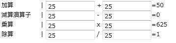

////

|metadata|
{
    "name": "xamcalculationmanager",
    "controlName": ["xamCalculationManager"],
    "tags": ["Calculations"],
    "guid": "749d7fd3-c573-4ce8-8e81-f8ce98409e59",  
    "buildFlags": [],
    "createdOn": "2016-05-25T18:21:54.5291226Z"
}
|metadata|
////

= xamCalculationManager

== トピックの概要

== 目的

このトピックでは、xamCalculationManager コントロールを紹介し、コントロールの機能を説明します。

== 概要

xamCalculationManager コントロールでは、異なるコントロール間で再利用される可能性のある複雑な数式を作成できます。これらの数式のソースおよびターゲットは、項目計算の任意のオブジェクトの任意のパブリック プロパティになることができます。集計関数を実行する項目 (Sum および Averageなど) のリストを使用して数式を作成することもできます。

xamCalculationManager には、Excel 関数をエミュレートする多数の定義済み関数があり、さらにカスタム関数を登録することも可能です。xamCalculationManager は、ソースおよびターゲットの依存関係に基づき、数式を解決する順序を自動的に判断します。

以下のスクリーンショットには、xamCalculationManager によって計算される数式の結果が表示されます。

*関連トピック:*

* link:xamcalculationmanager-getting-started-with-xamcalculationmanager.html[xamCalculationManager を使用した作業の開始]
* link:xamcalculationmanager-overview-of-item-calculator.html[項目計算式の概要]
* link:xamcalculationmanager-overview-of-list-calculator.html[リスト計算式の概要]
* link:xamcalculationmanager-create-xamcalculationmanager-custom-functions.html[xamCalculationManager カスタム関数の作成]
* link:xamcalculationmanager-api-overview.html[API の概要]