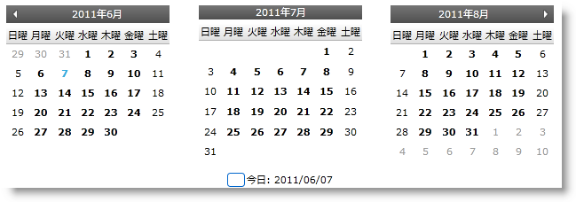
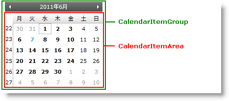
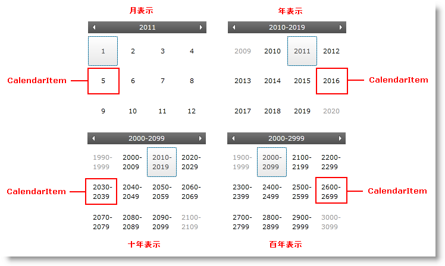
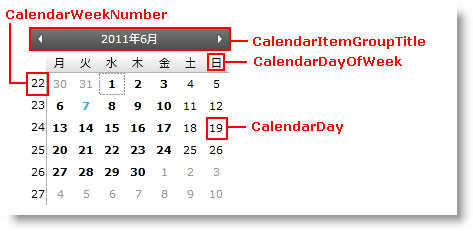
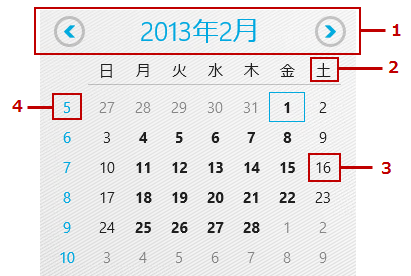

////

|metadata|
{
    "name": "xamcalendar-about",
    "controlName": ["xamCalendar"],
    "tags": ["Editing","Getting Started","Recurrences","Selection"],
    "guid": "310bc25c-0ae4-4dc6-9703-da421bb9db5e",  
    "buildFlags": [],
    "createdOn": "2016-05-25T18:21:54.6011244Z"
}
|metadata|
////

= xamCalendar について

link:{ApiPlatform}controls.editors.xamcalendar{ApiVersion}~infragistics.controls.editors.xamcalendar.html[xamCalendar] コントロールは、ひとつまたは複数の CalendarItemGroup 項目を表示するように設計されています (以下の図 3)。これらのグループはコントロールの CurrentMode プロパティに基づいて、Days、Months、Years、Decades または Centuries を表示できます。このコントロールによってユーザーは以下を実行できます。

* ナビゲート - ヘッダー領域の矢印をクリックすることによって
* 拡大/縮小 - CalendarItemGroupTitle (縮小) または CalendarItems (拡大) をクリックすることで link:{ApiPlatform}controls.editors.xamcalendar{ApiVersion}~infragistics.controls.editors.calendarbase~currentmode.html[CurrentMode] を変更することによって
* 選択 - ひとつまたは複数の CalendarItems を選択することによってこの機能は、CurrentMode= link:{ApiPlatform}controls.editors.xamcalendar{ApiVersion}~infragistics.controls.editors.xamcalendar~mincalendarmode.html[MinCalendarMode] の時に使用できます。それ以外の場合にはコントロールは拡大します。

ifdef::sl,wpf[]

endif::sl,wpf[]

ifdef::win-rt[]
image::images/xamCalendar_RT_About_1.png[]
endif::win-rt[]

====== 図 1: xamCalendar コントロールの実装例

== 主要機能

xamCalendar コントロールは以下の主要機能を提供します。

* 複数の予定表
* 異なるビュー
* 単一または複数日付の選択

それぞれは以下に説明します。

== 複数の予定表

xamCalendar はひとつまたは複数の CalendarItemGroups を表示できます。

ifdef::sl,wpf[]

endif::sl,wpf[]

ifdef::win-rt[]
image::images/xamCalendar_RT_About_2.png[]
endif::win-rt[]

====== 図 2: CalendarItemGroup

[start=1]
. CalendarItemGroup
[start=2]
. CalendarItemArea

注*:* ひとつのコントロールのすべての CalendarItemGroups は、xamCalendar に設定されている同じズーム モードを使用します。異なるズーム モードで CalendarItemGroups を表示する必要がある場合には、複数の XamCalendar コントロールが必要です。

== 異なるビュー

CalendarItemGroups は以下のビューを表示できます (図 3)。

* 日単位の表示 (デフォルト) 
* 月単位の表示
* 年単位の表示
* 10 年単位の表示
* 世紀単位の表示

ifdef::sl,wpf[]

endif::sl,wpf[]

ifdef::win-rt[]

[cols="a,a"]
|====
|image::images/xamCalendar_RT_About_MonthView.png[]
|image::images/xamCalendar_About_YearView.png[]

|月単位の表示 

1. CalendarItem
|年単位の表示 

1. CalendarItem

|image::images/xamCalendar_About_DecadeView.png[]
|image::images/xamCalendar_About_CenturyView.png[]

|10 年単位の表示 

1. CalendarItem
|世紀単位の表示 

1. CalendarItem

|====

endif::win-rt[]

====== 図 3: xamCalendar ビュー

ビューは、xamCalendar コントロールの CurrentMode プロパティによって管理されます。

ifdef::sl,wpf[]

endif::sl,wpf[]

ifdef::win-rt[]

endif::win-rt[]

====== 図 4: 日単位の表示の CalendarItemGroup 要素

ifdef::win-rt[]
[start=1]
. CalendarItemGroupTitle
[start=2]
. CalendarDayOfWeek
[start=3]
. CalendarDay
[start=4]
. CalendarWeekNumber

endif::win-rt[]

CalendarItemGroupTitle でヘッダーをクリックすることによって、ユーザーは年内の月、10年内の年、世紀内の10年、1000年内の世紀を表示するように拡大できます。CalendarItem (図 3) をクリックすることによって、ユーザーは月内の日が表示されるまで拡大できます。

== 単一または複数日付の選択

xamCalendar は、単一の日付選択だけでなく、複数の日付選択をサポートします。SelectionMode プロパティを設定することによってこの動作を制御し、 link:{ApiPlatform}controls.editors.xamcalendar{ApiVersion}~infragistics.controls.editors.calendarbase~selecteddates.html[SelectedDates] プロパティと link:{ApiPlatform}controls.editors.xamcalendar{ApiVersion}~infragistics.controls.editors.calendarbase~selecteddate.html[SelectedDate] プロパティから選択を取得できます。

== 関連トピック

link:xamcalendar-restricting-date-selection.html[日付選択制限を実装]

link:xamcalendar-using.html[xamCalendar の使用]