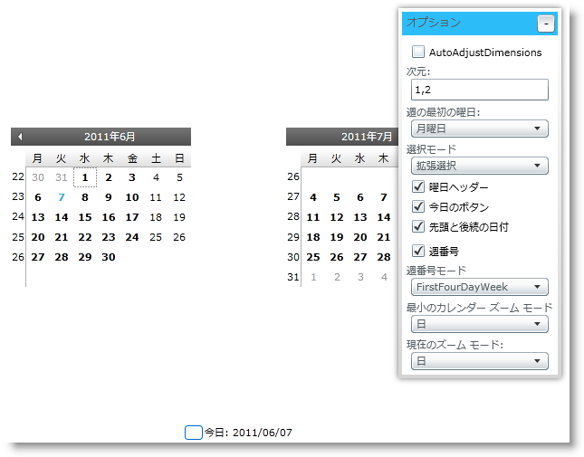
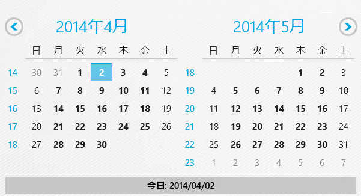

////

|metadata|
{
    "name": "xamcalendar-using",
    "controlName": ["xamCalendar"],
    "tags": ["Editing","Getting Started","How Do I","Selection"],
    "guid": "a45cb446-f02a-41cf-b7f1-4856b7bb84da",  
    "buildFlags": [],
    "createdOn": "2016-05-25T18:21:54.6121244Z"
}
|metadata|
////

= xamCalendar の使用

このトピックは、 link:{ApiPlatform}controls.editors.xamcalendar{ApiVersion}~infragistics.controls.editors.xamcalendar.html[xamCalendar] コントロールとそのモードおよびプロパティについて説明します。最後に、コントロールの主なプロパティを使用して外観と機能をカスタマイズする方法を説明するためにコード例を提供します。

トピックは以下のとおりです。

* <<Intro,概要>>
* <<DisplayModes,表示モード>>
* <<SelectionModes,選択モード>>
* <<DisplayProperties,xamCalendar コントロールの表示プロパティ>>

** <<VisibilityProperties,表示状態プロパティ>>
** <<Look-and-Feel,ルック アンド フィール プロパティ>>

* <<CodeExample,コード例>>
* <<RelatedTopics,関連トピック>>

[[Intro]]

== 概要

ifdef::sl,wpf[]
xamCalendar コントロールは、Microsoft Vista Common Controls Calendar クラスの機能と同様の機能を提供します。
endif::sl,wpf[]

ifdef::sl,wpf[]

endif::sl,wpf[]

ifdef::win-rt[]

endif::win-rt[]

====== 図 1: xamCalendar コントロールの実装例

[[DisplayModes]]

== 表示モード

このコントロールは、より迅速なナビゲーションと選択の変更を容易にするために拡大/縮小を可能にするナビゲーション機能を提供します。ズーム モードの制御には以下の 2 つのプロパティがあります。

* link:{ApiPlatform}controls.editors.xamcalendar{ApiVersion}~infragistics.controls.editors.calendarbase~currentmode.html[CurrentMode] - 現在の表示モードを制御します (Day、Month、Year、Decade または Century)。
* link:{ApiPlatform}controls.editors.xamcalendar{ApiVersion}~infragistics.controls.editors.xamcalendar~mincalendarmode.html[MinCalendarMode] - ユーザーがナビゲートできる最低のズーム レベルを制御します。

[[SelectionModes]]

== 選択モード

このコントロールは、単一選択モードと複数選択モードをサポートします。これらは、 link:{ApiPlatform}controls.editors.xamcalendar{ApiVersion}~infragistics.controls.editors.xamcalendar~selectionmode.html[SelectionMode] プロパティから管理されます。Extended または Range などの複数選択モードを使用する時に、 link:{ApiPlatform}controls.editors.xamcalendar{ApiVersion}~infragistics.controls.editors.calendarbase~selecteddates.html[SelectedDates] プロパティを使用して、選択をアクセス/変更できます。このコントロールには主に単一選択モードで使用される link:{ApiPlatform}controls.editors.xamcalendar{ApiVersion}~infragistics.controls.editors.calendarbase~selecteddate.html[SelectedDate] プロパティもあります。複数選択モードでは、このプロパティは最初の選択された日付を返します。

[[DisplayProperties]]

== xamCalendar コントロールの表示プロパティ

[[VisibilityProperties]]

== 表示状態プロパティ

以下のプロパティは、さまざまな UI 要素の表示状態を制御します。

* link:{ApiPlatform}controls.editors.xamcalendar{ApiVersion}~infragistics.controls.editors.calendarbase~leadingandtrailingdatesvisibility.html[LeadingAndTrailingDatesVisibility] - 現在の月に属さない日付の表示状態を構成します (CurrentMode が Days に設定されると適用できます)
* link:{ApiPlatform}controls.editors.xamcalendar{ApiVersion}~infragistics.controls.editors.calendarbase~weeknumbervisibility.html[WeekNumberVisibility] - 週番号の可視性をコントロールします (週番号は link:{ApiPlatform}controls.editors.xamcalendar{ApiVersion}~infragistics.controls.editors.xamcalendar~weekrule.html[WeekRule] プロパティを設定することによって計算されます)。
* link:{ApiPlatform}controls.editors.xamcalendar{ApiVersion}~infragistics.controls.editors.xamcalendar~todaybuttonvisibility.html[TodayButtonVisibility] - TodayButton の表示状態を構成します
* link:{ApiPlatform}controls.editors.xamcalendar{ApiVersion}~infragistics.controls.editors.calendarbase~dayofweekheadervisibility.html[DayOfWeekHeaderVisibility] - カレンダーの曜日ヘッダーの可視性を構成します (表示形式は、 link:{ApiPlatform}controls.editors.xamcalendar{ApiVersion}~infragistics.controls.editors.calendarbase~dayofweekheaderformat.html[DayOfWeekHeaderFormat] プロパティでコントロールされます)。

コントロールの link:{ApiPlatform}controls.editors.xamcalendar{ApiVersion}~infragistics.controls.editors.calendarbase~dimensions.html[Dimensions] プロパティを設定することによって、 (行/列数に基づいて) 表示される CalendarItemGroup インスタンスの数を制御できます (上記の図 1 で、Dimensions プロパティは 1 行 x 2 列に設定されます)。また、 link:{ApiPlatform}controls.editors.xamcalendar{ApiVersion}~infragistics.controls.editors.calendarbase~autoadjustdimensions.html[AutoAdjustDimensions] プロパティを有効にすることによって、追加の CalendarItemGroups でパネルで使用可能なスペースを自動的に埋めることができます。

[[Look-and-Feel]]

== ルック アンド フィール プロパティ

以下のプロパティはカレンダーのルック アンド フィールを制御します。最初のプロパティ ResourceProvider を除き、すべてスタイル タイプのプロパティは以下のとおりです。

* link:{ApiPlatform}controls.editors.xamcalendar{ApiVersion}~infragistics.controls.editors.calendarbase~resourceprovider.html[ResourceProvider]
* link:{ApiPlatform}controls.editors.xamcalendar{ApiVersion}~infragistics.controls.editors.calendarbase~calendardaystyle.html[CalendarDayStyle] - CalendarDay は個々の日を表す要素です (コントロールの CurrentMode が Days に設定される時に限り使用される) 
* link:{ApiPlatform}controls.editors.xamcalendar{ApiVersion}~infragistics.controls.editors.calendarbase~calendaritemstyle.html[CalendarItemStyle] - CalendarItem は日付の範囲を表す要素です (コントロールの CurrentMode が Days 以外の何かに設定される時に限り使用される) 
* link:{ApiPlatform}controls.editors.xamcalendar{ApiVersion}~infragistics.controls.editors.calendarbase~scrollnextrepeatbuttonstyle.html[ScrollNextRepeatButtonStyle] と link:{ApiPlatform}controls.editors.xamcalendar{ApiVersion}~infragistics.controls.editors.calendarbase~scrollpreviousrepeatbuttonstyle.html[ScrollPreviousRepeatButtonStyle] - CalendarDays または CalendarItems を前後にスクロールするために使用される 2 つの RepeatButtons のスタイルを制御します。
* link:{ApiPlatform}controls.editors.xamcalendar{ApiVersion}~infragistics.controls.editors.calendarbase~todaybuttonstyle.html[TodayButtonStyle] - 現在に日付を選択してナビゲートするボタンのスタイルを制御します。

[[CodeExample]]

== コード例

以下のコード例は、上記の図 1 に示される xamCalendar コントロールの設定を示します。

*XAML の場合:*

----
<ig:XamCalendar x:Name="myCalendar" 
        DayOfWeekHeaderFormat="Abbreviated"                         
        CurrentMode="Days"
        Dimensions="1,2"                        
        FirstDayOfWeek="Monday"
        AutoAdjustDimensions="
        DayOfWeekHeaderVisibility="Visible" 
        MinCalendarMode="Days"                        
        SelectionMode="Extended"
        TodayButtonVisibility="Visible"
        WeekNumberVisibility="Visible"
        LeadingAndTrailingDatesVisibility="Visible"
        WeekRule="FirstFullWeek"/>
----

*Visual Basic の場合:*

----
Imports Infragistics.Controls.Editors
...
Dim myCalendar = New XamCalendar()
myCalendar.Name = "myCalendar"
myCalendar.DayOfWeekHeaderFormat = DayOfWeekHeaderFormat.Abbreviated
myCalendar.CurrentMode = CalendarZoomMode.Days
myCalendar.Dimensions =
    New Infragistics.Controls.Editors.Primitives.CalendarDimensions(1, 2)
myCalendar.FirstDayOfWeek = System.DayOfWeek.Monday
myCalendar.AutoAdjustDimensions = False
myCalendar.DayOfWeekHeaderVisibility = Visibility.Visible
myCalendar.MinCalendarMode = CalendarZoomMode.Days
myCalendar.SelectionMode = CalendarDateSelectionMode.Extended
myCalendar.TodayButtonVisibility = Visibility.Visible
myCalendar.WeekNumberVisibility = Visibility.Visible
myCalendar.LeadingAndTrailingDatesVisibility = Visibility.Visible
myCalendar.WeekRule = System.Globalization.CalendarWeekRule.FirstFullWeek
...
----

*C# の場合:*

----
using Infragistics.Controls.Editors;
...
var myCalendar = new XamCalendar();
myCalendar.Name = "myCalendar";
myCalendar.DayOfWeekHeaderFormat = DayOfWeekHeaderFormat.Abbreviated;
myCalendar.CurrentMode = CalendarZoomMode.Days;
myCalendar.Dimensions =
    new Infragistics.Controls.Editors.Primitives.CalendarDimensions(1, 2);
myCalendar.FirstDayOfWeek = System.DayOfWeek.Monday;
myCalendar.AutoAdjustDimensions = false;
myCalendar.DayOfWeekHeaderVisibility = Visibility.Visible;
myCalendar.MinCalendarMode = CalendarZoomMode.Days;
myCalendar.SelectionMode = CalendarDateSelectionMode.Extended;
myCalendar.TodayButtonVisibility = Visibility.Visible;
myCalendar.WeekNumberVisibility = Visibility.Visible;
myCalendar.LeadingAndTrailingDatesVisibility = Visibility.Visible;
myCalendar.WeekRule = System.Globalization.CalendarWeekRule.FirstFullWeek; 
...
----

[[RelatedTopics]]

== 関連トピック

link:xamcalendar-about.html[xamCalendar について]

link:xamcalendar-restricting-date-selection.html[日付選択制限を実装]