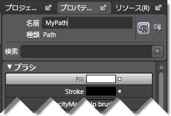

////

|metadata|
{
    "name": "xamcarousel-creating-a-named-path-on-the-artboard",
    "controlName": ["xamCarousel"],
    "tags": [],
    "guid": "{BEF00F5A-53BF-4DD6-A208-D34516E8A180}",  
    "buildFlags": [],
    "createdOn": "2012-01-30T19:39:52.0017535Z"
}
|metadata|
////

= アートボードで名前を指定したパスを作成

xamCarouselPanel™、xamCarouselListBox™、xamDataCarousel™、および xamDataPresenter™ のカルーセル ビュー コントロールは項目を表示するためにパスを使用します。これらのコントロールはパスを指定しない場合には組み込みパスを使用します。ただし、これらのコントロールのために固有のカスタム パスを作成できます。Microsoft® Expression® Blend を使用してパスを描画し、次に Visual Studio プロジェクトにインポートすることができます。

以下の手順に従って、Expression Blend のアートボードで名前を指定したパスを作成します。

[start=1]
. 新しいプロジェクトを作成します。
[start=2]
. 左手のツールボックス領域から、ペン ツールを選択します。

image::images/xamCarousel_Creating_a_Named_Path_on_the_Artboard_01.png[マウス オーバー ペン ツールのある Expression Blend ツールボックス]

[start=3]
. アートボードでパスを描画します。アートボード上の複数の領域をクリックするだけで、Blend が点を結び、パスを作成します。

image::images/xamCarousel_Creating_a_Named_Path_on_the_Artboard_02.png[Expression Blend アートボードに作成したパス]

[start=4]
. 右手の [プロパティ] タブで、[名前] テキストボックスでパス名を指定します。

[start=5]
. Expression Blend で名前を指定したパスが作成されました。カルーセル コントロールのいずれかにこのパスを割り当てることについての詳細は、 link:xamcarousellistbox-setting-a-path-for-xamcarousellistbox-to-use.html[「xamCarouselListBox のパスを使用するように設定」]または link:xamcarouselpanel-setting-a-path-for-xamcarouselpanel-to-use.html[「xamCarouselPanel パスを使用するように設定」]を参照してください。