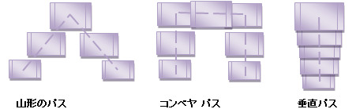

////

|metadata|
{
    "name": "xamcarousel-path",
    "controlName": ["xamCarousel"],
    "tags": ["How Do I"],
    "guid": "{CA99FA72-63C5-4933-ABD1-5166D5E4E9AE}",  
    "buildFlags": [],
    "createdOn": "2012-01-30T19:39:52.0137559Z"
}
|metadata|
////

= パス

Microsoft® Windows® Presentation Foundation は、Path XAML 要素を中心に構築された形やジオメトリに対するサポートが拡張されています。これが link:xamdata-terms-presentation-formats-carousel-view.html[カルーセル ビュー]体験を提供する Infragistics の非常に革新的なコントロールセットにつながることもごく当然のことでした。link:{RootAssembly}{ApiVersion}~infragistics.windows.controls.carouselviewsettings~itempath.html[ItemPath] プロパティは、xamCarouselPanel とこのビューに基づいて構築されたその他すべてのコントロールでの作業の基本です (概要は、 link:xamcarousel-terms-architecture.html[アーキテクチャ]を参照してください)。

image::images/Terms_Path_01.png[xamcarousel コントロールでのパスの実例]

効果的なパスを設定することで、エンド ユーザーをいかに満足させることができるのかを知ることは容易です。XAMLで、Path 要素から開始します。この要素で Name プロパティを設定して、後で使用してカルーセル対応のコントロールから参照することができます。*XAML の場合:*

----
<Path Name="smilePath"
  Width="Auto"
  Height="Auto"
  Stretch="Fill"
  Margin="0,0,0,0"
  VerticalAlignment="Top"
  HorizontalAlignment="Left"
  Data="M 12,192 C12,192 61,444 239,444 417,444 487,198 487,198"
  Opacity="1" />
----

次に、コントロールの ViewSettings プロパティを通して公開される link:{RootAssembly}{ApiVersion}~infragistics.windows.controls.carouselviewsettings.html[CarouselViewSettings] で、この Path 要素を ItemPath プロパティに割り当てます。以下の例の XAML は xamCarouselPanel コントロールと上記で定義したパスを関連付けます。*XAML の場合:*

----
<igWindows:XamCarouselPanel.ViewSettings>
        <igWindows:CarouselViewSettings
          ItemPath="{StaticResource smilePath}" />
</igWindows:XamCarouselPanel.ViewSettings>
----

Microsoft® Expression® Blend ArtBoard を使用してパスを作成する手順ごとの詳細なガイドについては、 link:xamcarousel-creating-a-named-path-on-the-artboard.html[アートボードで名前を指定したパスを作成]を参照してください。

代わりに XAML で直接パスを指定しようとする場合、Framework クラス、System.Windows.Shapes.Path およびその Data プロパティについては、.NET Framework 3.0 SDK のドキュメントを参照してください。Data プロパティのドキュメントは、.NET Framework 3.0 SDK ドキュメントにもある「PathGeometry マークアップ構文」ヘルプ トピックにリンクします。一見すると、パスのジオメトリの構文をこれまで使用したことがない場合には気後れするかもしれませんが、これらの構文に慣れると、必要な場合には XAML で直接パスを編集できるようになります。

円または楕円のコースを辿るとしても、あらゆるパスは開始点と終了点で定義されます。これらの開始点と終了点は、Path 要素の Data プロパティに指定される最初の座標と最後の座標に基づいています。カルーセル項目が一方の端に現れて、エンド ユーザーがリストをナビゲートするにしたがってエンドユーザーの目の前を順次移動し、次にもう一方の端で消えます。項目のリストがなくなると、カルーセルが空になります。コントロールの ViewSettings で link:{RootAssembly}{ApiVersion}~infragistics.windows.controls.carouselviewsettings~islistcontinuous.html[IsListContinuous] を設定することにより、これを回避できます。

カルーセル項目のなめらかなアニメートの動作を処理する必要はまったくありません。コントロールのインフラストラクチャがユーザーに代わって調整します。パス定義の柔軟性によって、データを提示する際に最適な方法でカルーセルリスト項目を自由にレイアウトできます。以下の画像は、創造力を刺激するいくつかのパスのレイアウトを例示しています。

パスは単に抽象的というだけでなく、スタイル可能です。パスを描画するために link:{RootAssembly}{ApiVersion}~infragistics.windows.controls.carouselviewsettings~itempathrenderpen.html[ItemPathRenderPen] プロパティを使用し、パスを塗りつぶすために link:{RootAssembly}{ApiVersion}~infragistics.windows.controls.carouselviewsettings~itempathrenderbrush.html[ItemPathRenderBrush] プロパティを使用します。これらのプロパティは両方ともコントロールの ViewSettings プロパティ上にあります。これらのプロパティによって、カルーセル項目の下にあるスペースを定型化することができます。これらのプロパティは、パスのトラブルシューティングのためにも使用できます。これらのプロパティによって、ランタイムにコントロールによって使用される実際のパスを確認することを可能にするからです。

image::images/Terms_Path_03.png[xamcarouselpanel の実例]

link:{RootAssembly}{ApiVersion}~infragistics.windows.controls.carouselviewsettings~itemsperpage.html[ItemsPerPage] プロパティを使用して一度にパスに表示される項目数を指定できます。表示される項目数が増えると、狭い間隔で項目が表示されます。表示される項目数が減ると項目間の間隔は広くなります。以下の画像は 5 つの項目を表示する xamCarouselPanel コントロールです。

image::images/Terms_Path_04.png[項目の間のスペースがより大きい xamcarouselpanel の実例]

カルーセル対応のコントロールで項目を配置する際の密度を調整するもうひとつの方法は、 link:{RootAssembly}{ApiVersion}~infragistics.windows.controls.carouselviewsettings~itempathprefixpercent.html[ItemPathPrefixPercent] プロパティと link:{RootAssembly}{ApiVersion}~infragistics.windows.controls.carouselviewsettings~itempathsuffixpercent.html[ItemPathSuffixPercent] プロパティを使用することです。これらのプロパティによって、既定のパスに沿ってカルーセル項目を間隔を狭めて配置する、または間隔を空けて配置することができます。カルーセル項目が現れるパスの開始点と終了点からオフセットを指定します。これはレイアウトでカルーセル項目に使用可能なパスの長さに効果的に短縮します。以下の画像では、これらの両方のプロパティが 0.4 (40%) の最大値に増やされており、カルーセル項目間の間隔への影響を確認することができます。

image::images/Terms_Path_05.png[項目の間のスペースが小さい xamcarouselpanel の実例]

ItemPath は、カルーセル対応コントロールで最も強力なプロパティのひとつです。選択するパスは、エンド ユーザーのアプリケーションでの経験に著しい影響を与えます。

学習する次の概念は link:xamcarousel-path-effects.html[パスエフェクト]で、トランジション効果と実際のワークスペースの感覚によってパスを生き生きとしたものにすることができます。