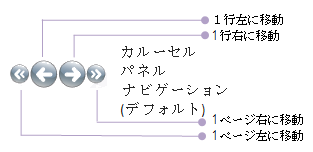
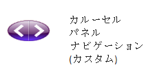

////

|metadata|
{
    "name": "xamcarousel-terms-carousel-panel-navigator",
    "controlName": ["xamCarousel"],
    "tags": ["Getting Started"],
    "guid": "{4C9AFF9B-DC78-4F4E-92B3-928623B458F3}",  
    "buildFlags": [],
    "createdOn": "2012-01-30T19:39:52.0197571Z"
}
|metadata|
////

= CarouselPanelNavigator

エンド ユーザーは、以下に示す link:{RootAssembly}{ApiVersion}~infragistics.windows.controls.carouselpanelnavigator.html[CarouselPanelNavigator] パネルを使用して、カルーセル項目をナビゲートできます。デフォルトで、項目リストの先頭、リストの前の項目、リストの次の項目、項目リストの最後に移動するための 4 つのボタンがあります。

ViewSettings 上の link:{RootAssembly}{ApiVersion}~infragistics.windows.controls.carouselviewsettings~carouselpanelnavigatorstyle.html[CarouselPanelNavigatorStyle] プロパティに固有のスタイル リソースをバインドすることによって、CarouselPanelNavigator の外観をカスタマイズできます。上記の図に表示するボタンの横に標準的な名称が表示されています。ボタンのスタイルを変更したいだけの場合には、スタイリングを再定義したいボタン名にスタイルリソースのキーを設定できます。以下の図に示すように、ボタンの番号や位置をはじめとする CarouselPanelNavigator のコンテンツを変更するために、固有のコントロールのテンプレートを関連付けることも可能です。

ボタンが Adorner レイヤーに配置されている場合、ボタンはカルーセル項目の前に常に表示されます。CarouselPanelNavigator を非表示にしたい場合、ViewSettings で link:{RootAssembly}{ApiVersion}~infragistics.windows.controls.carouselviewsettings~isnavigatorvisible.html[IsNavigatorVisible] プロパティを設定します。