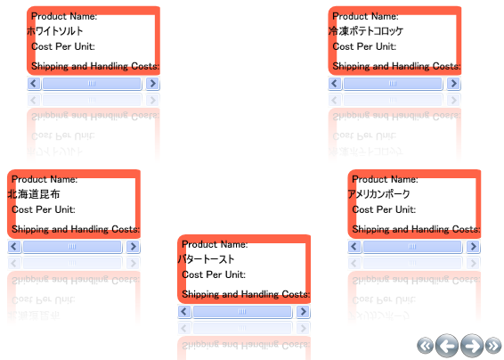

////

|metadata|
{
    "name": "xamcarousellistbox-editing-the-carousellistboxitem-template",
    "controlName": ["xamCarouselListBox"],
    "tags": ["Data Presentation","Templating"],
    "guid": "{A94D8983-45BC-429F-9353-3F12D76211AF}",  
    "buildFlags": [],
    "createdOn": "2012-01-30T19:39:52.0357603Z"
}
|metadata|
////

= CarouselListBoxItem テンプレートを編集

link:{RootAssembly}{ApiVersion}~infragistics.windows.controls.carousellistboxitem.html[CarouselListBoxItem] は、xamCarouselListBox™ コントロール内に含まれる項目の選択可能なコンテナーです。CarouselListBoxItem は、ListBoxItem から派生する link:{RootAssembly}{ApiVersion}~infragistics.windows.controls.carouselpanelitem.html[CarouselPanelItem] から派生します。xamCarouselListBox には、CarouseListBoxItem のコレクションが含まれます。これらの項目を手動で作成することができます。または、データ バインドされている場合には、xamCarouselListBox が項目を作成します。

テンプレートは非常に複雑な場合があります。コントロールのテンプレートには特定のコントロールを描画するために必要なすべての設定が含まれます。

これらの手順に従って、CarouselListBoxItem テンプレートを修正します。xamCarouselListBox で各項目の周囲に境界線を配置します。このトピックは、 link:xamcarousellistbox-getting-started-with-xamcarousellistbox.html[xamCarouselListBox をアプリケーションに追加] および link:xamcarousellistbox-working-with-the-itemtemplate.html[ItemTemplate での作業] のトピックのタスクを完了していることが前提となります。

[start=1]
. 「ItemTemplate での作業」トピックのコードを修正します。DataTemplate で Label の Background および Foreground 設定を削除します。修正した DataTemplate は以下のコードのようになるはずです。

*XAML の場合:*

----
<DataTemplate x:Key="SimpleDataTemplate">
        <StackPanel>
                <Label Content="Product Name:"/>
                <ContentPresenter Content="{Binding XPath=ProductName}" />
                <Label Content="Cost Per Unit:"/>
                <ContentPresenter Content="{Binding XPath=CostPerUnit}" />
                <Label Content="Shipping and Handling Costs:"/>
                <ContentPresenter Content="{Binding XPath=ShipAndHandle}" />
        </StackPanel>
</DataTemplate>
----

[start=2]
. Border を作成して、BorderBrush を Tomato に、BorderThickness を 10 に設定します。リンク先の link:resources-editing-the-carousellistboxitem-template.html[スタイル テンプレート]全体をプロジェクトにコピーすることができます。

*XAML の場合:*

----

----

[start=3]
. プロジェクトをビルドして実行します。xamCarouselListBox の各項目の周囲に赤い境界線が表示して以下の図のようになります。

