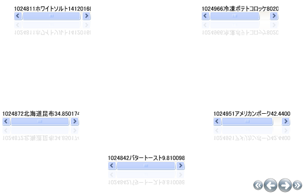

////

|metadata|
{
    "name": "xamcarousellistbox-getting-started-with-xamcarousellistbox",
    "controlName": ["xamCarouselListBox"],
    "tags": ["Data Presentation","Getting Started"],
    "guid": "{CD0FEF23-0169-4FDA-8629-FB6D652AD1FD}",  
    "buildFlags": [],
    "createdOn": "2012-01-30T19:39:52.0387609Z"
}
|metadata|
////

= xamCarouselListBox をアプリケーションに追加

新しいコントロールで作業を初めて開始する時にはどこから始めれば良いのかわからない場合があります。このトピックは、xamCarouselListBox コントロールを作成して、XAML を使用してデータ バインドする方法を最初から説明します。

xamCarouselListBox コントロールはパスに沿って項目を配置します。このパスを変更するには、 link:xamcarousellistbox-setting-a-path-for-xamcarousellistbox-to-use.html[「xamCarouselListBox のパスを使用するように設定」]を参照してください。データ バインディング オプションの詳細は、「全般的なプログラミングの概念」の link:generalconcepts-data-binding.html[「データ バインディング」]セクションを参照してください。

[start=1]
. Microsoft® Windows® Presentation Foundation Window または Page プロジェクトを作成します。
[start=2]
. xamCarouselListBox により簡単にアクセスするために、以下の名前空間宣言を開始の Page タグまたは Window タグ内に配置します。

*XAML の場合:*

----
xmlns:igWindows="http://infragistics.com/Windows"
----

[start=3]
. XmlDataProvider を定義するリソース セクションを作成します。XmlDataProvider は link:resources-orders.html[Orders] XML ファイルを参照します。Grid パネル内に以下の XAML を配置します。 

*XAML の場合:*

----
<Grid.Resources>
        <XmlDataProvider Source="../Data/Orders.xml" 
          x:Key="OrderData" XPath="/Orders" />
</Grid.Resources>
----

[start=4]
. XamCarouselListBox のインスタンスを作成して、前述の手順で作成された XmlDataProvider に ItemSource プロパティを設定します。

*XAML の場合:*

----
<igWindows:XamCarouselListBox 
  ItemsSource="{Binding Source={StaticResource OrderData}, XPath=Order}"/>
----

[start=5]
. プロジェクトをビルドして実行します。xamCarouselListBox はデータが格納されて以下の画像のようになるはずです。

xamCarouselListBox コントロールはデータを表示しますが、最初はきれいに表示しません。xamCarouselListBox の ItemTemplate を作成することによって、これを修正できます。ItemTemplate を使用すると、必要に応じてデータを表示できます。ItemTemplate に関する詳細は、 link:xamcarousellistbox-working-with-the-itemtemplate.html[「ItemTemplate での作業」]を参照してください。

== 関連トピック

link:using-the-data-context-for-data-binding.html[データ バインドでデータ コンテキストを使用]