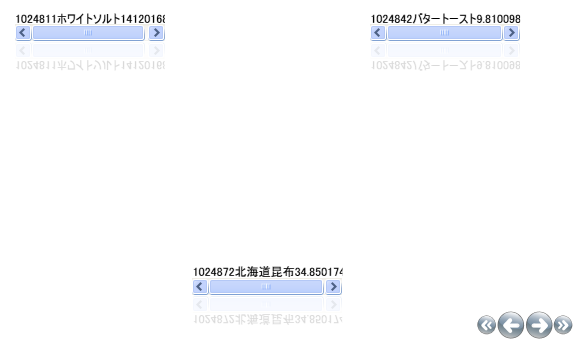

////

|metadata|
{
    "name": "xamcarousellistbox-limiting-the-number-of-items-on-xamcarousellistboxs-path",
    "controlName": ["xamCarouselListBox"],
    "tags": ["Data Presentation","Editing"],
    "guid": "{FCEBD7F7-D062-4B3A-83F1-2002F4A3B32A}",  
    "buildFlags": [],
    "createdOn": "2012-01-30T19:39:52.0407613Z"
}
|metadata|
////

= xamCarouselListBox のパスで項目数を制限

xamCarouselListBox™ コントロールはパスに沿って項目を表示します。CarouselViewSettings オブジェクトの link:{RootAssembly}{ApiVersion}~infragistics.windows.controls.carouselviewsettings~itemsperpage.html[ItemsPerPage] プロパティを修正することによって一度に表示される項目の量を変更します。

以下のコードは、一度に 3 つの項目を表示するように xamCarouselListBox コントロールを設定しています。

*XAML の場合:*

----
<igWindows:XamCarouselListBox.ViewSettings>
        <igWindows:CarouselViewSettings ItemsPerPage="3" />
</igWindows:XamCarouselListBox.ViewSettings>
----

link:xamcarousellistbox-getting-started-with-xamcarousellistbox.html[xamCarouselListBox をアプリケーションに追加] のトピックで開始の XamCarouselListBox タグ内にこのコードを配置すると、以下の画像のような結果になります。

