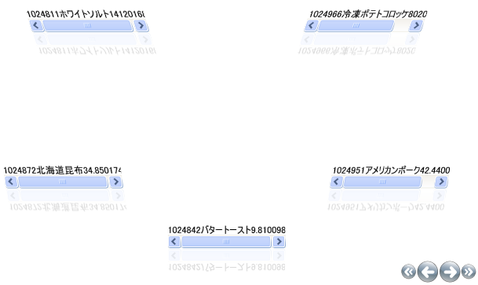
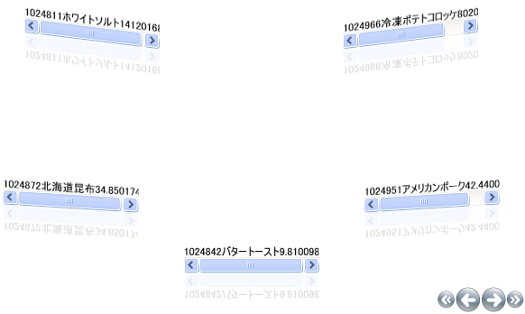

////

|metadata|
{
    "name": "xamcarousellistbox-modifying-the-skew-effect-of-items-on-xamcarousellistboxs-path",
    "controlName": ["xamCarouselListBox"],
    "tags": ["Data Presentation","Editing"],
    "guid": "{B40C7521-CC9F-466B-87B3-9CDE44746187}",  
    "buildFlags": [],
    "createdOn": "2012-01-30T19:39:52.0497631Z"
}
|metadata|
////

= xamCarouselListBox のパスで項目の傾斜効果を変更

xamCarouselListBox コントロールはパス上の項目を斜めにすることができます。X 軸または Y 軸のいずれかで個々に傾斜効果を設定できます。その他のパス エフェクト (不透明、スケール、Z-オーダー) と同じように、 link:{RootAssembly}{ApiVersion}~infragistics.windows.controls.carouselviewsettings.html[CarouselViewSettings] オブジェクトは link:{RootAssembly}{ApiVersion}~infragistics.windows.controls.skewanglexeffectstopcollection.html[SkewAngleXeffectStopCollection] および link:{RootAssembly}{ApiVersion}~infragistics.windows.controls.skewangleyeffectstopcollection.html[SkewAngleYeffectStopCollection] を公開します。さらに、その他の効果と同じように、 link:{RootAssembly}{ApiVersion}~infragistics.windows.controls.carouselviewsettings~skewanglexeffectstopdirectionproperty.html[SkewAngleXEffectStopDirection] プロパティと link:{RootAssembly}{ApiVersion}~infragistics.windows.controls.carouselviewsettings~skewangleyeffectstopdirectionproperty.html[SkewAngleYEffectStopDirection] プロパティを設定することによって、X および Y の傾斜両方に対して Horizontal、Vertical、または UseItemPath のいずれかに効果の方向を設定する必要があります。傾斜の値は、オブジェクトの回転を処理します。有効な値は -360 から +360 です。

[NOTE]
====
**注:** このトピックは、 link:xamcarousellistbox-getting-started-with-xamcarousellistbox.html[xamCarouselListBox をアプリケーションに追加]のタスクを完了していることが前提となります。
====

== 傾斜-X を修正

以下のコードは、パスに関連して X 軸に沿ってオブジェクトを傾斜します。最初の link:{RootAssembly}{ApiVersion}~infragistics.windows.controls.skewanglexeffectstop.html[SkewAngleXEffectStop] はパスの先頭 (オフセット 0) で 25 度傾斜します。中間点 (オフセット .5) で項目は傾斜されません。パスの最後 (オフセット 1) で項目は -25 度傾斜されます。

*XAML の場合:*

----
<igWindows:XamCarouselListBox.ViewSettings>
        <igWindows:CarouselViewSettings SkewAngleXEffectStopDirection="UseItemPath" 
          UseSkewing="True">
                <igWindows:CarouselViewSettings.SkewAngleXEffectStops>
                        <igWindows:SkewAngleXEffectStopCollection>
                                <igWindows:SkewAngleXEffectStop Offset="0" Value="25" />
                                <igWindows:SkewAngleXEffectStop Offset=".5" Value="0" />
                                <igWindows:SkewAngleXEffectStop Offset="1" Value="-25" />
                        </igWindows:SkewAngleXEffectStopCollection>
                </igWindows:CarouselViewSettings.SkewAngleXEffectStops>
        </igWindows:CarouselViewSettings>
</igWindows:XamCarouselListBox.ViewSettings>
----

== 傾斜-Y を修正

以下のコードは、パスに関連して Y 軸に沿ってオブジェクトを傾斜します。最初の *SkewAngleYEffectStop* はパスの先頭 (オフセット 0) で項目を 10 度傾斜します。中間点 (オフセット .5) で項目は傾斜されません。パスの最後 (オフセット 1) で項目は -10 度傾斜されます。

*XAML の場合:*

----
<igWindows:XamCarouselListBox.ViewSettings>
        <igWindows:CarouselViewSettings SkewAngleYEffectStopDirection="UseItemPath" 
          UseSkewing="True">
                <igWindows:CarouselViewSettings.SkewAngleYEffectStops>
                        <igWindows:SkewAngleYEffectStopCollection>
                                <igWindows:SkewAngleYEffectStop Offset="0" Value="10" />
                                <igWindows:SkewAngleYEffectStop Offset=".5" Value="0" />
                                <igWindows:SkewAngleYEffectStop Offset="1" Value="-10" />
                        </igWindows:SkewAngleYEffectStopCollection>
                </igWindows:CarouselViewSettings.SkewAngleYEffectStops>
        </igWindows:CarouselViewSettings>
</igWindows:XamCarouselListBox.ViewSettings>
----

