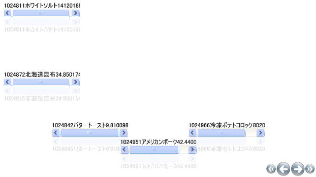

////

|metadata|
{
    "name": "xamcarousellistbox-setting-padding-on-xamcarousellistboxs-path",
    "controlName": ["xamCarouselListBox"],
    "tags": ["Data Presentation","Editing"],
    "guid": "{F7D25D04-100C-4E88-9FDE-BF6C7BBFF023}",  
    "buildFlags": [],
    "createdOn": "2012-01-30T19:39:52.0537639Z"
}
|metadata|
////

= xamCarouselListBox のパスでパディングを設定

xamCarouselListBox™ のパスの前後にバッファ ゾーンを配置できます。xamCarouselListBox は、パスに沿ってコントロールのレイアウトを計算するときにこのバッファ ゾーン、つまりパディングを使用します。

以下の画像は、パスのプレフィックスとサフィックスの機能を例示します。

image::images/xamCarousel_Setting_a_Path_Padding_01.png[xamcarousellistbox のパスのプレフィックスとサフィックス機能]

以下のコードを使用して、 link:{RootAssembly}{ApiVersion}~infragistics.windows.controls.carouselviewsettings.html[CarouselViewSettings] の link:{RootAssembly}{ApiVersion}~infragistics.windows.controls.carouselviewsettings~itempathprefixpercent.html[ItemPathPrefixPercent] プロパティと link:{RootAssembly}{ApiVersion}~infragistics.windows.controls.carouselviewsettings~itempathsuffixpercent.html[ItemPathSuffixPercent] プロパティを指定します。

*XAML の場合:*

----
<igWindows:XamCarouselListBox.ViewSettings>
        <igWindows:CarouselViewSettings ItemPathPrefixPercent=".2" 
          ItemPathSuffixPercent=".4" />
</igWindows:XamCarouselListBox.ViewSettings>
----

このコードを  link:xamcarousellistbox-getting-started-with-xamcarousellistbox.html[xamCarouselListBox をアプリケーションに追加] トピックに適用すると、以下の画像のように EarthQuake Pills レコードの後に大量のパディングが挿入されることになります。

