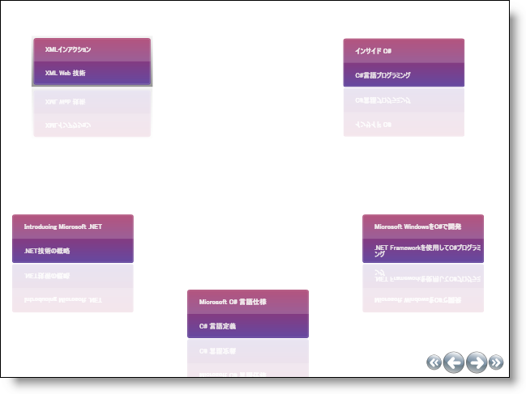

////

|metadata|
{
    "name": "xamcarousellistbox-understanding-xamcarousellistbox",
    "controlName": ["xamCarouselListBox"],
    "tags": ["Data Presentation","Getting Started"],
    "guid": "{DDA4B679-1789-4370-B5B2-8C8837655FE6}",  
    "buildFlags": [],
    "createdOn": "2012-01-30T19:39:52.0557643Z"
}
|metadata|
////

= xamCarouselListBox について

xamCarouselListBox™ コントロールは、xamCarouselPanel™ コントロールに似ています。xamCarouselListBox は、指定した link:xamcarousel-path.html[パス]に沿って項目を配置するためにその ItemsPanel として xamCarouselPanel を使用する派生 Selector コントロールです。xamCarouselListBox は、xamCarouselPanel のレイアウト機能を Selector コントロールの項目管理および選択機能と結合しています。

* link:xamcarousel-path-effects.html[パス エフェクト] - 普通は可能ではない特定の視覚的なフレアを項目に付与するいくつかの効果を xamCarouselListBox のパスに沿って使用できます。これらのパス エフェクトは項目を拡大縮小することによって、3 次元の外観をパス自体に与えることができます。または不透明効果は一度に 1 項目だけを目立たせたい場合に有効です。または傾斜効果は項目に動きの感覚を提供できます。
* 項目テンプレート - xamCarouselListBox の各項目は特別なコンテナ、CarouselListBoxItem 内に含まれます。このひとつのコンテナーの視覚的スタイルを設定することによって、各項目は同じスタイルで表示されます。また、DataTemplate を作成することによって、xamCarouselListBox コントロールをデータ ソースにバインドして、項目ごとにより多くの情報を表示できます。
* link:xamcarousel-terms-carousel-panel-navigator.html[CarouselPanelNavigator] - xamCarouselListBox コントロールの右下隅に、CarouselPanelNavigator として集合的に知られている 4 つのボタン セットがあります。クラスタの中央の 2 つの大きいボタンは、1 項目ずつパスを前後にスクロールするために使用されます。2 つの大きいボタンの両側にある小さい 2 つのボタンは、それぞれパスの最初の項目と最後の項目にスクロールします。

== 構成図

xamCarouselListBox™ コントロールはさまざまな要素で構成されています。以下の図は、要素の関係を表しています。これによって xamCarouselListBox の全体的な構成をより的確に理解できます。

image::images/xamCarouselListBox_Composition_Diagrams.png[xamcarousellistbox の構成図]

== 用語と概念

このセクションは、xamCarouselListBox™ を構成する主要な要素を定義します。以下のリンクをクリックして、これらの要素を学習して、xamCarouselListBox との関連を確認します。

* link:xamcarousel-terms-architecture.html[アーキテクチャ]
* link:xamcarousel-terms-carousel-panel-navigator.html[CarouselPanelNavigator]
* link:xamcarousel-path.html[パス]
* link:xamcarousel-path-effects.html[パス エフェクト] 
* link:xamdata-terms-views.html[ビュー]
* link:xamdata-terms-themepacks.html[テーマパック]