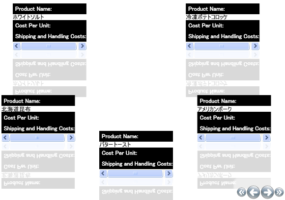

////

|metadata|
{
    "name": "xamcarousellistbox-working-with-the-itemtemplate",
    "controlName": ["xamCarouselListBox"],
    "tags": ["Data Presentation","Editing","Templating"],
    "guid": "{1047D5DF-DFDC-4A58-B338-7F1A80FE456D}",  
    "buildFlags": [],
    "createdOn": "2012-01-30T19:39:52.0607653Z"
}
|metadata|
////

= ItemTemplate での作業

xamCarouselListBox™ を使用すると、DataTemplates で項目をレイアウトして、DataTemplate を ItemTemplate プロパティに割り当てることができます。DataTemplate を使用することによって、データをどのように表示したいかを指定できます。

[NOTE]
====
**注:** このトピックは、 link:xamcarousellistbox-getting-started-with-xamcarousellistbox.html[xamCarouselListBox をアプリケーションに追加]のタスクを完了していることが前提となります。
====

[start=1]
. Resources 領域で DataTemplate を作成します。以下のコードによって、各項目は基本データから 3 つの要素を表示するようになります。各要素の上にラベルを配置します。DataTemplate に Key を指定します。DataTemplate を xamCarouselListBox を割り当てるために次の手順でこの Key を使用します。

*警告:* コンパイル時のエラーを防止するために、Key を DataTemplate に必ず割り当ててください。

各ラベルの背景色と前景色を指定して、コンテンツとラベルを区別します。

*XAML の場合:*

----
<DataTemplate x:Key="SimpleDataTemplate">
	<StackPanel>
		<Label Content="Product Name:" Background="Black" Foreground="White"/>
		<ContentPresenter Content="{Binding XPath=ProductName}" />
		<Label Content="Cost Per Unit:" Background="Black" Foreground="White"/>
		<ContentPresenter Content="{Binding XPath=CostPerUnit}" />
		<Label Content="Shipping and Handling Costs:" Background="Black" 
		  Foreground="White"/>
		<ContentPresenter Content="{Binding XPath=ShipAndHandle}" />
	</StackPanel>
</DataTemplate>
----

[start=2]
. xamCarouselListBox の ItemTemplate プロパティを以前の手順で作成された DataTemplate、StaticResource に設定します。

*XAML の場合:*

----
<igWindows:XamCarouselListBox 
  ItemsSource="{Binding Source={StaticResource OrderData}, XPath=Order}"
  ItemTemplate="{StaticResource SimpleDataTemplate}"/>
----

[start=3]
. プロジェクトをビルドして実行します。以下の図のように黒いラベルを表示する xamCarouselListBox の各項目が確認できます。

