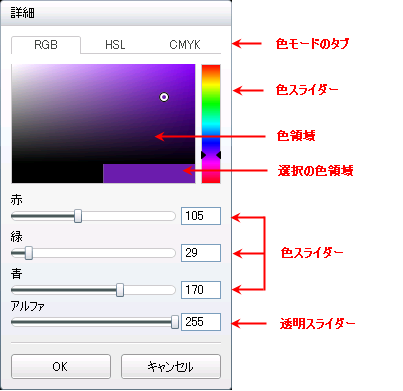

////

|metadata|
{
    "name": "xamcolorpicker-advanced-editor",
    "controlName": ["xamColorPicker"],
    "tags": ["Editing","How Do I"],
    "guid": "f2ca39d7-2bb8-4633-98d1-a35655003ea7",  
    "buildFlags": [],
    "createdOn": "2016-05-25T18:21:54.6540899Z"
}
|metadata|
////

= 詳細エディターの構成

xamColorPicker コントロールの詳細エディター セクションによって、エンドユーザーは提供されるパレットで使用できない色を選択できます。

カラー モード タブ - エンドユーザーは詳細エディター領域内で 3 つの異なるカラー モードを利用できます。

* RGB - このモデルは、赤、緑、青の三原色を一緒に使用して色を作る加法混色のモデルです。
* HSL - このモデルは、色相、色の彩度、色の明度に基づいて色を定義します。
* CMYK - このモデルは、シアン、マゼンタ、イエローとキー (黒) を使用して色を作る減法混色のモデルです。

カラー スライダー - このスライダーによってエンドユーザーは特定の色をピックできます。この特定の色の範囲は濃い色から明るい色まで色領域に表示されます。

カラー領域 - この領域はエンドユーザーがスライダーから選択した特定の色の範囲を表示します。

選択されたカラー領域 - この領域には以前に選択された色とカラー領域で選択されている現在の色の 2 色が表示されます。

カラー スライダー - カラー モード タブから選択したモデルに基づいて、これらのスライダーは RGB 値、CMKY 値または HSL 値を表示します。各モデルの最後のスライダーは、色の透明度を表示します。

エンドユーザーが詳細エディター領域から色を選択すると、xamColorPicker コントロールの SelectedColor プロパティはその特定の色に設定されます。

以下のコードで示すように、xamColorPicker コントロールの link:{ApiPlatform}controls.editors.xamcolorpicker{ApiVersion}~infragistics.controls.editors.xamcolorpicker~showadvancededitorbutton.html[ShowAdvancedEditorButton] プロパティを False に設定することによって、詳細エディターをエンドユーザーに非表示にできます。

*XAML の場合:*

----
<ig:XamColorPicker x:Name="MyColorPicker"  DerivedPalettesCount="10" Width="100"  
                   Height="20" ShowAdvancedEditorButton=" 
                   ShowDerivedColorPalettes=">
</ig:XamColorPicker>
----

*Visual Basic の場合:*

----
MyColorPicker.ShowAdvancedEditorButton = False
----

*C# の場合:*

----
MyColorPicker.ShowAdvancedEditorButton = false;
----

== 関連トピック

link:xamcolorpicker-palettes.html[パレットの構成]

link:xamcolorpicker-create-a-custom-palette.html[カスタム パレットの構成]

link:xamcolorpicker-selected-color.html[選択した色の構成]