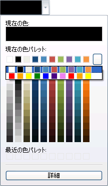

////

|metadata|
{
    "name": "xamcolorpicker-create-a-custom-palette",
    "controlName": ["xamColorPicker"],
    "tags": ["How Do I","Styling"],
    "guid": "afa23127-dfa7-4c9f-9100-319f7bfc86b1",  
    "buildFlags": [],
    "createdOn": "2016-05-25T18:21:54.6660906Z"
}
|metadata|
////

= カスタム パレットの構成

事前に定義されたパレットがニーズに合わないので使用可能なパレットを拡張したい場合があるでしょう。

link:{ApiPlatform}controls.editors.xamcolorpicker{ApiVersion}~infragistics.controls.editors.xamcolorpicker~colorpalettes.html[ColorPalettes] コレクションに追加することによって、固有のカスタム パレットを xamColorPicker コントロールに簡単に追加できます。

次のコードは、これを実現する方法を示しています。

*XAML の場合:*

----
<ig:XamColorPicker x:Name="MyColorPicker" DerivedPalettesCount="10" Width="100"   
                   Height="30" >
   <ig:XamColorPicker.ColorPalettes>
      <!-- カスタム パレットを作成します -->
      <ig:ColorPalette>
         <ig:ColorPalette.Colors>
            <ig:ColorPatchCollection>
               <ig:ColorPatch Color="Red"/>
               <ig:ColorPatch Color="Orange"/>
               <ig:ColorPatch Color="Yellow"/>
               <ig:ColorPatch Color="Green"/>
               <ig:ColorPatch Color="Blue"/>
               <ig:ColorPatch Color="Indigo"/>
               <ig:ColorPatch Color="Violet"/>
               <ig:ColorPatch Color="Red"/>
               <ig:ColorPatch Color="Orange"/>
               <ig:ColorPatch Color="Yellow"/>
            </ig:ColorPatchCollection>
         </ig:ColorPalette.Colors>
      </ig:ColorPalette>
   </ig:XamColorPicker.ColorPalettes>
</ig:XamColorPicker>
----

*Visual Basic の場合:*

----
Dim MyColorPalette As New ColorPalette()
MyColorPalette.Colors.Add(Colors.Red)
MyColorPalette.Colors.Add(Colors.Orange)
MyColorPalette.Colors.Add(Colors.Yellow)
MyColorPalette.Colors.Add(Colors.Green)
MyColorPalette.Colors.Add(Colors.Blue)
MyColorPalette.Colors.Add(Colors.Purple) 
MyColorPalette.Colors.Add(Colors.Magenta)
MyColorPalette.Colors.Add(Colors.Red)
MyColorPalette.Colors.Add(Colors.Orange)
MyColorPalette.Colors.Add(Colors.Yellow)
MyColorPicker.ColorPalettes.Add(MyColorPalette)
----

*C# の場合:*

----
ColorPalette MyColorPalette = new ColorPalette();
MyColorPalette.Colors.Add(Colors.Red);
MyColorPalette.Colors.Add(Colors.Orange);
MyColorPalette.Colors.Add(Colors.Yellow);
MyColorPalette.Colors.Add(Colors.Green);
MyColorPalette.Colors.Add(Colors.Blue);
MyColorPalette.Colors.Add(Colors.Purple);
MyColorPalette.Colors.Add(Colors.Magenta);
MyColorPalette.Colors.Add(Colors.Red);
MyColorPalette.Colors.Add(Colors.Orange);
MyColorPalette.Colors.Add(Colors.Yellow);
this.MyColorPicker.ColorPalettes.Add(MyColorPalette);
----

次のスクリーンショットは 2 つのカスタム パレットが追加された xamColorPicker コントロールです。

== 関連トピック

link:xamcolorpicker-advanced-editor.html[詳細エディターの構成]

link:xamcolorpicker-palettes.html[パレットの構成]

link:xamcolorpicker-selected-color.html[選択した色の構成]