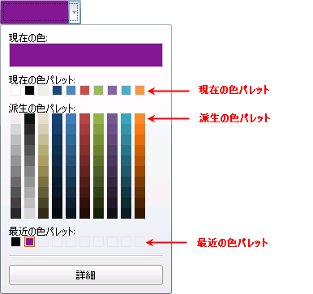

////

|metadata|
{
    "name": "xamcolorpicker-palettes",
    "controlName": ["xamColorPicker"],
    "tags": ["Getting Started"],
    "guid": "0a3c5d99-9ba2-4a59-b62d-440e5fd15b90",  
    "buildFlags": [],
    "createdOn": "2016-05-25T18:21:54.6600902Z"
}
|metadata|
////

= パレットの構成

パレットは xamColorPicker コントロールの基本的なパーツです。パレットがなければ、エンドユーザーはコントロールを操作できません。

xamColorPicker コントロール内には、以下の 3 つの異なるパレットがあります。

現在の色パレット - このパレットは、コントロールが使用可能なプロがデザインしたパレット、または開発者固有のカスタム パレットを表示します。現在の色パレットの右にあるドロップダウン ボタンを選択すると、すべてのカスタム パレットのリストを表示します。ドロップダウンからこれらのパレットのいずれかを選択すると、現在の色パレットがその選択したパレットに変わります。

派生色パレット - このパレットは、現在のパレットに表示される色をだんだんと濃い色調にして表示します。xamColorPicker コントロールの DerivedPalettesCount プロパティを設定することによって表示される色調の数を設定できます。

最近の色パレット - このパレットはエンドユーザーによって最近選択された色を表示します。

以下のコードで示すように、xamColorPicker コントロールの ShowDerivedColorPalette プロパティと RecentColorPalette プロパティを設定することによって、派生色パレットと最近使用した色パレットを表示または非表示にできます。

*XAML の場合:*

----
<ig:XamColorPicker ShowDerivedColorPalettes=" ShowRecentColorsPalette="   
                   x:Name="MyColorPicker"  Width="100" Height="20">
</ig:XamColorPicker>
----

*Visual Basic の場合:*

----
MyColorPicker.ShowDerivedColorPalettes = False
MyColorPicker.ShowRecentColorsPalette = False
----

*C# の場合:*

----
MyColorPicker.ShowDerivedColorPalettes = false;
MyColorPicker.ShowRecentColorsPalette = false;
----

各パレットと共に表示されるキャプションは完全にカスタマイズ可能で、固有のアプリケーションに合うように設定できます。xamColorPicker コントロールの以下のプロパティを設定することによってこれは実行できます。

* link:{ApiPlatform}controls.editors.xamcolorpicker{ApiVersion}~infragistics.controls.editors.xamcolorpicker~currentcolorcaption.html[CurrentColorCaption]
* link:{ApiPlatform}controls.editors.xamcolorpicker{ApiVersion}~infragistics.controls.editors.xamcolorpicker~currentpalettecaption.html[CurrentPaletteCaption]
* link:{ApiPlatform}controls.editors.xamcolorpicker{ApiVersion}~infragistics.controls.editors.xamcolorpicker~derivedcolorpalettescaption.html[DerivedColorPalettesCaption]
* link:{ApiPlatform}controls.editors.xamcolorpicker{ApiVersion}~infragistics.controls.editors.xamcolorpicker~recentcolorpalettecaption.html[RecentColorPalettesCaption]

以下のコードはこれらのプロパティを設定する方法を示します。

*XAML の場合:*

----
<ig:XamColorPicker x:Name="MyColorPicker"  DerivedPalettesCount="10" Width="100"  
                   Height="20"CurrentColorCaption = "New Current Color Caption"
                   CurrentPaletteCaption = "New Current Palette Caption"
                   DerivedColorPalettesCaption = "New Derived Palette Caption"
                   RecentColorPaletteCaption = "New Recent Color Palette Caption">
</ig:XamColorPicker>
----

*Visual Basic の場合:*

----
MyColorPicker.CurrentColorCaption = "New Current Color Caption"
MyColorPicker.CurrentPaletteCaption = "New Current Palette Caption"
MyColorPicker.DerivedColorPalettesCaption = "New Derived Palette Caption"
MyColorPicker.RecentColorPaletteCaption = "New Recent Color Palette Caption"
----

*C# の場合:*

----
MyColorPicker.CurrentColorCaption = "New Current Color Caption";
MyColorPicker.CurrentPaletteCaption = "New Current Palette Caption";
MyColorPicker.DerivedColorPalettesCaption = "New Derived Palette Caption";
MyColorPicker.RecentColorPaletteCaption = "New Recent Color Palette Caption";
----

== 関連トピック

link:xamcolorpicker-advanced-editor.html[詳細エディターの構成]

link:xamcolorpicker-create-a-custom-palette.html[カスタム パレットの構成]

link:xamcolorpicker-selected-color.html[選択した色の構成]