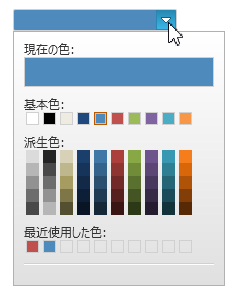

////

|metadata|
{
    "name": "xamcolorpicker-selected-color",
    "controlName": ["xamColorPicker"],
    "tags": ["How Do I","Selection"],
    "guid": "4d8419fc-75c6-4de5-9805-56f04dbc8ba4",  
    "buildFlags": [],
    "createdOn": "2016-05-25T18:21:54.6720909Z"
}
|metadata|
////

= 選択した色の構成 (xamColorPicker)

== トピックの概要

=== 目的

このトピックでは、 _xamColorPicker_™ コントロールで選択済みの色を識別し変更する方法を説明します。

=== 前提条件

このトピックをより理解するために、以下のトピックを参照することをお勧めします。

[options="header", cols="a,a"]
|====
|トピック|目的

| link:xamcolorpicker-adding-xamcolorpicker-to-your-page.html[xamColorPicker をページに追加]
|このトピックでは、XAML とプロシージャー コードを使用して、ページに _xamColorPicker_ コントロールを追加する方法を説明します。

|====

=== このトピックの内容

このトピックは、以下のセクションで構成されます。

* <<_Ref394388221, ユーザー インタラクションと操作性 >>
* <<_Ref394388226, 選択した色の構成 >>
* <<_Ref394388230, SelectedColorChanged イベントの使用 >>
* <<_Ref394389905, 選択した色をプレビュー >>
* <<_Ref394388241, 関連コンテンツ >>

[[_Ref394388221]]
== ユーザー インタラクションと操作性

=== ユーザー インタラクションの概要表

以下の表では、色の選択に関連する  _xamColorPicker_   コントロールのユーザー インタラクション機能を概観します。

[options="header", cols="a,a,a"]
|====
|目的|方法|構成方法

|[[_Hlk377147553]] 

現在のカラー パレット、派生のカラー パレット、または最近のカラー パレットから色を選択します。
|マウス クリック
|image::images/No.png[]

|[[_Hlk377147649]] 

現在のカラー パレット、派生のカラー パレット、または最近のカラー パレットから色をプレビューします。
|色の上にホバーします。
|image::images/No.png[]

|詳細エディターから色を選択し `OK` ボタンをクリックします。
|マウス クリック
|image::images/Yes.png[] 

* link:xamcolorpicker-advanced-editor.html[詳細エディターの構成] 

|選択済みの色を復元します。
|`ESC` キー
|image::images/No.png[]

|選択済みの色を復元します。
|エディター以外をクリックします。
|image::images/No.png[]

|====

[[_Ref394388226]]
== 選択した色の構成

[[_Hlk368069110]]

=== 概要

_xamColorPicker_   の `SelectedColor` プロパティを使用し現在の選択色を取得または設定します。

注:

[NOTE]
====
特定の色を選択して最近のカラー パレットに追加します。
====

=== プロパティ設定

以下の表は、任意の構成とそれを管理するプロパティ設定のマップを示します。

[options="header", cols="a,a,a"]
|====
|目的:|使用するプロパティ:|設定値:

|選択の色を指定します。
| link:{ApiPlatform}controls.editors.xamcolorpicker{ApiVersion}~infragistics.controls.editors.xamcolorpicker~selectedcolor.html[SelectedColor]
|`Color?`

|====

[[_Hlk337817761]]

=== 例

以下のスクリーンショットは、下記設定の結果、 _xamColorPicker_   の外観がどのようになるかを示しています。

[options="header", cols="a,a"]
|====
|プロパティ|値

| link:{ApiPlatform}controls.editors.xamcolorpicker{ApiVersion}~infragistics.controls.editors.xamcolorpicker~selectedcolor.html[SelectedColor]
| _Blue_ 

|====

以下のコードはこの例を実装します。

*XAML の場合:*

[source,xaml]
----
<ig:XamColorPicker SelectedColor="Blue" Height="30" Width="150" />
----

*C# の場合:*

[source,csharp]
----
var colorPicker = new XamColorPicker {SelectedColor = Colors.Blue, Height = 30, Width = 150};
----

*Visual Basic の場合:*

[source,vb]
----
Dim colorPicker = New XamColorPicker() With 
{
            .SelectedColor = Colors.Blue,
            .Height = 30,
            .Width = 150
}
----

[[_Ref394388230]]
== SelectedColorChanged イベントの使用

=== 概要

_xamColorPicker_   で選択済みの色が変更されると `SelectedColorChanged` イベントが発生します。

このイベントは  _xamColorPicker_   パレットの特定の色をクリックすると発生します。

イベントは新規選択および選択済みの色に関する情報を提供する link:{ApiPlatform}controls.editors.xamcolorpicker{ApiVersion}~infragistics.controls.editors.selectedcolorchangedeventargs_members.html[SelectedColorChangedEventArgs] タイプの引数を受け取ります。

[[_Ref393992051]]
[[_Ref394389905]]
== 選択した色をプレビュー

現在ホバーされている色を識別するために  _xamColorPicker_   の `SelectedColorPreview` プロパティを使用します。

このプロパティは、現在のカラー パレット、派生のカラー パレット、最近のカラー パレット、または詳細エディターのパレットの色をホバーする度に更新されます。

色をホバーしない場合は、`SelectedColorPreview` は `SelectedColor` と同じ値を受け取ります。

=== プロパティ設定

以下の表は、任意の動作とそれを管理するプロパティ設定のマップを示します。

[options="header", cols="a,a,a"]
|====
|目的:|使用するプロパティ:|設定値:

|マウス ホバーして選択済みの色をプレビューします。
| link:{ApiPlatform}controls.editors.xamcolorpicker{ApiVersion}~infragistics.controls.editors.xamcolorpicker~selectedcolorpreview.html[SelectedColorPreview]
|`Color?`

|====

[[_Ref394388241]]
== 関連コンテンツ

このトピックの追加情報については、以下のトピックも合わせてご参照ください。

[options="header", cols="a,a"]
|====
|トピック|目的

| link:xamcolorpicker-advanced-editor.html[詳細エディターの構成]
|このトピックでは、エンド ユーザーが提供済みのパレットにない色の選択を可能にする _xamColorPicker_ コントロールの詳細エディターのセクションについて説明します。

| link:xamcolorpicker-palettes.html[パレットの構成]
|このトピックでは、 _xamColorPicker_ コントロールのパレットについて説明します。

| link:xamcolorpicker-create-a-custom-palette.html[カスタム パレットの構成]
|このトピックでは、 _xamColorPicker_ コントロールでカスタム パレットを作成する方法を説明します。

|====
