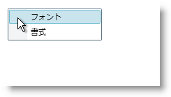

////
|metadata|
{
    "name": "xamcontextmenu-getting-started-with-xamcontextmenu",
    "controlName": ["xamContextMenu"],
    "tags": ["Getting Started"],
    "guid": "{722F008E-C781-42F6-A3B3-3EF1B7225973}",
    "buildFlags": [],
    "createdOn": "2016-05-25T18:21:54.7890975Z"
}
|metadata|
////

= xamContextMenu をページに追加

== 始める前に

xamContextMenu™ コントロールを使用して、アプリケーションのさまざまなコントロールのためのコンテキスト依存メニューを作成します。たとえば、元に戻すまたはやり直す機能を持つ TextBox コントロールのためのコンテキスト メニューと追加または削除機能を持つ xamGrid コントロールのためのコンテキスト メニューを作成できます。

== 達成すること

xamContextMenu コントロールをテキスト ボックスに追加する方法を学習します。完成したプロジェクトを実行してテキスト ボックスを右クリックすると、ブラウザーに以下のスクリーンショットに似たコンテキスト メニューが表示されます。

== 次の手順を実行します

[start=1]
. Microsoft® {PlatformName} アプリケーションを作成します。
[start=2]
. 以下の NuGet パッケージをアプリケーションに追加します。

** Infragistics.WPF.Menus

NuGet フィードのセットアップと NuGet パッケージの追加の詳細については、link:nuget-feeds.html[NuGet フィード] ドキュメントを参照してください。

[start=3]
. コード ビハインドに using/Imports のディレクティブを配置するか xamContextMenu の XML 名前空間宣言を追加します。

*XAML の場合:*

[source]
----
xmlns:ig="http://schemas.infragistics.com/xaml"
----

*Visual Basic の場合:*

[source]
----
Imports Infragistics.Controls.Menus
----

*C# の場合:*

[source]
----
using Infragistics.Controls.Menus;
----

[start=4]
. TextBox コントロールを、LayoutRoot という名前のデフォルトの Grid レイアウト パネルに追加します。プロシージャー コードでこれを行う場合、ユーザー コントロールの Loaded イベントを処理し、イベント ハンドラーにこのコードを配置することができます。

*XAML の場合:*

[source]
----
<TextBox Name="textBox1">
    <!--TODO: ContextMenuService クラスの添付 Manager プロパティのタグを宣言します-->
</TextBox>
----

*Visual Basic の場合:*

----
Dim textbox1 As TextBox
Private Sub UserControl_Loaded(ByVal sender As Object, ByVal e As RoutedEventArgs)
    textBox1 = New TextBox()
    Me.LayoutRoot.Children.Add(textBox1)
    'TODO: ContextMenuManager オブジェクトをインスタンス化して、TextBox コントロールに添付します
    'TODO: xamContextMenu コントロールのインスタンスを作成します
    'TODO: MenuItem オブジェクトを xamContextMenu コントロールに追加します
End Sub
----

*C# の場合:*

[source]
----
private TextBox textBox1;
private void UserControl_Loaded(object sender, RoutedEventArgs e)
{
    textBox1 = new TextBox();
    this.LayoutRoot.Children.Add(textBox1);
    //TODO: ContextMenuManager オブジェクトのインスタンスを作成して、TextBox コントロールに添付します
    //TODO: xamContextMenu コントロールのインスタンスを作成します
    //TODO: MenuItem オブジェクトを xamContextMenu コントロールに追加します
}
----

[start=5]
. XAML でこれを実行する場合に link:{ApiPlatform}controls.menus.xammenu{ApiVersion}~infragistics.controls.menus.contextmenuservice.html[ContextMenuService] クラスの Manager プロパティのタグを宣言します。ただし、コードでこれを実行する場合には、 link:{ApiPlatform}controls.menus.xammenu{ApiVersion}~infragistics.controls.menus.contextmenumanager.html[ContextMenuManager] オブジェクトをインスタンス化して、ContextMenuService クラスの静的な link:{ApiPlatform}controls.menus.xammenu{ApiVersion}~infragistics.controls.menus.contextmenuservice~setmanager.html[SetManager] メソッドを使用してコントロールに添付します。

*XAML の場合:*

[source]
----
<ig:ContextMenuService.Manager>
    <ig:ContextMenuManager>
        <ig:ContextMenuManager.ContextMenu>
            <!--TODO: ここで xamContextMenu コントロールを追加します-->
        </ig:ContextMenuManager.ContextMenu>
    </ig:ContextMenuManager>
</ig:ContextMenuService.Manager>
----

*Visual Basic の場合:*

[source]
----
Dim contextMenuManager1 As New ContextMenuManager()
ContextMenuService.SetManager(textBox1, contextMenuManager1)
'TODO: ContextMenuManager オブジェクトの ContextMenu プロパティを設定します。
----

*C# の場合:*

[source]
----
ContextMenuManager contextMenuManager1 = new ContextMenuManager();
ContextMenuService.SetManager(textBox1, contextMenuManager1);
//TODO: ContextMenuManager オブジェクトの ContextMenu プロパティを設定します
----

[start=6]
. xamContextMenu コントロールを作成します。コードでこれを実行する場合、ContextMenuManager オブジェクトの link:{ApiPlatform}controls.menus.xammenu{ApiVersion}~infragistics.controls.menus.contextmenumanager~contextmenu.html[ContextMenu] プロパティを必ず設定します。

*XAML の場合:*

[source]
----
<ig:XamContextMenu>
    <!--TODO: ここに XamMenuItem オブジェクトを追加します-->
</ig:XamContextMenu>
----

*Visual Basic の場合:*

[source]
----
Dim xamContextMenu1 As New XamContextMenu()
contextMenuManager1.ContextMenu = xamContextMenu1
----

*C# の場合:*

[source]
----
XamContextMenu xamContextMenu1 = new XamContextMenu();
contextMenuManager1.ContextMenu = xamContextMenu1;
----

[start=7]
. 2 つの link:{ApiPlatform}controls.menus.xammenu{ApiVersion}~infragistics.controls.menus.xammenuitem.html[XamMenuItem] オブジェクトを xamContextMenu コントロールに追加します。XAML では、xamContextMenu の Items コレクションのタグを宣言する必要はありません。

** 最初の XamMenuItem オブジェクトの link:{ApiPlatform}controls.menus.xammenu{ApiVersion}~infragistics.controls.menus.primitives.xamheadereditemscontrol~header.html[Header] プロパティを「Font」に設定します。
** 二番目の XamMenuItem オブジェクトの Header プロパティを「Formatting」に設定します。

*XAML の場合:*

[source]
----
<ig:XamMenuItem Header="Font" />
<ig:XamMenuItem Header="Formatting" />
----

*Visual Basic の場合:*

[source]
----
Dim menuItemFont As New XamMenuItem With {.Header = "Font"}
Dim menuItemFormatting As New XamMenuItem With {.Header = "Formatting"}
xamContextMenu1.Items.Add(menuItemFont)
xamContextMenu1.Items.Add(menuItemFormatting)
----

*C# の場合:*

[source]
----
XamMenuItem menuItemFont = new XamMenuItem
{
    Header = "Font"
};
XamMenuItem menuItemFormatting = new XamMenuItem
{
    Header = "Formatting"
};
xamContextMenu1.Items.Add(menuItemFont);
xamContextMenu1.Items.Add(menuItemFormatting);
----

[start=8]
. アプリケーションを実行します。機能を追加するために XamMenuItem オブジェクトの link:{ApiPlatform}controls.menus.xammenu{ApiVersion}~infragistics.controls.menus.xammenuitem~click_ev.html[Click] イベントを処理できます。

== 関連トピック

link:xamcontextmenu-about-xamcontextmenu.html[xamContextMenu について]

link:xamcontextmenu-using-xamcontextmenu.html[xamContextMenu の使用]